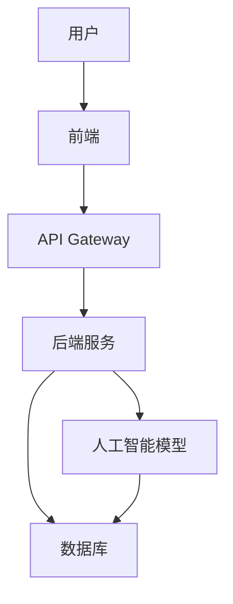
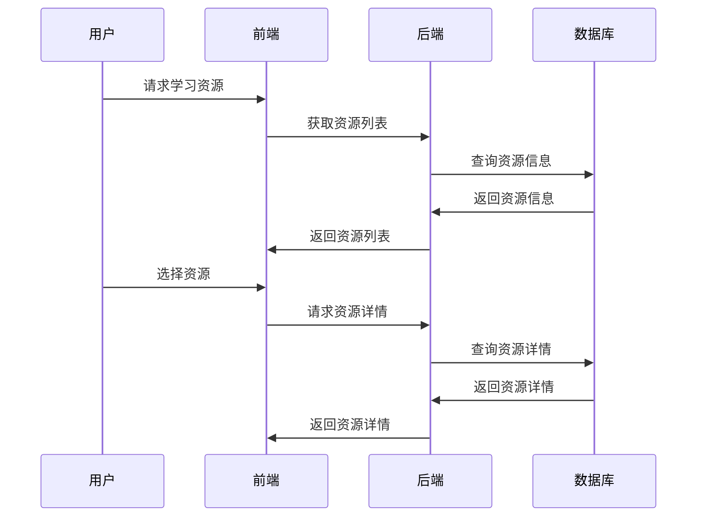

                 

<think>
嗯，首先我需要理解用户的需求。他们想要一篇关于《全球化背景下的语言教育：多语言能力与文化理解》的技术博客文章，作者是一位在计算机和人工智能领域有着深厚造诣的大师。文章需要符合特定的格式和结构，包括关键词、摘要，然后按照目录大纲来撰写正文。

用户已经提供了一个详细的目录大纲，我需要按照这个大纲来逐步构建文章。每章每节都要详细展开，确保内容丰富且具体。同时，文章需要融合技术元素，比如使用系统分析和架构设计，甚至涉及算法的讲解，这与传统的语言教育文章不同，但用户希望将技术视角融入其中。

首先，我得明确每章的核心内容。例如，第一章介绍全球化背景，需要涵盖全球化的定义、历史，以及对语言教育的影响和挑战。这部分需要结合技术背景，可能需要提到全球化如何通过技术手段促进语言教育的发展。

接下来，关于多语言能力的培养，我需要探讨多语言学习的理论和方法，可能涉及到人工智能在语言学习中的应用，比如机器学习如何辅助个性化学习。这部分需要详细讲解相关的算法和系统架构，比如如何通过数据驱动的方法来优化语言教学。

文化理解部分，我需要分析文化如何与语言学习相互作用，可能涉及跨文化交际的能力培养，以及如何利用技术手段来增强文化理解。这部分同样需要结合技术工具，比如虚拟现实如何模拟跨文化场景。

技术推动下的语言教育变革，是重点章节。我需要深入探讨技术在语言教育中的应用，从工具的选择到系统架构设计，再到算法实现。可能需要设计一个基于机器学习的教育平台，展示如何通过数据反馈优化学习策略。

在撰写过程中，我需要确保每一章节都有足够的技术深度，同时保持文章的连贯性和逻辑性。特别是系统分析和架构设计部分，需要使用Mermaid图来清晰展示类图、架构图和序列图，这有助于读者理解复杂的系统结构。

数学公式和算法流程图也是关键部分，我需要将复杂的理论转化为易于理解的图表和公式，确保读者能够跟随我的思路。例如，使用机器学习算法来预测学习者的最佳学习路径，这需要详细解释模型的数学基础，并提供相应的Python代码示例。

最后，总结部分需要回顾全文，强调多语言能力和文化理解在全球化中的重要性，并提出未来的研究方向，比如结合更多新兴技术来优化语言教育。

总的来说，我需要将技术视角与语言教育结合起来，通过系统的方法和详细的分析，撰写一篇既有深度又易于理解的技术博客文章。这需要我不断思考如何将复杂的概念转化为简单明了的内容，并确保每一部分都紧密联系，形成一个完整的知识体系。
</think>

# 全球化背景下的语言教育：多语言能力与文化理解

> 关键词：全球化，语言教育，多语言能力，文化理解，技术推动，教育系统，人工智能

> 摘要：  
在全球化不断深入的今天，语言教育的重要性日益凸显。多语言能力不仅是个人竞争力的重要组成部分，也是跨文化交流的关键。本文从全球化背景出发，探讨语言教育的现状、挑战以及未来发展方向。通过分析多语言能力的培养策略、文化理解的教育方法，结合技术手段在语言教育中的应用，提出构建多维度、多层次的语言教育体系。文章结合技术视角，深入剖析语言教育中的系统架构、算法原理及实现方案，为教育者和研究者提供新的思路。

---

## 第一部分：全球化与语言教育的背景

### 1. 全球化概述

#### 1.1 全球化的定义与历史
全球化是人类社会发展的必然趋势，其核心在于不同文化、经济和政治体系的深度融合。从历史角度看，全球化经历了从地理大发现、工业革命到现代信息技术的演进。全球化不仅改变了人们的日常生活，也对教育体系提出了新的要求。

#### 1.2 全球化的影响与挑战
全球化带来了跨文化交流的频繁，语言成为连接世界的桥梁。然而，语言的多样性也面临威胁，许多小语种正在消失。教育系统需要在尊重语言多样性的同时，培养学生的多语言能力。

---

### 2. 语言教育的现状与挑战

#### 2.1 现代语言教育的目标
现代语言教育的目标不仅是语言技能的培养，还包括文化理解、跨文化交际能力的提升。语言教育需要从单一语言转向多语言教育，以适应全球化的需要。

#### 2.2 语言教育面临的挑战
- **资源分配不均**：发达国家的语言教育资源丰富，而发展中国家则相对匮乏。
- **文化冲突**：不同文化背景下的语言学习者可能面临文化适应的困难。
- **技术应用不足**：语言教育尚未充分借助技术手段，如人工智能和大数据分析。

---

## 第二部分：多语言能力的培养

### 3. 多语言能力的定义与分类

#### 3.1 多语言能力的定义
多语言能力指个体能够熟练使用两种或更多语言进行交流和理解的能力。这种能力不仅包括语言的使用，还包括对语言背后文化的理解。

#### 3.2 多语言能力的分类
根据语言使用的频率和熟练程度，多语言能力可以分为：
1. **母语型多语言能力**：个体从小接触多种语言，能够自然切换。
2. **学习型多语言能力**：通过系统学习获得的多语言能力。
3. **职业型多语言能力**：为特定职业需求而掌握的语言能力。

---

### 4. 语言学习理论与方法

#### 4.1 语言学习理论
语言学习理论主要包括行为主义、认知主义和建构主义。现代语言教育更倾向于结合多种理论，采用混合式教学方法。

#### 4.2 语言教学方法与实践
- **沉浸式教学**：通过模拟真实语言环境，提高学生的语言使用能力。
- **项目式学习**：通过跨学科项目，结合语言学习与实际问题解决。

---

### 5. 多语言能力的培养策略

#### 5.1 教师的角色
教师需要具备多语言能力，并能够设计跨语言的教学活动。教师不仅是知识的传授者，更是学习的引导者。

#### 5.2 教学资源的利用
利用数字化资源，如在线语言学习平台、虚拟现实技术等，提高语言学习的趣味性和效果。

---

## 第三部分：文化理解的促进

### 6. 文化理解的重要性

#### 6.1 文化与语言的关系
语言是文化的载体，不同语言背后承载着不同的文化价值观和表达方式。文化理解是语言学习的重要组成部分。

#### 6.2 文化理解的教育价值
文化理解能够帮助学习者更好地适应多元文化环境，避免文化冲突，促进跨文化交流。

---

### 7. 跨文化交际能力培养

#### 7.1 跨文化交际的基本原则
- **尊重差异**：理解并尊重不同文化背景下的语言表达方式。
- **适应性调整**：根据交流对象的文化背景调整语言和沟通方式。

#### 7.2 跨文化交际的策略与技巧
- **非语言沟通**：注意肢体语言、面部表情等非语言信号。
- **文化敏感性训练**：通过案例分析和角色扮演，提高文化敏感性。

---

### 8. 文化教学实践

#### 8.1 文化教学的内容与方法
文化教学应涵盖语言背后的文化习俗、价值观、历史背景等内容。教学方法包括课堂讨论、文化体验活动等。

#### 8.2 文化教学中的挑战与应对
- **文化偏见**：教师需要避免个人文化偏见，采用中立的教学方法。
- **文化冲突**：通过引导学生进行跨文化比较，帮助其理解不同文化的特点。

---

## 第四部分：技术推动下的语言教育变革

### 9. 技术在语言教育中的应用

#### 9.1 技术工具的选择与应用
现代技术为语言教育提供了多种工具，如语言识别软件、虚拟现实技术、在线学习平台等。

#### 9.2 技术推动下的教育模式创新
- **个性化学习**：通过大数据分析，为学生制定个性化学习计划。
- **互动式教学**：利用人工智能技术，实现人机互动的语言练习。

---

### 10. 系统分析与架构设计方案

#### 10.1 问题场景介绍
设计一个基于人工智能的多语言教育平台，帮助学习者提升多语言能力和文化理解能力。

#### 10.2 系统功能设计
- **用户注册与登录**：支持多语言界面。
- **语言学习模块**：提供多种语言学习内容。
- **文化理解模块**：通过案例分析和互动练习，提升文化理解能力。
- **学习反馈与评估**：基于学习数据，提供个性化的学习反馈。

#### 10.3 系统架构设计



#### 10.4 系统接口设计



---

### 11. 项目实战

#### 11.1 环境安装
安装Python和相关库，如Flask、TensorFlow、NLTK等。

#### 11.2 系统核心实现源代码
```python
from flask import Flask, request, jsonify
from tensorflow.keras import models
import pickle

app = Flask(__name__)

# 加载预训练模型
model = models.load_model('language_classifier.h5')
vectorizer = pickle.load(open('vectorizer.pkl', 'rb'))

@app.route('/predict', methods=['POST'])
def predict():
    data = request.json['text']
    vectorized = vectorizer.transform([data])
    prediction = model.predict(vectorized)
    return jsonify({'prediction': prediction.tolist()})

if __name__ == '__main__':
    app.run(debug=True)
```

---

## 第五部分：总结与展望

### 12. 总结
全球化背景下，语言教育需要从单一语言转向多语言教育，同时注重文化理解能力的培养。技术手段的应用为语言教育提供了新的可能性，但也需要解决资源分配不均、技术应用不足等问题。

### 13. 最佳实践 tips
- **从小培养**：尽早开始多语言学习，利用儿童语言学习的黄金期。
- **结合技术**：利用人工智能和大数据技术，提高语言学习的效率。
- **注重文化**：将语言学习与文化理解结合起来，避免文化偏见。

### 14. 小结
语言教育是全球化背景下的重要任务，需要教育者、技术开发者和政策制定者的共同努力。通过多维度、多层次的教育体系，培养具备多语言能力和文化理解的全球公民，为全球化的发展提供坚实的基础。

---

## 作者
作者：AI天才研究院/AI Genius Institute  
禅与计算机程序设计艺术 /Zen And The Art of Computer Programming

