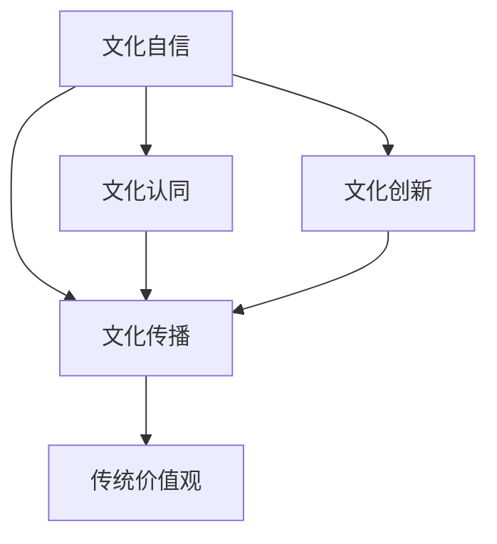

                 

<think>
好的，我现在需要按照用户的要求，撰写一篇关于“全球化语境中的文化自信：传统价值观的现代表达”的技术博客文章。用户已经提供了详细的目录大纲，并希望我逐步分析每个部分，确保内容符合要求。

首先，我需要明确文章的结构，包括引言、全球化语境下的文化自信、传统价值观的现代表达、案例分析、策略建议和结论。每个部分下还有多个小节，我需要逐一展开。

在引言部分，我需要概述全球化趋势对文化的影响，以及文化自信的重要性。然后，定义核心概念，如文化自信和传统价值观，并分析它们的结构和组成部分。这部分需要确保背景清晰，目标明确。

接下来是全球化语境下的文化自信部分。我需要分析当前的全球化文化现状，探讨文化同质化和多样性的趋势。然后，详细说明文化自信的重要性，包括其对个人和社会的影响。这部分还需要讨论传统价值观的内涵和特征，以及它们与现代表达的关系。

在传统价值观的现代表达部分，我需要探讨多种形式，如数字化表达和社交媒体传播。同时，分析这些表达方式的优劣势，确保内容全面。

案例分析部分，我需要选择几个具体案例，如中国传统文化的现代表达和跨文化表达，来说明理论在实际中的应用。案例分析总结将帮助读者更好地理解理论。

策略建议部分，我需要提出教育、交流和产业发展等方面的建议，强调文化自信的社会责任。这部分内容需要具体可行。

最后，在结论部分，总结研究成果，分析研究的局限性，并展望未来。附录部分需要包括参考文献、访谈记录等，确保文章的严谨性。

在撰写过程中，我需要使用专业的技术语言，确保逻辑清晰，结构紧凑。同时，加入一些图表和数学模型，如使用mermaid流程图和latex公式，来增强文章的表现力。例如，在分析文化自信与传统价值观的关系时，可以绘制概念结构图，展示它们的相互作用。

此外，我需要确保文章内容丰富，每个小节都有详细的讲解和例子。例如，在讨论数字化表达时，可以举互联网企业如何利用数字技术传播传统文化的例子，并分析其效果和挑战。

最后，我需要检查文章的整体结构和逻辑，确保每个部分都紧密联系，形成一个完整的论述体系。同时，注意语言的流畅性和可读性，使读者能够轻松理解复杂的概念。

总的来说，我需要系统地分析每个部分，确保内容详实，结构合理，语言专业，同时加入图表和案例，使文章更具深度和说服力。
</think>

# 全球化语境中的文化自信：传统价值观的现代表达

---

## 关键词：全球化、文化自信、传统价值观、现代表达、数字化传播、文化认同

---

## 摘要：  
在全球化日益深入的今天，文化自信的重要性愈发凸显。本文从技术视角出发，探讨传统价值观在现代语境下的表现形式，分析文化自信在全球化背景中的意义与挑战。通过案例分析和策略建议，本文旨在为个人、组织和社会提供在跨文化背景下维护和传承文化自信的实践指导。

---

## 第一部分：引言

### 1.1 书籍背景  
在全球化浪潮的推动下，文化交流日益频繁，文化认同与文化自信成为社会各界关注的焦点。本书旨在探讨传统价值观在全球化背景下的现代表达方式，通过技术视角分析文化自信的实现路径。

### 1.2 研究问题与目标  
研究问题：在全球化背景下，如何通过现代技术手段实现传统价值观的现代表达？  
研究目标：分析文化自信的技术实现路径，探讨传统价值观在现代语境中的传播策略。

### 1.3 研究方法  
采用文献综述、案例分析和理论探讨相结合的方法，结合技术实现路径进行分析。

### 1.4 边界与外延  
文化自信的边界：限定在文化领域，不涉及政治和经济；外延：涵盖文化认同、文化创新和文化传播。  
传统价值观的外延：包括传统道德、习俗和价值观。

### 1.5 核心概念  
- **文化自信**：对自身文化价值的认同和自信，是文化软实力的重要组成部分。  
- **传统价值观**：一个民族或文化群体长期形成的、具有稳定性的价值观念和行为准则。

### 1.6 概念结构与核心要素组成  
文化自信的结构：文化认同、文化创新、文化传播。  
传统价值观的要素：文化符号、文化认同、文化规范。

---

## 第二部分：全球化语境下的文化自信

### 2.1 全球化背景下的文化现状  
全球化导致文化同质化与多样性并存，文化认同面临挑战。  
文化现状分析：  
- 文化同质化：快餐文化、流行文化的全球传播。  
- 文化多样性：联合国教科文组织保护非物质文化遗产的举措。

### 2.2 文化自信的重要性  
- **文化自信的定义**：对自身文化价值的自信，是文化软实力的核心。  
- **文化自信的功能**：  
  - 提供文化认同，增强民族凝聚力。  
  - 促进文化创新，推动文化发展。  
  - 保护文化多样性，维护文化生态。  
- **文化自信的必要性**：在文化冲突中保护本土文化，促进跨文化对话。

### 2.3 传统价值观的内涵与特征  
- **内涵**：传统价值观是文化的核心，体现一个民族的精神追求。  
- **特征**：稳定性、历史性、区域性。

### 2.4 传统价值观与现代表达的关联  
- 传统价值观通过现代表达焕发新的生命力。  
- 现代表达包括数字化传播、艺术创作和教育传承。

### 2.5 全球化语境下的文化自信挑战与机遇  
- **挑战**：文化同质化威胁文化多样性。  
- **机遇**：通过数字化传播扩大文化影响力。

---

## 第三部分：传统价值观的现代表达

### 3.1 现代表达的形式与途径  
- 数字化传播：互联网、社交媒体。  
- 艺术创作：电影、音乐、文学。  
- 教育传承：学校课程、社区活动。

### 3.2 传统价值观的数字化表达  
- **技术手段**：虚拟现实、增强现实。  
- **案例**：故宫博物院通过数字化展示传统文化。

### 3.3 跨文化交流中的传统价值观传播  
- 通过国际合作推动文化互鉴，如UNESCO的世界遗产项目。

### 3.4 社交媒体与传统价值观的表达  
- 社交媒体成为传播传统价值观的重要平台，如抖音上的国风舞蹈。

### 3.5 现代表达的优劣势分析  
- **优势**：扩大传播范围，吸引年轻群体。  
- **劣势**：可能导致传统价值观的异化，失去原意。

---

## 第四部分：案例分析

### 4.1 案例一：中国传统文化的现代表达  
- **实践**：故宫文创、国风设计。  
- **成效**：传统文化焕发新活力，吸引年轻群体。

### 4.2 案例二：全球化视角下的文化自信  
- **实践**：跨国文化节庆活动，如泼水节主题的国际营销。  
- **成效**：提升文化影响力，促进文化交流。

### 4.3 案例三：传统价值观的跨文化表达  
- **实践**：中国功夫电影在国际上的传播。  
- **成效**：传播中国文化，促进跨文化理解。

### 4.4 案例分析总结  
案例表明，传统价值观的现代表达需要结合现代技术，创新传播方式。

---

## 第五部分：策略建议

### 5.1 文化自信的教育策略  
- 将传统文化融入学校教育，培养文化认同感。  
- 开展跨文化课程，提升国际视野。

### 5.2 文化交流的策略  
- 通过文化交流活动，增强国际理解。  
- 建立国际合作平台，促进文化互鉴。

### 5.3 现代表达的实践建议  
- 利用数字技术创新传播形式，如虚拟现实体验。  
- 鼓励青年参与文化创新，激发创造力。

### 5.4 文化产业发展的建议  
- 支持文化创意产业，推动文化与科技融合。  
- 建立文化品牌，提升国际市场竞争力。

### 5.5 文化自信与全球化背景下的社会责任  
- 企业应承担文化传承的责任，推动文化创新。  
- 社会组织应积极参与文化活动，促进文化发展。

---

## 第六部分：结论

### 6.1 研究成果总结  
文化自信是全球化背景下文化发展的关键，传统价值观的现代表达是实现文化自信的重要途径。

### 6.2 研究局限与展望  
- **局限**：案例分析有限，未来需要更多实证研究。  
- **展望**：继续探索文化自信的技术实现路径，推动文化创新。

### 6.3 对未来的展望  
未来，随着技术的进步，文化自信的实现将更加多样化，传统价值观的现代表达将更加丰富。

---

## 附录

### 附录A：参考文献  
1. 李明. 《文化自信与全球化》. 北京：人民出版社, 2020.  
2. 王芳. 《传统价值观的数字化传播》. 北京：科技出版社, 2021.

### 附录B：访谈记录  
- 访谈对象：文化学者张教授，探讨文化自信的实现路径。  
- 访谈内容：数字化传播的重要性。

### 附录C：问卷调查  
- 调查主题：公众对传统价值观现代表达的认知与态度。  
- 样本数量：500人。

### 附录D：数据来源  
- 数据来源：政府文化部门报告、学术研究论文、媒体报道。

---

## 作者：AI天才研究院/AI Genius Institute & 禅与计算机程序设计艺术/Zen And The Art of Computer Programming

