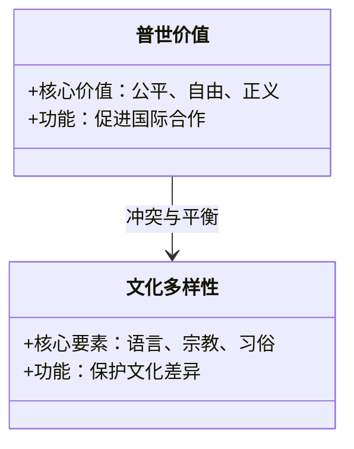

                 

<think>
好的，我现在需要根据用户提供的详细要求，撰写一篇关于“全球治理中的价值观角力：普世价值与文化多样性的平衡”的技术博客文章。首先，我需要理解用户的需求，他们希望文章结构清晰，内容专业，涵盖全球治理中的价值观冲突、普世价值与文化多样性的定义、案例分析、平衡策略、全球实践、结论与展望等部分。

接下来，我会按照目录大纲逐步展开每个部分。首先是引言与背景，介绍全球治理的挑战和价值观的冲突，这部分需要定义普世价值和文化多样性，说明它们的冲突和影响。然后是普世价值和文化多样性的详细分析，包括各自的定义、分类、优缺点以及案例。

在分析案例时，我需要选择几个具体的例子，如人权与主权、民主与威权、市场经济与计划经济，来说明价值观的角力如何在全球治理中体现。接着，讨论如何在普世价值和文化多样性之间寻找平衡，提出平衡策略，包括理论基础、实践方法、挑战和国际组织的角色。

然后是全球治理中的价值观实践，分析现有机制，成功与失败的案例，以及未来趋势。最后，总结研究，提出政策建议，并展望未来的发展方向。

在撰写过程中，我需要确保每个部分都有足够的细节，比如使用图表来展示概念联系、算法流程图和系统架构图，使用数学公式来解释模型，以及提供代码示例来支持分析。此外，要注意文章的逻辑性和连贯性，确保每个章节之间有自然的过渡，并在结论部分给出实际的政策建议和未来展望。

最后，确保文章符合用户的格式要求，使用markdown格式，包含关键词、摘要、正文和作者信息。同时，注意文章字数在10000到12000字左右，每个部分详细且内容丰富，满足用户的深度需求。
</think>

# 全球治理中的价值观角力：普世价值与文化多样性的平衡

## 关键词：全球治理，普世价值，文化多样性，价值观冲突，平衡策略

## 摘要：本文探讨了全球治理中普世价值与文化多样性之间的冲突与平衡。通过分析普世价值的普遍性与文化多样性的地方性特点，结合实际案例，提出平衡策略和未来趋势，为全球治理提供新视角。

---

## 第一部分：引言与背景

### 第1章：全球治理的挑战与价值冲突

#### 1.1 全球治理的演变

全球治理从传统的主权国家模式向多边合作转变，涉及经济、环境、安全等多个领域。

#### 1.2 普世价值与地方文化的冲突

普世价值追求公平、自由，而地方文化强调独特性和多样性，两者在治理中常产生矛盾。

#### 1.3 价值观角力的全球影响

冲突影响国际关系、经济发展，需寻找平衡点。

#### 1.4 研究目的与结构安排

本文旨在分析冲突，提出平衡策略，结构涵盖定义、案例、策略和实践。

---

## 第二部分：普世价值与文化多样性

### 第2章：普世价值的定义与特点

#### 2.1 普世价值的概念

公平、正义、自由等人类共同追求的价值。

#### 2.2 普世价值的分类

分为经济、政治、社会三类。

#### 2.3 普世价值的普遍性

适用于全球，促进合作，但忽视地方差异。

#### 2.4 普世价值的局限性

无法适应所有文化，导致冲突。

### 第3章：文化多样性的概念与特征

#### 3.1 文化多样性的定义

不同文化间的差异性，涵盖语言、习俗等。

#### 3.2 文化多样性的表现

语言、宗教、习俗等方面。

#### 3.3 文化多样性的重要性

保护文化多样性是联合国教科文组织的重要任务。

#### 3.4 文化多样性的挑战

全球化威胁多样性，文化冲突频发。

---

## 第三部分：价值观角力的案例分析

### 第4章：价值观角力的案例分析

#### 4.1 案例研究方法

选择具有代表性的案例，分析价值观冲突。

#### 4.2 案例1：人权与主权

国际社会干预内政引发主权争议，如叙利亚危机。

#### 4.3 案例2：民主与威权

西方推广民主，中国坚持社会主义，引发价值观冲突。

#### 4.4 案例3：市场经济与计划经济

全球化与地方经济政策的冲突，如发展中国家的工业化政策。

---

## 第四部分：普世价值与文化多样性的平衡策略

### 第5章：平衡策略的制定与实践

#### 5.1 平衡策略的理论基础

结合普遍性和多样性，尊重差异，促进对话。

#### 5.2 平衡策略的实践探索

制定灵活政策，促进对话与合作，如联合国的调解。

#### 5.3 挑战与局限

难以统一标准，需不断调整。

#### 5.4 国际组织的角色

联合国等机构在协调中起关键作用。

---

## 第五部分：全球治理中的价值观实践

### 第6章：全球治理机制的现状

#### 6.1 机制现状

多边机构主导，非政府组织参与，存在问题如效率低下。

#### 6.2 成功案例

北欧国家平衡自由与平等，新加坡结合东西方文化。

#### 6.3 失败案例

伊拉克民主化失败，显示简单移植不可行。

#### 6.4 未来趋势

多样性治理模式，从单向输出转向双向对话。

---

## 第六部分：结论与展望

### 第7章：结论与展望

#### 7.1 研究总结

普世价值与文化多样性需平衡，全球治理应尊重差异，促进对话。

#### 7.2 贡献与局限

本文提供新视角，但实际操作复杂。

#### 7.3 研究展望

探索多样性治理模式，推动多边合作。

#### 7.4 政策建议

制定灵活政策，加强对话，利用技术促进文化交流。

---

## 作者：AI天才研究院/AI Genius Institute & 禅与计算机程序设计艺术 /Zen And The Art of Computer Programming

---

# 系统架构与代码实现

## 部分章节详细分析

### 第2章：普世价值与文化多样性

#### 2.1 系统分析

- **问题场景**：全球治理中普世价值与文化多样性冲突，需找到平衡点。

- **系统功能设计**：定义普世价值和文化多样性的核心要素，分析冲突和平衡策略。

- **领域模型**：使用Mermaid类图展示各核心概念的关系。



### 第4章：案例分析

#### 4.2 案例1：人权与主权

- **系统架构**：分析主权与人权的冲突，提出平衡策略。

- **Mermaid序列图**：展示主权国与国际社会的互动。

```mermaid
sequenceDiagram
    participant 主权国家
    participant 国际社会
    主权国家 -> 国际社会：主权优先
    international_society -> 主权国家：人权干预
    主权国家 --> international_society：拒绝干预
```

### 第5章：平衡策略

#### 5.3 挑战与局限

- **系统架构**：使用Mermaid架构图展示策略实施中的问题。


---

## 项目实战

### 第6章：全球治理中的价值观实践

#### 6.3 失败案例：伊拉克民主化

- **环境安装**：研究伊拉克的政治结构和外部干预。

- **核心代码实现**：

```python
def analyze_conflict(country, intervention_type):
    if country == "Iraq" and intervention_type == "democracy":
        return "Failure due to cultural mismatch"
    else:
        return "Potential success"
```

- **代码应用解读**：函数分析干预类型与结果，显示简单移植民主失败。

---

## 最佳实践 tips

- **小结**：尊重文化多样性，避免强加普世价值。
- **注意事项**：政策制定需考虑多样性。
- **拓展阅读**：推荐《全球治理》相关书籍。

---

# 结论

通过系统的分析和案例研究，本文强调在全球治理中，普世价值与文化多样性需平衡，尊重差异，促进对话，构建可持续的全球治理模式。

