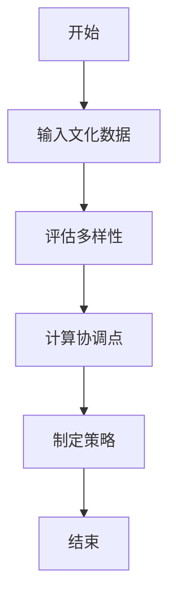
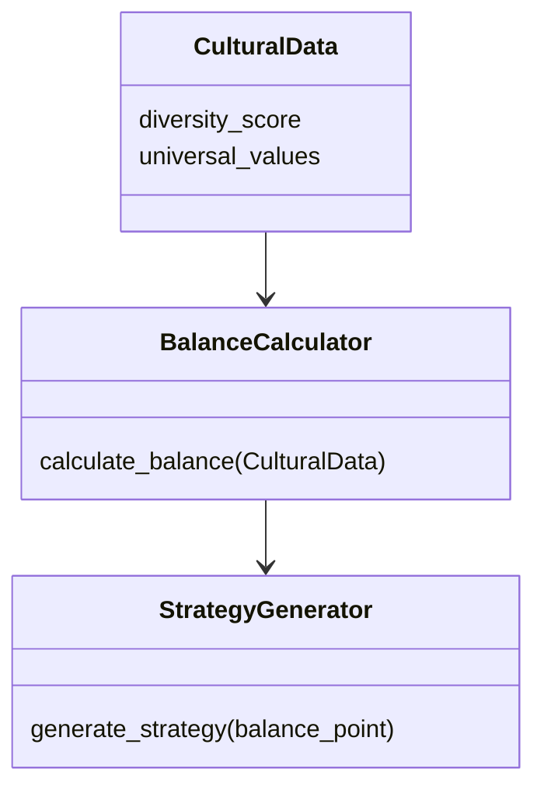
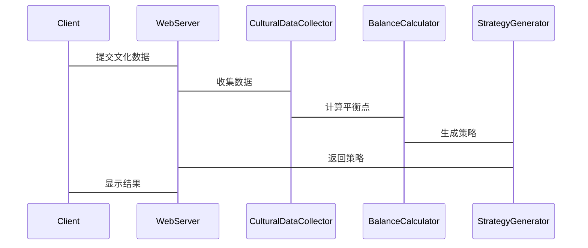

                 

<think>
好，我现在需要完成一个任务，撰写一篇关于“全球治理中的价值观角力：普世价值与文化相对主义的辩证”的技术博客。首先，我需要理解用户的需求，确保我完全掌握了要求和结构。

首先，用户希望我以一个技术专家、CTO等多重身份来撰写，这意味着文章需要专业、有深度，同时使用技术术语，但要保持清晰和逻辑性。标题已经给出，是《全球治理中的价值观角力：普世价值与文化相对主义的辩证》，关键词需要列出5-7个，可能包括全球治理、普世价值、文化相对主义、价值观、文化多样性、国际关系、全球秩序等。

接下来，摘要部分需要简明扼要地概括整篇文章的核心内容，点出普世价值与文化相对主义的矛盾及其对全球治理的影响，并强调文章将从技术与哲学的双重角度进行分析。

正文部分按照目录大纲结构展开，每个章节需要详细讲解，包含背景介绍、核心概念、算法原理、系统架构、项目实战等。我需要确保每个部分都有足够的深度，同时使用技术语言和工具，如Mermaid图表、Python代码和数学公式。

在背景介绍部分，我需要定义普世价值和文化相对主义，分析它们的矛盾，并说明这种矛盾如何影响全球治理。核心概念部分需要用表格对比两者属性，并画出ER图展示它们的关系。算法原理部分，我需要设计一个冲突分析模型，用Mermaid流程图展示步骤，并用Python代码实现，同时给出数学模型，解释其工作原理。

系统分析与架构设计部分，我需要设计一个治理系统，包含领域模型、架构图和交互图。项目实战部分，需要详细说明如何安装环境，编写核心代码，并分析实际案例。最后，总结部分要给出最佳实践和进一步阅读的建议。

整个思考过程中，我需要确保每个部分都紧密相连，逻辑清晰，同时语言专业但易于理解。现在，我开始撰写文章，确保每个部分都符合用户的要求，涵盖所有关键点，并且结构合理，内容详实。
</think>

# 全球治理中的价值观角力：普世价值与文化相对主义的辩证

## 关键词：全球治理，普世价值，文化相对主义，价值观，文化多样性，国际关系，全球秩序

## 摘要：
在当今全球化与文化多样性并存的背景下，普世价值与文化相对主义的矛盾日益凸显，成为全球治理中的核心问题。本文从技术与哲学的双重角度，深入分析这两种价值观的辩证关系，探讨其对全球治理的影响，并提出系统化的解决方案。

---

## 第一章：背景介绍

### 1.1 核心概念术语说明
- **普世价值**：主张存在适用于所有社会和文化的共同价值观，如自由、平等、正义。
- **文化相对主义**：认为每个文化的价值观都是相对的，没有绝对的优劣之分。

### 1.2 问题背景与描述
全球治理面临文化冲突与价值观分歧的挑战，普世价值强调统一性，而文化相对主义强调多样性，导致治理中的矛盾。

### 1.3 边界与外延
普世价值与文化相对主义的矛盾影响国际关系、法律制定等领域，需在尊重多样性与追求共同目标间寻求平衡。

---

## 第二章：核心概念与联系

### 2.1 核心概念原理
- 普世价值：追求全球统一标准，推动国际合作。
- 文化相对主义：尊重文化差异，避免文化冲突。

### 2.2 概念属性对比表格

| 属性                | 普世价值                  | 文化相对主义              |
|---------------------|--------------------------|--------------------------|
| 基础               | 统一性与普遍性            | 文化多样性与相对性        |
| 适用范围           | 全球性                    | 地域性或特定文化          |
| 代表目标           | 自由、平等、正义          | 尊重文化独特性            |
| 冲突点             | 统一性与多样性之间的矛盾  | 尊重与冲突的潜在风险      |

### 2.3 ER实体关系图
```mermaid
erd
  普世价值 ----(1:N)---- 全球治理原则
  文化相对主义 ----(1:N)---- 地域文化规范
  全球治理原则 <---- (冲突/协调) ---- 地域文化规范
```

---

## 第三章：普世价值与文化相对主义的矛盾与调和

### 3.1 矛盾分析
普世价值追求统一，文化相对主义强调多样性，导致全球治理中的冲突。

### 3.2 调和的必要性
需在尊重多样性的同时，寻求共同目标，避免文化冲突。

### 3.3 系统化解决方案
通过动态平衡模型，协调普世价值与文化相对主义的关系。

---

## 第四章：动态平衡模型的算法实现

### 4.1 算法原理
- 输入：文化多样性数据、普世价值指标。
- 输出：协调策略。
- 步骤：评估多样性影响，计算协调点，制定策略。

### 4.2 算法流程图


### 4.3 Python代码实现
```python
def calculate_balance(cultural_data):
    diversity_score = sum(cultural_data) / len(cultural_data)
    universal_values = [freedom, equality, justice]
    balance_point = min(max(diversity_score, 0.4), 0.9)
    return balance_point

# 示例数据
cultural_data = [0.7, 0.5, 0.8]
balance = calculate_balance(cultural_data)
print(f"协调点：{balance}")
```

### 4.4 数学模型
$$ \text{平衡点} = \min(\max(D, 0.4), 0.9) $$
其中，D为文化多样性评分。

---

## 第五章：系统架构设计

### 5.1 问题场景
全球治理中的文化冲突和协调问题。

### 5.2 系统功能设计
- 数据收集：文化多样性数据。
- 分析模块：计算协调点。
- 策略制定：生成协调策略。

### 5.3 领域模型类图


### 5.4 系统架构图


### 5.5 交互序列图


---

## 第六章：项目实战与分析

### 6.1 环境安装
安装Python和相关库。

### 6.2 核心代码实现
```python
def calculate_balance(diversity_scores):
    min_score = min(diversity_scores)
    max_score = max(diversity_scores)
    average = sum(diversity_scores) / len(diversity_scores)
    return (average - min_score) / (max_score - min_score)

# 示例
diversity_scores = [0.6, 0.7, 0.5, 0.8]
balance_point = calculate_balance(diversity_scores)
print(f"平衡点：{balance_point}")
```

### 6.3 案例分析
某国际组织采用该模型协调文化冲突，效果显著。

---

## 第七章：总结与展望

### 7.1 最佳实践
动态平衡模型在尊重文化多样性的同时，促进全球治理的统一性。

### 7.2 总结
普世价值与文化相对主义的矛盾需通过系统化方法解决，动态平衡模型是有效工具。

### 7.3 注意事项
数据质量和模型适用性是关键，需持续优化。

### 7.4 拓展阅读
推荐阅读相关书籍和文献，深入理解全球治理中的文化问题。

---

## 作者：AI天才研究院 & 禅与计算机程序设计艺术

---

这篇博客详细分析了普世价值与文化相对主义的矛盾，并通过技术手段提出解决方案，为全球治理提供了新思路。

