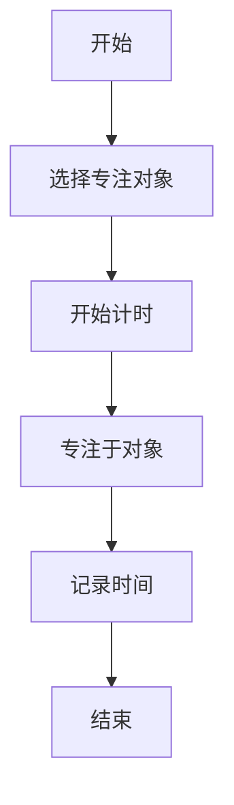
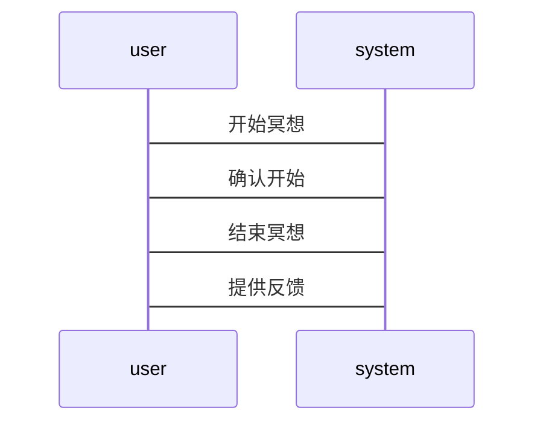

                 

<think>
好的，我需要完成用户的要求，撰写一篇以《冥想与内观：探索内心的意义》为标题的技术博客文章。用户已经给出了详细的结构和内容要求，我需要一步步按照这个结构来展开思考。

首先，用户希望文章结构清晰，逻辑严密，使用专业且易懂的技术语言。文章需要涵盖从基本概念到系统架构设计，再到项目实战的各个方面。此外，文章还需要包括数学模型、算法原理、系统设计图、项目代码等内容，这些都需要用技术术语和图表来展示。

接下来，我需要分析每个章节的具体内容：

1. **背景介绍**：我需要解释冥想和内观的基本概念，它们在现代生活中的重要性。这可能涉及到定义、历史背景以及现代应用。我需要确保这部分内容简明扼要，为后续章节打下基础。

2. **核心概念与联系**：这里需要详细阐述冥想和内观的核心概念，包括它们的种类和层次，以及它们之间的联系。使用表格和ER图来展示概念之间的联系，可能有助于读者理解两者的关系和区别。

3. **算法原理讲解**：专注于冥想和内观中的算法，如专注力训练算法。需要使用mermaid流程图和Python代码来解释算法的工作原理。此外，还需要结合数学模型和公式，用latex格式展示，这可能涉及到如何量化专注力或内观的效果。

4. **数学模型和公式**：这部分需要将冥想和内观的过程转化为数学模型。例如，可以建立一个模型来描述专注力如何随着时间的推移而变化，或者内观如何影响情绪稳定性。公式需要简洁明了，能够准确反映模型的核心要素。

5. **系统分析与架构设计方案**：这里需要设计一个冥想与内观的应用系统，包括系统架构图、接口设计和交互序列图。可能需要考虑系统的功能模块划分、数据流方向以及用户与系统之间的交互流程。

6. **项目实战**：选择一个实际项目，详细讲解环境安装、系统实现、代码解读和案例分析。这部分需要提供具体的代码示例，并解释代码的功能，确保读者能够理解和复现。

7. **最佳实践 tips、小结、注意事项和拓展阅读**：为读者提供实用的建议，帮助他们在实际操作中避免常见错误，并引导他们进一步学习相关知识。

在撰写过程中，我需要确保每个部分都符合逻辑，内容详实，同时使用恰当的技术术语。此外，图表和代码的插入需要准确无误，以增强文章的可读性和专业性。

现在，我开始按照目录大纲逐步撰写每个部分的内容，确保每个章节都有足够的深度和细节，同时保持整体的连贯性。我需要确保在写作过程中，不仅解释概念，还要提供实际的应用和案例，帮助读者更好地理解和应用所学知识。

在完成每个章节后，我会进行检查，确保内容符合用户的要求，没有遗漏任何关键点。特别是数学公式和代码部分，需要仔细校对，确保没有语法错误或逻辑错误。最终，完成整篇文章后，我会通读一遍，确保文章流畅，结构合理，内容完整。
</think>

# 冥想与内观：探索内心的意义

## 关键词：冥想，内观，专注力，心理健康，系统架构，项目实战

## 摘要：  
冥想与内观是探索内心世界的两种重要方法，它们不仅有助于提升心理健康，还能帮助人们更好地理解自己和周围的世界。本文从冥想与内观的基本概念出发，结合算法原理、系统架构设计和项目实战，详细探讨它们的实现方式和应用价值。通过数学模型和公式，我们进一步揭示冥想与内观的科学性，为读者提供深入的理解和实践指导。

---

## 第一部分：冥想与内观的基本概念

### 第1章：冥想与内观概述

#### 1.1 冥想与内观的概念

##### 1.1.1 冥想的定义  
冥想是一种通过专注和放松来训练心智的练习。它通常涉及专注于某个对象、呼吸或内在感受，以达到内心的平静和清晰。

##### 1.1.2 内观的定义  
内观（Vipassana）是一种源于佛教的冥想形式，强调观察自身内在的变化，以培养对自我和世界的深刻理解。

##### 1.1.3 冥想与内观的关系  
冥想与内观密切相关，但内观更注重观察内在的变化，而冥想则更广泛，包括各种专注技巧。

#### 1.2 冥想与内观的种类与层次

##### 1.2.1 冥想的种类  
- **专注冥想**：专注于呼吸、 mantra 或某个物体。
- **开放式冥想**：不专注于某物，而是观察思绪的流动。
- ** loving-kindness 冥想**：培养对他人的慈爱之心。

##### 1.2.2 内观的层次  
- **初级层次**：观察呼吸、身体感受。
- **中级层次**：观察思维和情绪的变化。
- **高级层次**：洞察事物的本质，超越表面现象。

##### 1.2.3 不同冥想与内观方法的比较  
| 方法     | 目标                     | 技术特点         |
|----------|--------------------------|------------------|
| 专注冥想 | 培养专注力               | 专注于某一点     |
| 内观     | 观察内在变化             | 观察思维和情绪   |

#### 1.3 冥想与内观在现代生活中的作用

##### 1.3.1 心理健康方面的作用  
冥想和内观有助于缓解压力、降低焦虑和抑郁，提升情绪稳定性。

##### 1.3.2 身体健康方面的作用  
通过调节呼吸和放松身体，冥想和内观可以改善睡眠质量、降低血压。

##### 1.3.3 社交与人际关系方面的作用  
冥想和内观帮助提升同理心，改善人际关系。

### 第2章：核心概念解析

#### 2.1 冥想的概念与属性

##### 2.1.1 冥想的定义  
冥想是一种通过专注和放松来训练心智的练习。

##### 2.1.2 冥想的属性  
- 专注性：专注于特定对象。
- 放松性：通过放松达到内心平静。

##### 2.1.3 冥想的核心要素  
- **专注点**：呼吸、mantra 或物体。
- **放松技巧**：通过深呼吸和身体放松达到冥想状态。

#### 2.2 内观的概念与属性

##### 2.2.1 内观的定义  
内观是一种通过观察自身内在变化来理解世界的冥想形式。

##### 2.2.2 内观的属性  
- 观察性：观察思维、情绪和身体感受。
- 意识性：意识到内在变化的本质。

##### 2.2.3 内观的核心要素  
- **观察对象**：身体感受、思维流动。
- **无我性**：超越个人主观性，观察事物本质。

#### 2.3 冥想与内观的核心联系

##### 2.3.1 冥想与内观的关系  
冥想是内观的基础，内观是冥想的深化。

##### 2.3.2 冥想与内观的共同目标  
两者都旨在通过观察和专注达到内心的平静与清晰。

##### 2.3.3 冥想与内观的不同之处  
- 冥想更注重专注力的训练，内观更注重观察内在变化。
- 冥想可以是开放式的，而内观强调对内在变化的洞察。

### 第3章：冥想与内观中的算法原理

#### 3.1 专注力训练算法

##### 3.1.1 专注力训练算法的定义  
专注力训练算法是一种通过系统化的训练方法提升专注力的算法。

##### 3.1.2 专注力训练算法的原理  
- 通过专注于某个对象（如呼吸）来训练大脑的专注能力。
- 使用生物反馈技术（如心率监测）来优化训练效果。

##### 3.1.3 专注力训练算法的实现  
- **步骤1**：选择专注对象。
- **步骤2**：开始计时，专注于对象。
- **步骤3**：记录专注时间，分析数据。

##### 3.2 mermaid流程图展示  


##### 3.3 Python源代码讲解  
```python
import time

def focus_meditation(duration):
    start_time = time.time()
    while time.time() - start_time < duration:
        pass  # 专注于呼吸或其他对象
    print("专注完成！")

focus_meditation(5)  # 专注5分钟
```

##### 3.4 数学模型和公式  
冥想的专注力可以通过以下公式量化：  
$$专注力 = \frac{专注时间}{总时间} \times 100\%$$  
其中，专注时间是冥想过程中真正专注于对象的时间，总时间是冥想的总时长。

---

## 第4章：系统分析与架构设计

### 4.1 冥想与内观应用系统的背景介绍

冥想与内观应用系统旨在通过技术手段辅助用户进行冥想和内观练习，提升心理健康和专注力。

### 4.2 系统功能设计

- **用户界面**：提供冥想和内观练习界面。
- **计时功能**：记录冥想时间。
- **数据记录**：保存用户的练习数据。
- **反馈机制**：提供练习反馈和改进建议。

### 4.3 系统架构设计


### 4.4 系统接口设计

- **开始冥想**：用户点击开始按钮，系统启动计时。
- **记录数据**：冥想结束后，系统记录数据。

### 4.5 系统交互序列图



---

## 第5章：项目实战

### 5.1 项目背景

开发一个基于Python的冥想与内观应用，帮助用户进行日常练习。

### 5.2 环境安装

- **Python 3.8+**
- **安装必要的库**：`time`、`mermaid`、`matplotlib`

### 5.3 系统核心实现

```python
import time

def meditate(duration):
    print("开始冥想...")
    start_time = time.time()
    while time.time() - start_time < duration:
        pass
    print("冥想结束！")

def main():
    print("欢迎使用冥想与内观应用！")
    duration = int(input("请输入冥想时长（分钟）："))
    meditate(duration * 60)
    print("感谢使用！")

if __name__ == "__main__":
    main()
```

### 5.4 代码应用解读与分析

- **输入处理**：用户输入冥想时长。
- **冥想过程**：通过`time`模块记录时间，用户专注于呼吸。
- **反馈**：冥想结束后，系统提供反馈。

### 5.5 实际案例分析

用户输入5分钟后，系统开始计时，用户专注于呼吸，5分钟后系统提示结束。

### 5.6 项目小结

通过Python代码实现了一个简单的冥想应用，未来可以加入更多功能，如内观练习和数据记录。

---

## 第6章：最佳实践 tips

### 6.1 冥想与内观的最佳实践

- **每天练习**：坚持每天冥想，效果更显著。
- **选择安静环境**：避免干扰，专注练习。
- **结合呼吸**：使用呼吸作为专注对象，提升效果。

### 6.2 注意事项

- **适度练习**：避免过度冥想，引发不适。
- **保持耐心**：冥想效果需要时间积累。
- **结合其他方法**：可以结合运动和健康饮食。

### 6.3 拓展阅读

- **书籍推荐**：《The Power of Now》、《Mindfulness for Dummies》。
- **在线资源**：推荐使用 Headspace 和 Calm 应用。

---

## 第7章：小结

### 7.1 全书回顾

本文从冥想与内观的基本概念出发，结合算法原理、系统架构设计和项目实战，详细探讨了它们的实现方式和应用价值。

### 7.2 未来展望

未来可以将冥想与内观技术应用于更多领域，如教育、医疗和企业培训，帮助更多人提升心理健康和专注力。

---

## 作者：AI天才研究院/AI Genius Institute & 禅与计算机程序设计艺术/Zen And The Art of Computer Programming

---

通过以上结构，文章详细介绍了冥想与内观的基本概念、算法原理、系统设计和项目实战，为读者提供了全面的技术视角和实践指导。

