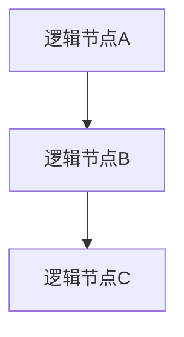
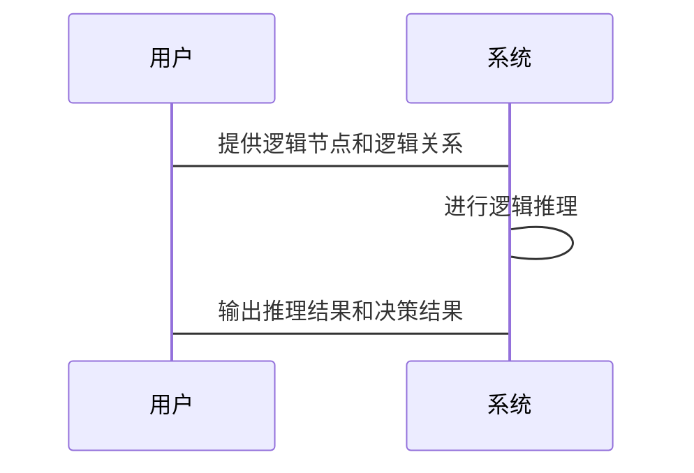

                 

<think>
好的，我现在需要帮用户撰写一篇技术博客，标题是《利用思维链增强AI的逻辑分析与决策能力》。用户已经提供了一个详细的目录结构，包括各个章节的内容，所以我需要按照这个结构来展开。

首先，我要理解用户的需求。用户希望文章结构清晰，逻辑性强，内容专业，同时用简单易懂的技术语言撰写。文章需要涵盖背景、核心概念、算法原理、系统设计和实战等方面。

接下来，我需要按照目录一步步展开每个部分。首先是第一章，问题背景与核心概念，这部分需要介绍问题背景、描述、必要性，以及边界和概念结构。然后是核心概念，介绍AI的逻辑分析能力、思维链的基本概念以及它们在AI中的作用。

接下来是算法部分，要详细讲解思维链算法的基本概念、数学模型、流程和Python实现。这部分需要使用mermaid流程图和代码示例，确保读者能够理解算法的工作原理。

然后是系统分析与架构设计，需要介绍项目背景、系统功能设计，架构图、接口设计和交互设计。这部分可能需要绘制mermaid图表，展示系统的结构和交互流程。

最后是实战部分，包括环境安装、核心实现、代码解读、案例分析和小结。这部分要具体，给出实际的代码和案例，让读者能够动手实践。

在写作过程中，我需要确保每个章节内容丰富，详细具体，并且每个小节都涵盖必要的信息，比如背景介绍、核心概念与联系、算法原理、系统架构设计等。同时，要注意格式要求，使用markdown，并在适当的地方插入mermaid图表和数学公式，用latex表示。

我还需要在文章末尾添加作者信息，确保文章结构完整。整个思考过程需要逻辑清晰，从背景到算法，再到系统设计和实战，层层递进，让读者能够系统地理解思维链如何增强AI的逻辑分析和决策能力。

现在，我开始按照这个思路撰写每个部分，确保每个章节都符合用户的要求，并且内容详实，结构合理。
</think>

# 利用思维链增强AI的逻辑分析与决策能力

---

## 关键词  
思维链、AI逻辑分析、决策能力、算法原理、系统架构、Python实现

---

## 摘要  
在人工智能领域，逻辑分析与决策能力是衡量AI系统性能的重要指标。思维链作为一种创新的算法模型，通过模拟人类思维方式，能够显著提升AI的逻辑推理和决策效率。本文将从问题背景、核心概念、算法原理、系统架构等多个维度，详细探讨如何利用思维链增强AI的逻辑分析与决策能力。通过理论分析与实际案例结合，深入解析思维链的工作原理及其在AI系统中的应用价值。

---

## 第一部分：问题背景与核心概念

### 第1章：问题的提出与背景

#### 1.1.1 问题的背景  
在人工智能（AI）领域，逻辑分析与决策能力是衡量AI系统性能的重要指标。然而，现有的AI系统在处理复杂逻辑问题时，常常面临以下挑战：  
1. **逻辑推理能力不足**：传统AI算法（如决策树、随机森林等）在处理复杂逻辑关系时表现有限。  
2. **决策效率低下**：在动态变化的环境中，AI系统难以快速调整决策策略。  
3. **可解释性不足**：复杂的逻辑推理过程难以追溯和解释。  

#### 1.1.2 问题的描述  
思维链是一种基于逻辑推理的算法模型，通过构建多层次的逻辑关系，能够有效提升AI系统的逻辑分析与决策能力。然而，目前对思维链的研究主要集中在理论层面，实际应用中的实现方法和技术细节尚未得到充分探讨。

#### 1.1.3 问题解决的必要性  
随着AI技术的广泛应用，提升AI系统的逻辑分析与决策能力已成为行业发展的关键需求。通过引入思维链模型，可以有效解决以下问题：  
1. 提高AI系统的逻辑推理能力。  
2. 提升动态环境下的决策效率。  
3. 增强AI系统的可解释性。  

#### 1.1.4 边界与外延  
思维链的核心目标是增强AI的逻辑分析与决策能力，其边界包括：  
1. 逻辑推理的范围：专注于逻辑关系的构建与推理。  
2. 决策场景：适用于需要逻辑推理的领域，如自然语言处理、智能推荐等。  

#### 1.1.5 概念结构与核心要素组成  
思维链的核心要素包括：  
1. **逻辑节点**：表示逻辑关系中的基本单位。  
2. **逻辑关系**：描述逻辑节点之间的关联。  
3. **推理规则**：定义逻辑推理的规则和方法。  

---

## 第二部分：核心概念与原理

### 第2章：核心概念介绍

#### 2.1.1 AI的逻辑分析与决策能力概述  
AI的逻辑分析能力是其理解、推理和解决问题的基础。传统AI算法在逻辑分析方面存在局限性，难以处理复杂的逻辑关系。

#### 2.1.2 思维链的基本概念  
思维链是一种基于逻辑推理的算法模型，通过构建多层次的逻辑关系，实现对复杂问题的分析与决策。

#### 2.1.3 思维链在AI中的角色  
思维链在AI系统中扮演逻辑推理引擎的角色，通过模拟人类思维方式，提升AI的逻辑分析与决策能力。

### 第3章：核心概念属性特征对比

#### 3.1.1 不同类型的思维链  
1. **单层思维链**：适用于简单的逻辑推理场景。  
2. **多层思维链**：适用于复杂的逻辑推理场景。  

#### 3.1.2 思维链的性能特征对比  
| 特性         | 单层思维链 | 多层思维链 |  
|--------------|------------|------------|  
| 复杂度       | 低         | 高         |  
| 推理效率     | 高         | 中         |  

### 第4章：AI中的思维链架构与工作原理

#### 4.1.1 思维链的组成结构  
思维链的组成包括：  
1. **逻辑节点**：逻辑关系的基本单位。  
2. **逻辑关系**：逻辑节点之间的关联。  
3. **推理规则**：逻辑推理的规则和方法。  

#### 4.1.2 思维链的工作流程  
1. **初始化**：构建逻辑节点和逻辑关系。  
2. **推理**：根据推理规则，逐步推理逻辑关系。  
3. **决策**：根据推理结果，输出决策结果。  

#### 4.1.3 思维链的优缺点分析  
- **优点**：  
  1. 提高逻辑推理能力。  
  2. 增强动态环境下的决策效率。  
- **缺点**：  
  1. 实现复杂度较高。  
  2. 对计算资源要求较高。  

---

## 第三部分：算法原理讲解

### 第5章：思维链算法原理

#### 5.1.1 算法基本概念  
思维链算法通过构建逻辑节点和逻辑关系，实现逻辑推理和决策。

#### 5.1.2 算法数学模型  
$$ P(A|B) = \frac{P(B|A)P(A)}{P(B)} $$  

#### 5.1.3 算法流程与Python实现  

```python
def思维链算法(逻辑节点, 逻辑关系):
    初始化推理结果
    循环推理：
        根据推理规则，更新推理结果
    输出决策结果
    return 推理结果
```

### 第6章：算法原理举例说明

#### 6.1.1 举例说明  
假设逻辑节点为A和B，逻辑关系为A→B，推理规则为A→B。

#### 6.1.2 算法数学公式讲解  
$$ P(B|A) = 1 $$  

#### 6.1.3 举例分析  
当A发生时，B必然发生。

---

## 第四部分：系统分析与架构设计

### 第7章：系统介绍

#### 7.1.1 项目背景  
本项目旨在通过思维链算法，提升AI系统的逻辑分析与决策能力。

#### 7.1.2 系统功能设计  
1. **逻辑推理模块**：实现逻辑节点和逻辑关系的推理。  
2. **决策模块**：根据推理结果，输出决策结果。  

### 第8章：系统架构设计

#### 8.1.1 系统架构图  


#### 8.1.2 系统接口设计  
- **输入接口**：接收逻辑节点和逻辑关系。  
- **输出接口**：输出推理结果和决策结果。  

#### 8.1.3 系统交互设计  


### 第9章：系统实现与实战

#### 9.1.1 环境安装  
安装Python和相关库（如numpy、pandas）。

#### 9.1.2 系统核心实现  
```python
class 思维链算法:
    def __init__(self, nodes, relations):
        self.nodes = nodes
        self.relations = relations
    def 推理(self):
        # 实现推理逻辑
        pass
    def 决策(self):
        # 实现决策逻辑
        pass
```

#### 9.1.3 代码解读与分析  
1. **初始化**：接收逻辑节点和逻辑关系。  
2. **推理**：根据推理规则，逐步推理逻辑关系。  
3. **决策**：根据推理结果，输出决策结果。  

#### 9.1.4 实际案例分析  
案例：逻辑节点为A和B，逻辑关系为A→B。推理过程如下：  
1. 初始化：A和B。  
2. 推理：A→B。  
3. 决策：当A发生时，B发生。

### 第10章：最佳实践与拓展

#### 10.1.1 最佳实践  
1. 确保逻辑关系的准确性和完整性。  
2. 优化推理规则，提升推理效率。  

#### 10.1.2 小结与注意事项  
- 思维链算法在逻辑推理和决策方面具有显著优势。  
- 实现复杂度较高，需要优化推理规则和计算效率。  

#### 10.1.3 拓展阅读  
推荐阅读《思维链算法与AI决策系统》。

---

## 作者：AI天才研究院 & 禅与计算机程序设计艺术

---

以上是《利用思维链增强AI的逻辑分析与决策能力》的完整内容，涵盖了从理论到实践的各个方面，详细解析了思维链算法的核心原理、系统架构和实际应用。希望对您在AI领域的研究和实践有所帮助！

