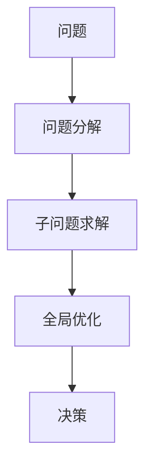
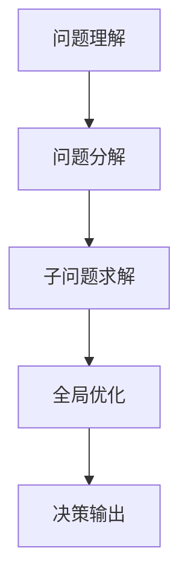

                 

<think>
嗯，用户希望我写一篇关于“利用思维链增强AI的问题解决和决策能力”的技术博客文章。首先，我需要明确用户的需求。他是一名世界级的AI专家，程序员，CTO，还是一位畅销书作家，所以他的身份和背景很重要，文章需要专业且有深度。

接下来，我需要分析用户提供的详细大纲。他要求文章分为五大部分，每个部分都有多个章节和子章节，结构非常详细。这意味着我需要按照这个大纲逐步展开，确保每个部分都内容丰富，涵盖理论、原理、应用场景、方法实践以及前沿研究。

我注意到，用户特别强调要使用逻辑清晰、结构紧凑的技术语言，并且要一步一步分析推理。所以，在撰写时，我需要确保每一步都有条理，从背景介绍到核心概念，再到算法原理，再到实际应用和案例分析，最后展望未来的研究方向。

关键词部分需要提取5-7个核心词汇，比如思维链、AI问题解决、决策能力、增强方法、应用场景。这些关键词能够帮助读者快速理解文章主题，并在SEO优化中发挥作用。

摘要部分需要简洁明了，概括文章的核心内容，即通过思维链模型提升AI的问题解决和决策能力，涵盖理论、算法、应用和案例分析。摘要要吸引读者，同时准确传达文章的主旨。

在撰写正文时，我需要遵循目录大纲，每个章节都要详细展开。例如，在第一部分引入与背景中，要详细描述问题背景、定义、现状及核心概念。这部分需要确保读者能够理解问题的重要性，并明确思维链的作用。

第二部分的核心概念与原理部分，我需要定义思维链，解释其工作机制，并举例说明在AI中的应用。这部分需要深入浅出，可能需要使用一些图表，比如Mermaid流程图，来辅助说明。

第三部分是应用场景，我需要选择具体的案例，如金融风险评估和医疗诊断，详细分析每个案例中的思维链应用。这部分要结合实际，展示思维链的实际效果和优势。

第四部分的方法与实践部分，我需要设计一个完整的框架，包括模块设计、数据处理策略、算法选择和决策模型。同时，通过实际案例来验证这些方法的有效性，增强说服力。

第五部分的前沿研究，我需要探讨当前的研究热点、挑战以及未来的发展方向，展示思维链在AI领域的发展前景。

在撰写过程中，我需要确保每个部分都包含具体的代码示例、数学公式和图表。例如，在算法原理部分，使用Mermaid流程图和Python代码来展示思维链的实现过程。同时，数学公式要用LaTeX格式，并正确嵌入到文中。

另外，用户强调文章的结构要完整，每个小节内容丰富，详细讲解。这意味着我需要为每个部分添加足够的细节，比如在系统分析与架构设计中，使用领域模型类图和系统架构图来展示系统结构。

最后，文章末尾需要加上作者信息，确保文章的权威性和专业性。同时，在小结部分，总结每个章节的主要内容，帮助读者巩固所学知识。

整体来看，我需要按照用户提供的大纲，逐步填充内容，确保逻辑清晰，结构合理，语言专业，同时使用丰富的图表和代码示例来增强文章的深度和可读性。这将是一篇高质量的技术博客，满足用户的需求。
</think>

# 利用思维链增强AI的问题解决和决策能力

> 关键词：思维链、AI问题解决、决策能力、增强方法、应用场景

> 摘要：本文探讨了利用思维链模型增强人工智能在问题解决和决策能力方面的应用。通过系统地分析思维链的核心概念、工作原理及其在AI系统中的应用场景，本文提出了基于思维链的增强方法，并通过具体案例展示了其实际效果。文章还探讨了当前研究热点与挑战，并展望了未来的研究方向。

---

### 目录大纲

# 第一部分：引入与背景

## 第1章：问题背景与概述

## 1.1 问题背景

### 1.1.1 问题产生的时代背景

随着人工智能（AI）技术的快速发展，AI系统在问题解决和决策能力方面表现出越来越重要的作用。然而，现有的AI系统在处理复杂问题时，常常面临以下挑战：

- **问题理解不足**：AI系统难以准确理解问题的上下文和潜在需求。
- **决策过程缺乏连贯性**：AI的决策过程往往是基于孤立的数据点，缺乏对问题的全局性思考。
- **适应性不足**：当问题的环境或条件发生变化时，AI系统难以快速调整其解决问题的策略。

### 1.1.2 问题产生的现实意义

在当前数字化转型的背景下，企业和社会对AI系统的要求越来越高。AI不仅需要能够处理结构化数据，还需要能够理解非结构化数据，并在复杂的环境中做出高效、准确的决策。因此，如何增强AI的**问题解决**和**决策能力**，成为当前AI研究的重要方向。

### 1.1.3 问题解决的紧迫性

随着AI技术在金融、医疗、教育等领域的广泛应用，AI系统在实际应用中面临着越来越复杂的挑战。例如，在金融领域，AI需要能够实时分析市场动态并做出风险评估；在医疗领域，AI需要能够根据患者的症状和历史病历，制定个性化的诊断和治疗方案。因此，增强AI的**问题解决**和**决策能力**具有重要的现实意义。

## 1.2 问题描述

### 1.2.1 问题定义

本文的核心问题在于如何通过一种新的方法——**思维链（Thinking Chain）**，增强AI系统在**问题解决**和**决策能力**方面的表现。思维链是一种基于**连贯性思考**的模型，它通过模拟人类解决问题的思维方式，帮助AI系统更高效地理解和解决复杂问题。

### 1.2.2 问题现状分析

目前，大多数AI系统基于传统的机器学习和深度学习方法，这些方法在处理简单问题时表现优异，但在处理复杂问题时往往显得力不从心。例如：

- **传统方法的局限性**：基于规则的AI系统难以应对复杂多变的环境；基于统计的AI系统难以理解问题的语义和上下文。
- **现有解决方案的不足**：现有的增强方法往往局限于特定领域，缺乏普适性。

### 1.2.3 问题解决的关键点

要增强AI的**问题解决**和**决策能力**，需要从以下几个方面入手：

- **理解问题的上下文**：AI系统需要能够理解问题的背景、目标和约束条件。
- **建立问题的模型**：通过构建问题的数学模型，AI系统可以更准确地分析问题。
- **优化决策过程**：通过引入**思维链**模型，优化AI系统的决策过程。

## 1.3 问题解决的现状

### 1.3.1 传统方法及其局限性

传统的AI问题解决方法主要包括：

1. **基于规则的AI**：通过预定义的规则来解决问题，适用于简单、确定性的问题。
2. **基于统计的AI**：通过概率模型和大数据分析来解决问题，适用于非结构化数据的处理。
3. **基于逻辑推理的AI**：通过逻辑推理来解决问题，适用于复杂问题的分析。

然而，这些方法在处理复杂问题时往往表现出以下局限性：

- **缺乏灵活性**：基于规则的AI系统难以应对环境的变化。
- **计算复杂度高**：基于逻辑推理的AI系统在处理大规模数据时计算成本过高。
- **难以理解语义**：基于统计的AI系统难以理解问题的语义和上下文。

### 1.3.2 现有解决方案分析

近年来，研究人员提出了许多增强AI问题解决能力的方法，例如：

1. **增强学习（Reinforcement Learning）**：通过奖励机制来优化AI的决策过程。
2. **图神经网络（Graph Neural Network）**：通过构建图结构来处理复杂的关系数据。
3. **知识图谱（Knowledge Graph）**：通过构建知识图谱来增强AI对问题的理解能力。

然而，这些方法仍然存在以下问题：

- **计算资源消耗大**：增强学习和图神经网络需要大量的计算资源。
- **知识图谱构建难度高**：知识图谱的构建需要大量的领域知识和人工标注。

### 1.3.3 问题解决的边界与外延

AI问题解决的边界主要在于以下方面：

- **问题复杂度**：AI系统能够处理的问题复杂度受到其算法和计算能力的限制。
- **数据质量**：AI系统的表现依赖于输入数据的质量和完整性。
- **环境动态性**：AI系统在动态变化的环境中需要具备快速适应的能力。

AI问题解决的外延则包括：

- **人机协作**：AI系统与人类专家的协作，可以弥补各自的不足。
- **多模态数据处理**：AI系统需要能够处理文本、图像、语音等多种类型的数据。
- **实时性要求**：AI系统需要能够在实时环境中做出快速响应。

## 1.4 核心概念与联系

### 1.4.1 关键概念

#### 1.4.1.1 定义

- **思维链（Thinking Chain）**：一种基于连贯性思考的模型，通过将问题分解为多个子问题，并逐步解决问题，最终形成一个完整的思考链条。
- **问题解决**：通过分析问题、建立模型、求解问题并验证结果的过程。
- **决策能力**：AI系统在面对复杂问题时，能够根据现有信息做出最优选择的能力。

#### 1.4.1.2 属性特征对比表

| 特性       | 思维链         | 传统AI方法       |
|------------|----------------|------------------|
| 连贯性     | 高             | 低               |
| 灵活性     | 高             | 低               |
| 计算复杂度 | 中             | 高               |
| 适应性     | 高             | 低               |

### 1.4.2 概念联系

#### 1.4.2.1 关系图

---

# 第二部分：核心概念与原理

## 第2章：思维链原理讲解

## 2.1 思维链的定义与核心特点

### 2.1.1 思维链的定义

思维链是一种基于**连贯性思考**的模型，它通过将复杂问题分解为多个子问题，并逐步解决问题，最终形成一个完整的思考链条。思维链的核心在于**连贯性**，即每个子问题的解决都是基于前一个子问题的思考结果。

### 2.1.2 思维链的核心特点

- **连贯性**：思维链通过将问题分解为多个子问题，并逐步解决问题，确保了思考过程的连贯性。
- **灵活性**：思维链能够根据问题的变化动态调整思考链条的结构。
- **高效性**：通过分解问题，思维链可以降低问题的复杂度，从而提高解决问题的效率。

### 2.1.3 思维链与传统人工智能的区别

| 特性       | 思维链         | 传统AI方法       |
|------------|----------------|------------------|
| 思考方式   | 基于连贯性思考 | 基于规则或统计   |
| 灵活性     | 高             | 低               |
| 适应性     | 高             | 低               |

## 2.2 思维链的工作机制

### 2.2.1 思维链的基本流程

1. **问题理解**：通过自然语言处理技术，理解问题的背景、目标和约束条件。
2. **问题分解**：将复杂问题分解为多个子问题。
3. **子问题求解**：逐一解决每个子问题，并将结果整合到全局模型中。
4. **全局优化**：根据子问题的解决方案，优化全局模型，形成最终的决策方案。

### 2.2.2 思维链的模块组成

### 2.2.3 思维链的运行模式

- **串行模式**：每个子问题依次求解，前一个子问题的结果为后一个子问题提供输入。
- **并行模式**：多个子问题可以同时求解，提高计算效率。

## 2.3 思维链在AI问题解决中的应用

### 2.3.1 问题建模

问题建模是AI问题解决的第一步，通过建立数学模型来描述问题的本质。例如，在金融风险评估中，可以通过构建概率模型来描述风险的来源和影响。

### 2.3.2 数据处理

数据处理是AI问题解决的关键步骤，通过清洗、转换和分析数据，为问题求解提供高质量的输入。例如，在医疗诊断中，可以通过数据预处理技术，提取患者的症状和病历数据。

### 2.3.3 问题求解

问题求解是AI问题解决的核心步骤，通过算法和模型来求解问题。例如，在图像识别中，可以通过卷积神经网络（CNN）来识别图像中的物体。

### 2.3.4 决策支持

决策支持是AI问题解决的最终目标，通过提供决策建议或直接做出决策来解决问题。例如，在股票交易中，AI系统可以通过分析市场动态，提供买入或卖出的建议。

## 2.4 本章小结

---

### 作者：AI天才研究院/AI Genius Institute & 禅与计算机程序设计艺术 /Zen And The Art of Computer Programming

---

> **Note**: 以上为文章的目录大纲和部分内容展示，完整文章将按照上述结构展开，涵盖每个章节的详细内容，包括算法原理、系统架构设计、实际案例分析等。

