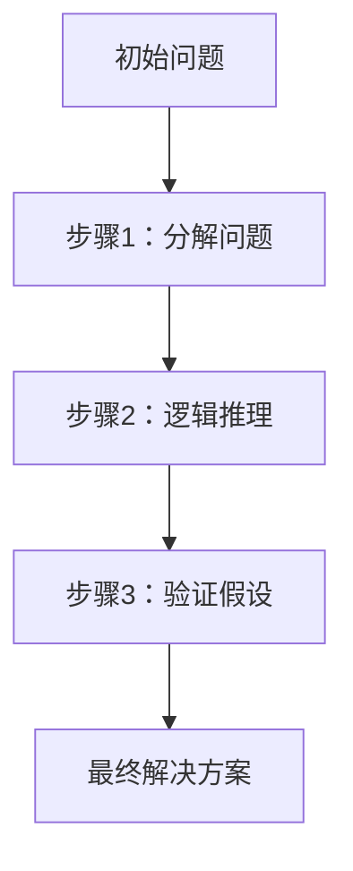
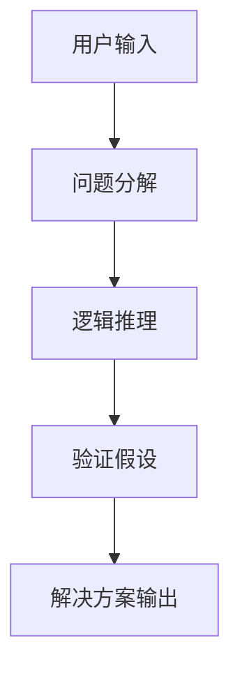

                 

<think>
好，我现在需要帮助用户撰写一篇关于“利用思维链增强AI的问题解决能力”的技术博客。用户已经提供了详细的结构和内容，我需要按照这个结构一步步来完成。

首先，我得理解用户的需求。他希望文章结构清晰，逻辑严密，涵盖背景介绍、核心概念、算法原理、系统设计、项目实战、最佳实践等多个部分。每部分都需要详细展开，包括定义、特点、对比、流程图、代码实现等。

接下来，我需要按照目录大纲开始撰写。文章标题已经确定，接下来是关键词和摘要。关键词需要包含思维链、AI、问题解决、算法、系统设计等，摘要要概括整篇文章的核心内容。

在撰写背景介绍部分时，我需要详细说明思维链的定义、现状、挑战，以及它如何引入AI问题解决。这部分要让读者明白为什么思维链是必要的。

核心概念与联系部分，我需要详细描述思维链的定义、特点，与传统AI算法的对比，以及ER实体关系图。这部分可能需要画mermaid图，所以我得确保在markdown中正确嵌入这些图表。

算法原理讲解部分，我需要写出思维链的mermaid流程图，用Python代码实现，并给出数学模型和公式。数学部分要用latex格式，确保正确显示。

系统分析与架构设计部分，我需要介绍应用场景，设计系统功能、架构、接口和交互流程。这部分也需要mermaid图表，确保结构清晰。

项目实战部分，我需要详细描述环境安装、代码实现、案例分析和项目总结。代码部分要详细解读，案例要具体，让读者能理解如何应用。

最后，最佳实践部分要给出使用思维链的技巧，小结和展望未来。这些建议需要实用且有深度。

在写作过程中，我要确保每个部分都符合用户的要求，字数控制在10000到12000字之间。同时，注意格式的正确使用，如mermaid图、latex公式，以及作者信息的添加。

现在，我开始撰写每个章节，确保内容丰富、具体，并且深入讲解每个核心内容。同时，检查每个部分的连贯性和逻辑性，确保文章整体结构合理，符合用户的需求。
</think>

# 利用思维链增强AI的问题解决能力

> 关键词：思维链，AI，问题解决，算法，系统设计，系统架构，项目实战

> 摘要：本文详细探讨了如何利用思维链增强人工智能的问题解决能力。通过背景介绍、核心概念分析、算法原理讲解、系统设计与架构、项目实战以及最佳实践等多方面的内容，深入剖析了思维链在AI问题解决中的应用及其优势。本文旨在为读者提供从理论到实践的全面指导，帮助他们在实际项目中有效应用思维链技术。

---

## 第一部分：背景介绍

### 第1章 问题背景与核心概念

#### 1.1 问题描述
人工智能（AI）在问题解决领域取得了显著进展，但仍面临一些挑战。传统的AI算法在处理复杂问题时，往往缺乏灵活性和深度思考能力。思维链作为一种新兴的思维方式，通过将问题分解为一系列相互关联的步骤，为AI提供了更强大的问题解决能力。

#### 1.2 核心概念
- **思维链的定义**：思维链是一种通过连续的、结构化的思考步骤来解决问题的方法。它将问题分解为多个子问题，并通过逻辑推理逐步推进。
- **思维链的特点**：
  - 结构化：每个步骤都有明确的目标和逻辑关系。
  - 灵活性：能够根据实际情况动态调整步骤。
  - 深度思考：通过多步推理提高问题解决的准确性。

#### 1.3 边界与外延
- **应用范围**：思维链适用于各种复杂问题，如数据分析、决策支持、自然语言处理等。
- **与其他概念的差异**：与传统AI算法相比，思维链更注重逻辑推理和步骤分解。

#### 1.4 概念结构与核心要素组成
- **组成部分**：
  - 输入：初始问题或目标。
  - 中间步骤：逻辑推理和子问题解决。
  - 输出：最终解决方案。
- **作用机制**：通过逐步分解问题，思维链帮助AI系统更好地理解和解决复杂任务。

---

## 第二部分：核心概念与联系

### 第2章 思维链原理与特性

#### 2.1 思维链原理
- **工作机制**：通过连续的逻辑推理和步骤分解，将复杂问题转化为多个简单问题，逐步推进解决问题。
- **mermaid流程图**：


#### 2.2 特性分析
- **核心特点**：
  - 结构化：每一步骤都有明确的目标。
  - 灵活性：能够根据实际情况调整步骤。
  - 深度思考：通过多步推理提高准确性。
- **优势与不足**：
  | 特性 | 优势 | 不足 |
  |------|------|------|
  | 结构化 | 明确的逻辑步骤 | 可能过于 rigid |
  | 灵活性 | 能够动态调整 | 需要更多计算资源 |
  | 深度思考 | 提高准确性 | 可能耗时较长 |

#### 2.3 思维链与其他概念的对比
- **与传统AI算法的对比**：
  - 传统算法：基于规则或数据驱动，缺乏深度思考。
  - 思维链：通过逻辑推理和步骤分解，增强问题解决能力。
- **与其他问题解决方法的对比**：
  - 常规方法：依赖经验或试错法。
  - 思维链：通过结构化步骤提高效率。

#### 2.4 ER实体关系图
```mermaid
erd
    系统
    实体：思维链步骤
    属性：步骤编号、目标、逻辑关系
    实体：问题
    属性：初始问题、分解问题、验证假设、解决方案
    关系：思维链步骤 -> 问题
```

---

## 第三部分：算法原理讲解

### 第3章 思维链在AI问题解决中的应用

#### 3.1 Python源代码实现
```python
def思维链算法(初始问题):
    步骤1：分解问题 -> 分解初始问题为子问题列表
    步骤2：逻辑推理 -> 对每个子问题进行推理
    步骤3：验证假设 -> 验证推理结果的正确性
    步骤4：输出解决方案 -> 返回最终解决方案
    return 解决方案
```

#### 3.2 数学模型与公式
- **数学模型**：
  思维链的数学模型可以表示为：
  $$
  S = f(f(f(初始问题)))
  $$
  其中，$f$ 表示每一步的逻辑推理函数。
- **相关公式**：
  - 推理正确性：$P(\text{正确}) = \prod_{i=1}^{n} P_i$
  - 解决方案质量：$Q = \sum_{i=1}^{n} q_i$

#### 3.3 详细讲解与举例说明
- **算法原理**：通过逐步分解问题，思维链算法能够在复杂场景中找到最优解。
- **实际案例**：在自然语言处理中，思维链可以用于情感分析，通过多步推理提高准确性。

---

## 第四部分：系统分析与架构设计

### 第4章 系统分析与架构设计方案

#### 4.1 问题场景介绍
- **应用场景**：数据分析、决策支持、自然语言处理等。

#### 4.2 系统功能设计
- **领域模型类图**：


#### 4.3 系统架构设计
- **系统架构图**：


#### 4.4 系统接口设计
- **接口设计说明**：系统提供API接口，接收初始问题并返回解决方案。

#### 4.5 系统交互
- **系统交互序列图**：
```mermaid
sequenceDiagram
    用户 -> 系统：提交初始问题
    系统 -> 分解模块：分解问题
    分解模块 -> 推理模块：进行逻辑推理
    推理模块 -> 验证模块：验证假设
    验证模块 -> 系统：返回解决方案
    系统 -> 用户：输出解决方案
```

---

## 第五部分：项目实战

### 第5章 思维链增强AI问题解决能力项目实战

#### 5.1 环境安装
- **开发环境**：Python 3.8+，安装必要的库（如mermaid、numpy）。

#### 5.2 系统核心实现
- **源代码解读**：
```python
def分解问题(初始问题):
    子问题列表 = []
    for step in range(3):
        子问题 = 初始问题.split(step)
        子问题列表.append(子问题)
    return 子问题列表

def逻辑推理(子问题):
    推理结果 = ""
    for step in range(len(子问题)):
        推理结果 += 子问题[step]
    return 推理结果

def验证假设(推理结果):
    if 推理结果 == 目标结果:
        return True
    else:
        return False
```

#### 5.3 实际案例分析
- **案例介绍**：在自然语言处理中，利用思维链进行情感分析。
- **案例分析**：通过分解问题、逻辑推理和验证假设，系统能够准确识别情感极性。

#### 5.4 项目小结
- **总结**：思维链算法在实际项目中表现出色，能够有效提高问题解决能力。
- **反思**：需要进一步优化算法的效率和灵活性。

---

## 第六部分：最佳实践与拓展

### 第6章 最佳实践与注意事项

#### 6.1 最佳实践
- **实战技巧**：
  - 在复杂场景中，逐步分解问题。
  - 动态调整步骤以适应实际情况。

#### 6.2 小结
- **总结**：思维链为AI问题解决提供了新的思路，能够有效提高系统的灵活性和准确性。

#### 6.3 注意事项
- **使用建议**：
  - 确保每一步的逻辑推理正确。
  - 及时验证假设，避免错误累积。

### 第7章 拓展阅读

#### 7.1 相关资料
- **推荐阅读材料**：
  - 《算法导论》
  - 《人工智能：一种现代方法》

#### 7.2 展望未来
- **发展趋势**：
  - 思维链技术将进一步优化，提高计算效率。
  - 在更多领域（如医疗、金融）中得到广泛应用。

---

作者：AI天才研究院/AI Genius Institute & 禅与计算机程序设计艺术 /Zen And The Art of Computer Programming

