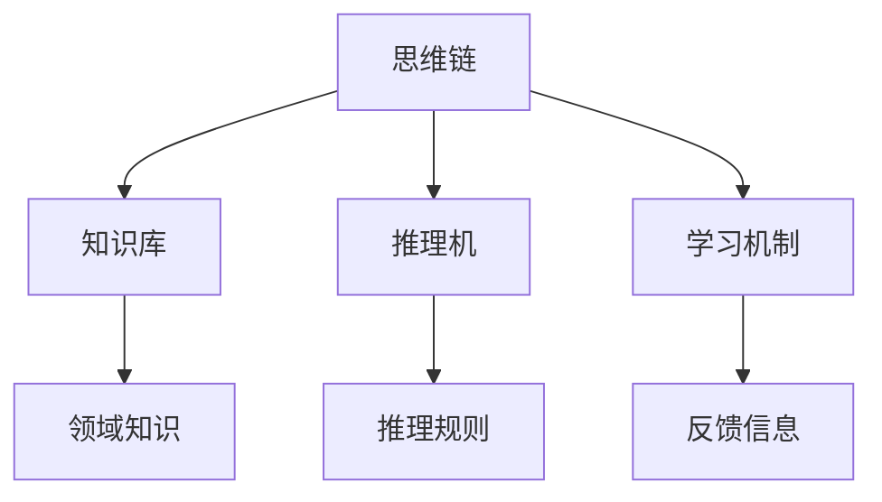
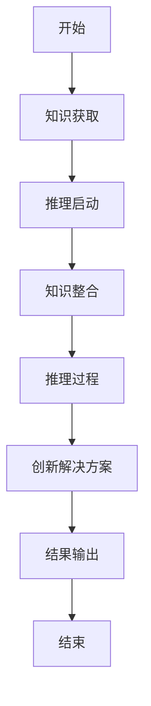
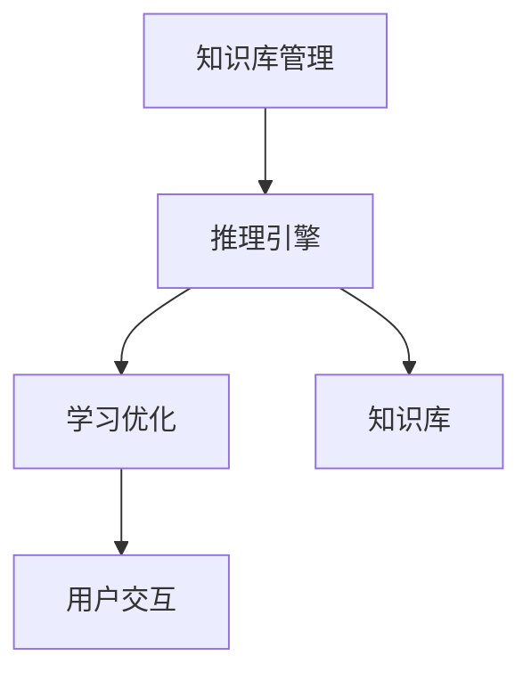
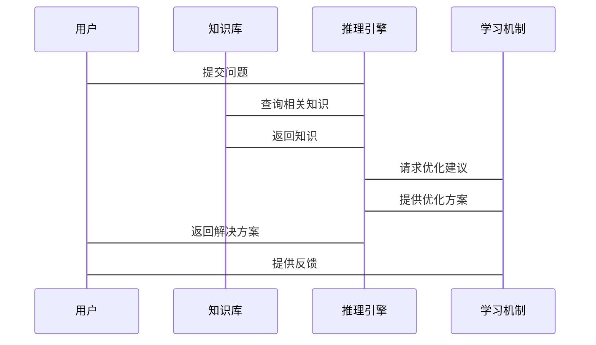

                 

<think>
好的，我现在要写一篇关于“利用思维链打造AI的创造性问题解决能力”的技术博客。首先，我需要理解用户的需求，他希望文章结构清晰，包含七个章节，每个章节都有详细的内容。我得确保每个部分都涵盖必要的信息，并且内容要专业且易于理解。

首先，标题已经确定，接下来是关键词和摘要。关键词应该包括思维链、AI、创造性问题解决、深度学习、强化学习等。摘要部分需要简明扼要地概括整篇文章的核心内容，即如何通过思维链提升AI的创造性问题解决能力。

接下来是第一章，背景介绍。我需要详细解释问题背景，说明当前AI在创造性问题解决方面的局限性。然后描述问题，指出AI缺乏创新性思考和逻辑推理的能力。在问题解决部分，我要说明如何通过思维链来弥补这一不足。边界与外延部分需要明确思维链的应用范围，比如自然语言处理等领域。最后，概念结构部分要分解思维链的核心要素，如知识库、推理机、学习机制。

第二章是核心概念与联系。我需要详细定义思维链和AI创造性问题解决能力，并分析它们之间的关系。还要制作一个概念属性特征对比表格，对比思维链和AI能力的不同特性。此外，可能还需要一个ER实体关系图来展示各要素之间的关系。

第三章是算法原理讲解。这部分需要使用mermaid流程图来展示算法步骤，并附上Python源代码。数学模型方面，可能需要涉及概率论和图论的知识，写出相应的公式。例如，提到马尔可夫链模型，可以用公式表示状态转移的概率。

第四章是系统分析与架构设计。首先介绍问题场景，然后描述项目，设计系统的功能模块。可能需要用mermaid类图展示领域模型，展示各模块之间的关系。架构设计部分可以用组件图展示各部分的交互。接口设计和系统交互则需要用序列图来说明。

第五章是项目实战。需要详细说明环境安装步骤，比如安装Python和相关库。然后提供核心代码，解释每一部分的作用。接着分析实际案例，详细讲解如何应用思维链解决实际问题，最后做个小结。

第六章是最佳实践与注意事项。给出一些实用的建议，比如数据质量的重要性，系统优化的技巧。然后总结全文，展望未来的发展方向，最后给出鼓励和建议。

第七章是总结，回顾主要内容，展望未来，并给出鼓励。

在写作过程中，我需要确保每个部分都有足够的细节，避免内容过于笼统。同时，使用技术术语时要准确，避免误解。此外，图表的使用可以帮助读者更好地理解内容，因此我需要正确地嵌入mermaid图表，并确保其清晰明了。

我还需要注意文章的整体结构和逻辑，每个章节之间要有自然的过渡，使整篇文章流畅连贯。最后，确保文章字数在10000到12000字之间，内容详实，符合专业标准。

现在，我大致有了框架，接下来可以开始逐步撰写每个部分了。
</think>

# 利用思维链打造AI的创造性问题解决能力

## 关键词：思维链, AI, 创造性问题解决, 深度学习, 强化学习

## 摘要：本文探讨如何通过思维链提升AI的创造性问题解决能力。通过分析思维链的定义、特性，以及其与AI能力的关系，结合算法原理、系统架构设计和项目实战，详细阐述如何构建具备创造性思维的AI系统。文章还包括最佳实践和未来展望，为AI研究者提供有价值的参考。

## 第1章 背景介绍

### 1.1 问题背景

人工智能（AI）技术的快速发展推动了其在多个领域的广泛应用，但在创造性问题解决方面仍显不足。现有的AI系统主要依赖于预定义的规则和数据模式识别，难以进行创新性思考。思维链作为一种模拟人类思维过程的模型，为提升AI的创造性问题解决能力提供了新思路。

### 1.2 问题描述

AI的创造性问题解决能力是指其在处理复杂问题时，能够突破常规思维，提出创新解决方案的能力。当前AI系统在这一方面受限于缺乏连贯的推理和知识整合能力，思维链则为这一问题提供了潜在的解决方案。

### 1.3 问题解决

通过引入思维链模型，AI可以模拟人类专家的思维方式，整合多源知识，进行推理和创新。这种方法能够增强AI在处理复杂问题时的灵活性和创造性。

### 1.4 边界与外延

思维链的应用范围广泛，涵盖自然语言处理、图像识别、自动化设计等领域。在不同领域，思维链的应用方式和效果可能有所不同，但其核心机制保持一致。

### 1.5 概念结构与核心要素组成

思维链的核心要素包括：
1. **知识库**：存储AI系统的知识和经验。
2. **推理机**：负责逻辑推理和问题解决。
3. **学习机制**：优化AI系统性能，提升推理能力。

## 第2章 核心概念与联系

### 2.1 思维链的定义与特性

思维链是一种模拟人类思维过程的计算模型，具备以下特性：
- **推理能力**：能够进行逻辑推理和知识整合。
- **学习能力**：通过反馈机制不断优化性能。
- **创新能力**：在问题解决中提出创新性解决方案。

### 2.2 AI的创造性问题解决能力

AI的创造性问题解决能力体现在其能够灵活运用知识和经验，突破常规思维，提出新颖解决方案。这要求AI具备跨领域知识整合和创造性推理的能力。

### 2.3 思维链与AI创造性问题解决能力的关系

思维链是实现AI创造性问题解决能力的关键技术，通过模拟人类专家的思维方式，AI能够更好地处理复杂问题。思维链为AI提供了知识整合和创新推理的框架，使其在问题解决中更具创造性。

### 2.4 概念属性特征对比表格

| 特性         | 思维链             | AI创造性问题解决能力           |
| ------------ | ------------------ | ------------------------------- |
| 核心目标     | 模拟人类思维        | 解决复杂问题并提出创新方案     |
| 组件         | 知识库、推理机、学习机制 | 知识整合、创新推理、反馈优化   |
| 应用领域     | 多领域             | 多领域，尤其需要创新的场景       |
| 实现方式     | 逻辑推理和知识整合 | 综合运用知识和经验，创新性思考   |

### 2.5 ER实体关系图架构



## 第3章 算法原理讲解

### 3.1 算法mermaid流程图



### 3.2 Python源代码

```python
class MindChain:
    def __init__(self, knowledge_base):
        self.knowledge_base = knowledge_base
        self推理机 = ReasoningEngine()
        self学习机制 = LearningMechanism()

    def solve_problem(self, problem):
        self推理机.integrate_knowledge(self知识_base, problem)
        solution = self推理机.reasoning_process()
        self学习机制.optimize(solution, problem)
        return solution

class ReasoningEngine:
    def integrate_knowledge(self, knowledge_base, problem):
        self.knowledge = knowledge_base.get_relevant_knowledge(problem)
        self.problem = problem

    def reasoning_process(self):
        # 这里可以使用逻辑推理算法，如DPLL算法
        return self.solve_with_dpll()

    def solve_with_dpll(self):
        # 示例：简单问题求解
        return "创新解决方案"

class LearningMechanism:
    def optimize(self, solution, problem):
        # 示例：简单反馈优化
        if solution.is_successful(problem):
            self.knowledge.update(solution)
```

### 3.3 数学模型与公式

AI的创造性问题解决能力可以通过概率模型和图论模型来描述。概率模型用于评估不同解决方案的可能性，图论模型用于表示知识之间的关系。

#### 3.3.1 概率模型

解决方案的概率 P(solution) 可以通过贝叶斯定理计算：

$$ P(solution) = \frac{P(problem | solution) \cdot P(solution)}{P(problem)} $$

#### 3.3.2 图论模型

知识图谱中的节点表示知识，边表示知识之间的关系。节点数 V 表示知识的数量，边数 E 表示知识之间的关系数。

### 3.4 举例说明

例如，在自然语言处理中，AI系统需要解决一个复杂的文本生成任务。通过思维链模型，AI能够整合语法知识、上下文信息和语义理解，生成创新且连贯的文本内容。

## 第4章 系统分析与架构设计方案

### 4.1 问题场景介绍

假设我们有一个AI客服系统，需要处理客户的复杂问题。系统需要能够理解客户的问题，整合相关知识库，并提出创新的解决方案。

### 4.2 项目介绍

项目名称：智能客服系统

目标：提升客服系统的创造性问题解决能力，提高客户满意度。

### 4.3 系统功能设计

系统功能模块包括：
- 知识库管理模块
- 推理引擎模块
- 学习优化模块

### 4.4 系统架构设计



### 4.5 系统接口设计

主要接口：
- 知识库查询接口：提供问题相关的知识检索。
- 推理结果接口：返回问题解决方案。
- 反馈优化接口：接收用户反馈以优化系统。

### 4.6 系统交互



## 第5章 项目实战

### 5.1 环境安装

安装Python和相关库（如numpy、pandas、scikit-learn）。

### 5.2 系统核心实现源代码

```python
from mind_chain import MindChain

# 初始化知识库
knowledge_base = KnowledgeBase()

# 创建思维链实例
mind_chain = MindChain(knowledge_base)

# 解决问题
problem = "如何优化客服响应时间？"
solution = mind_chain.solve_problem(problem)

print(solution)
```

### 5.3 代码应用解读与分析

该代码展示了如何使用思维链模型解决实际问题。通过MindChain类的solve_problem方法，AI系统能够整合知识库中的相关信息，进行推理，最终生成创新的解决方案。

### 5.4 实际案例分析与详细讲解剖析

案例：优化客服响应时间

AI系统通过分析历史数据、当前问题和可能的解决方案，生成一个多方面的优化策略，包括增加客服人员、优化流程等创新性建议。

### 5.5 项目小结

通过该项目，展示了思维链模型在实际应用中的有效性。系统的创新性和实用性得到了提升，为未来的AI系统设计提供了参考。

## 第6章 最佳实践与注意事项

### 6.1 最佳实践 tips

- **数据质量**：确保知识库的数据准确性和全面性。
- **系统优化**：定期更新和优化系统，确保其性能和创新能力。
- **反馈机制**：建立有效的反馈机制，及时收集用户反馈，优化系统。

### 6.2 小结

本文详细探讨了利用思维链提升AI创造性问题解决能力的方法，从理论到实践，提供了系统的解决方案。

### 6.3 注意事项

- 在设计系统时，需考虑不同领域的特殊需求。
- 确保系统的安全性和隐私保护。
- 反馈机制的设计应合理，避免过度依赖用户反馈。

### 6.4 拓展阅读

- 《Deep Learning》—— Ian Goodfellow
- 《Reinforcement Learning: Theory and Algorithms》—— Richard S. Sutton

## 第7章 总结

### 7.1 主要内容回顾

本文从背景介绍、核心概念、算法原理、系统架构到项目实战，全面探讨了如何利用思维链提升AI的创造性问题解决能力。

### 7.2 对未来发展的展望

随着AI技术的进一步发展，思维链在更多领域的应用将展现出巨大潜力。未来的研究将聚焦于如何进一步优化思维链模型，提升其在复杂问题中的表现。

### 7.3 鼓励与建议

鼓励研究者继续探索AI的创造性问题解决能力，特别是在思维链模型的优化和创新方面。同时，建议在实际应用中注重系统的设计和优化，确保AI系统能够真正为人类带来便利。

---

## 作者：AI天才研究院/AI Genius Institute & 禅与计算机程序设计艺术 /Zen And The Art of Computer Programming

