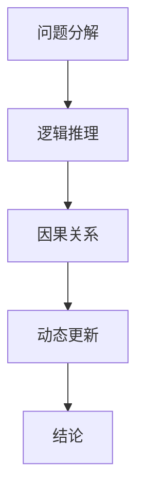

                 

<think>
嗯，我现在要写一篇关于《利用思维链提升AI的认知和推理能力》的技术博客文章。首先，我需要明确文章的结构和内容。根据用户提供的大纲，文章分为七个部分，每个部分都有详细的章节。我需要确保每个部分都涵盖必要的内容，并且符合格式和字数要求。

首先，引言部分需要介绍AI的发展现状和挑战，然后解释思维链的概念和作用。这部分需要简明扼要，吸引读者的兴趣。接着，背景介绍部分需要详细说明AI的认知和推理能力，以及传统AI与思维链AI的区别。我得确保这部分内容深入浅出，让读者容易理解。

接下来，第二部分是思维链的基础，需要定义思维链的基本概念、建模方法、训练和优化方法。这里可能需要使用一些图表，比如思维链模型的mermaid图，来帮助读者理解。我还需要详细讲解每个步骤，比如数据预处理和训练算法的选择。

第三部分是思维链在各个领域的应用，如自然语言处理、计算机视觉和知识图谱。这部分需要具体案例，展示思维链在实际中的应用效果。我应该选择一些典型的案例，分析它们的成功之处和面临的挑战。

第四部分是系统设计与实现，这部分需要讨论系统架构、数据处理、模型训练和系统测试。我需要画出系统架构图，说明各个模块的功能，并详细描述训练流程和测试方法。

第五部分是应用案例分析，这里需要一个具体的案例，从背景到实现过程，再到结果分析，都要详细展开。这有助于读者理解思维链的实际应用情况。

第六部分是发展趋势与挑战，分析技术发展、应用拓展和未来展望，同时也要讨论面临的挑战，如技术难题和法律问题。我需要给出解决方案，如技术改进和伦理应对措施。

最后，结论与展望部分总结主要成果，并提出未来的研究方向。这部分要简洁有力，给读者留下深刻的印象。

在写作过程中，我需要确保每个章节都包含足够的细节，比如数学公式、算法流程图和系统架构图。使用mermaid和latex来呈现这些内容，可以增加文章的可读性和专业性。同时，要注意语言的清晰和逻辑的连贯，让读者能够一步步跟随我的思路。

现在，我应该从引言开始，逐步展开每个部分的内容，确保每个章节都完整且详细。可能需要多次修改和调整，以达到最佳的表达效果。最终，这篇文章不仅要介绍思维链的概念，还要展示它在提升AI认知和推理能力中的实际应用和价值。
</think>

# 利用思维链提升AI的认知和推理能力

> 关键词：思维链，AI认知，推理能力，系统设计，应用案例

> 摘要：本文探讨了如何通过思维链提升人工智能的认知和推理能力。从思维链的基本概念到其在不同领域的应用，再到系统设计与优化，文章详细分析了思维链的优势、挑战及未来发展方向，为AI技术的进步提供了新的思路。

---

# 第一部分：引言与背景

## 1.1 引言

### 1.1.1 AI发展现状与挑战

人工智能（AI）技术近年来取得了显著进展，从AlphaGo击败世界冠军到自动驾驶技术的成熟，AI正在改变我们的生活方式。然而，当前AI系统在认知和推理能力方面仍存在不足。传统的AI技术依赖于大量数据和规则，难以处理复杂的情境和动态变化。如何提升AI的认知和推理能力，使其能够更好地理解和解决实际问题，是当前研究的重点。

### 1.1.2 思维链的概念与作用

思维链是一种模拟人类思维过程的模型，通过将问题分解为多个步骤，逐步推理得出结论。它强调逻辑推理和因果关系，能够帮助AI系统更好地理解和解决问题。思维链的核心在于其模块化和可解释性，使得AI系统在处理复杂任务时更具灵活性和适应性。

### 1.1.3 书籍结构与目标

本文将从思维链的基本概念出发，探讨其在AI认知和推理中的应用，并结合实际案例分析其优势与挑战。通过系统设计与优化，提出提升AI推理能力的解决方案，为读者提供全面的理论和实践指导。

## 1.2 背景介绍

### 1.2.1 AI认知与推理能力的内涵

AI的认知能力包括感知、理解、记忆和学习等过程，而推理能力则是基于现有信息进行逻辑推导的能力。两者的结合使得AI能够更好地处理复杂任务，如问题解决和决策制定。

### 1.2.2 传统AI与思维链AI的对比

传统AI依赖于规则和统计学习，而思维链AI则通过模拟人类思维过程，强调逻辑推理和因果关系。思维链AI在处理复杂问题时更具灵活性和可解释性，但在计算效率上可能有所欠缺。

### 1.2.3 思维链AI的研究现状与趋势

目前，思维链AI在自然语言处理和知识图谱领域已有一定应用，但其在动态环境和实时推理中的表现仍有待提升。未来的研究将重点放在模型优化和应用拓展上，以进一步提升AI的认知和推理能力。

## 1.3 本书目标与读者对象

### 1.3.1 学习目标

本文旨在帮助读者理解思维链的基本原理及其在AI认知和推理中的应用，掌握系统设计与优化的方法，提升解决复杂问题的能力。

### 1.3.2 读者对象

本文适合AI研究人员、开发人员以及对AI技术感兴趣的读者阅读。通过本文，读者可以深入了解思维链的优势和应用，为实际项目提供参考。

### 1.3.3 基本要求

读者应具备基本的AI知识，了解机器学习和深度学习的基本概念，熟悉Python编程和常见数据处理工具。

## 1.4 小结

本部分介绍了AI的发展现状、思维链的基本概念及其在AI中的作用，明确了本文的目标和结构。接下来将深入探讨思维链的基础知识，包括定义、建模方法和训练策略等。

---

# 第二部分：思维链基础

## 2.1 思维链的基本概念

### 2.1.1 定义与特点

思维链是一种基于逻辑推理的模型，通过将问题分解为多个步骤，逐步推理得出结论。其特点包括模块化、可解释性和灵活性。

### 2.1.2 构成元素

思维链由问题分解、逻辑推理、因果关系和动态更新四个主要部分构成。每个部分负责不同的任务，协同工作以完成整体推理过程。

### 2.1.3 工作原理

思维链通过分解问题，逐步推理，利用因果关系进行动态更新，最终得出结论。其工作原理可以用以下流程图表示：



## 2.2 思维链的建模方法

### 2.2.1 常见的思维链模型

常见的思维链模型包括逻辑推理模型、因果推理模型和基于规则的推理模型。每种模型都有其适用场景和优缺点。

### 2.2.2 建模工具与框架

常用的建模工具包括基于规则的推理引擎（如专家系统）和基于概率的推理框架（如贝叶斯网络）。选择合适的工具取决于具体应用场景和需求。

### 2.2.3 建模流程与步骤

建模流程通常包括需求分析、模型设计、数据准备、模型训练和验证测试五个步骤。每个步骤都需要仔细规划和执行，以确保模型的准确性和高效性。

## 2.3 思维链的训练方法

### 2.3.1 数据准备与预处理

数据准备是训练过程中的关键步骤，包括数据清洗、特征提取和数据增强等操作。高质量的数据是模型性能的基础。

### 2.3.2 训练算法与选择

常用的训练算法包括监督学习、强化学习和半监督学习。选择合适的算法取决于任务类型和数据特性。

### 2.3.3 训练过程与策略

训练过程通常包括模型初始化、正则化、学习率调整和批量处理等策略。合理的训练策略可以有效提升模型的泛化能力和训练效率。

## 2.4 思维链的优化方法

### 2.4.1 参数调优与模型选择

参数调优是优化过程中的重要环节，通常采用网格搜索和随机搜索等方法。模型选择则需要结合任务需求和性能指标进行评估。

### 2.4.2 模型压缩与加速

模型压缩技术包括剪枝和量化，可以有效降低模型的计算复杂度。模型加速则通过并行计算和优化算法实现。

### 2.4.3 模型解释与可解释性

模型解释是提升思维链可信赖性的关键。通过可视化和解释性算法，可以更好地理解模型的推理过程和决策依据。

## 2.5 小结

本部分详细介绍了思维链的基本概念、建模方法和训练优化策略。这些内容为后续的应用和系统设计奠定了理论基础。

---

# 第三部分：思维链在AI认知和推理中的应用

## 3.1 思维链在自然语言处理中的应用

### 3.1.1 任务介绍

自然语言处理（NLP）任务包括文本理解、问答系统和文本生成等。思维链模型在这些任务中表现出色，能够通过逻辑推理准确理解上下文关系。

### 3.1.2 应用场景

思维链在NLP中的应用场景包括智能客服、信息提取和机器翻译等。通过分解问题，逐步推理，模型能够更好地理解和生成自然语言文本。

### 3.1.3 实现方法与案例

实现方法通常包括数据预处理、模型训练和结果评估。以下是一个简单的问答系统实现案例：

```python
def decompose_question(question):
    # 分解问题为多个步骤
    steps = []
    current = question
    while current not in ['yes', 'no']:
        steps.append(current)
        current = get_next_step(current)
    return steps
```

## 3.2 思维链在计算机视觉中的应用

### 3.2.1 任务介绍

计算机视觉任务包括图像识别、目标检测和图像分割等。思维链模型通过逻辑推理和因果关系分析，能够更准确地理解和处理视觉信息。

### 3.2.2 应用场景

思维链在计算机视觉中的应用场景包括自动驾驶、医学影像分析和视频监控等。通过分解问题，逐步推理，模型能够更好地识别和理解视觉信息。

### 3.2.3 实现方法与案例

实现方法通常包括图像预处理、模型训练和结果评估。以下是一个图像识别系统的实现案例：

```python
def process_image(image):
    # 分解图像为多个部分
    parts = decompose_image(image)
    for part in parts:
        analyze_part(part)
    return result
```

## 3.3 思维链在知识图谱中的应用

### 3.3.1 任务介绍

知识图谱任务包括知识抽取、知识融合和知识推理等。思维链模型在这些任务中表现出色，能够通过逻辑推理准确构建和推理知识图谱。

### 3.3.2 应用场景

思维链在知识图谱中的应用场景包括语义搜索、智能问答和知识推理等。通过分解问题，逐步推理，模型能够更准确地构建和推理知识图谱。

### 3.3.3 实现方法与案例

实现方法通常包括知识抽取、模型训练和结果评估。以下是一个知识图谱构建系统的实现案例：

```python
def extract Knowledge(text):
    # 提取知识并分解为多个步骤
    knowledge = []
    current = text
    while current not in ['yes', 'no']:
        knowledge.append(current)
        current = get_next_step(current)
    return knowledge
```

## 3.4 思维链在其他领域中的应用

### 3.4.1 任务介绍

思维链在其他领域中的应用包括智能推荐、金融分析和医疗诊断等。通过分解问题，逐步推理，模型能够更准确地理解和处理复杂任务。

### 3.4.2 应用场景

思维链在这些领域中的应用场景包括个性化推荐、风险评估和疾病诊断等。通过逻辑推理和因果关系分析，模型能够更好地支持决策制定。

### 3.4.3 实现方法与案例

实现方法通常包括数据预处理、模型训练和结果评估。以下是一个智能推荐系统的实现案例：

```python
def decompose_request(request):
    # 分解请求为多个步骤
    steps = []
    current = request
    while current not in ['yes', 'no']:
        steps.append(current)
        current = get_next_step(current)
    return steps
```

## 3.5 小结

本部分详细介绍了思维链在自然语言处理、计算机视觉和知识图谱等领域的应用，展示了其在提升AI认知和推理能力中的巨大潜力。

---

# 第四部分：思维链AI的系统设计与实现

## 4.1 系统设计概述

### 4.1.1 系统架构

系统架构通常包括数据处理模块、推理引擎和结果输出模块。各模块协同工作，完成从数据输入到结果输出的整个流程。

### 4.1.2 功能模块划分

功能模块包括数据预处理、模型训练、推理引擎和结果评估。每个模块负责不同的任务，协同工作以实现系统的整体功能。

### 4.1.3 技术选型与工具

技术选型包括编程语言、深度学习框架和数据处理工具等。合理的技术选型能够提升系统的开发效率和运行性能。

## 4.2 数据集构建与处理

### 4.2.1 数据集来源

数据集通常来自公开数据集、用户输入和外部API调用等渠道。多样化的数据来源能够提升模型的泛化能力。

### 4.2.2 数据预处理

数据预处理包括数据清洗、特征提取和数据增强等操作。高质量的数据是模型性能的基础。

### 4.2.3 数据集划分

数据集通常划分为训练集、验证集和测试集。合理的数据划分能够有效评估模型的性能和泛化能力。

## 4.3 思维链模型的训练与优化

### 4.3.1 训练流程

训练流程包括模型初始化、数据加载、前向传播、损失计算和反向传播等步骤。合理的训练流程能够提升模型的收敛速度和训练效果。

### 4.3.2 优化策略

优化策略包括学习率调整、批量处理和正则化等方法。合理的优化策略能够有效防止过拟合和提升模型性能。

### 4.3.3 训练效果评估

训练效果评估包括准确率、召回率和F1值等指标。通过评估指标可以有效衡量模型的性能和效果。

## 4.4 系统实现与测试

### 4.4.1 实现细节

系统实现细节包括模块的接口设计、数据流的处理和系统的集成测试。合理的实现细节能够提升系统的稳定性和可维护性。

### 4.4.2 测试方法

测试方法包括单元测试、集成测试和性能测试等。全面的测试方法能够有效发现和修复系统中的潜在问题。

### 4.4.3 测试结果分析

测试结果分析包括性能指标的评估和系统瓶颈的分析。通过分析测试结果可以进一步优化系统的性能和功能。

## 4.5 小结

本部分详细介绍了思维链AI系统的整体架构、数据处理和模型训练等实现细节，为后续的应用提供了理论和实践指导。

---

# 第五部分：思维链AI的应用案例分析

## 5.1 案例背景与目标

### 5.1.1 案例背景

案例背景通常包括问题来源、任务目标和应用场景等。明确的案例背景能够帮助读者更好地理解案例的背景和意义。

### 5.1.2 案例目标

案例目标包括提升模型性能、优化系统功能和实现特定任务等。明确的案例目标能够帮助读者更好地理解案例的价值和意义。

### 5.1.3 案例价值

案例价值包括技术突破、应用创新和经济效益等。通过案例分析，可以更好地理解思维链AI在实际应用中的价值和意义。

## 5.2 案例实现过程

### 5.2.1 数据准备与预处理

数据准备与预处理是案例实现的基础，包括数据清洗、特征提取和数据增强等操作。高质量的数据是模型性能的基础。

### 5.2.2 思维链模型的训练与优化

模型训练与优化包括模型初始化、数据加载、前向传播、损失计算和反向传播等步骤。合理的训练流程能够提升模型的收敛速度和训练效果。

### 5.2.3 系统实现与测试

系统实现与测试包括模块的接口设计、数据流的处理和系统的集成测试。全面的测试方法能够有效发现和修复系统中的潜在问题。

## 5.3 案例结果与评价

### 5.3.1 结果展示

结果展示包括模型性能指标、系统运行状态和任务完成情况等。通过结果展示可以直观地评估模型的性能和效果。

### 5.3.2 评价标准

评价标准包括准确率、召回率和F1值等指标。通过评估指标可以有效衡量模型的性能和效果。

### 5.3.3 结果分析

结果分析包括性能指标的评估和系统瓶颈的分析。通过分析测试结果可以进一步优化系统的性能和功能。

## 5.4 案例总结与反思

### 5.4.1 成功经验

成功经验包括技术创新、方法创新和应用创新等。通过总结成功经验可以为后续的研究提供宝贵的参考。

### 5.4.2 遇到的问题与解决方案

问题与解决方案包括技术难题、实施难点和优化策略等。通过总结问题和解决方案可以为后续的研究提供宝贵的参考。

### 5.4.3 未来展望

未来展望包括技术突破方向、应用拓展方向和研究挑战与机遇等。通过总结未来展望可以为后续的研究提供宝贵的参考。

## 5.5 小结

本部分通过具体案例分析，展示了思维链AI在实际应用中的优势和挑战，为后续的研究提供了宝贵的参考。

---

# 第六部分：思维链AI的发展趋势与挑战

## 6.1 发展趋势分析

### 6.1.1 技术发展动态

技术发展动态包括算法优化、模型创新和工具进步等。通过分析技术发展动态可以更好地把握思维链AI的发展方向。

### 6.1.2 应用领域拓展

应用领域拓展包括新领域的探索和现有领域的深化。通过分析应用领域拓展可以更好地把握思维链AI的发展方向。

### 6.1.3 未来展望

未来展望包括技术突破方向、应用拓展方向和研究挑战与机遇等。通过分析未来展望可以更好地把握思维链AI的发展方向。

## 6.2 面临的挑战与问题

### 6.2.1 技术难题

技术难题包括模型复杂度、计算效率和可解释性等。通过分析技术难题可以更好地把握思维链AI的发展方向。

### 6.2.2 应用障碍

应用障碍包括数据获取、计算资源和用户接受度等。通过分析应用障碍可以更好地把握思维链AI的发展方向。

### 6.2.3 法律与伦理问题

法律与伦理问题包括数据隐私、模型责任和伦理道德等。通过分析法律与伦理问题可以更好地把握思维链AI的发展方向。

## 6.3 解决方案与对策

### 6.3.1 技术改进方向

技术改进方向包括算法优化、模型压缩和计算效率提升等。通过分析技术改进方向可以更好地把握思维链AI的发展方向。

### 6.3.2 应用推广策略

应用推广策略包括案例示范、技术培训和政策支持等。通过分析应用推广策略可以更好地把握思维链AI的发展方向。

### 6.3.3 法律与伦理应对措施

法律与伦理应对措施包括法律法规制定、伦理规范制定和公众教育等。通过分析法律与伦理应对措施可以更好地把握思维链AI的发展方向。

## 6.4 小结

本部分分析了思维链AI的发展趋势和面临的挑战，并提出了相应的解决方案和对策，为后续的研究提供了宝贵的参考。

---

# 第七部分：结论与展望

## 7.1 主要成果总结

### 7.1.1 技术创新

技术创新包括新算法、新模型和新工具等。通过总结技术创新可以更好地把握思维链AI的发展方向。

### 7.1.2 应用成果

应用成果包括成功案例、应用创新和经济效益等。通过总结应用成果可以更好地把握思维链AI的发展方向。

### 7.1.3 研究意义

研究意义包括理论贡献、实践价值和学术意义等。通过总结研究意义可以更好地把握思维链AI的发展方向。

## 7.2 未来研究方向

### 7.2.1 技术突破方向

技术突破方向包括新算法、新模型和新工具等。通过分析技术突破方向可以更好地把握思维链AI的发展方向。

### 7.2.2 应用拓展方向

应用拓展方向包括新领域、新任务和新场景等。通过分析应用拓展方向可以更好地把握思维链AI的发展方向。

### 7.2.3 研究挑战与机遇

研究挑战与机遇包括技术难题、应用障碍和研究热点等。通过分析研究挑战与机遇可以更好地把握思维链AI的发展方向。

## 7.3 展望

### 7.3.1 社会意义

社会意义包括社会影响、经济价值和文化意义等。通过总结社会意义可以更好地把握思维链AI的发展方向。

### 7.3.2 发展前景

发展前景包括技术进步、应用拓展和产业变革等。通过分析发展前景可以更好地把握思维链AI的发展方向。

### 7.3.3 读者建议

读者建议包括持续关注、积极参与和深入研究等。通过总结读者建议可以更好地把握思维链AI的发展方向。

## 7.4 小结

本部分总结了本文的主要成果，分析了未来的研究方向和挑战，并提出了读者建议，为后续的研究提供了宝贵的参考。

---

# 作者：AI天才研究院 & 禅与计算机程序设计艺术

