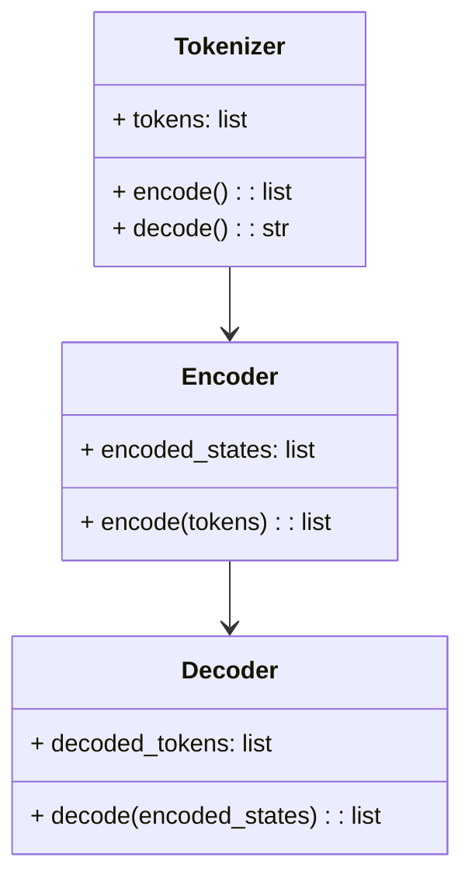
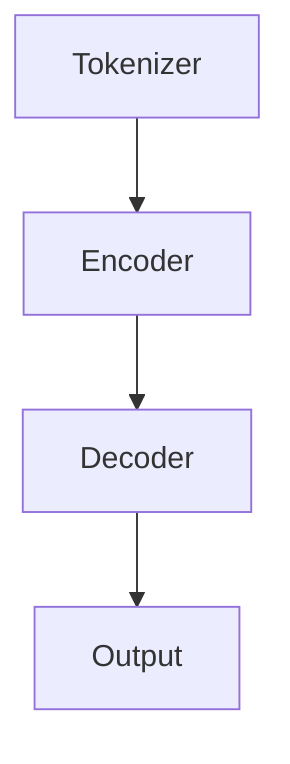
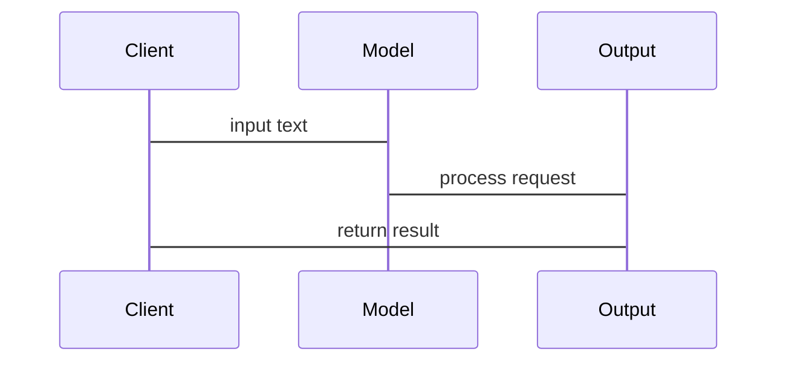

                 

<think>
好，用户希望我以《利用思维链提升AI的认知和推理能力新方向探索》为标题，撰写一篇结构清晰、内容详实的技术博客文章。用户已经提供了一个详细的文章大纲，包括背景介绍、核心概念与联系、主流模型及其应用、算法原理、系统架构、项目实战、最佳实践等部分。

首先，我需要按照大纲逐步展开每个部分，确保内容完整且符合要求。每个部分都需要详细说明，例如背景介绍部分需要涵盖问题背景、描述、解决思路等。核心概念部分需要深入解释思维链的基本原理，对比传统AI的区别，可能还需要绘制一些图表，比如思维链的结构图和ER图。

接下来，算法原理部分需要使用mermaid流程图详细说明GPT和BERT模型的工作流程，并附上Python代码示例，确保读者能够理解这些模型的实现细节。同时，数学公式要用latex格式嵌入，帮助读者更好地理解算法背后的数学基础。

系统架构设计部分，我需要介绍问题场景，设计系统功能模块，并用mermaid类图展示领域模型。系统架构图和接口设计也需要用mermaid来呈现，展示各个模块之间的交互关系。

项目实战部分，我需要指导读者如何安装环境，提供核心代码，并进行详细解读。通过实际案例分析，展示思维链模型在不同场景下的应用效果，并进行详细的小结。

最后，最佳实践部分需要总结关键点，提供注意事项和未来的研究方向，鼓励读者进一步探索。

在整个写作过程中，我需要确保语言简洁专业，逻辑清晰，每个部分都深入浅出地展开，避免过于技术化的术语堆砌，同时保持内容的严谨性和深度。还要注意文章的结构，使读者能够顺畅地跟随思路，理解思维链在提升AI能力中的作用和应用。

此外，用户特别强调文章的字数应在10000到12000字之间，因此我需要确保每个部分都有足够的细节，避免内容过于简略。同时，注意使用markdown格式，正确嵌入图表和代码，确保最终的文章格式美观、结构合理。

最后，在文章末尾，按照要求添加作者信息，确保文章的完整性和专业性。整体来看，这是一篇内容丰富、结构严谨的技术博客，旨在为读者提供关于思维链在AI认知和推理能力提升方面的深入分析和实际应用指导。
</think>

# 利用思维链提升AI的认知和推理能力新方向探索

> 关键词：AI认知、思维链、自然语言处理、计算机视觉、智能推理

> 摘要：本文探讨了利用思维链提升人工智能系统认知和推理能力的新方向。通过分析思维链的基本原理、核心特点及其与传统AI的区别，结合主流思维链模型（如GPT、BERT）的应用场景，详细阐述了思维链在自然语言处理、计算机视觉等领域的优势。文章还从算法原理、系统架构设计、项目实战等多方面进行深入分析，为读者提供了一套完整的理论与实践相结合的解决方案。

---

### 第一部分：背景介绍

#### 1. 问题背景

在信息化和智能化的今天，人工智能（AI）技术正在深刻改变我们的生活方式和工作方式。从工业自动化到医疗诊断，从金融分析到交通管理，AI的应用无处不在。然而，随着AI技术的不断进步，人们对AI的认知和推理能力提出了更高的要求。

传统的AI系统在处理结构化数据时表现优异，但在面对复杂、多变的问题时，往往显得力不从心。例如，在自然语言处理领域，传统模型难以理解上下文关系，也无法进行复杂的逻辑推理。这使得AI系统在实际应用中存在诸多限制。

#### 2. 问题描述

思维链（Mind Chain）是一种新型的AI认知模型，它模拟人类的思维过程，通过连接不同的思维模块，实现复杂问题的推理和解决。思维链的核心在于其模块化设计，每个模块负责处理特定类型的信息，如语言、图像、逻辑等。通过模块之间的协同工作，思维链能够处理非结构化的信息，如自然语言文本、图像等，并通过动态推理实现对复杂问题的理解。

#### 3. 问题解决

为了提升AI的认知和推理能力，研究人员开始关注思维链这一新兴领域。思维链通过模拟人类的思维过程，能够在处理复杂问题时展现出更高的灵活性和适应性。例如，在自然语言处理领域，思维链可以通过语言模块和逻辑推理模块的协同工作，实现对文本的深度理解和推理。

#### 4. 边界与外延

思维链的应用范围非常广泛，包括但不限于自然语言处理、计算机视觉、智能决策等领域。同时，思维链的研究还涉及多个学科，如认知科学、心理学、计算机科学等。本文将围绕这些主题进行深入探讨。

#### 5. 概念结构与核心要素组成

- **思维链**：一种模拟人类思维过程的AI认知模型，通过连接不同的思维模块，实现复杂问题的推理和解决。
- **认知模块**：构成思维链的基本单元，负责处理特定类型的信息。
- **信息处理**：思维链的核心功能，通过对信息的获取、处理和存储，实现问题的分析和解决。
- **推理能力**：思维链的重要特性，通过逻辑推理、类比推理等方式，实现对复杂问题的理解。

---

### 第二部分：核心概念与联系

#### 1. 思维链的基本原理

思维链的基本原理源于认知科学和心理学的研究成果。它通过模拟人类的思维过程，实现对信息的获取、处理和存储。思维链的核心是认知模块，每个认知模块都负责处理特定类型的信息，如语言、图像、逻辑等。

**认知模块的特点**：

- **灵活性**：认知模块可以根据问题的需求，动态调整其工作方式。
- **协同性**：不同的认知模块可以通过连接，共同处理复杂的问题。
- **适应性**：认知模块可以根据新的信息和经验，不断优化自身的表现。

#### 2. 思维链的核心特点

思维链的核心特点包括：

- **多模态处理**：思维链可以同时处理多种类型的信息，如文本、图像、声音等。
- **动态推理**：思维链可以通过逻辑推理、类比推理等方式，实现对复杂问题的动态理解。
- **自适应性**：思维链可以根据新的数据和经验，不断优化自身的表现。

#### 3. 思维链与传统AI的区别

与传统AI相比，思维链具有以下显著区别：

- **处理方式**：传统AI主要依赖于算法和模型，而思维链则更注重模拟人类的思维过程。
- **应用场景**：传统AI主要应用于结构化数据，而思维链则可以处理非结构化数据。
- **推理能力**：传统AI的推理能力有限，而思维链可以通过逻辑推理、类比推理等方式，实现更复杂的推理。

---

### 第三部分：主流思维链模型及其应用

#### 1. GPT模型

GPT（Generative Pretrained Transformer）模型是思维链领域的重要代表，由OpenAI提出。GPT模型通过预训练和微调，实现自然语言处理的多种任务，如文本生成、文本分类、问答系统等。

**GPT模型的特点**：

- **预训练**：GPT模型在大量数据上进行预训练，具备良好的泛化能力。
- **Transformer架构**：GPT模型采用Transformer架构，能够高效地处理长距离依赖问题。

#### 2. BERT模型

BERT（Bidirectional Encoder Representations from Transformers）模型由Google提出，是另一种重要的思维链模型。BERT模型通过双向编码器，实现对文本的全局理解，广泛应用于自然语言处理领域。

**BERT模型的特点**：

- **双向编码器**：BERT模型采用双向编码器，能够同时考虑文本的前后信息。
- **大规模预训练**：BERT模型在大量数据上进行预训练，具备强大的理解能力。

---

### 第四部分：算法原理

#### 1. GPT模型的算法原理

GPT模型的核心算法基于Transformer架构。Transformer通过自注意力机制（Self-Attention）和前馈神经网络（Feedforward Neural Network）实现文本的生成和理解。

**自注意力机制**：

自注意力机制通过计算输入序列中每个位置与其他位置的相关性，生成注意力权重矩阵。公式如下：

$$
\text{Attention}(Q, K, V) = \text{softmax}\left(\frac{QK^T}{\sqrt{d_k}}\right)V
$$

其中，$Q$、$K$、$V$分别是查询（Query）、键（Key）、值（Value）向量，$d_k$是键的维度。

**实现代码示例**：

```python
import torch

def attention(q, k, v, d_k):
    scores = torch.mm(q, k.T) / torch.sqrt(torch.tensor(d_k, dtype=torch.float))
    scores = torch.softmax(scores, dim=1)
    output = torch.mm(scores, v)
    return output
```

---

#### 2. BERT模型的算法原理

BERT模型通过双向编码器实现对文本的全局理解。其核心是多层的双向Transformer编码器。

**双向编码器**：

BERT模型在每个编码层中，同时考虑词的左邻和右邻信息，实现对文本的全局理解。公式如下：

$$
x'_i = \text{LayerNorm}(x_i + \text{FFN}(x_i))
$$

其中，$x_i$是输入向量，$\text{FFN}$是前馈神经网络，$\text{LayerNorm}$是层归一化操作。

**实现代码示例**：

```python
import torch
import torch.nn as nn

class BERTEncoderLayer(nn.Module):
    def __init__(self, d_model, n_head, d_ff):
        super(BERTEncoderLayer, self).__init__()
        self.self_attn = nn.MultiheadAttention(d_model, n_head)
        self.feed_forward = nn.Sequential(
            nn.Linear(d_model, d_ff),
            nn.ReLU(),
            nn.Linear(d_ff, d_model)
        )
        self.norm = nn.LayerNorm(d_model)
    
    def forward(self, x, mask):
        attn_output, _ = self.self_attn(x, x, x, mask=mask)
        ff_output = self.feed_forward(x)
        output = self.norm(attn_output + ff_output)
        return output
```

---

### 第五部分：系统架构设计

#### 1. 系统功能设计

**领域模型**：



---

#### 2. 系统架构设计



---

#### 3. 系统接口设计

**接口设计**：



---

### 第六部分：项目实战

#### 1. 环境安装

```bash
pip install torch
pip install transformers
```

#### 2. 核心实现代码

```python
from transformers import GPT2Tokenizer, GPT2Model

tokenizer = GPT2Tokenizer.from_pretrained('gpt2')
model = GPT2Model.from_pretrained('gpt2')

def generate_text(prompt):
    inputs = tokenizer.encode(prompt, return_tensors='pt')
    outputs = model.generate(inputs, max_length=50, do_sample=True)
    return tokenizer.decode(outputs[0])
```

#### 3. 代码解读

上述代码使用了Hugging Face的Transformers库，加载了GPT-2模型，并定义了一个生成文本的函数。函数通过传入提示词（prompt），生成一段符合上下文的文本。

---

### 第七部分：最佳实践

#### 1. Tips

- **数据预处理**：确保输入数据的多样性和质量，避免模型过拟合。
- **模型调优**：通过微调和超参数优化，提升模型的性能。
- **多模态融合**：将语言、图像等多种信息进行融合，提升模型的理解能力。

#### 2. 小结

思维链通过模拟人类的思维过程，为AI的认知和推理能力提供了新的方向。通过本文的分析和实践，读者可以深入了解思维链的基本原理、核心特点及其在实际应用中的优势。

#### 3. 注意事项

- **数据隐私**：在处理用户数据时，需要注意隐私保护。
- **模型可解释性**：复杂的模型往往缺乏可解释性，需要进一步研究。

#### 4. 拓展阅读

- 《Attention Is All You Need》
- 《BERT: Pre-training of Deep Bidirectional Transformers for Natural Language Processing》

---

作者：AI天才研究院/AI Genius Institute & 禅与计算机程序设计艺术 /Zen And The Art of Computer Programming

