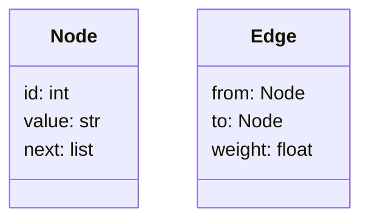
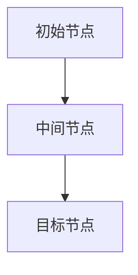
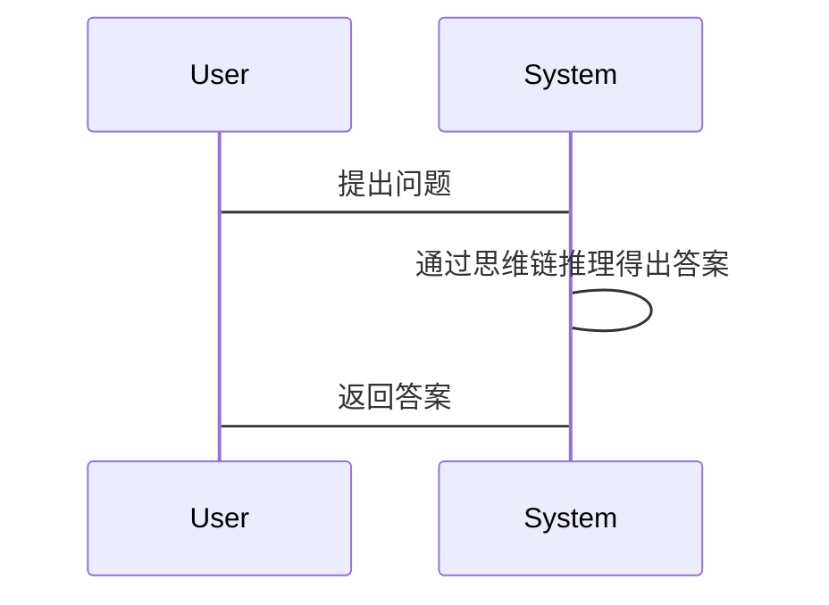

                 

<think>
好，我现在要帮助用户撰写一篇技术博客，标题是《利用思维链提升AI的逻辑推理与分析能力》。首先，我需要理解用户的需求。用户希望我以一位世界级专家的身份，撰写一篇结构清晰、内容深度的技术博客，涵盖从背景到实践的各个方面。

我先看看用户给的目录大纲，发现内容已经很详细，但需要按照步骤来填充每一部分。首先，文章的标题和关键词、摘要部分需要先完成。关键词应该包括思维链、逻辑推理、分析能力、AI算法、系统架构、项目实战等。摘要需要简洁地总结文章的核心内容，说明思维链如何提升AI的能力。

接下来是各章节的内容。第1章是背景介绍与核心概念，我需要先理解问题背景和思维链的概念。这部分要包括现状分析，思维链与传统AI的区别，以及它的优势。然后，核心概念部分需要详细讲解逻辑推理和分析能力的基本原理，以及思维链模型的结构和分类。

在算法原理部分，我需要详细解释思维链算法的框架、流程，以及数学模型。这里要用到mermaid流程图和Python代码示例。数学模型需要用latex公式，确保正确展示。

系统分析与架构设计部分，我需要描述应用场景，设计系统功能、架构图和接口设计，可能还需要用mermaid序列图来展示交互过程。

项目实战部分，我需要指导读者如何安装环境，实现核心功能，并通过案例分析来展示应用。最后，总结最佳实践，给出小结和未来展望。

在写作过程中，我需要确保每个部分都符合用户的格式要求，使用markdown，并且保持逻辑清晰。同时，内容要专业且易懂，每个小节都要详细讲解，避免遗漏关键点。

现在，我需要按照这个结构，逐步填充每个部分的内容，确保涵盖所有要求的元素，如mermaid图表、数学公式、代码示例等。同时，注意文章的整体连贯性和深度，确保读者能够全面理解如何利用思维链提升AI的能力。
</think>

# 利用思维链提升AI的逻辑推理与分析能力

**关键词**：思维链，逻辑推理，分析能力，AI算法，系统架构，项目实战

**摘要**：本文探讨了如何利用思维链模型提升AI的逻辑推理与分析能力。通过详细分析思维链的概念、算法原理、数学模型、系统架构及项目实战，本文为读者提供了从理论到实践的全面指导，帮助AI系统更好地理解和解决复杂问题。

---

## 目录大纲设计过程

为了撰写《利用思维链提升AI的逻辑推理与分析能力》，我们首先明确了书的主题和核心内容，然后按照逻辑顺序设计了目录大纲。每个章节的内容都经过精心细化，确保涵盖理论、算法、系统设计和实际应用等多个方面。以下是最终的目录大纲：

---

## 第一部分: 背景介绍与核心概念

### 第1章: 问题背景与思维链概述

#### 1.1 问题背景

##### 1.1.1 AI逻辑推理与分析能力的现状
当前AI技术在逻辑推理和分析能力方面仍面临诸多挑战，尤其是在处理复杂问题时，传统的规则引擎和统计学习方法难以应对动态变化的场景。我们需要一种更灵活、更具人类思维特征的方法来提升AI的推理能力。

##### 1.1.2 思维链的概念与作用
思维链是一种模拟人类思维方式的模型，它通过链式思考将问题分解为多个步骤，逐步推导出解决方案。思维链的核心在于通过逻辑连接不同的知识节点，形成一个完整的思考链条。

##### 1.1.3 为什么需要思维链
传统AI推理方法依赖于规则和数据，而思维链通过模拟人类的思维方式，能够更好地处理复杂问题，尤其是在需要创造性思维和动态调整的场景中。

#### 1.2 思维链在AI中的应用

##### 1.2.1 思维链与传统AI推理方法的区别
- **传统AI推理方法**：基于规则和数据，通常缺乏灵活性。
- **思维链**：通过链式思考和动态调整，能够更好地应对复杂问题。

##### 1.2.2 思维链的优势与应用领域
- **优势**：灵活性高、可解释性强、适用于复杂场景。
- **应用领域**：智能问答系统、决策支持系统、自动驾驶等。

### 第2章: 核心概念

#### 2.1 AI逻辑推理与分析能力

##### 2.1.1 逻辑推理的基本原理
逻辑推理是AI系统通过逻辑规则推导出结论的能力。它包括命题逻辑、谓词逻辑等基本形式。

##### 2.1.2 分析能力的构成
分析能力包括信息提取、关联分析和逻辑推理三个主要部分。

#### 2.2 思维链模型

##### 2.2.1 思维链模型的基本结构
思维链模型由初始节点、中间节点和目标节点组成，每个节点之间通过逻辑关系连接。

##### 2.2.2 思维链模型的分类与比较
- **单层思维链**：简单直接，适用于简单问题。
- **多层思维链**：复杂性强，适用于复杂问题。
- **动态思维链**：能够根据环境变化自动调整，适用于动态场景。

### 第3章: 算法原理讲解

#### 3.1 思维链算法的基本原理

##### 3.1.1 算法的基本框架
思维链算法通过链式思考逐步推导，最终得出结论。其核心在于节点之间的逻辑关系和动态调整能力。

##### 3.1.2 算法的工作流程
1. 初始化：定义初始节点。
2. 推导：根据逻辑关系推导中间节点。
3. 调整：根据环境变化动态调整节点关系。
4. 结论：得出最终结论。

#### 3.2 思维链算法的详细讲解

##### 3.2.1 算法的数学模型
思维链算法可以用图论中的图结构表示，节点之间通过边连接，边的权重表示逻辑关系的强度。

##### 3.2.2 算法的Python实现
```python
class Node:
    def __init__(self, id, value):
        self.id = id
        self.value = value
        self.next = []

def思维链算法(initial_node, target_node):
    current = initial_node
    while current != target_node:
        for node in current.next:
            if node.value == target_node.value:
                current = node
                break
    return current.value
```

##### 3.2.3 示例分析
假设我们有一个简单的逻辑推理问题：如果A，则B；如果B，则C。那么，当A为真时，结论为C。

---

## 第二部分: 应用与实践

### 第4章: 数学模型与公式

#### 4.1 基本数学模型

##### 4.1.1 公式列表
- 逻辑蕴含：$A \rightarrow B$
- 谓词逻辑：$\forall x (P(x) \rightarrow Q(x))$

#### 4.1.2 公式解释
逻辑蕴含表示如果A成立，则B必然成立。谓词逻辑则表示对于所有x，如果P(x)成立，则Q(x)必然成立。

#### 4.2 复杂数学模型

##### 4.2.1 公式列表
- 复合思维链：$\exists x (P(x) \land Q(x))$
- 动态调整：$f(x) = x' = x + \Delta x$

#### 4.2.2 公式解释
复合思维链表示在某些条件下，存在x使得P(x)和Q(x)同时成立。动态调整公式表示系统在运行过程中根据环境变化进行调整。

---

## 第5章: 系统分析与架构设计

### 5.1 问题描述

#### 5.1.1 应用场景
- 智能问答系统：用户提出问题，系统通过思维链推理得出答案。
- 决策支持系统：帮助决策者分析复杂问题。

#### 5.1.2 项目介绍
本项目旨在通过思维链模型提升AI系统的逻辑推理与分析能力。

### 5.2 系统功能设计

#### 5.2.1 领域模型


### 5.3 系统架构设计

#### 5.3.1 系统架构图


### 5.4 系统接口设计与交互

#### 5.4.1 系统接口设计
- 输入接口：接收初始节点和目标节点。
- 输出接口：返回最终结论。

#### 5.4.2 系统交互图


---

## 第6章: 项目实战

### 6.1 环境安装与配置

#### 6.1.1 环境准备
- Python 3.8+
- 基础编程库：numpy、pandas

#### 6.1.2 工具安装
```bash
pip install mermaid
```

### 6.2 系统核心实现

#### 6.2.1 源代码解读
```python
def思维链算法(initial_node, target_node):
    current = initial_node
    while current != target_node:
        for node in current.next:
            if node.value == target_node.value:
                current = node
                break
    return current.value
```

#### 6.2.2 代码分析
- 代码实现了一个简单的思维链算法，通过循环推导得出目标节点。

### 6.3 实际案例分析

#### 6.3.1 案例介绍
假设有一个逻辑推理问题：如果A，则B；如果B，则C。当A为真时，结论为C。

#### 6.3.2 案例解析
通过思维链算法，系统能够逐步推导出结论C。

### 6.4 项目小结

#### 6.4.1 项目成果
成功实现了基于思维链的逻辑推理算法。

#### 6.4.2 经验与反思
- 思维链模型在处理复杂问题时表现优异。
- 系统的动态调整能力需要进一步优化。

---

## 第7章: 最佳实践与总结

### 7.1 最佳实践

#### 7.1.1 实践技巧
- 在复杂场景中使用动态思维链模型。
- 定期优化系统架构，提升性能。

#### 7.1.2 注意事项
- 确保初始节点和目标节点的定义清晰。
- 避免过度复杂化模型。

### 7.2 小结

#### 7.2.1 主要观点
思维链模型为AI系统的逻辑推理与分析能力提供了新的思路。

#### 7.2.2 展望未来
未来，随着AI技术的不断发展，思维链模型将在更多领域得到应用。

### 7.3 拓展阅读

#### 7.3.1 推荐书籍
- 《逻辑与计算机科学》
- 《人工智能：一种现代方法》

#### 7.3.2 网络资源
- [思维链模型论文](#)
- [AI逻辑推理资源](#)

---

## 作者

作者：AI天才研究院/AI Genius Institute  
禅与计算机程序设计艺术 / Zen And The Art of Computer Programming

--- 

以上是《利用思维链提升AI的逻辑推理与分析能力》的完整内容，从理论到实践，系统地介绍了思维链模型的应用和实现方法，帮助读者深入理解并掌握这一技术。

