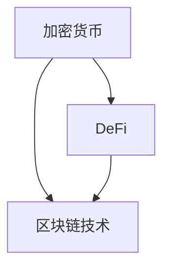
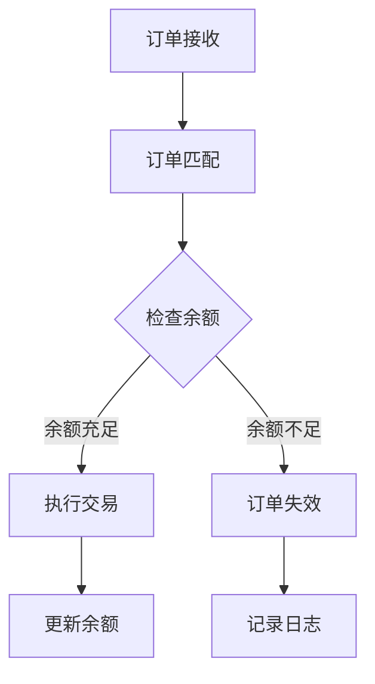
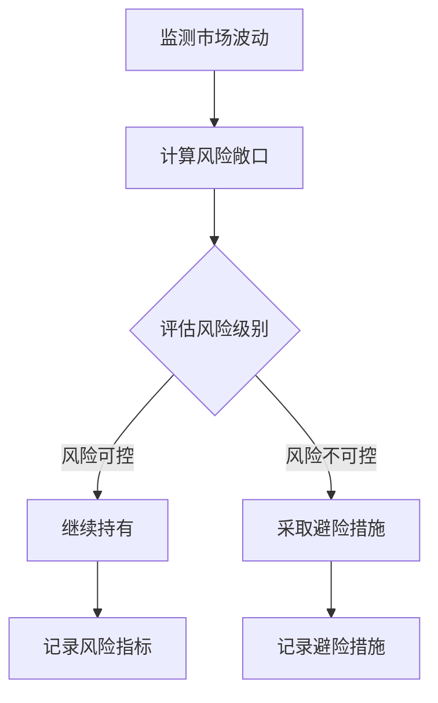
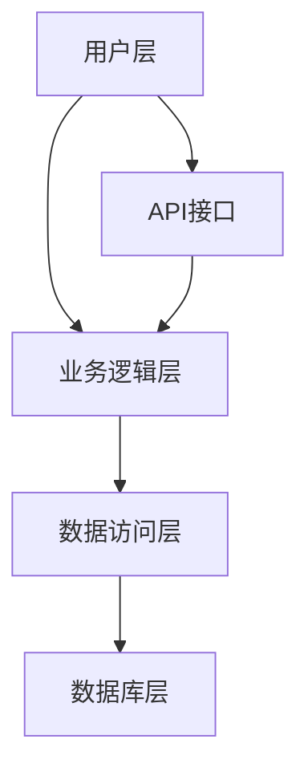
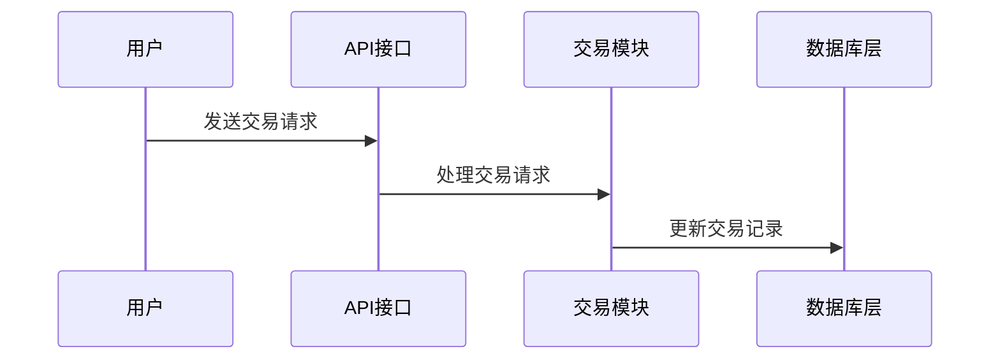

                 

<think>
嗯，好的，我需要写一篇关于《加密货币经济学：数字金融的理论与实践》的技术博客文章。首先，我应该先理清文章的结构和每个部分需要包含的内容。

首先，文章的标题是《加密货币经济学：数字金融的理论与实践》，关键词应该包括加密货币、经济学、区块链、数字货币、DeFi、风险管理等。摘要部分需要简明扼�地概括文章的核心内容，即探讨加密货币的经济原理、市场结构以及风险管理，并结合实际案例分析。

接下来是目录大纲，按照用户提供的结构，分为几个主要章节：背景介绍、核心概念与联系、算法原理讲解、数学模型与公式、系统分析与架构设计方案、项目实战、最佳实践与小结。

在背景介绍中，我需要详细解释问题背景，包括互联网和区块链技术的发展如何推动加密货币的兴起，以及其对金融市场的影响。然后描述问题，指出当前研究多集中于技术层面，而对经济学的系统性研究较少。接下来，说明解决问题的方法，比如系统性分析加密货币的经济学基础。还要定义研究的边界，如市场结构、交易机制、风险管理等。最后，概述核心概念，如加密货币、区块链、DeFi等。

核心概念部分，需要详细解释每个概念，比较它们的异同，并用表格形式展示。例如，比较加密货币与传统货币，DeFi与传统金融的区别。同时，使用Mermaid图来展示概念之间的关系，比如DeFi如何构建在区块链之上。

算法原理讲解部分，需要详细分析加密货币交易和风险管理的算法，用Mermaid流程图展示交易和风险管理的过程，并用Python代码实现这些算法。同时，给出数学公式，如计算波动率的公式，并用例子说明。

数学模型和公式部分，需要解释这些公式在实际中的应用，比如波动率如何影响交易策略。

系统架构部分，设计一个交易平台，包括用户层、业务逻辑层、数据访问层和数据库层，以及API接口。用Mermaid图展示系统架构和交互过程。

项目实战部分，详细说明如何安装环境，实现核心功能，如交易模块和风险管理模块，分析实际案例，并进行代码解读。

最后，最佳实践部分，总结经验，提出注意事项，并推荐拓展阅读材料。

现在，我需要确保每个部分都有足够的细节和深度，同时保持逻辑清晰和语言简洁。可能还需要查找一些实际案例来支持理论，确保文章既有理论深度，又有实践价值。

在写作过程中，我应该先完成每个章节的草稿，然后进行多次修改，确保内容准确无误，并符合读者的理解习惯。特别是要检查数学公式的推导和算法的实现，确保没有错误。

总之，我需要一步步地按照大纲来完成，确保每个部分都详细且准确，同时保持文章的整体连贯性和可读性。
</think>

# 加密货币经济学：数字金融的理论与实践

## 关键词：加密货币、经济学、区块链、数字货币、DeFi、风险管理

## 摘要

加密货币作为数字货币的一种，通过区块链技术实现了去中心化和安全交易，对传统金融体系产生了深远影响。本文系统探讨加密货币的经济学原理，分析其市场结构、交易机制及风险管理，并结合实际案例，揭示其在数字金融中的应用与挑战。

## 目录大纲

### 1. 背景介绍

#### 1.1 问题背景

随着互联网和区块链技术的发展，加密货币迅速崛起，改变了传统货币的交易方式和支付体系。其去中心化和安全性特点，催生了全新的金融市场和经济模式。

#### 1.2 问题描述

现有研究多集中在技术层面，而对加密货币的经济学系统性研究较少。加密货币市场的快速扩张及其经济原理，亟需深入分析。

#### 1.3 问题解决

本文旨在填补这一空白，探讨加密货币的经济学基础，提供全面理解框架。

#### 1.4 边界与外延

研究范围包括市场结构、交易机制、风险管理、政策监管等，涉及加密货币、区块链、DeFi等多个核心概念。

#### 1.5 概念结构与核心要素

加密货币经济学涵盖加密货币、区块链、DeFi等核心概念，构建了完整的理论体系。

### 2. 核心概念与联系

#### 2.1 加密货币的概念与特点

加密货币通过密码学技术确保交易安全，具备去中心化、匿名性、安全性等特点。

#### 2.2 区块链技术

区块链技术为加密货币提供分布式账本支持，确保交易可信和不可篡改。

#### 2.3 数字货币与加密货币的关系

数字货币涵盖加密货币和非加密货币，加密货币是其重要组成部分，依赖密码学技术实现安全交易。

#### 2.4 去中心化金融

DeFi基于区块链构建金融市场，利用智能合约实现传统金融产品的去中心化。

### 3. 核心概念联系

通过Mermaid图展示加密货币、区块链、DeFi之间的关系：



### 4. 核心概念对比

下表对比加密货币与传统货币、DeFi与传统金融的异同：

| 特性       | 加密货币          | 传统货币          |
|------------|-------------------|-------------------|
| 中心化     | 去中心化          | 中心化            |
| 匿名性     | 高               | 低               |
| 安全性     | 高（密码学保护） | 依赖金融体系      |

| 特性       | DeFi             | 传统金融          |
|------------|------------------|------------------|
| 中心化     | 去中心化          | 中心化            |
| 可访问性   | 高               | 受限             |
| 透明性     | 高               | 低               |

### 5. 算法原理讲解

#### 5.1 加密货币交易算法

交易算法包括订单匹配、价格波动分析和执行策略。Mermaid流程图展示交易过程：



交易算法的Python实现：

```python
def process_order(user, order):
    if check_balance(user, order.value):
        execute_trade(user, order)
        update_balance(user, order.value)
        return "交易完成"
    else:
        log_order_failure(user, order)
        return "订单失败"
```

#### 5.2 风险管理算法

风险管理算法监测市场波动，评估风险级别，采取相应措施。Mermaid流程图展示风险控制过程：



风险管理的Python实现：

```python
def manage_risk(asset, threshold):
    if calculate_volatility(asset) > threshold:
        apply_hedging(asset)
    else:
        monitor(asset)
```

### 6. 数学模型与公式

加密货币交易中的关键公式：

$$
V = \frac{W_t}{P_t}
$$

$$
\sigma^2 = \frac{1}{n-1} \sum_{i=1}^{n} (r_i - \bar{r})^2
$$

其中，V为价值，W_t为资产总量，P_t为价格，σ²为波动率，r_i为收益率，\bar{r}为平均收益率。

### 7. 系统分析与架构设计

#### 7.1 问题场景介绍

设计一个加密货币交易平台，提供交易、余额查询和风险控制功能。

#### 7.2 项目介绍

项目名称：加密货币交易平台

项目目标：构建高效、安全、易用的平台。

#### 7.3 系统功能设计

- 交易功能：支持多种币种交易，订单簿查看，交易记录查询。
- 余额查询：显示账户余额。
- 风险控制：实时监控市场波动，实施风险措施。

#### 7.4 系统架构设计

系统架构Mermaid图：



#### 7.5 系统接口设计

主要接口包括：

- 交易接口：处理交易请求，返回结果。
- 余额查询接口：查询用户余额。
- 风险控制接口：监控市场波动，实施控制措施。

#### 7.6 系统交互

系统交互Mermaid序列图：



### 8. 项目实战

#### 8.1 环境安装

安装Python、区块链开发库（如Web3.py）、数据库（如PostgreSQL）。

#### 8.2 核心实现

实现交易模块和风险管理模块，分别处理交易和监控市场波动。

#### 8.3 实际案例分析

分析比特币价格波动，应用风险管理算法实施避险策略。

### 9. 最佳实践与小结

#### 9.1 最佳实践

建议采用模块化设计，确保系统的可扩展性；定期更新安全措施，防范攻击。

#### 9.2 小结

加密货币作为数字金融的重要组成部分，其经济学研究具有重要意义。通过系统性分析，可以更好地理解市场机制和风险。

#### 9.3 注意事项

投资者需谨慎，了解市场风险；开发者需确保系统安全性。

#### 9.4 拓展阅读

推荐阅读《区块链：重新定义价值传递》和《DeFi：去中心化金融的未来》。

### 作者

作者：AI天才研究院/AI Genius Institute & 禅与计算机程序设计艺术/Zen And The Art of Computer Programming

