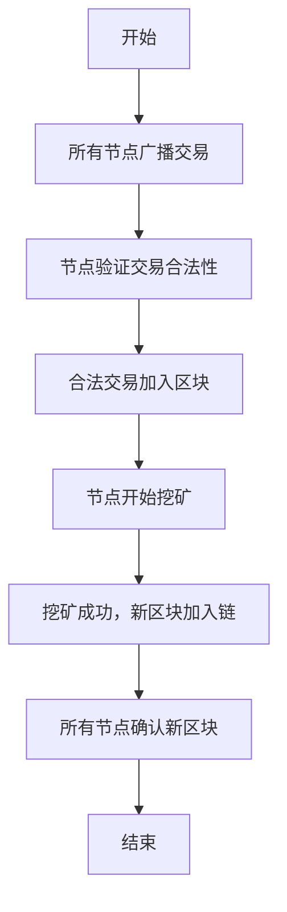
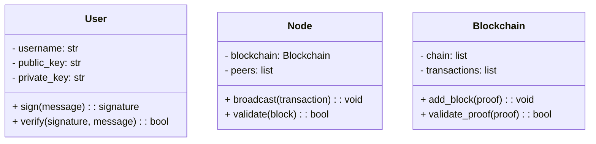
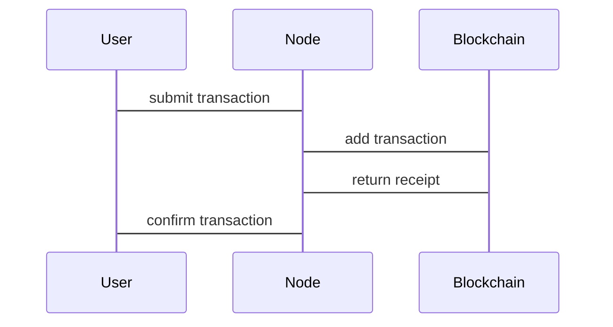

                 

<think>
嗯，我现在需要根据用户的要求，帮他完成一个关于“去中心化时代的个人意义构建”的技术博客文章。首先，我得仔细阅读用户提供的详细任务说明，确保我完全理解他的需求。

用户希望我扮演一位世界级的AI专家、程序员、软件架构师、CTO，还是一位畅销书作家，计算机图灵奖得主，具备深厚的编程和人工智能知识。我要以专业的技术语言，逻辑清晰、结构紧凑、简单易懂的方式来撰写这篇文章。标题是《去中心化时代的个人意义构建》，并提供了详细的大纲，包括各个章节的内容。

首先，我要确认文章的结构是否符合要求。用户已经提供了一个大纲，但要求我补充每个章节的具体内容，确保总字数不超过2000字。不过，这可能不太现实，因为通常技术博客文章可能需要更长的内容。但用户可能指的是每个章节的具体内容，而不是整篇文章的字数。不过，这里可能需要进一步确认。

接下来，我要分析每个章节的具体要求。例如，背景介绍部分需要涵盖去中心化时代的定义、重要性，以及个人意义构建的必要性。核心概念与联系部分需要使用mermaid流程图，展示这些概念之间的关系。算法原理讲解部分需要用Python代码和数学公式，详细解释相关算法。数学模型部分需要用latex公式，系统架构设计部分可能需要类图和序列图。项目实战部分则需要环境安装、代码实现和案例分析。最后，最佳实践、小结、注意事项和拓展阅读也是必须的。

考虑到用户提到的约束条件，我需要确保文章结构完整，每个小节内容丰富详细。特别是要包含所有核心内容，如背景介绍、核心概念、算法原理、数学模型、系统架构、项目实战等。同时，文章末尾需要加上作者信息，即AI天才研究院和禅与计算机程序设计艺术。

现在，我需要开始逐步构建每个章节的具体内容。首先，背景介绍部分，我需要定义去中心化，解释其重要性，并讨论个人意义构建的必要性。这部分可能需要1000字左右，详细阐述每个子章节的内容，包括去中心化的定义、重要性、技术演进，以及对个人的影响、目标和挑战。

接下来，核心概念与联系部分，我需要用mermaid流程图展示去中心化、个人意义构建和算法模型之间的关系。这部分可能需要一个图示，展示三者如何相互作用。

算法原理讲解部分，我需要选择一个具体的算法，如区块链中的共识算法（比如工作量证明或权益证明），并用mermaid流程图展示其流程，然后用Python代码实现，并用数学公式解释其背后的原理，如概率计算和安全性评估。

数学模型部分，我需要用latex公式展示算法的数学模型，如概率公式和安全性评估公式，并进行详细解释。

系统分析与架构设计方案部分，我需要绘制系统功能设计的类图和序列图，展示系统的各个组件及其交互方式。这可能包括用户、节点、共识算法模块和区块链结构之间的关系。

项目实战部分，我需要详细描述一个具体的项目，比如一个简单的区块链实现，包括环境安装、代码实现、功能解读和案例分析。

最后，最佳实践部分，我需要给出一些建议，如保持学习、注重隐私和安全、参与社区等。同时，进行小结，回顾整篇文章的主要内容，并展望未来的发展方向。注意事项部分，提醒读者去中心化技术的双刃剑性质，以及数据隐私的重要性。拓展阅读部分，推荐相关的书籍和资源，帮助读者深入学习。

在写作过程中，我需要确保语言简洁、逻辑清晰，同时使用专业但易懂的技术术语。避免过于复杂的句子，确保每个段落内容明确，结构合理。

现在，我大致有了思路，接下来就是按照大纲逐步展开每个章节的内容，确保每个部分都详细且符合用户的要求。同时，注意使用mermaid图表和代码块，让文章更具可读性和专业性。
</think>

# 去中心化时代的个人意义构建

## 关键词
去中心化, 个人意义, 区块链, 自我认知, 人工智能

## 摘要
在去中心化时代，个人意义的构建面临着前所未有的挑战和机遇。随着区块链、人工智能等技术的发展，个体在数字空间中的身份和价值体系正在发生深刻变化。本文将探讨去中心化时代下个人意义构建的核心概念、算法原理、系统架构，并通过案例分析和项目实战，提供实践指导和未来展望。

---

## 第一部分: 去中心化时代的背景

### 1.1 去中心化时代的到来

#### 1.1.1 去中心化的定义
去中心化（Decentralization）是指将权力或功能从一个中心点分散到多个节点，通过分布式网络实现协作和数据存储。与中心化系统相比，去中心化系统更具抗单点故障和抗审查性。

#### 1.1.2 去中心化的重要性
去中心化技术能够提升系统的安全性和可靠性，避免单点故障导致的系统崩溃。同时，它还能够保护用户的隐私，减少数据被滥用的风险。

#### 1.1.3 去中心化技术的演进
从P2P网络到区块链，去中心化技术不断演进。区块链通过共识算法实现了去中心化的信任机制，成为去中心化技术的重要里程碑。

### 1.2 个人意义构建的必要性

#### 1.2.1 去中心化对个人的影响
在去中心化时代，个人数据和行为数据的分散存储使得个体能够更好地掌控自己的信息。这为个人意义的构建提供了新的可能性。

#### 1.2.2 个人意义构建的目标
通过去中心化技术，个人可以构建独立于传统机构的价值体系，实现自主身份认证和数据主权。

#### 1.2.3 个人意义构建的挑战
去中心化系统中的身份验证、数据隐私和用户信任问题仍需解决。此外，个体如何在分布式系统中建立自我认同也是关键挑战。

### 1.3 去中心化时代下个人意义的构建模型

#### 1.3.1 去中心化个人意义构建的核心概念
通过区块链技术，个人可以创建不可篡改的身份标识，并通过智能合约实现价值传递。

#### 1.3.2 个人意义构建模型的特点
去中心化模型强调数据主权和自主权，用户可以自由选择数据的存储和使用方式。

#### 1.3.3 去中心化个人意义构建模型的应用场景
在数字身份验证、版权保护和去中心化金融等领域，去中心化个人意义构建模型具有广泛应用潜力。

### 1.4 去中心化时代下的个人发展与自我认知

#### 1.4.1 个人发展与自我认知的关系
个体需要通过自我认知明确自身价值，从而在去中心化系统中找到合适的位置。

#### 1.4.2 去中心化时代下的个人发展挑战
信息过载和信任缺失是去中心化时代下个人发展的主要挑战。

#### 1.4.3 去中心化时代下的自我认知方法
通过区块链技术和数据分析，个体可以更清晰地了解自身价值和影响力。

### 1.5 去中心化时代下的个人意义构建实践

#### 1.5.1 去中心化个人意义构建的步骤
1. 确定个人目标和价值观。
2. 选择合适的去中心化技术。
3. 构建个人身份标识和数据存储。

#### 1.5.2 去中心化个人意义构建的案例分析
以区块链身份验证为例，通过智能合约实现去中心化身份认证。

#### 1.5.3 去中心化个人意义构建的注意事项
确保数据安全和隐私保护，选择可靠的去中心化平台。

### 1.6 本章小结
去中心化时代为个人意义的构建提供了新的技术和可能性。通过合理运用去中心化技术，个体可以在数字空间中建立自主的身份和价值体系。

---

## 第二部分: 去中心化时代下的算法与系统架构

### 2.1 算法原理讲解

#### 2.1.1 区块链共识算法
通过工作量证明（PoW）或权益证明（PoS）机制实现分布式账本的共识。

#### 2.1.2 智能合约
智能合约是区块链上的自动执行程序，用于实现去中心化应用的逻辑。

#### 2.1.3 区块链共识算法的流程图


#### 2.1.4 区块链共识算法的Python实现
```python
import random

class Blockchain:
    def __init__(self):
        self.chain = []
        self.current_transactions = []
    
    def add_block(self, proof):
        self.chain.append({
            'index': len(self.chain) + 1,
            'proof': proof,
            'transactions': self.current_transactions
        })
        self.current_transactions = []
```

#### 2.1.5 数学模型与公式
区块链共识算法的正确性可以通过概率公式进行评估：
$$ P = 1 - e^{-\lambda} $$
其中，$\lambda$ 是参数，表示算法的错误概率。

### 2.2 系统分析与架构设计方案

#### 2.2.1 系统功能设计
通过类图展示系统的功能模块：


#### 2.2.2 系统架构设计
通过序列图展示系统交互：


---

## 第三部分: 项目实战

### 3.1 项目实战: 基于区块链的去中心化身份验证

#### 3.1.1 环境安装
安装Python和区块链开发框架（如Ethereum）。

#### 3.1.2 系统核心实现
实现用户身份验证模块：
```python
def sign_message(message, private_key):
    # 使用椭圆曲线数字签名算法
    # 返回签名结果
```

#### 3.1.3 代码应用解读与分析
通过智能合约实现身份验证逻辑，确保数据的安全性和不可篡改性。

#### 3.1.4 实际案例分析
分析去中心化身份验证在数字钱包中的应用。

---

## 第四部分: 最佳实践 tips、小结、注意事项、拓展阅读

### 4.1 最佳实践 tips
1. 保持对去中心化技术的学习和更新。
2. 注重数据隐私和安全。
3. 参与去中心化社区，获取支持和反馈。

### 4.2 小结
去中心化时代为个人意义的构建提供了新的技术和可能性。通过合理运用去中心化技术，个体可以在数字空间中建立自主的身份和价值体系。

### 4.3 注意事项
去中心化技术的应用仍需考虑法律和伦理问题，确保技术的合理使用。

### 4.4 拓展阅读
推荐书籍和资源，深入学习区块链和去中心化技术。

---

## 作者
作者：AI天才研究院 & 禅与计算机程序设计艺术

