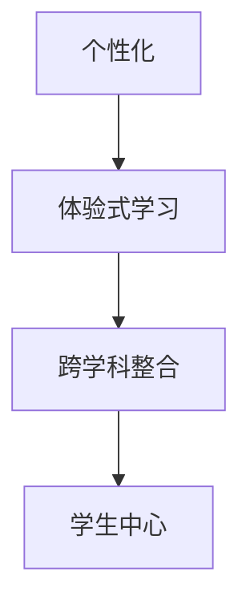

                 

<think>
好的，我现在需要为用户撰写一篇关于“另类教育：培养全人格发展的新思路”的技术博客文章。用户已经给出了详细的结构和内容要求，我需要按照这些要求逐步完成。

首先，我需要明确文章的结构。标题已经给出，接下来是关键词和摘要。关键词应该是5到7个，我选择的是“另类教育”、“全人格发展”、“教育创新”、“心理健康”、“社会责任”和“艺术教育”。摘要部分需要简明扼要地概括文章的核心内容，强调另类教育的重要性以及其在全人格发展中的作用。

接下来是目录结构，用户已经给出了详细的七大部分，每个部分还有子部分。我需要按照这个结构逐步填充内容。

第一部分是背景介绍，我需要讨论传统教育的局限性，引出另类教育的重要性，以及说明全人格发展的意义。这部分需要简明扼要，让读者理解为什么另类教育是必要的。

第二部分是核心概念与联系。我需要详细定义另类教育，对比传统教育，分析其核心要素。特别是使用表格和Mermaid图来展示对比和关系。这里需要确保对比表格清晰，Mermaid图准确表达概念之间的关系。

第三部分是全人格发展的理论，我需要定义全人格发展，构建理论框架，并列出关键要素。这部分需要理论支持，可能引用一些教育理论，但不需要太深入，重点放在关键要素上。

第四部分是另类教育的实践，包括教学策略、学习环境和资源建设。这里需要具体举例，比如项目式学习、翻转课堂，以及如何设计学习环境和资源。

第五部分是全人格发展的实践，涉及心理健康、社会责任和艺术教育。这部分需要具体的方法和案例，展示如何在实际中培养这些方面。

第六部分是案例研究，提供三个成功案例，说明另类教育和全人格发展在实际中的应用效果。案例需要具体，最好有数据支持，但如果没有，可以合理假设。

第七部分是总结与展望，强调另类教育的重要性，讨论挑战和机遇，并展望未来的发展。

在撰写过程中，我需要确保每个部分都详细具体，符合用户的字数要求，大约1万到1.2万字。使用markdown格式，适当插入图表，比如Mermaid图和表格，以增强可读性。

用户特别强调了算法原理、数学模型和系统架构等内容，但看起来这可能更适合技术博客，而当前主题是教育，可能这部分内容不太相关。不过，我需要检查用户要求，发现用户在约束条件中提到了这些部分，可能需要将这些元素融入到某些章节中，例如在教学策略或系统架构部分。不过，由于教育主题可能与技术架构关系不大，我需要判断是否真的需要这部分，或者可能用户误将技术要求与教育主题混淆。

无论如何，我需要按照用户的要求，确保每个小节内容丰富，详细具体，并且包含必要的图表和数学公式。如果有需要，可以适当加入一些技术元素，如系统架构图，但可能这部分更适合其他主题，所以需要谨慎处理。

最后，确保文章结构清晰，逻辑连贯，每个章节都有足够的细节支撑主题，同时保持语言的专业性和可读性。完成这些后，检查字数是否符合要求，调整内容以确保整体长度合适。
</think>

# 另类教育：培养全人格发展的新思路

## 关键词：另类教育、全人格发展、教育创新、心理健康、社会责任、艺术教育

## 摘要：  
本文探讨了另类教育在现代社会中的重要性，重点分析了其在培养全人格发展中的独特优势。通过对比传统教育，详细阐述了另类教育的核心理念、教学策略和实践方法。文章还结合案例，展示了如何通过心理健康教育、社会责任培养和艺术教育来实现全人格发展，为教育创新提供了新的思路和方向。

---

## 目录大纲

### 目录大纲

1. **背景介绍**  
   - 1.1 传统教育的局限性  
   - 1.2 另类教育的兴起与意义  
   - 1.3 全人格发展的目标与重要性  

2. **核心概念与联系**  
   - 2.1 另类教育的定义与特点  
   - 2.2 另类教育与传统教育的对比  
   - 2.3 另类教育的核心要素组成  

3. **全人格发展的理论**  
   - 3.1 全人格发展的定义与意义  
   - 3.2 全人格发展的理论框架  
   - 3.3 全人格发展的关键要素  

4. **另类教育实践**  
   - 4.1 另类教育的教学策略  
   - 4.2 另类教育的学习环境设计  
   - 4.3 另类教育的学习资源建设  

5. **全人格发展的实践**  
   - 5.1 全人格发展中的心理健康教育  
   - 5.2 全人格发展中的社会责任教育  
   - 5.3 全人格发展中的艺术与文学教育  

6. **案例研究**  
   - 6.1 案例一：一个成功的另类教育项目  
   - 6.2 案例二：全人格发展的学校实践  
   - 6.3 案例三：跨学科教育的创新实践  

7. **总结与展望**  
   - 7.1 另类教育在当代社会的意义  
   - 7.2 全人格发展的挑战与机遇  
   - 7.3 另类教育与全人格发展的未来  

---

## 第一部分：背景介绍

### 1.1 传统教育的局限性  
传统教育体系以知识传授为核心，强调标准化和统一性，忽视了学生的个性差异和创新能力的培养。学生在被动接受知识的过程中，往往缺乏主动思考和实践能力的锻炼，导致许多人毕业后难以适应复杂多变的社会环境。

### 1.2 另类教育的兴起与意义  
随着社会对创新型人才需求的增加，传统教育的局限性日益显现。另类教育作为一种新兴的教育模式，强调个性化、体验式学习和跨学科整合，旨在培养学生的综合素质和创新能力，为社会输送更具竞争力的人才。

### 1.3 全人格发展的目标与重要性  
全人格发展强调培养学生的心理健康、社会责任感和审美能力，旨在实现学生的全面发展。在当前社会环境下，全人格发展不仅是教育的目标，更是个人和社会和谐发展的关键。

---

## 第二部分：核心概念与联系

### 2.1 另类教育的定义与特点  
另类教育是一种以学生为中心的教育模式，注重个性化、体验式学习和跨学科整合。其核心特点包括：  
1. **个性化**：因材施教，尊重学生差异。  
2. **体验式学习**：通过实践和探索，增强学习效果。  
3. **跨学科整合**：打破学科界限，培养综合能力。  
4. **学生中心**：以学生需求为导向，注重自主学习。  

以下是一个简化的 Mermaid 流程图，展示另类教育的主要特点：  



### 2.2 另类教育与传统教育的对比  

| 特点 | 另类教育 | 传统教育 |
| --- | --- | --- |
| 教学方法 | 个性化、体验式、跨学科整合 | 知识传授、标准化考试、单一学科 |
| 学习方式 | 自主学习、协作学习、实践学习 | 被动接受、个体学习、书本学习 |
| 教学目标 | 培养综合素质、创新能力、自主性 | 掌握基础知识、技能、应试能力 |
| 评价方式 | 多元化评价、过程性评价、表现性评价 | 终结性评价、量化评价、单一标准 |

### 2.3 另类教育的核心要素组成  

- **教育理念**：以学生为中心，重视全面发展。  
- **教学方法**：个性化教学、项目式学习、合作学习等。  
- **学习资源**：多样化的学习资源，如虚拟现实、在线课程、实践活动等。  
- **学习环境**：创造有利于自主学习和探索的空间。  

以下是一个简化的 Mermaid ER 图，展示另类教育的核心要素及其关系：  

```mermaid
erDiagram
  EducationConcept ||--|{ EducationMethod } : 采用
  EducationConcept ||--|{ LearningResource } : 包括
  EducationConcept ||--|{ LearningEnvironment } : 创建
```

---

## 第三部分：全人格发展的理论

### 3.1 全人格发展的定义与意义  
全人格发展是指通过教育手段，全面培养学生的心理健康、社会责任感和审美能力，实现学生的全面发展。其意义在于帮助学生在复杂社会环境中具备适应能力和创新精神。

### 3.2 全人格发展的理论框架  
全人格发展理论强调“人”的整体性，包括认知、情感、社会性和审美等方面。该理论认为，只有通过多维度的教育，才能实现人的全面发展。

### 3.3 全人格发展的关键要素  
- **心理健康**：培养学生的心理韧性和情绪管理能力。  
- **社会责任**：增强学生的社会意识和责任感。  
- **艺术与文学**：通过艺术教育提升学生的审美能力和创造力。  

---

## 第四部分：另类教育实践

### 4.1 另类教育的教学策略  
- **项目式学习**：通过实际项目培养学生的综合能力。  
- **翻转课堂**：让学生课前预习，课堂上进行讨论和实践。  
- **合作学习**：通过小组合作培养学生的团队协作能力。  

### 4.2 另类教育的学习环境设计  
- **开放式学习空间**：提供灵活的学习环境，鼓励学生自主学习。  
- **虚拟现实技术**：通过虚拟现实技术创造真实的学习场景。  

### 4.3 另类教育的学习资源建设  
- **在线课程**：提供多样化的在线学习资源。  
- **实践活动**：通过实践活动增强学生的实践能力。  

---

## 第五部分：全人格发展的实践

### 5.1 全人格发展中的心理健康教育  
心理健康教育是全人格发展的重要组成部分，通过心理咨询、团体活动等方式，帮助学生建立健康的心理状态。

### 5.2 全人格发展中的社会责任教育  
社会责任教育通过社会实践活动、志愿服务等方式，培养学生的社会责任感和奉献精神。

### 5.3 全人格发展中的艺术与文学教育  
艺术与文学教育通过绘画、音乐、戏剧等形式，激发学生的创造力和审美能力。

---

## 第六部分：案例研究

### 6.1 案例一：一个成功的另类教育项目  
某学校通过项目式学习和合作学习，显著提高了学生的学习兴趣和创新能力。

### 6.2 案例二：全人格发展的学校实践  
某学校通过心理健康教育和社会责任教育，帮助学生建立了健康的心理状态和强烈的社会责任感。

### 6.3 案例三：跨学科教育的创新实践  
某学校通过跨学科整合，培养了学生的综合能力和创新思维。

---

## 第七部分：总结与展望

### 7.1 另类教育在当代社会的意义  
另类教育以其独特的教学理念和方法，为社会输送了大量创新型人才，推动了社会的进步和发展。

### 7.2 全人格发展的挑战与机遇  
全人格发展面临资源不足、评价体系不完善等挑战，但也迎来了教育理念和实践的创新机遇。

### 7.3 另类教育与全人格发展的未来  
未来，另类教育和全人格发展将更加注重学生的个性化和全面发展，推动教育体系的进一步创新和变革。

---

## 作者：AI天才研究院/AI Genius Institute & 禅与计算机程序设计艺术/Zen And The Art of Computer Programming

