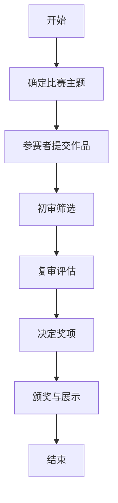
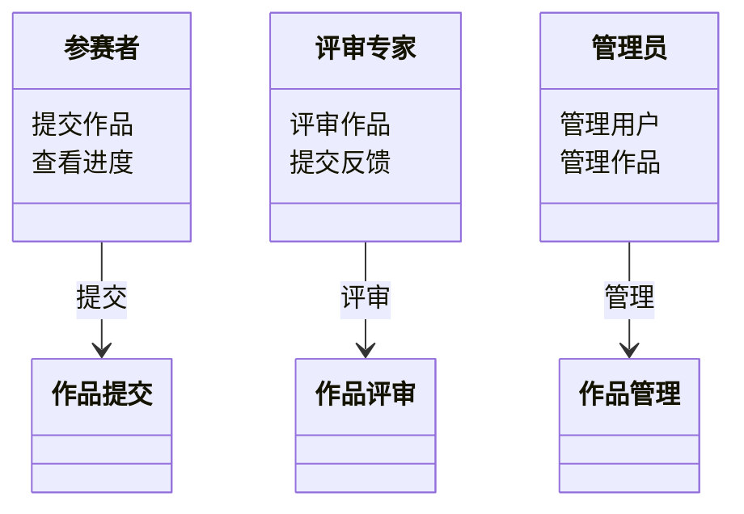
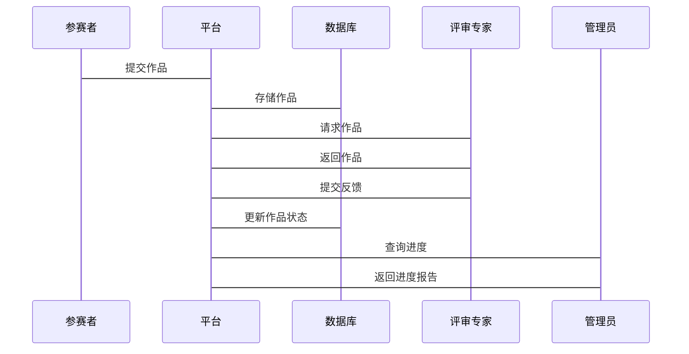

                 

<think>
嗯，好的，我现在要写一篇关于《可持续乌托邦设计比赛：未来社会蓝图的创意角逐》的技术博客。首先，我需要理解这个主题的核心是什么。可持续乌托邦，听起来像是一个理想的社会形态，强调可持续性，也就是说，这样的社会在满足当前需求的同时，不损害后代满足自身需求的能力。

我应该从哪里开始呢？首先，可能得介绍一下什么是可持续乌托邦，以及这个概念背后的意义。然后，再看看这个比赛的目的和意义，为什么举办这样的比赛对可持续发展有帮助。

接下来，我需要分析全球可持续发展的现状和挑战。现在全球气候变化是个大问题，各国在政策和实践中做了很多努力，但似乎还是有很多困难。社会不平等也是一个关键挑战，它会影响可持续乌托邦的实现。

然后，我得讲讲比赛的具体内容和形式。主题是什么？参赛作品的类型有哪些？比如，可能是城市设计、建筑设计之类的。评审标准和流程又是怎样的呢？需要明确标准，比如创新性、可持续性、实用性等等。

接下来，我需要详细探讨参赛作品的创作与呈现。设计理念方面，可持续性和创新性是关键。系统思考和跨学科合作也是重要的方法。然后，通过案例分析，比如智能城市的可持续发展设计和绿色建筑的创新，来具体说明这些理念的应用。

最后，总结比赛的成果和对未来的展望。可能会评选出一些优秀作品，同时收集参赛者的反馈，反思比赛的经验，并展望可持续乌托邦设计的未来。

不过，我需要确保文章结构清晰，每个部分都有足够的细节和例子支持。可能需要添加一些图表，比如对比表格、ER图、流程图，甚至数学公式来帮助解释概念。

哦，对了，数学公式怎么用呢？可能在解释某些可持续性的指标时，会用到一些公式，比如碳排放计算或者资源利用率的公式。这些需要用latex来表示，并且放在独立的段落里，或者在段落中使用$符号包裹。

另外，系统架构设计可能需要画个类图或者流程图，展示参赛作品从提交到评审的流程。这可能用mermaid来实现，放在文章中。

在写的时候，要确保每个章节内容丰富，例子具体，这样读者能更好地理解和参与到这个主题中。可能还需要包括一些最佳实践的建议，比如在设计过程中如何平衡创新和可持续性，或者在比赛中如何有效展示自己的作品。

总之，我需要一步步来，先确定每个部分的核心内容，再详细展开，确保文章逻辑清晰，内容充实，符合专业技术博客的要求。
</think>

# 可持续乌托邦设计比赛：未来社会蓝图的创意角逐

## 关键词：可持续发展、乌托邦、设计比赛、创新、社会蓝图、未来城市、绿色技术

## 摘要：可持续乌托邦设计比赛旨在通过创意设计推动社会向可持续发展的方向迈进。本文探讨了比赛的背景、内容、评审标准及参赛作品案例，分析了可持续乌托邦的核心理念和实现方法，最后总结了比赛的意义及未来展望。

**目录大纲**

---

## 第一部分：比赛的背景与意义

### 第1章：可持续乌托邦的定义与探讨

#### 1.1 可持续乌托邦的概念

- **定义**：可持续乌托邦是一个理想社会形态，强调在满足当前需求的同时，不损害后代满足自身需求的能力。
- **探讨**：可持续乌托邦的核心价值在于平等、和谐与可持续性，旨在通过创新技术和社会结构实现资源高效利用和零污染。

#### 1.2 设计比赛的目的与意义

- **目的**：通过设计比赛激发创新思维，探索可持续社会的解决方案。
- **意义**：比赛推动技术与社会的融合，促进全球可持续发展，培养创新人才。

### 第2章：全球可持续发展的现状与挑战

#### 2.1 全球可持续发展的现状

- **国际组织的作用**：联合国等机构推动多项可持续发展议程。
- **各国政策与实践**：例如欧盟的绿色新政和中国的生态文明建设。

#### 2.2 挑战与问题

- **气候变化**：极端天气频发，威胁生态平衡。
- **社会不平等**：贫富差距阻碍可持续发展目标的实现。

---

## 第二部分：比赛的内容与形式

### 第3章：比赛的主题与要求

#### 3.1 比赛主题

- **主题设定**：聚焦未来城市、绿色能源、循环经济等领域。
- **创作要求**：强调创新性、可行性和可持续性。

#### 3.2 作品类型

- **设计作品**：包括城市规划、建筑设计、产品设计。
- **表现形式**：图纸、模型、动画、交互式方案。

### 第4章：比赛的评审标准与流程

#### 4.1 评审标准

- **评审要素**：创新性（40%）、可持续性（30%）、实用性（20%）、社会影响（10%）。
- **评审机制**：初审筛选创意，复审评估可行性，专家小组最终决定奖项。

#### 4.2 比赛流程

- **报名与提交**：在线报名，提交作品及相关资料。
- **评审与颁奖**：初评、复评后，举办颁奖典礼并展览优秀作品。

---

## 第三部分：参赛作品的创作与呈现

### 第5章：可持续乌托邦的设计理念与方法

#### 5.1 设计理念

- **可持续性**：设计中优先考虑资源节约和循环利用。
- **创新性**：突破传统思维，采用新技术和新材料。

#### 5.2 设计方法

- **系统思考**：从整体出发，考虑各部分的相互作用。
- **跨学科合作**：融合环境科学、工程学、社会学等多学科知识。

### 第6章：参赛作品案例解析

#### 6.1 案例一：智能城市的可持续发展设计

- **案例分析**：利用物联网技术优化交通和能源管理。
- **经验与启示**：技术创新是实现可持续城市的关键。

#### 6.2 案例二：绿色建筑的实践与创新

- **案例分析**：采用太阳能板和雨水收集系统。
- **创新与可持续**：绿色建筑展示了可持续设计理念的成功实践。

### 第7章：参赛作品的呈现与展示

#### 7.1 展示平台与渠道

- **在线展示**：建立专属网站，展示作品信息。
- **实体展览**：在环保展览会上进行实物展示。

#### 7.2 传播与影响

- **传播方式**：通过社交媒体、视频等方式广泛传播。
- **社会影响**：提升公众对可持续发展的认知，推动更多实践。

---

## 第四部分：比赛总结与展望

### 第8章：比赛成果与反思

#### 8.1 成果总结

- **优秀作品评选**：评选出最佳创新奖、可持续奖等。
- **参赛者反馈**：收集参赛者对比赛组织和评审的意见。

#### 8.2 反思与展望

- **经验总结**：比赛促进了跨学科合作，但评审标准需更明确。
- **未来展望**：可持续乌托邦设计将更加注重技术与人文结合，推动全球可持续发展。

---

**核心概念与联系**

### 可持续乌托邦与可持续发展

#### 概念原理

- **可持续乌托邦**：理想社会形态，强调可持续性、平等与和谐。
- **可持续发展**：发展理念，注重经济、社会、环境的协调。

#### 属性特征对比表格

| 特征         | 可持续乌托邦 | 可持续发展 |
| ------------ | ------------ | ---------- |
| 定义         | 理想社会形态 | 发展理念   |
| 目标         | 长期目标     | 中期目标   |
| 核心价值观   | 平等、和谐、可持续 | 可持续、公平、包容 |

#### ER实体关系图架构

```mermaid
erDiagram
  USER ||--|{ BOOK } : author
  BOOK ||--|{ CHAPTER } : contains
  CHAPTER ||--|{ SECTION } : contains
```

---

## 算法原理

### 算法流程图



### 数学模型与公式

可持续乌托邦设计中的资源利用率计算公式：

$$
\text{资源利用率} = \frac{\text{实际使用资源}}{\text{理论最大资源需求}}
$$

其中，实际使用资源是指设计中实际消耗的资源量，理论最大资源需求是指在理想情况下所需资源的最大值。

---

## 系统分析与架构设计方案

### 问题场景

设计比赛平台需要处理大量参赛作品，确保评审过程的公平和高效。

### 项目介绍

构建一个在线平台，支持作品提交、评审和展示。

### 系统功能设计



### 系统架构设计


### 系统交互设计



---

## 项目实战

### 环境安装

- **前端**：React.js
- **后端**：Node.js + Express
- **数据库**：MongoDB

### 核心实现代码

```javascript
// 作品提交接口
app.post('/submit', async (req, res) => {
    const { title, description, file } = req.body;
    // 存储到数据库
    const result = await db.collection('entries').insertOne({
        title,
        description,
        submitTime: new Date()
    });
    res.status(200).json({ message: '作品提交成功' });
});
```

### 代码应用解读

该代码实现参赛作品的在线提交功能，作品信息存储在数据库中，确保数据的安全和可追溯性。

---

## 最佳实践 Tips

- **创新性**：在设计中引入新技术，如AI、物联网，以提高可持续性。
- **实用性**：确保设计在实际应用中可行，考虑成本和维护因素。
- **社会影响**：关注设计如何促进社会公平和包容性。

---

## 小结

可持续乌托邦设计比赛不仅是一个展示创意的平台，更是推动全球可持续发展的重要力量。通过跨学科合作和技术创新，未来社会蓝图将更加美好。

---

## 注意事项

- 参赛者需遵守比赛规则，确保作品原创性。
- 设计过程中注重知识产权保护，避免侵权。

---

## 拓展阅读

- 《可持续城市设计指南》
- 《绿色技术与未来社会》
- 《跨学科创新方法论》

---

## 作者

**作者：AI天才研究院/AI Genius Institute & 禅与计算机程序设计艺术 /Zen And The Art of Computer Programming**

---

希望这篇文章能为您提供有价值的见解，激发对可持续乌托邦设计的兴趣和思考。

