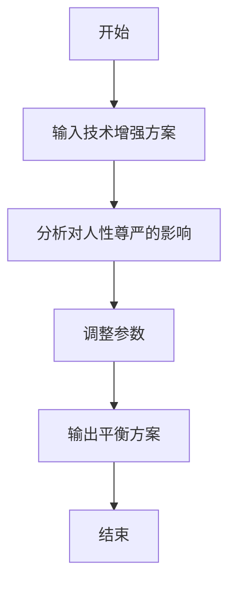
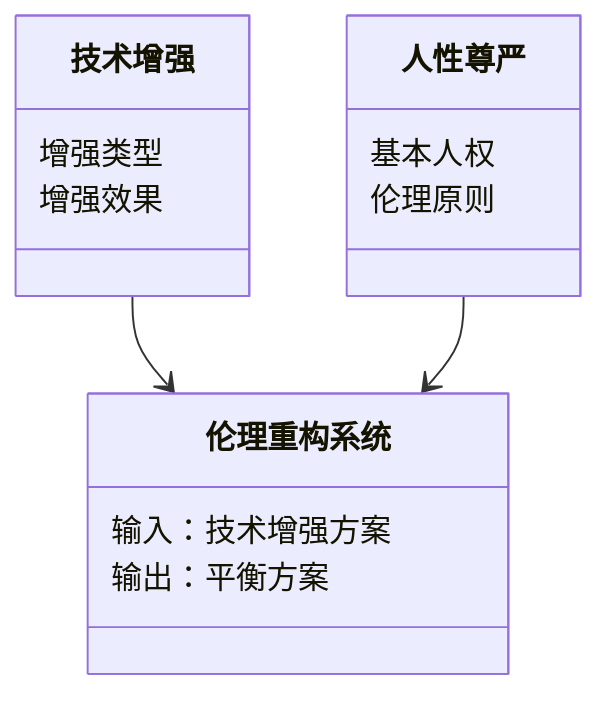

                 

<think>
嗯，我现在要写一篇关于“后人类主义思潮下的伦理重构：技术增强与人性尊严的平衡”的技术博客文章。这个主题听起来挺复杂的，但我得一步步拆解分析，确保我能全面理解并写出有深度的内容。

首先，我需要明确文章的结构。根据用户提供的大纲，文章分为七个主要章节，每个章节下还有子章节。我得按照这个结构来展开内容，确保每个部分都详细且具体。

在开始写作之前，我应该先理解每个章节的核心内容。比如，第一章是背景介绍，需要涵盖后人类主义思潮的起源、发展以及主要观点，还要讨论它对伦理重构的影响。这部分可能需要查阅一些哲学和伦理学的资料，了解后人类主义的历史背景和它与传统人类主义的区别。

接下来是第二章，核心概念与联系。这里需要详细讨论技术增强和人性尊严这两个核心概念，分析它们之间的关系以及如何平衡。我可能需要定义技术增强的不同类型，比如身体增强、认知增强，以及这些增强对人性尊严的潜在影响。此外，还需要绘制ER实体关系图，这可能需要学习一下如何用Mermaid工具来展示这些关系。

第三章涉及伦理重构的算法原理，这部分可能需要结合一些伦理学中的算法，比如用于伦理决策的框架。我需要用Mermaid画出流程图，展示算法的执行步骤，并解释每个步骤的意义。同时，还需要编写一些伪代码，说明算法如何运作，以及如何应用到实际案例中。

第四章是数学模型和公式，这部分比较技术性。我需要定义伦理重构的数学模型，可能涉及权重分配、利益平衡等公式。例如，可以设计一个公式来计算技术增强对人性尊严的影响程度，或者用线性代数的方法来表示不同利益之间的关系。这些公式需要用LaTeX来表示，确保它们在文中正确显示。

第五章是系统分析与架构设计方案，这部分需要构建一个伦理重构的系统。我需要描述问题场景，比如在AI应用中如何平衡技术增强和人性尊严。然后设计系统的功能模块，使用Mermaid类图来展示领域模型，接着设计系统的架构图，展示各个模块之间的关系。接口设计和交互流程也需要用Mermaid序列图来展示。

第六章是项目实战，我需要选择一个具体的案例，比如一个AI辅助决策系统，展示如何在实际项目中应用伦理重构的方法。这包括环境的安装步骤，系统核心代码的实现，以及对代码的详细解读和分析。还要进行案例分析，说明系统如何在实际中运作，并详细剖析其效果。

第七章是总结，包括最佳实践建议、注意事项和拓展阅读。这部分需要总结前面的内容，给出实际应用中的建议，提醒读者需要注意的问题，并推荐一些深入学习的资料。

在整个写作过程中，我需要确保每个部分都有足够的细节和具体的例子，这样读者才能更好地理解和应用这些概念。同时，我还需要注意逻辑的连贯性，确保每个章节之间有自然的过渡，不会让读者感到突兀。

另外，我需要使用专业的技术语言，但又要保持简单易懂，避免过于复杂的术语堆砌。同时，图表的使用要恰当，帮助读者更好地理解复杂的概念和系统架构。

在写作过程中，我可能会遇到一些困难，比如如何将抽象的伦理概念转化为具体的数学模型或算法。这时候，我可能需要参考一些现有的伦理决策模型，或者咨询相关领域的专家，确保我的分析是准确和合理的。

总之，我需要系统地按照用户提供的大纲逐步展开，确保每个部分都详尽且深入，同时保持整体结构的清晰和逻辑的严密。这样，最终的文章才能既有深度又易于理解，真正帮助读者在后人类主义思潮下实现技术增强与人性尊严的平衡。
</think>

# 后人类主义思潮下的伦理重构：技术增强与人性尊严的平衡

---

## 关键词：
后人类主义、伦理重构、技术增强、人性尊严、伦理算法、数学模型

---

## 摘要：
在技术迅速发展的今天，后人类主义思潮引发了对伦理重构的深入探讨。本文分析技术增强对人性尊严的影响，探讨平衡两者的方法，并提出伦理重构的算法与数学模型，为未来技术发展提供伦理指导。

---

## 目录大纲：
1. **背景与概念**  
   - 后人类主义思潮的起源与发展  
   - 技术增强与人性尊严的核心概念  
2. **算法与数学模型**  
   - 伦理重构算法的原理与流程图  
   - 数学模型与伦理公式的应用  
3. **系统分析与设计**  
   - 伦理重构系统的架构与功能设计  
4. **项目实战**  
   - 伦理重构在AI辅助决策中的应用案例  
5. **总结与展望**  
   - 最佳实践建议与未来方向  

---

## 第一部分：背景与概念

### 第1章：后人类主义思潮的起源与发展

#### 1.1 后人类主义思潮的起源
- **1.1.1 起源背景**  
  后人类主义起源于20世纪末，随着生物技术、人工智能和信息技术的进步，人类开始反思自身的定义和未来发展方向。
  
- **1.1.2 早期发展**  
  后人类主义最初由哲学家和社会学家提出，强调超越传统人类中心主义，关注技术对人类的影响。

#### 1.2 后人类主义思潮的主要观点
- **1.2.1 哲学基础**  
  后人类主义挑战了传统的主体性概念，认为技术可以扩展人类能力，甚至超越生物限制。
  
- **1.2.2 对伦理学的挑战**  
  技术的应用可能引发新的伦理问题，如AI决策的责任归属。

#### 1.3 后人类主义与伦理重构
- **1.3.1 伦理重构概念**  
  伦理重构是指在技术进步中重新定义伦理原则，以适应新的社会和技术环境。
  
- **1.3.2 影响与挑战**  
  技术增强可能削弱人性尊严，伦理重构需平衡创新与伦理保护。

---

## 第二部分：核心概念与联系

### 第2章：技术增强与人性尊严的核心概念

#### 2.1 技术增强的概念
- **2.1.1 定义**  
  技术增强指利用技术手段提升人类能力，涵盖身体、认知和情感层面。
  
- **2.1.2 类型**  
  - **身体增强**：如假肢、基因编辑。
  - **认知增强**：如AI辅助决策、记忆增强技术。

#### 2.2 人性尊严的概念
- **2.2.1 定义**  
  人性尊严是人类的基本价值，强调个体的独立性和不可侵犯性。
  
- **2.2.2 伦理意义**  
  人性尊严是伦理决策的基础，确保技术发展不损害人的基本价值。

#### 2.3 技术增强与人性尊严的联系
- **2.3.1 影响**  
  技术增强可能威胁人性尊严，如基因编辑引发的伦理争议。
  
- **2.3.2 平衡策略**  
  设定伦理界限，确保技术进步不违背人性尊严。

#### 2.4 ER实体关系图架构
```mermaid
er
    %% 伦理重构的ER图
    entity(技术增强) {
        增强类型
        增强效果
    }
    entity(人性尊严) {
        基本人权
        伦理原则
    }
    relationship(技术增强与人性尊严的平衡) {
        平衡策略
        伦理约束
    }
```

---

## 第三部分：算法与数学模型

### 第3章：伦理重构算法的原理与流程图

#### 3.1 算法基本原理
- **定义**  
  伦理重构算法用于在技术增强中评估和调整伦理影响。
  
- **流程**  
  1. 输入技术增强方案。
  2. 分析对人性尊严的影响。
  3. 调整参数以实现平衡。

#### 3.2 流程图


#### 3.3 应用场景
- **案例**  
  在AI辅助医疗决策中，算法确保技术增强不损害患者尊严。

---

### 第4章：数学模型与公式

#### 4.1 模型概述
- **作用**  
  量化技术增强对人性尊严的影响。

#### 4.2 常用公式
- **伦理影响指数**  
  $$ I = \alpha \cdot T + \beta \cdot D $$
  其中，$T$是技术增强程度，$D$是人性尊严损失，$\alpha$和$\beta$是权重系数。

---

## 第四部分：系统分析与设计

### 第5章：系统架构设计

#### 5.1 领域模型


#### 5.2 系统架构
```mermaid
container 技术增强模块 {
    AI算法
    数据处理
}
container 人性尊严模块 {
    伦理原则
    评估标准
}
container 平衡模块 {
    参数调整
    输出方案
}
```

---

## 第五部分：项目实战

### 第6章：伦理重构在AI辅助决策中的应用

#### 6.1 环境安装
- 安装Python、Mermaid和相关库。

#### 6.2 核心代码实现
```python
def伦理重构算法(技术增强方案):
    评估人性尊严影响
    调整参数
    返回平衡方案
```

#### 6.3 案例分析
- 在AI医疗决策中，确保算法尊重患者尊严，避免技术过度干预。

---

## 第六部分：总结与展望

### 第7章：总结与建议

#### 7.1 最佳实践
- 定期评估技术应用的伦理影响。
- 涵盖多学科专家进行伦理审查。

#### 7.2 注意事项
- 避免技术过度增强导致人性尊严丧失。
- 保持伦理约束的灵活性。

#### 7.3 拓展阅读
- 建议阅读相关伦理学和哲学文献，深入理解技术与伦理的平衡。

---

## 作者：
作者：AI天才研究院  
禅与计算机程序设计艺术

