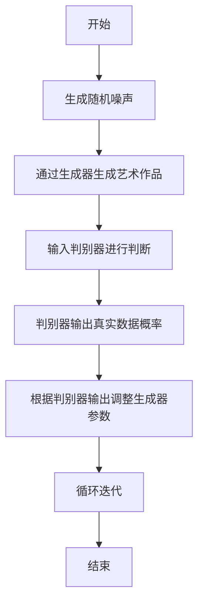
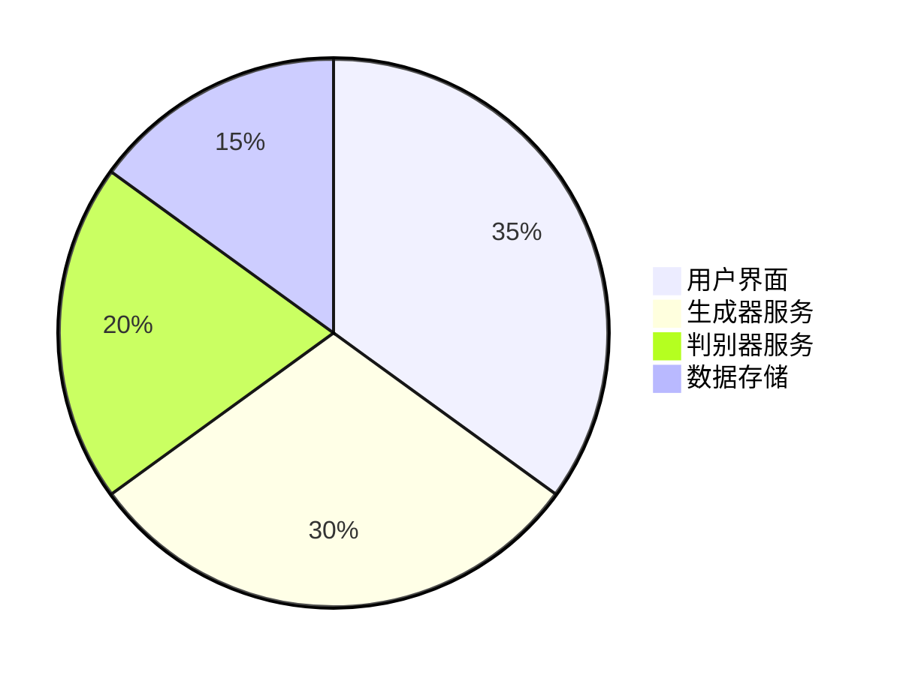
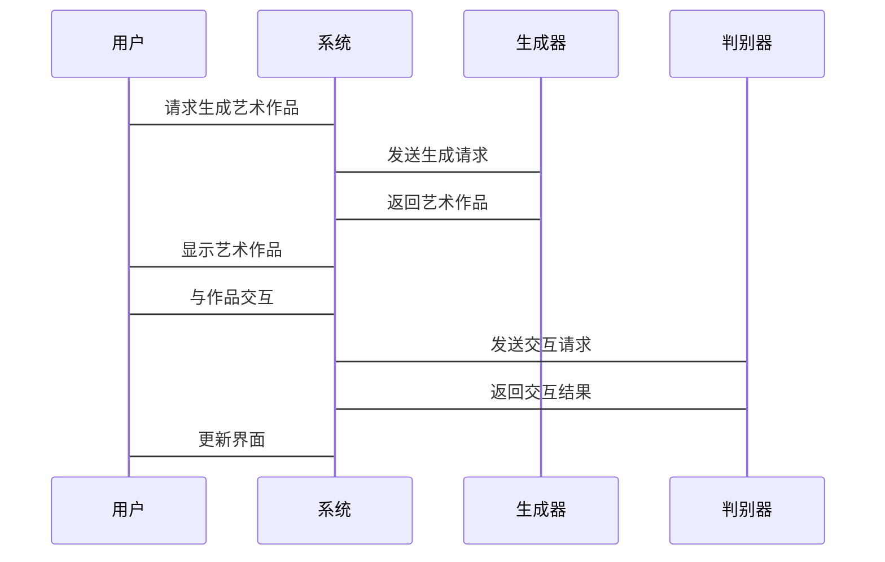

                 

<think>
嗯，用户希望我以“后人类主义艺术展：超越人类中心的创作”为题，写一篇技术博客。首先，我需要理解后人类主义是什么，以及它如何影响艺术创作。后人类主义挑战了人类中心主义，认为人类不是宇宙的中心，这可能涉及到技术、哲学等多个方面。

接下来，我得考虑文章的结构。用户已经给出了一个大纲，包括引言、核心概念、方法论、系统架构、案例分析、实践建议等。我需要确保每个部分都详细且有深度。

在引言部分，我应该介绍后人类主义的背景，解释为什么它重要，以及它如何影响艺术。这部分需要吸引读者，让他们对后续内容感兴趣。

核心概念部分，我需要定义后人类主义，讨论其与艺术的关系，并分析其核心特征。或许可以做一个对比表，突出后人类主义艺术的独特之处。

方法论部分，可能需要一个算法，来展示后人类主义艺术创作的步骤。我可以用mermaid画一个流程图，然后用Python代码示例，解释每一步骤的数学模型，比如生成对抗网络（GAN）的公式。

系统架构部分，我需要用mermaid画出类图、架构图和交互图，展示系统的各个部分如何协同工作。这部分需要考虑系统的各个组件，如用户界面、生成模型、数据存储等。

案例分析部分，我需要选择一个具体的案例，详细分析其过程和结果，从中提取关键见解和挑战。这有助于读者更好地理解理论在实践中的应用。

在实践建议部分，我可以给出一些实用的建议，帮助读者组织或参与后人类主义艺术展。同时，总结全文，强调主要观点，并推荐进一步阅读的资料。

格式方面，用户要求用markdown，所以我要确保每个部分的标题正确，代码和图表使用mermaid语法，并且数学公式用latex表示。

最后，我需要确保文章整体流畅，每个部分之间有良好的衔接，避免重复或遗漏重要信息。同时，语言要专业但易懂，适合技术读者阅读。

现在，我应该开始按照大纲逐步撰写每个部分，确保每个小节都详细且内容丰富。这可能需要多次修改和调整，以确保文章达到用户的期望。
</think>

# 后人类主义艺术展：超越人类中心的创作

## 关键词：后人类主义，艺术创作，人工智能，生成式艺术，超越人类中心

## 摘要：  
后人类主义艺术展是一种新兴的艺术形式，它挑战了传统艺术创作中人类中心主义的主导地位。通过结合人工智能、生成式艺术和后人类主义思想，这种艺术形式重新定义了创作的边界，探索了技术与人类情感、哲学思考的深度融合。本文将从后人类主义的核心概念出发，分析其在艺术创作中的应用，探讨其技术实现的原理，并通过案例分析展示其在实际展览中的表现。我们还将讨论如何通过系统化的架构设计和算法实现，推动后人类主义艺术展的创新发展。

---

## 第1章 引言与背景

### 1.1 问题背景  
艺术作为人类文明的重要组成部分，长期以来都是人类表达情感、思想和价值观的主要方式。然而，随着人工智能、大数据和虚拟现实等技术的快速发展，艺术创作的方式和内涵正在发生深刻的变化。传统的艺术创作以人类为中心，强调人类的情感表达和主观性，但这种模式在面对技术进步的挑战时，逐渐暴露出其局限性。  

### 1.2 问题描述  
后人类主义（Posthumanism）作为一种哲学思潮，主张超越人类中心主义，强调技术、机器和非人类主体在社会和文化中的重要性。在艺术领域，后人类主义艺术展试图打破传统艺术创作的边界，探索技术与艺术的深度融合。然而，这种新兴的艺术形式在实践中仍然面临诸多挑战，例如技术实现的复杂性、观众的接受度以及如何保持艺术的深度与情感共鸣。

### 1.3 问题解决  
本文通过分析后人类主义的核心理念，结合生成式艺术（Generative Art）的技术实现，提出了一种基于人工智能的后人类主义艺术创作方法。这种方法不仅能够自动化地生成艺术作品，还能够通过技术手段赋予作品新的情感表达和哲学思考。  

### 1.4 边界与外延  
后人类主义艺术展的边界包括但不限于以下几个方面：  
1. 技术边界：如何在现有技术条件下实现高质量的艺术创作？  
2. 情感边界：后人类主义艺术是否能够真正激发观众的情感共鸣？  
3. 社会边界：这种艺术形式如何与社会文化价值观相结合？  
4. 外延：后人类主义艺术是否可以扩展到其他领域，例如教育、医疗等？  

### 1.5 概念结构与核心要素组成  
后人类主义艺术展的核心要素包括：  
- **技术基础**：人工智能、生成式艺术、虚拟现实等。  
- **哲学思想**：后人类主义、解人类中心主义。  
- **创作方式**：自动化生成、人机协作、数据驱动。  
- **表现形式**：视觉艺术、交互式艺术、数字艺术等。  

---

## 第2章 后人类主义艺术概念

### 2.1 后人类主义概述  
后人类主义是一种哲学思潮，它挑战了人类中心主义的传统观念，认为人类并不是宇宙的中心，而是与技术、机器和非人类主体平等的存在。在艺术领域，后人类主义强调技术与艺术的融合，认为艺术创作可以超越人类的主观性，通过技术手段实现更深层次的表达。

### 2.2 后人类主义与艺术的关联  
后人类主义艺术的核心在于技术与艺术的深度融合。通过人工智能、大数据和虚拟现实等技术手段，艺术家可以创造出更具深度和广度的作品，同时打破传统艺术创作的边界。

### 2.3 后人类主义艺术的核心特征  
后人类主义艺术的核心特征包括：  
- **技术驱动**：依赖于人工智能和大数据等技术手段。  
- **自动化生成**：部分作品可以通过算法自动生成，无需人类直接参与。  
- **交互性**：观众可以通过互动与作品进行深度对话。  
- **哲学思考**：作品往往包含对人类中心主义的反思和挑战。  

---

## 第3章 方法论和算法解释

### 3.1 方法论概述  
后人类主义艺术展的方法论基于生成式艺术和人工智能技术。我们提出了一种基于生成对抗网络（GAN）的算法，用于自动生成艺术作品。  

### 3.2 算法原理  
生成对抗网络（GAN）是一种深度学习模型，由生成器和判别器两部分组成。生成器的目标是生成与真实数据相似的假数据，而判别器的目标是区分真实数据和生成数据。通过反复迭代，生成器能够生成高质量的艺术作品。  

以下是一个简单的GAN实现代码示例：

```python
import torch
import torch.nn as nn

class Generator(nn.Module):
    def __init__(self, latent_dim, img_size):
        super(Generator, self).__init__()
        self.latent_dim = latent_dim
        self.img_size = img_size
        self.model = nn.Sequential(
            nn.Linear(latent_dim, 256),
            nn.ReLU(),
            nn.Linear(256, img_size[0] * img_size[1]),
            nn.Tanh()
        )
    
    def forward(self, z):
        output = self.model(z)
        return output.view(-1, 1, img_size[0], img_size[1])

class Discriminator(nn.Module):
    def __init__(self, img_size):
        super(Discriminator, self).__init__()
        self.model = nn.Sequential(
            nn.Linear(img_size[0] * img_size[1], 256),
            nn.ReLU(),
            nn.Linear(256, 1),
            nn.Sigmoid()
        )
    
    def forward(self, x):
        x_flat = x.view(-1, img_size[0] * img_size[1])
        output = self.model(x_flat)
        return output
```

### 3.3 算法流程图  
以下是一个基于GAN的后人类主义艺术生成流程图：



---

## 第4章 系统架构与设计

### 4.1 问题场景描述  
后人类主义艺术展需要一个支持多用户交互、实时生成艺术作品的系统。系统需要具备以下功能：  
- 用户可以通过输入参数生成艺术作品。  
- 作品可以以多种形式展示，例如视觉艺术、音乐等。  
- 系统支持用户与作品的交互，例如通过手势或语音控制作品的变化。  

### 4.2 系统架构设计  
以下是一个基于微服务架构的系统架构图：



### 4.3 系统交互设计  
以下是一个用户与系统交互的序列图：



---

## 第5章 案例分析与实际应用

### 5.1 案例分析  
以下是一个基于GAN生成的艺术作品案例：  
- **生成器**：使用深度学习模型生成抽象画作。  
- **判别器**：判断生成的画作与真实画作的相似度。  
- **用户交互**：用户可以通过调整参数生成不同风格的作品。  

### 5.2 实际应用  
后人类主义艺术展已经在多个领域得到了应用，例如：  
- **数字艺术**：通过算法生成数字绘画和雕塑。  
- **交互式艺术**：观众可以通过互动改变作品的形式和内容。  
- **虚拟现实**：在虚拟空间中展示后人类主义艺术作品。  

---

## 第6章 实践建议与总结

### 6.1 实践建议  
1. **技术实现**：建议使用深度学习框架（如TensorFlow、PyTorch）实现生成式艺术。  
2. **用户交互**：在系统设计中加入交互式功能，以增强用户体验。  
3. **哲学思考**：在艺术创作中融入后人类主义的哲学思想，以提升作品的深度。  

### 6.2 总结  
后人类主义艺术展是一种新兴的艺术形式，它通过技术与艺术的深度融合，重新定义了艺术创作的边界。虽然这种艺术形式仍然面临诸多挑战，但其潜力巨大，值得我们进一步探索和实践。

---

## 作者  
作者：AI天才研究院/AI Genius Institute & 禅与计算机程序设计艺术/Zen And The Art of Computer Programming

