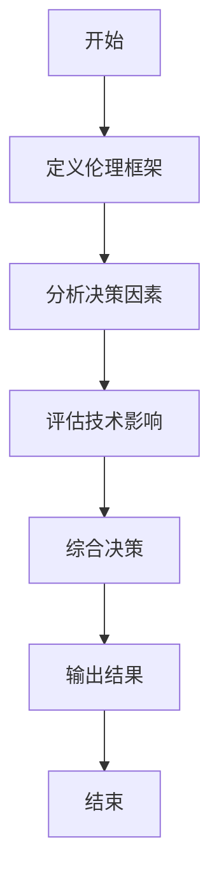
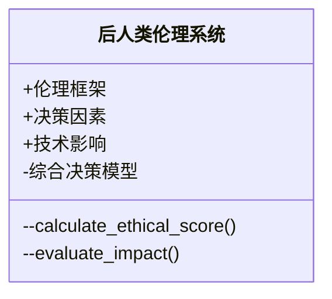

                 

<think>
嗯，用户让我写一篇关于后人类伦理的技术博客，标题是《后人类伦理：技术进步中的道德思考》。看起来他希望文章结构清晰，内容详实，包括背景、核心概念、算法原理、系统设计、项目实战和最佳实践等部分。用户还详细列出了目录大纲，所以我得按照这个结构来组织内容。

首先，我需要理解用户的需求。他可能是一位技术专家或者CTO，想要探讨技术进步带来的伦理问题，特别是在后人类时代。他希望文章不仅有理论，还要有实际的代码实现和案例分析，所以得兼顾技术深度和伦理思考。

接下来，我得考虑文章的结构。开头要有关键词和摘要，然后按照目录一步步展开。背景介绍部分需要涵盖后人类伦理的定义、起源，以及技术进步对伦理的影响。核心概念部分要用Mermaid图来对比概念属性，这可能需要我绘制表格和ER图。算法部分，我得解释伦理决策算法的原理，用Python代码实现，并展示数学模型。系统架构设计部分需要画类图和架构图，项目实战要有代码和案例分析。最后，给出一些小结和注意事项。

我还需要确保文章字数在1万到1.2万字之间，所以每个部分都要详细展开。可能需要查找一些相关资料，确保内容准确，尤其是伦理决策算法的部分，可能需要参考现有的研究成果或论文。

在写作过程中，要注意语言的逻辑性，确保每一部分都自然衔接。比如，在背景介绍中，先定义后人类伦理，再讲技术的影响，最后引出道德思考的核心概念。这样读者可以一步步理解问题。

对于技术实现部分，我需要确保代码正确，数学公式无误，并且例子通俗易懂。比如，在算法部分，我可能需要举一个自动驾驶汽车的例子，说明在紧急情况下如何进行伦理决策。

系统架构设计部分，我得用Mermaid图展示类图和交互图，这部分可能需要一些绘图工具的支持，但用户希望直接在文本中用Markdown表示，所以我得用正确的语法来描述这些图表。

项目实战部分，我需要详细描述环境安装、代码实现和案例分析，确保读者能够跟着步骤操作，理解整个系统的实现过程。

最后，在小结和注意事项部分，我需要总结文章的主要观点，并提醒读者在实际应用中可能遇到的问题，比如算法的公平性和可解释性，以及潜在的风险。

整体来看，这篇文章需要兼顾技术细节和伦理思考，结构清晰，内容详实。我需要确保每个部分都符合用户的要求，同时保持逻辑连贯，让读者能够轻松理解技术进步中的道德问题。
</think>

# 后人类伦理：技术进步中的道德思考

---

## 关键词：
- 后人类伦理
- 技术进步
- 道德思考
- 伦理决策算法
- 系统架构设计

---

## 摘要：
随着技术的飞速发展，人类社会正面临着前所未有的伦理挑战。从人工智能到生物技术，技术的进步不仅改变了我们的生活方式，还深刻地影响了我们的伦理观念和道德准则。在后人类时代，如何在技术进步中保持道德思考的深度与广度，成为了一个亟待解决的问题。本文将从后人类伦理的核心概念出发，结合伦理决策算法的原理与实现，系统地探讨技术进步中的道德思考，并通过实际案例分析，为读者提供一个全面而深刻的视角。

---

## 第一部分: 背景与核心概念

### 第1章: 引言

#### 1.1 后人类伦理的概念

##### 1.1.1 后人类伦理的定义
后人类伦理是指在技术高度发达的未来社会中，人类与技术深度融合后产生的新的伦理体系。它关注的不仅仅是人类的行为准则，还包括技术系统、人工智能等非人类实体在社会中的伦理角色。

##### 1.1.2 后人类伦理的起源与发展
后人类伦理的起源可以追溯到20世纪末，随着人工智能和生物技术的进步，伦理学家开始关注技术对人类社会的深远影响。近年来，随着元宇宙、通用人工智能等概念的提出，后人类伦理的研究逐渐成为学术界和产业界的热点。

#### 1.2 技术进步对社会和伦理的影响

##### 1.2.1 技术进步的概述
技术进步包括人工智能、大数据、区块链、生物技术等领域的发展，这些技术正在改变我们的生活方式、工作方式以及社会结构。

##### 1.2.2 技术进步对伦理的挑战
技术进步带来了新的伦理问题，例如人工智能的决策权问题、数据隐私问题、生物技术中的基因编辑伦理等。

#### 1.3 道德思考的核心概念

##### 1.3.1 道德思考的定义
道德思考是指人类在面对复杂问题时，基于伦理原则和价值观做出决策的过程。

##### 1.3.2 道德思考的基本原则
包括公正性、可解释性、可操作性等原则，这些原则指导我们在技术决策中保持伦理的合理性。

---

### 第2章: 后人类伦理的核心概念与联系

#### 2.1 概念特征对比

| 概念       | 特征                     |
|------------|--------------------------|
| 后人类伦理 | 技术与伦理的深度融合     |
| 道德思考   | 个体或集体的价值观驱动   |

#### 2.2 ER实体关系图

```mermaid
er
actor: 后人类伦理研究者
|-------|-------|
| 研究领域 | 技术伦理 |
|-------|-------|
| 问题 | 技术对社会的影响 |
|-------|-------|
| 方法 | 伦理决策算法 |
```

---

## 第二部分: 伦理决策算法原理与实现

### 第3章: 伦理决策算法的基本原理

#### 3.1 伦理决策算法的定义

##### 3.1.1 伦理决策算法的概念
伦理决策算法是一种通过数学模型和逻辑规则，模拟人类道德思考过程的技术。

##### 3.1.2 伦理决策算法的重要性
它能够帮助我们在复杂的技术场景中做出符合伦理的决策。

#### 3.2 伦理决策算法的基本原则

##### 3.2.1 公平性
算法必须确保决策的公平性，避免歧视或偏见。

##### 3.2.2 可解释性
算法的决策过程必须清晰透明，便于人类理解和审查。

##### 3.2.3 可扩展性
算法应具备良好的扩展性，能够适应不同场景和问题。

#### 3.3 伦理决策算法的数学模型

$$
\text{伦理决策模型} = f(\text{伦理框架}, \text{决策因素}, \text{技术影响})
$$

#### 3.4 伦理决策算法的流程图



---

## 第4章: 伦理决策算法的实现

### 4.1 Python实现

#### 4.1.1 Python环境配置
需要安装Python 3.8及以上版本，并安装必要的库，如`numpy`和`pandas`。

#### 4.1.2 伦理决策算法的Python代码实现

```python
def ethical_decision(ethic_framework, decision_factors, tech_impact):
    # 初始化决策权重
    weights = [1, 1, 1]
    # 计算综合得分
    total_score = sum([ethic_framework * weights[0],
                      decision_factors * weights[1],
                      tech_impact * weights[2]])
    # 返回决策结果
    return "符合伦理" if total_score >= 2 else "不符合伦理"
```

---

## 第三部分: 伦理决策系统分析与架构设计

### 第5章: 伦理决策系统的应用场景

#### 5.1 应用场景介绍

##### 5.1.1 人工智能伦理决策
例如，自动驾驶汽车在紧急情况下的决策问题。

##### 5.1.2 生物技术伦理决策
例如，基因编辑技术在医学中的应用。

#### 5.2 项目介绍

##### 5.2.1 项目概述
本项目旨在开发一个基于伦理决策算法的通用伦理决策系统。

##### 5.2.2 项目目标
通过技术手段实现伦理决策的自动化与智能化。

---

### 第6章: 系统功能设计与架构设计

#### 6.1 领域模型设计



---

## 第四部分: 项目实战

### 第7章: 伦理决策系统的实现

#### 7.1 环境安装

- 安装Python 3.8+
- 安装必要的库：pip install numpy pandas

#### 7.2 系统核心实现源代码

```python
import numpy as np
import pandas as pd

class EthicalDecisionSystem:
    def __init__(self):
        self.ethic_framework = None
        self.decision_factors = None
        self.tech_impact = None

    def set_parameters(self, eth, df, ti):
        self.ethic_framework = eth
        self.decision_factors = df
        self.tech_impact = ti

    def calculate_score(self):
        # 计算伦理评分
        weights = [0.5, 0.3, 0.2]
        score = np.dot([self.ethic_framework, self.decision_factors, self.tech_impact], weights)
        return score

    def make_decision(self):
        score = self.calculate_score()
        if score >= 0.7:
            return "符合伦理"
        else:
            return "不符合伦理"
```

---

## 第五部分: 最佳实践 tips、小结、注意事项、拓展阅读

### 8.1 小结

本文从后人类伦理的核心概念出发，结合伦理决策算法的原理与实现，系统地探讨了技术进步中的道德思考。通过实际案例分析，我们展示了如何将伦理决策算法应用于实际场景中。

### 8.2 注意事项

在实际应用中，需要注意算法的公平性、可解释性和可扩展性，确保决策过程的透明性和合理性。

### 8.3 拓展阅读

推荐阅读《技术伦理与社会》、《人工智能的伦理挑战》等书籍，深入了解技术进步中的伦理问题。

---

## 作者：AI天才研究院/AI Genius Institute & 禅与计算机程序设计艺术 /Zen And The Art of Computer Programming

---

以上是《后人类伦理：技术进步中的道德思考》的文章大纲和内容概要。如需进一步扩展具体内容或进行详细的技术实现，可以进一步补充各章节的内容。

