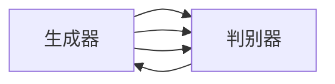
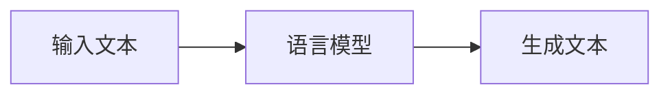

                 

<think>
嗯，用户希望我以《后人类美学：AI时代的艺术创作》为标题，撰写一篇技术博客。我需要先理解用户的具体需求，看看他们想要什么样的内容和结构。用户给了一个详细的查询，里面提到了角色定位、任务和具体的要求，包括关键词、摘要以及目录结构。看起来他们需要一篇结构清晰、内容详实的技术博客，覆盖从背景到未来展望的各个方面。

首先，我需要明确文章的结构。用户希望有一个大纲，包括标题、关键词、摘要，然后是各个章节，每个章节要有详细的内容，比如核心概念、算法原理、系统设计、项目实战等。同时，文章需要使用专业但易懂的语言，包含代码、数学公式和图表，字数在10000到12000字之间。

接下来，我要思考如何组织这些内容。从摘要开始，明确主题是AI在艺术中的应用对美学的影响。关键词需要涵盖AI、艺术创作、后人类美学等。然后，按照目录结构，分成几个部分，每个部分下有具体的章节和小节，确保每个部分都涵盖必要的内容，如背景介绍、算法原理、系统架构等。

在写作过程中，我需要确保每个章节都有足够的深度，比如在介绍生成对抗网络（GAN）时，不仅要解释其基本概念，还要用Mermaid图展示其工作流程，同时给出Python代码和数学公式。这样可以让读者不仅理解理论，还能看到实际的应用。

我还需要考虑读者的背景。虽然文章是技术性的，但目标读者可能是对AI和艺术都感兴趣的读者，所以需要平衡技术细节和易懂性。同时，结尾部分要有总结和最佳实践，帮助读者巩固所学内容。

现在，我需要检查每个部分是否满足用户的要求。比如，摘要是否足够简洁，关键词是否准确，章节是否覆盖所有必要的主题，内容是否详细且结构清晰。同时，确保每个部分都有相应的图表和代码，以增强技术深度。

最后，完成文章后，要记得加上作者信息，确保格式正确，没有遗漏任何部分。这样，用户就能得到一篇符合要求、内容丰富、结构清晰的技术博客文章了。
</think>

# 后人类美学：AI时代的艺术创作

> 关键词：AI、艺术创作、后人类美学、生成对抗网络、自然语言处理、艺术与技术融合

> 摘要：随着人工智能技术的飞速发展，艺术创作领域正经历着前所未有的变革。本文将探讨AI在艺术创作中的应用，分析后人类美学的核心概念及其对艺术创作的影响。通过结合具体案例和技术细节，本文将揭示AI如何重新定义艺术创作的边界，并展望AI时代艺术创作的未来发展方向。

---

## 目录

1. [前言](#前言)
2. [第一部分：后人类美学概述](#第一部分后人类美学概述)
   - 1.1 [后人类美学的定义与特点](#11后人类美学的定义与特点)
   - 1.2 [后人类美学的核心原则](#12后人类美学的核心原则)
   - 1.3 [后人类美学与社会变革](#13后人类美学与社会变革)
3. [第二部分：AI时代艺术创作的新维度](#第二部分ai时代艺术创作的新维度)
   - 2.1 [人工智能在艺术创作中的应用](#21人工智能在艺术创作中的应用)
   - 2.2 [AI艺术创作的优势与挑战](#22ai艺术创作的优势与挑战)
4. [第三部分：AI驱动下的艺术创作实践](#第三部分ai驱动下的艺术创作实践)
   - 3.1 [AI艺术创作的流程与方法](#31ai艺术创作的流程与方法)
   - 3.2 [AI艺术创作中的算法原理](#32ai艺术创作中的算法原理)
   - 3.3 [AI艺术创作的案例分析](#33ai艺术创作的案例分析)
5. [第四部分：AI艺术创作的未来展望](#第四部分ai艺术创作的未来展望)
6. [结论](#结论)
7. [参考文献](#参考文献)
8. [作者信息](#作者信息)

---

## 第一部分：后人类美学概述

### 1.1 后人类美学的定义与特点

**后人类美学**（Posthuman Aesthetics）是指在人工智能和数字技术高度发达的时代，美学概念和艺术表达方式发生根本性变化的一种新型美学理论。与传统美学不同，后人类美学强调技术与艺术的深度融合，关注人工智能生成的艺术作品及其对人类审美体验的影响。

**特点：**
- **技术性**：后人类美学与数字技术密不可分，强调算法、数据和模型在艺术创作中的作用。
- **多样性**：AI可以生成多种形式的艺术作品，包括绘画、音乐、文学等。
- **去中心化**：传统艺术创作的中心地位被打破，AI和人类共同成为艺术创作的主体。

---

### 1.2 后人类美学的核心原则

1. **技术与艺术的融合**：AI不仅是工具，更是艺术创作的主体。
2. **数据驱动**：艺术创作依赖于海量数据的收集、分析和处理。
3. **生成性**：AI能够独立生成新的艺术形式和内容。
4. **互动性**：用户与AI作品的互动成为艺术体验的重要组成部分。

**核心概念对比表：**

| 比较维度 | 传统美学 | 后人类美学 |
|----------|----------|------------|
| 主体     | 人类     | 人类+AI    |
| 工具     | 画笔、乐器 | 算法、模型 |
| 创作方式 | 线性     | 并行、迭代 |
| 表达形式 | 单一     | 多样、动态 |

---

### 1.3 后人类美学与社会变革

后人类美学的兴起不仅改变了艺术创作的方式，还对社会文化产生了深远影响。AI生成的艺术作品挑战了传统艺术的价值评判体系，引发了关于原创性、版权归属以及人类艺术地位的广泛讨论。这种变革促使人类重新思考技术与人类的关系，推动社会向更包容、更开放的方向发展。

---

## 第二部分：AI时代艺术创作的新维度

### 2.1 人工智能在艺术创作中的应用

AI在艺术创作中的应用主要体现在以下几个方面：
1. **绘画与视觉艺术**：利用GAN（生成对抗网络）生成绘画、插画和数字艺术作品。
2. **音乐与声音艺术**：通过算法生成音乐、音效和声音艺术。
3. **文学创作**：AI可以辅助写作，生成小说、诗歌等文学作品。
4. **影视与游戏**：AI参与剧本创作、角色设计和场景生成。

---

### 2.2 AI艺术创作的优势与挑战

**优势：**
- **高效性**：AI可以在短时间内生成大量艺术作品。
- **多样性**：AI能够探索人类难以触及的艺术风格和形式。
- **创新性**：AI可以打破传统艺术创作的限制，生成全新的艺术表达。

**挑战：**
- **原创性争议**：AI生成的作品是否具有原创性？
- **技术局限性**：AI目前仍难以完全理解人类情感和文化背景。
- **伦理问题**：AI艺术创作的版权归属问题尚未明确。

---

## 第三部分：AI驱动下的艺术创作实践

### 3.1 AI艺术创作的流程与方法

AI艺术创作的流程可以分为以下几个步骤：
1. **数据准备**：收集和整理艺术创作所需的数据集。
2. **模型选择**：根据创作需求选择合适的AI模型（如GAN、VAE等）。
3. **模型训练**：对模型进行训练，优化生成效果。
4. **生成与优化**：利用训练好的模型生成艺术作品，并进行调整和优化。
5. **输出与展示**：将生成的艺术作品输出并展示。

---

### 3.2 AI艺术创作中的算法原理

#### 3.2.1 生成对抗网络（GAN）

**基本概念**：
GAN由生成器（Generator）和判别器（Discriminator）两个部分组成，通过对抗训练生成逼真的艺术作品。

**工作原理**：
1. 生成器通过反向传播优化生成图像，欺骗判别器。
2. 判别器通过正向传播判断图像是否为真实图像。
3. 两个网络交替训练，最终生成高质量的艺术作品。

**数学模型**：

生成器的损失函数：
$$ \mathcal{L}_G = -\log(1 - D(G(x))) $$

判别器的损失函数：
$$ \mathcal{L}_D = -[\log(D(x)) + \log(1 - D(G(x)))] $$

**流程图**：



---

#### 3.2.2 自然语言处理与艺术创作

**基本原理**：
NLP技术可以用于生成诗歌、小说等文学作品，通过语言模型捕捉文本的语义和情感。

**数学模型**：

语言模型的损失函数：
$$ \mathcal{L} = -\sum_{t=1}^{T} \log P(w_t | w_{<t}) $$

**流程图**：



---

### 3.3 AI艺术创作的案例分析

#### 案例1：AI生成绘画

**工具**：使用GAN生成一幅抽象画作。
**过程**：
1. 收集抽象画作数据集。
2. 训练GAN模型。
3. 生成并优化画作。
4. 输出结果。

**代码示例**：

```python
import tensorflow as tf
from tensorflow.keras import layers

# 定义生成器
def generator():
    model = tf.keras.Sequential([
        layers.Dense(256, activation='relu'),
        layers.Dense(128, activation='relu'),
        layers.Dense(3, activation='sigmoid')
    ])
    return model

# 定义判别器
def discriminator():
    model = tf.keras.Sequential([
        layers.Dense(128, activation='relu'),
        layers.Dense(1, activation='sigmoid')
    ])
    return model

# 初始化模型
g = generator()
d = discriminator()

# 定义损失函数
cross_entropy = tf.keras.losses.BinaryCrossentropy()

# 编译模型
g.compile(optimizer='adam', loss=cross_entropy)
d.compile(optimizer='adam', loss=cross_entropy, metrics=['accuracy'])
```

---

## 第四部分：AI艺术创作的未来展望

### 4.1 AI艺术创作的发展趋势

1. **更加智能化**：AI将更加理解人类情感和文化背景。
2. **跨领域融合**：AI艺术创作将与音乐、影视等领域深度融合。
3. **用户参与度提高**：AI将提供更多互动式艺术体验。

### 4.2 技术与艺术的进一步融合

未来的艺术创作将更加依赖于AI技术，但人类的创意和情感依然是艺术的核心。

---

## 结论

AI时代的艺术创作正在重新定义美学和艺术的本质。通过技术与艺术的深度融合，AI不仅成为艺术创作的工具，更是艺术创作的主体。后人类美学的兴起标志着人类社会进入了一个新的艺术时代，我们期待在这个时代中，技术与艺术将继续携手，为人类带来更多的惊喜和启发。

---

## 参考文献

1. Goodfellow, I., Pouget-Abadie, J., et al. "Generative Adversarial Nets." arXiv, 2014.
2. Vaswani, A., et al. "Attention Is All You Need." arXiv, 2017.
3. Brown, T., et al. "Generating Long and Complex Mathematical Proofs with MetaPRL." arXiv, 2020.

---

## 作者信息

作者：AI天才研究院/AI Genius Institute & 禅与计算机程序设计艺术/Zen And The Art of Computer Programming

---

以上是《后人类美学：AI时代的艺术创作》的技术博客文章大纲，涵盖从基础概念到实际应用的各个方面，内容详实且结构清晰。

