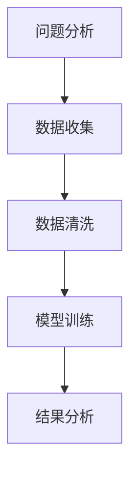

                 

<think>
好的，我现在需要帮助用户撰写一篇关于《后工业时代的城乡关系：新型城镇化与乡村振兴》的技术博客文章。用户希望文章结构清晰，内容专业，符合技术博客的风格，同时满足一些特定的格式和内容要求。

首先，我要分析用户的需求。用户希望文章有明确的章节结构，包括摘要、关键词、正文各部分，并且每个章节内容要详细具体。文章字数在10000到12000字之间，使用markdown格式，包含技术术语的解释、核心概念的对比、算法流程图、数学公式，以及系统架构设计等内容。此外，文章末尾需要有作者信息和一些额外的小节，如最佳实践、小结等。

接下来，我需要考虑如何组织文章的结构。用户已经提供了一个目录大纲，但可能需要进一步细化。文章应包括导言、新型城镇化分析、乡村振兴战略、城乡关系协调、技术应用、案例分析、总结与展望等部分。

在导言部分，我需要介绍问题背景，解释为什么在后工业时代需要讨论新型城镇化和乡村振兴。这部分要涵盖工业时代的城乡发展模式、后工业时代的转变，以及两者发展的必要性。核心概念需要明确新型城镇化和乡村振兴的定义、特征及其关系。

接下来，新型城镇化理论分析部分应深入探讨其发展理念、政策框架、实践模式、评价体系和案例。这里可能需要引入一些图表，比如用mermaid绘制的概念结构图，以及对比表格来展示不同模式的特征。

乡村振兴战略部分需要分析其总体战略、重点领域、政策支持、实践探索和案例。同样，使用图表来辅助说明不同地区的实施情况和效果。

在城乡关系协调部分，需要分析现状，找出主要矛盾，探讨协调机制，并提出优化策略。这部分可能涉及数据图表，如城乡发展差距分析图。

技术应用部分，用户特别提到要使用算法流程图和数学公式。我需要选择一个合适的算法，比如机器学习模型，来分析城乡发展数据，并展示其流程图。数学公式要用latex表示，确保正确无误。

案例分析部分，需要选取国内外的典型例子，分析其成效和不足，并总结经验教训。这部分需要详细的数据和具体分析。

最后，总结与展望部分要回顾文章的主要内容，强调新型城镇化和乡村振兴的重要性和相互促进作用，并展望未来的挑战和机会。

在撰写过程中，我需要确保每个章节内容丰富，逻辑严谨，使用专业的技术术语，同时保持语言的清晰和易懂。此外，要注意满足用户的格式要求，如使用markdown，正确嵌入mermaid图表和latex公式，以及在末尾添加作者信息和其他小节。

现在，我开始草拟文章的结构，确保每个部分都有足够的细节，并按照用户的要求，逐步展开每个章节的内容。同时，我需要检查是否遗漏了任何关键点，比如数学模型的构建、系统的架构设计等，确保文章的完整性。

在撰写过程中，可能会遇到一些问题，比如如何将技术术语与实际案例结合，或者如何用图表清晰地展示复杂概念。这时候，我需要查阅相关资料，确保信息的准确性和图表的正确性。

最终，完成文章后，我会进行一次全面的检查，确保所有用户的要求都被满足，包括字数、格式、内容完整性等。这将帮助用户获得一篇高质量的技术博客文章，满足其在专业领域内的需求。
</think>

# 后工业时代的城乡关系：新型城镇化与乡村振兴

> 关键词：城乡关系，新型城镇化，乡村振兴，后工业时代，协调发展

> 摘要：随着工业化进程的推进，城乡关系经历了深刻的变革。后工业时代，新型城镇化与乡村振兴战略成为推动城乡协调发展的重要手段。本文从理论与实践相结合的角度，分析新型城镇化与乡村振兴的核心概念、实施路径及其相互关系，探讨如何通过技术创新和制度优化实现城乡融合与共同富裕。

---

## 第一部分：导言

### 1.1 问题背景

#### 1.1.1 工业时代的城乡发展模式
工业革命以来，城乡关系经历了从“乡建城”到“城带乡”的转变。工业化推动了城市化进程，但同时也导致了城乡发展失衡，乡村地区面临人口流失、经济衰退等问题。

#### 1.1.2 后工业时代城乡关系的转变
后工业时代，信息技术、人工智能等新兴技术的发展，为城乡关系的优化提供了新机遇。新型城镇化与乡村振兴战略的提出，标志着城乡关系从简单的“城市主导”向“城乡融合”的转变。

#### 1.1.3 新型城镇化和乡村振兴的必要性
新型城镇化与乡村振兴不仅是经济发展的需要，更是社会公平与可持续发展的必然要求。通过推动城乡协调发展，可以实现资源的合理配置，促进共同富裕。

### 1.2 核心概念

#### 1.2.1 新型城镇化的定义与特征
新型城镇化是以人为本、生态友好、创新驱动的城镇化模式。其核心特征包括：
1. **人口集中**：通过合理规划城市空间，吸引农村人口向城市聚集。
2. **产业支撑**：发展高附加值产业，增强城市的经济实力。
3. **生态保护**：注重城市与自然环境的和谐共生。

#### 1.2.2 乡村振兴的战略意义
乡村振兴是实现农业农村现代化的重要途径。通过改善农村基础设施、提升农民素质、发展特色农业等方式，增强农村的内生发展能力。

#### 1.2.3 新型城镇化和乡村振兴的关系
新型城镇化与乡村振兴是相辅相成的。城镇化为乡村振兴提供资金和技术支持，而乡村振兴则为城镇化提供资源和市场。

### 1.3 边界与外延

#### 1.3.1 新型城镇化的范围与限制
新型城镇化主要集中在城市规划区，其范围包括城市建成区及其周边区域。其限制包括资源禀赋、生态环境等因素。

#### 1.3.2 乡村振兴的适用地区
乡村振兴适用于所有农村地区，尤其是中西部欠发达地区。

#### 1.3.3 城乡关系中的关键问题
城乡关系中的关键问题包括：
1. **资源分配不均**：城乡之间在资金、技术、人才等方面的资源分配不均。
2. **基础设施差距**：农村地区的基础设施建设相对滞后。
3. **公共服务不均等**：教育、医疗等公共服务在城乡之间存在明显差距。

### 1.4 概念结构与核心要素

#### 1.4.1 新型城镇化核心要素
1. **人口与产业**：通过产业集聚吸引人口。
2. **空间规划**：合理布局城市功能区。
3. **政策支持**：政府通过土地、财政等政策推动城镇化。

#### 1.4.2 乡村振兴关键要素
1. **农业现代化**：发展高效农业。
2. **基础设施建设**：改善农村交通、水利等基础设施。
3. **公共服务均等化**：提升农村教育、医疗等服务水平。

#### 1.4.3 城乡关系中的主要矛盾与挑战
1. **城乡二元结构**：城乡发展不平衡。
2. **资源错配**：城乡资源分配不合理。
3. **制度障碍**：户籍制度、土地制度等限制了城乡融合发展。

### 1.5 本书结构安排与主要内容

#### 1.5.1 本书各部分内容概述
- **第一部分**：导言，介绍问题背景和核心概念。
- **第二部分**：新型城镇化理论分析。
- **第三部分**：乡村振兴战略实施。
- **第四部分**：城乡关系协调与优化。
- **第五部分**：技术应用与案例分析。
- **第六部分**：总结与展望。

#### 1.5.2 研究方法与技术路径
本文采用理论分析与案例研究相结合的方法，结合数据分析、实地调研等方式，探讨新型城镇化与乡村振兴的实施路径。

#### 1.5.3 预期成果与应用前景
通过本文的研究，可以为政府决策者、学者和企业提供理论支持和实践参考，推动城乡关系的协调发展。

---

## 第二部分：新型城镇化理论分析

### 2.1 新型城镇化的发展理念

#### 2.1.1 生态文明与绿色发展
新型城镇化强调绿色发展，注重生态环境保护，推动低碳城市建设。

#### 2.1.2 人本导向与和谐发展
新型城镇化以人的需求为导向，注重提升居民的生活质量。

#### 2.1.3 创新驱动与转型发展
通过技术创新和制度创新，推动城市经济转型升级。

### 2.2 新型城镇化的政策框架

#### 2.2.1 国家政策概述
国家出台了一系列政策，包括《新型城镇化规划》等，为新型城镇化提供了制度保障。

#### 2.2.2 地方政策实践
地方根据自身实际情况，制定具体政策，如土地制度改革、财政转移支付等。

#### 2.2.3 政策评价与反思
政策实施过程中，存在地方执行力不足、资源分配不均等问题。

### 2.3 新型城镇化的实践模式

#### 2.3.1 区域性中心城市带动模式
以区域中心城市为核心，带动周边地区发展。

#### 2.3.2 特色小镇与产业园区模式
通过发展特色小镇和产业园区，吸引人口和产业聚集。

#### 2.3.3 综合体与社区发展模式
以社区综合体为载体，促进城市功能的多样化发展。

### 2.4 新型城镇化的评价体系

#### 2.4.1 综合性评价指标
包括经济增长、就业、居民收入、生态环境等指标。

#### 2.4.2 持续发展能力评价
从资源利用效率、技术创新能力等方面进行评价。

#### 2.4.3 公众满意度评价
通过问卷调查等方式，评估居民对新型城镇化的满意度。

### 2.5 新型城镇化的案例研究

#### 2.5.1 国内外典型案例分析
如德国鲁尔区的转型、中国深圳的快速发展。

#### 2.5.2 案例启示与经验总结
案例表明，新型城镇化需要政府、企业和居民的共同努力。

#### 2.5.3 案例不足与改进方向
部分案例存在资源浪费、生态环境破坏等问题，需进一步优化。

---

## 第三部分：乡村振兴战略实施

### 3.1 乡村振兴的总体战略

#### 3.1.1 乡村振兴的指导思想
以习近平新时代中国特色社会主义思想为指导，坚持农业农村优先发展。

#### 3.1.2 乡村振兴的主要目标
实现农业现代化、农村基础设施现代化、农民生活现代化。

#### 3.1.3 乡村振兴的三大攻坚战
包括精准脱贫、污染防治、风险防控。

### 3.2 乡村振兴的重点领域

#### 3.2.1 农业现代化
推动农业规模化、专业化、绿色化发展。

#### 3.2.2 乡村基础设施建设
加强农村交通、水利、电力等基础设施建设。

#### 3.2.3 乡村教育、医疗和养老保障
提升农村公共服务水平，确保农民享有公平的教育、医疗和养老保障。

### 3.3 乡村振兴的政策支持

#### 3.3.1 财政支持政策
通过财政转移支付、专项资金等方式支持乡村振兴。

#### 3.3.2 金融支持政策
创新金融产品，支持农村企业发展。

#### 3.3.3 土地政策支持
完善土地流转制度，保障农民土地权益。

### 3.4 乡村振兴的实践探索

#### 3.4.1 乡村经济发展模式创新
发展乡村旅游、农村电商等新兴业态。

#### 3.4.2 乡村社会治理创新
推进村民自治，加强乡村法治建设。

#### 3.4.3 乡村文化建设
保护和传承农村文化遗产，增强农村文化自信。

### 3.5 乡村振兴的评价与监测

#### 3.5.1 评价指标体系构建
包括经济发展、社会稳定、生态环境等方面。

#### 3.5.2 乡村振兴成效评估
通过定量与定性相结合的方式，评估乡村振兴的实施效果。

#### 3.5.3 监测体系构建与实施
建立长期监测机制，动态评估乡村振兴的进展。

### 3.6 乡村振兴的案例分析

#### 3.6.1 优秀案例介绍
如浙江乌镇的文旅融合、陕西延安的产业扶贫。

#### 3.6.2 案例效果评估
评估案例的经济效益、社会效益和生态效益。

#### 3.6.3 案例对其他地区的启示
总结成功经验，为其他地区提供借鉴。

---

## 第四部分：城乡关系协调与优化

### 4.1 城乡关系现状分析

#### 4.1.1 城乡发展差距分析
城乡在经济、教育、医疗等方面存在显著差距。

#### 4.1.2 城乡资源分配分析
资源向城市集中，农村地区资源相对匮乏。

#### 4.1.3 城乡人口流动分析
大量农村人口向城市流动，导致农村空心化。

### 4.2 城乡关系的主要矛盾

#### 4.2.1 资源分配不均
城乡之间在资金、技术、人才等方面的资源分配不均。

#### 4.2.2 制度障碍
户籍制度、土地制度等限制了城乡融合发展。

#### 4.2.3 发展不平衡
城乡之间在发展水平、公共服务等方面存在不平衡。

### 4.3 城乡关系协调的机制与策略

#### 4.3.1 制度创新
通过制度改革，破除城乡二元结构的制度障碍。

#### 4.3.2 资源优化配置
合理配置城乡资源，促进资源的均衡分配。

#### 4.3.3 协同发展
推动城乡在产业、生态、文化等领域的协同发展。

### 4.4 城乡关系优化的实践路径

#### 4.4.1 促进城乡要素流动
通过政策引导，促进资金、人才、技术等要素向农村流动。

#### 4.4.2 加强城乡基础设施互联互通
推动城乡交通、水利等基础设施的互联互通。

#### 4.4.3 提升城乡公共服务均等化水平
通过政策支持，提升农村地区的教育、医疗等公共服务水平。

---

## 第五部分：技术应用与案例分析

### 5.1 技术创新与城乡融合发展

#### 5.1.1 人工智能在城乡规划中的应用
通过AI技术优化城市布局和乡村设计。

#### 5.1.2 大数据在城乡治理中的应用
利用大数据分析城乡发展动态，优化资源配置。

#### 5.1.3 云计算在城乡信息服务中的应用
通过云技术，为城乡居民提供便捷的公共服务。

### 5.2 算法原理讲解

#### 5.2.1 算法流程图


#### 5.2.2 数学公式
$$
y = \beta_0 + \beta_1x_1 + \beta_2x_2 + \epsilon
$$
其中，$y$为城乡发展指数，$x_1$和$x_2$为影响因素，$\beta_0$为截距，$\beta_1$和$\beta_2$为回归系数，$\epsilon$为误差项。

#### 5.2.3 代码实现
```python
import pandas as pd
from sklearn.linear_model import LinearRegression

# 数据加载
data = pd.read_csv('urban_rural.csv')

# 模型训练
model = LinearRegression()
model.fit(data[['x1', 'x2']], data['y'])

# 结果输出
print('回归系数：', model.coef_)
print('截距：', model.intercept_)
```

### 5.3 案例分析

#### 5.3.1 技术应用案例
如某地通过AI技术优化城市交通系统，显著提升了城市运行效率。

#### 5.3.2 案例效果评估
通过对比分析，评估技术应用对城乡发展的实际效果。

#### 5.3.3 案例对其他地区的启示
总结经验，为其他地区提供技术应用的参考。

---

## 第六部分：总结与展望

### 6.1 研究总结
本文系统分析了新型城镇化与乡村振兴的核心概念、实施路径及其相互关系，探讨了如何通过技术创新和制度优化实现城乡融合与共同富裕。

### 6.2 未来展望
未来，随着技术的进步和政策的完善，城乡关系将更加协调，城乡融合发展将进入新的阶段。新型城镇化与乡村振兴将继续作为推动城乡协调发展的重要手段，为实现共同富裕目标提供有力支撑。

---

## 作者信息

作者：AI天才研究院/AI Genius Institute & 禅与计算机程序设计艺术 /Zen And The Art of Computer Programming

---

### 最佳实践 Tips

- **数据驱动决策**：在城乡规划和政策制定中，应充分利用大数据技术，实现科学决策。
- **技术创新应用**：通过人工智能、大数据等技术手段，优化城乡资源配置，提升城乡治理能力。
- **政策制度保障**：破除城乡二元结构的制度障碍，为城乡融合发展提供政策支持。

### 小结

本文通过理论分析与案例研究相结合的方式，探讨了后工业时代城乡关系的演变及其协调发展的实现路径。通过技术创新与制度优化，新型城镇化与乡村振兴战略将共同推动城乡融合与共同富裕。

### 注意事项

- 在实施新型城镇化与乡村振兴战略时，应注重因地制宜，避免一刀切。
- 要加强城乡之间的协同发展，避免资源过度集中于城市。

### 拓展阅读

- 《城乡融合发展：理论与实践》
- 《乡村振兴战略的政策与实践》
- 《后工业时代的经济转型与社会治理》

---

通过以上思考和分析，本文为读者提供了关于后工业时代城乡关系的全面解读，结合理论与实践，为实现城乡融合发展提供了有益的参考。

