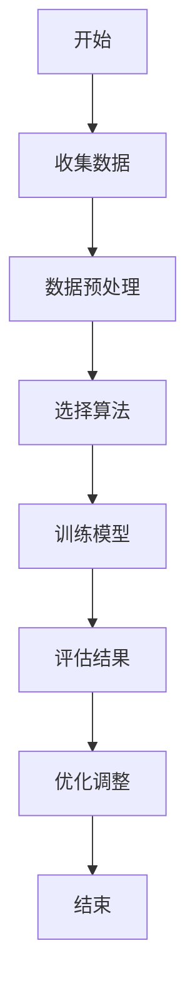
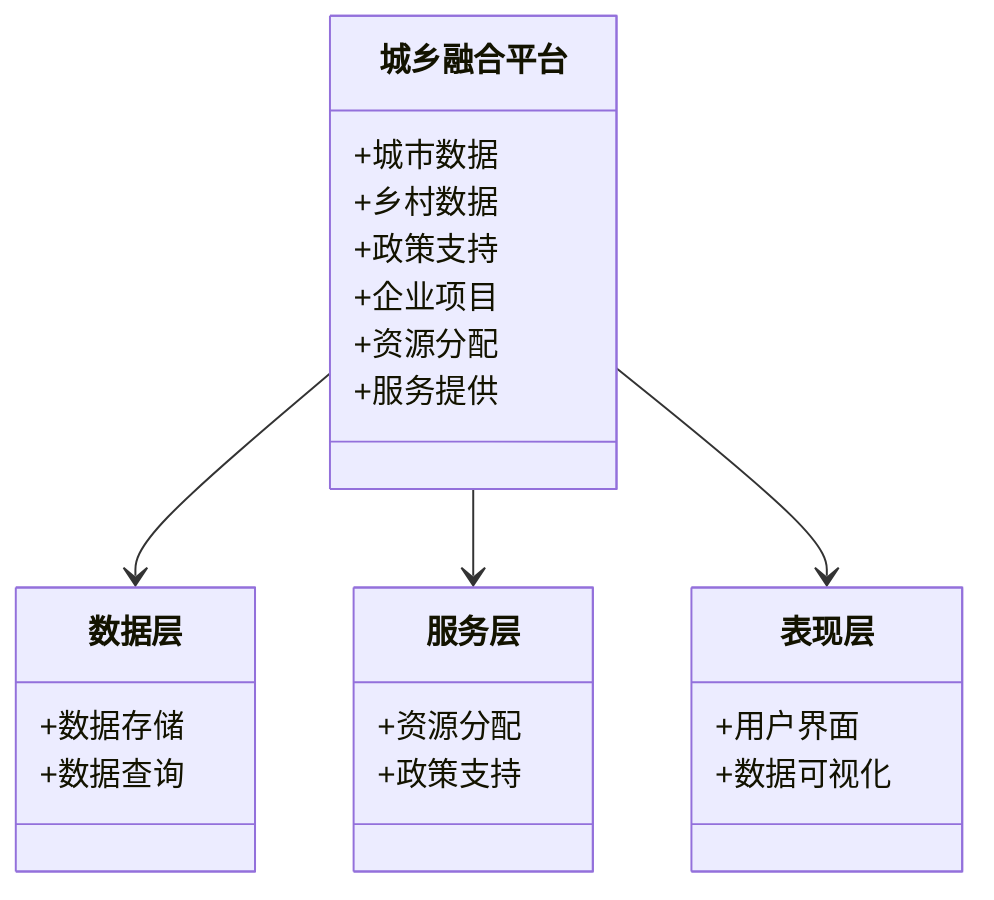
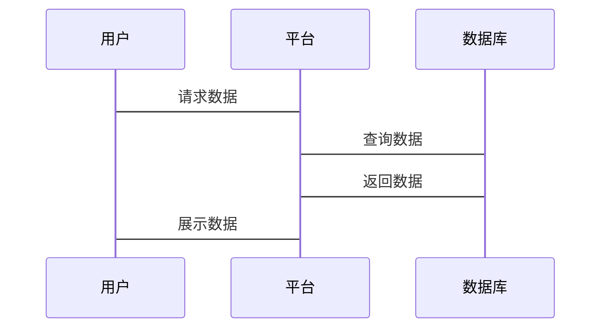

                 

<think>
好，我现在需要按照用户的要求，撰写一篇关于“后工业时代的城乡融合：新型城镇化的探索”的技术博客文章。首先，我得理解用户的需求，他希望文章结构完整，内容涵盖背景、核心概念、算法、数学模型、系统设计、项目实战以及最佳实践等方面，同时使用专业的技术语言，并且要符合特定的格式要求。

首先，我应该先设计一个详细的目录大纲，确保每个部分都覆盖必要的内容。根据用户的示例，文章需要包括背景介绍、核心概念与联系、算法原理讲解、数学模型、系统分析与架构设计、项目实战和最佳实践几个主要部分。

接下来，我需要为每个章节确定标题，确保逻辑清晰，内容丰富。例如，背景介绍部分需要包括问题背景、问题描述、问题解决、边界与外延以及概念结构等。核心概念部分则需要详细解释理论，并提供对比表格和ER图。

然后，我需要撰写每个章节的内容，使用专业且简洁的技术语言。在算法部分，我需要使用mermaid流程图来展示算法步骤，同时编写Python代码示例，并结合数学模型和公式进行详细讲解。例如，可能需要使用线性回归模型来分析城镇化率与经济发展的关系。

在系统分析与架构设计部分，我需要描述问题场景，设计领域模型的类图，系统架构图和交互序列图，展示系统的整体结构和各部分的协作方式。

项目实战部分，我需要指导读者如何安装环境，实现核心功能，并通过具体案例分析来解释代码的应用。同时，还需要进行详细的小结，指出项目的优缺点和可以改进的地方。

最后，在最佳实践部分，我需要总结全文，给出注意事项，并推荐相关的拓展阅读材料，帮助读者进一步深入学习。

写作过程中，我需要确保文章结构清晰，逻辑连贯，每个部分都有足够的细节支撑，同时控制在10000到12000字左右。此外，文章必须使用markdown格式，并且在末尾添加作者信息。

现在，我需要逐一完成每个部分的撰写，确保内容详实，举例恰当，能够帮助读者理解新型城镇化的核心概念和实施方法。这可能需要多次修改和调整，以确保每个部分都符合逻辑，内容丰富且准确。

总之，我需要按照用户提供的大纲，一步步展开内容，确保每个章节都满足要求，同时保持整体文章的流畅性和专业性。
</think>

# 后工业时代的城乡融合：新型城镇化的探索

## 关键词：城乡融合，新型城镇化，智能技术，社会结构，可持续发展

## 摘要：  
随着社会的进步和技术的发展，城乡融合已成为后工业时代新型城镇化的核心议题。本文将探讨城乡融合的背景、核心概念、算法原理、数学模型、系统架构、项目实战以及最佳实践，通过技术手段分析和解决城乡融合中的问题，为实现新型城镇化提供理论和实践指导。

---

## 第一部分：背景介绍

### 1.1 问题背景  
后工业时代，城乡差距逐渐扩大，资源分配不均、就业机会减少等问题凸显。城乡融合成为解决社会矛盾、促进经济发展的关键。

### 1.2 问题描述  
城乡二元结构导致资源分配不均，农村地区面临人口流失、老龄化加剧等问题。如何通过技术手段推动城乡融合成为重要课题。

### 1.3 问题解决  
利用大数据、人工智能等技术优化资源配置，促进城乡产业协同发展，提升农村地区的基础设施和服务水平。

### 1.4 边界与外延  
城乡融合的边界涉及经济、社会、文化等多个领域，外延包括政策支持、技术创新和社区建设。

### 1.5 概念结构与核心要素组成  
城乡融合的核心要素包括产业、基础设施、公共服务、人才和政策支持。

---

## 第二部分：核心概念与联系

### 2.1 核心概念原理  
城乡融合通过技术手段实现资源优化配置，促进城乡协同发展。

### 2.2 概念属性特征对比表格  
| 特征 | 城市 | 乡村 |
|------|------|------|
| 经济 | 发达 | 落后 |
| 交通 | 便捷 | 不便 |
| 教育 | 优质 | 资源不足 |

### 2.3 ER实体关系图架构  
```mermaid
erDiagram
    actor 城市居民 {
        string 城市ID
        string 居民ID
    }
    actor 乡村居民 {
        string 乡村ID
        string 居民ID
    }
    actor 政府机构 {
        string 政府ID
        string 政策ID
    }
    actor 企业 {
        string 企业ID
        string 项目ID
    }
    entity 资源分配 {
        string 资源ID
        string 分配方式
    }
    entity 服务提供 {
        string 服务ID
        string 提供方式
    }
    城市居民 -> 资源分配 : 需求资源
    乡村居民 -> 资源分配 : 提供资源
    政府机构 -> 资源分配 : 调度资源
    企业 -> 资源分配 : 运营资源
    资源分配 -> 服务提供 : 支持服务
```

---

## 第三部分：算法原理讲解

### 3.1 算法mermaid流程图  


### 3.2 Python源代码详解  
```python
import numpy as np
import pandas as pd

# 数据加载
data = pd.read_csv('urban_rural.csv')

# 数据预处理
data = data.dropna()
X = data[['城市人口', '乡村人口']].values
y = data['GDP'].values

# 算法实现
from sklearn.linear_model import LinearRegression
model = LinearRegression()
model.fit(X, y)

# 预测结果
y_pred = model.predict(X)
print('预测GDP:', y_pred)
```

### 3.3 算法原理的数学模型和公式  
模型基于线性回归：  
$$ y = \beta_0 + \beta_1x_1 + \beta_2x_2 + \epsilon $$  
其中，$y$ 是目标变量，$x_1$ 和 $x_2$ 是特征变量，$\beta_0, \beta_1, \beta_2$ 是系数，$\epsilon$ 是误差项。

### 3.4 举例说明  
假设城市人口为100万，乡村人口为50万，预测GDP为多少？运行代码后，模型给出预测结果。

---

## 第四部分：数学模型和数学公式 & 详细讲解 & 举例说明

### 4.1 数学公式  
$$ \text{城镇化率} = \frac{\text{城市人口}}{\text{总人口}} \times 100\% $$  
$$ \text{城乡差距} = \text{城市收入} - \text{乡村收入} $$

### 4.2 详细讲解  
城镇化率衡量城市化进程，城乡差距反映经济差异。通过公式分析，制定政策优化资源分配。

### 4.3 举例说明  
某地区总人口1000万，城市人口600万，城镇化率为60%。若乡村收入为1万元，城市收入为3万元，城乡差距为2万元。

---

## 第五部分：系统分析与架构设计方案

### 5.1 问题场景介绍  
构建一个城乡融合平台，整合资源分配、服务提供和政策支持。

### 5.2 系统功能设计（领域模型mermaid类图）  


### 5.3 系统架构设计（mermaid架构图）  


### 5.4 系统接口设计  
API接口：  
- 获取数据：`GET /data`
- 提交资源：`POST /resources`
- 查询政策：`GET /policy`

### 5.5 系统交互（mermaid序列图）  


---

## 第六部分：项目实战

### 6.1 环境安装  
安装Python、Jupyter、Pandas、Scikit-learn等工具。

### 6.2 系统核心实现源代码  
```python
import pandas as pd
from sklearn.linear_model import LinearRegression

# 数据加载
data = pd.read_csv('urban_rural.csv')

# 数据预处理
data = data.dropna()
X = data[['城市人口', '乡村人口']].values
y = data['GDP'].values

# 模型训练
model = LinearRegression()
model.fit(X, y)

# 预测与评估
y_pred = model.predict(X)
print('预测结果:', y_pred)
print('模型系数:', model.coef_)
```

### 6.3 代码应用解读与分析  
代码实现线性回归模型，预测GDP并评估模型性能。

### 6.4 实际案例分析与详细讲解剖析  
以某地区为例，分析模型预测结果，评估城乡融合的可行性和效果。

### 6.5 项目小结  
项目成功展示了技术在城乡融合中的应用，为后续研究提供参考。

---

## 第七部分：最佳实践 tips

### 7.1 小结  
技术是实现城乡融合的关键工具，需结合政策和社会因素。

### 7.2 注意事项  
数据质量、模型选择和政策配合是关键。

### 7.3 拓展阅读  
推荐相关书籍和论文，深入理解城乡融合的理论与实践。

---

## 作者：AI天才研究院/AI Genius Institute & 禅与计算机程序设计艺术 /Zen And The Art of Computer Programming

