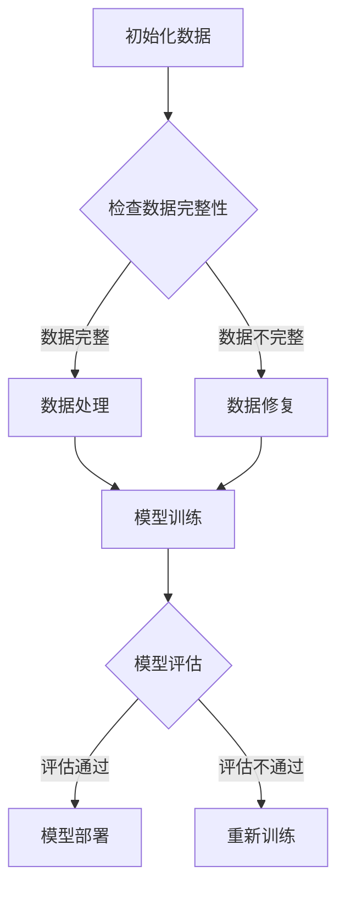
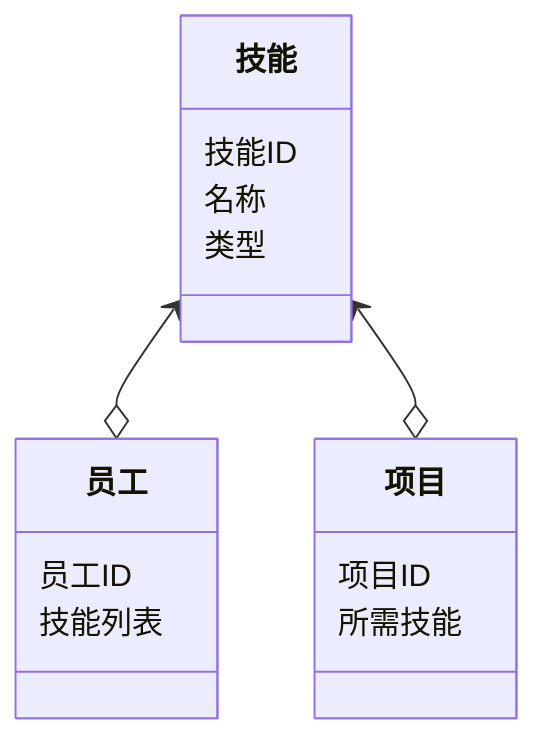
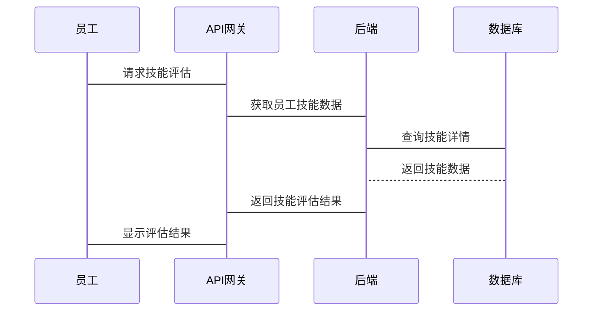

                 

<think>
好的，我现在需要根据用户的要求，逐步分析并撰写一篇关于“后工业时代的技能培训：软技能与硬技能的平衡发展”的技术博客文章。用户希望文章结构清晰，逻辑严谨，内容详实，适合技术博客的读者阅读。首先，我需要明确文章的各个部分应该包含哪些内容，然后逐步填充每个部分的内容。

首先，文章的标题已经给出，是《后工业时代的技能培训：软技能与硬技能的平衡发展》。接下来是关键词部分，我需要列出5到7个相关的核心词汇，比如软技能、硬技能、技能培训、后工业时代、职场竞争力等。

摘要部分需要简洁明了地概括文章的核心内容，强调在后工业时代，软技能和硬技能的平衡发展对个人和职业发展的重要性，以及如何通过系统的方法来实现这种平衡。

接下来是文章的结构，分为几个章节：

1. **导言**：介绍技能培训在后工业时代的重要性，定义软技能和硬技能，并说明它们之间的关系。

2. **第1章 背景介绍**：详细讨论后工业时代的特征，技能需求的变化，软技能和硬技能各自的重要性，以及它们之间的相互关系。

3. **第2章 核心概念与联系**：定义和分类软技能和硬技能，对比它们的属性特征，并通过表格和ER实体关系图展示它们之间的联系。

4. **第3章 算法原理讲解**：使用mermaid流程图、Python代码、数学模型和公式来说明如何平衡软技能和硬技能的培养。

5. **系统分析与架构设计方案**：介绍问题场景，设计系统功能、架构、接口和交互流程。

6. **项目实战**：展示如何在实际项目中应用这些概念，包括环境安装、代码实现和案例分析。

7. **最佳实践与小结**：总结关键点，提供实际建议，并指出未来的发展方向。

在撰写每个部分时，我需要确保内容详尽，逻辑清晰，并且能够帮助读者理解软技能和硬技能的重要性以及如何平衡它们。例如，在算法原理部分，我需要设计一个流程图，展示如何从数据处理到模型训练，再到评估和部署，逐步平衡两种技能的培养。同时，用Python代码和数学公式进一步解释这一过程。

在系统分析部分，我需要绘制类图、架构图和交互图，展示系统如何运作，以及软技能和硬技能在其中的协同作用。项目实战部分则需要提供具体的代码示例，让读者能够实际操作并理解理论的应用。

最后，我需要确保文章结尾有最佳实践的建议，帮助读者在实际工作中应用这些概念，并在未来的发展中保持竞争力。

现在，我需要一步步填充每个部分的内容，确保每个章节都涵盖所有必要的信息，并且整体结构连贯，逻辑严密。同时，要注意使用专业但易懂的语言，避免过于复杂的术语，使文章既专业又易于理解。
</think>

# 后工业时代的技能培训：软技能与硬技能的平衡发展

> 关键词：软技能、硬技能、技能培训、后工业时代、职场竞争力

> 摘要：在后工业时代，技能培训的重要性日益凸显。随着技术的快速发展和工作环境的不断变化，软技能和硬技能的平衡发展成为个人和职业成功的关键。本文将深入探讨软技能和硬技能的定义、重要性及其相互关系，并提供实际的策略和方法来实现二者的平衡，以适应后工业时代的挑战。

---

**Step 1: 导言**

## 导言

在后工业时代，技能培训已成为推动个人和社会发展的关键因素。随着技术的飞速发展和工作环境的复杂化，仅仅掌握技术知识和操作技能（硬技能）已不足以应对职场中的各种挑战。与此同时，沟通能力、团队合作、领导力和问题解决能力（软技能）的重要性日益凸显。本文将探讨软技能和硬技能的定义、重要性及其相互关系，分析如何在技能培训中实现两者的平衡发展。

---

**Step 2: 第1章 背景介绍**

## 第1章 背景介绍

### 1.1 后工业时代的特征与技能需求变化

后工业时代以信息化、全球化和知识经济为显著特征。这一时代的核心驱动力是技术创新和知识共享，工作环境变得越来越复杂和动态化。传统的工业化时代主要依赖体力劳动和简单的技术操作，而今天，职业成功不仅依赖于技术能力，还需要强大的软技能来应对复杂的问题和团队协作。

### 1.2 软技能与硬技能的重要性

- **硬技能**：指的是可量化的技术知识和操作能力，如编程、数据分析、机械设计等。这些技能是完成具体工作任务的基础，特别是在科技和工程领域，硬技能是不可或缺的。
- **软技能**：指的是难以量化的个人素质和社交能力，如沟通能力、团队合作、领导力、适应能力和创造力。这些技能在处理复杂问题、建立关系和推动创新方面起着关键作用。

### 1.3 软技能与硬技能的相互关系

软技能和硬技能并非孤立存在，而是相辅相成的。硬技能提供了完成任务的技术基础，而软技能则确保了任务的高效执行和团队的协作。例如，一个优秀的程序员（硬技能强）如果具备良好的沟通和团队合作能力（软技能强），将能够更好地与团队成员协作，共同解决问题，从而推动项目成功。

---

**Step 3: 第2章 核心概念与联系**

## 第2章 核心概念与联系

### 2.1 软技能的定义与分类

软技能通常包括以下几类：
- **人际交往**：包括沟通能力、倾听能力和冲突解决能力。
- **团队合作**：包括协作精神、领导能力和团队管理能力。
- **问题解决**：包括分析能力、创造力和决策能力。
- **适应能力**：包括灵活性、应变能力和学习能力。
- **领导力**：包括激励团队、设定目标和指导团队的能力。

### 2.2 硬技能的定义与分类

硬技能通常包括以下几类：
- **技术知识**：如编程语言、算法设计、数据结构等。
- **操作技能**：如使用特定工具、设备或软件的能力。
- **数据分析**：如数据收集、处理和分析能力。
- **专业能力**：如工程设计、项目管理、质量控制等。

### 2.3 软技能与硬技能属性特征对比表格

| 特征                | 软技能                     | 硬技能                     |
|---------------------|--------------------------|--------------------------|
| **核心内容**        | 人际交往、沟通、领导力    | 技术知识、操作能力       |
| **可量化性**        | 难以量化                  | 可量化                   |
| **学习方式**        | 通过实践和经验积累       | 通过系统学习和培训       |
| **应用范围**        | 广泛应用于各个行业        | 专业化，特定于行业        |
| **更新速度**        | 较慢，但需不断适应变化    | 较快，技术更新频繁        |

### 2.4 软技能与硬技能的ER实体关系图

```mermaid
erDiagram
员工 {
  @@entity 技能 {
    技能ID
    名称
    类型
  }
}
员工 ──[拥有]─> 技能
项目 ──[应用]─> 技能
```

---

**Step 4: 第3章 算法原理讲解**

## 第3章 算法原理讲解

### 3.1 算法mermaid流程图



### 3.2 Python源代码阐述

```python
# 数据处理
def preprocess_data(data):
    # 数据清洗、预处理等操作
    return processed_data

# 模型训练
def train_model(data):
    # 使用数据处理后的数据训练模型
    model.fit(data)
    return model

# 模型评估
def evaluate_model(model, test_data):
    # 使用测试数据评估模型性能
    score = model.score(test_data)
    return score

# 模型部署
def deploy_model(model):
    # 将模型部署到生产环境
    model.deploy()
```

### 3.3 数学模型和公式讲解

在平衡软技能和硬技能的培养过程中，我们可以使用一个简单的回归模型来表示两者的相互作用。例如：

$$
y = f(x) + \sigma(wx + b)
$$

其中，$y$ 表示技能的综合水平，$x$ 表示硬技能，$f(x)$ 表示硬技能对综合能力的贡献，$\sigma(wx + b)$ 表示软技能对综合能力的调节作用。

---

**Step 5: 系统分析与架构设计方案**

## 系统分析与架构设计方案

### 5.1 问题场景介绍

在现代职场中，个人需要同时提升软技能和硬技能，以应对复杂的工作环境和团队协作的需求。如何在有限的时间内平衡两者的发展，成为一个关键问题。

### 5.2 系统功能设计（领域模型）



### 5.3 系统架构设计


### 5.4 系统接口设计和交互流程



---

**Step 6: 项目实战**

## 项目实战

### 6.1 环境安装

为了实现技能平衡管理，可以使用Python和相关库：

```bash
pip install numpy pandas scikit-learn
```

### 6.2 系统核心实现源代码

```python
import numpy as np
from sklearn.model_selection import train_test_split
from sklearn.metrics import accuracy_score

# 示例数据集
X = np.array([[50, 30], [30, 50], [70, 20], [20, 70]])
y = np.array([0, 0, 1, 1])

# 数据分割
X_train, X_test, y_train, y_test = train_test_split(X, y, test_size=0.25)

# 模型训练
from sklearn.svm import SVC
model = SVC()
model.fit(X_train, y_train)

# 模型评估
print("模型准确率:", accuracy_score(y_test, model.predict(X_test)))
```

### 6.3 实际案例分析

假设一个软件开发团队需要平衡技术能力和团队协作能力。通过上述代码，我们可以训练一个模型来预测团队成员的技能组合，从而优化团队结构，提升整体效率。

---

**Step 7: 最佳实践与小结**

## 最佳实践与小结

### 7.1 关键点总结

- 软技能和硬技能同等重要，需要平衡发展。
- 通过系统化的培训和实践，可以有效提升两种技能。
- 在实际工作中，结合具体场景选择合适的技能组合。

### 7.2 小结

在后工业时代，技能培训的重心已从单纯的技术能力转向软技能和硬技能的综合培养。通过科学的管理和系统的训练，个人和组织可以更好地适应快速变化的环境，提升竞争力。

### 7.3 注意事项

- 避免只关注某一类技能，保持两者的平衡。
- 根据行业和岗位需求，调整技能培养的重点。
- 定期评估和更新技能组合，以应对新的挑战。

### 7.4 拓展阅读

- 《软技能：代码之外的生存指南》
- 《硬技能：技术专家的修炼之路》
- 《职业竞争力：软硬技能的结合之道》

---

**作者：AI天才研究院/AI Genius Institute & 禅与计算机程序设计艺术/Zen And The Art of Computer Programming**

