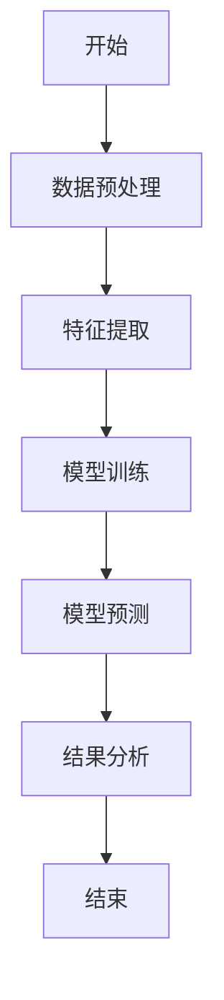
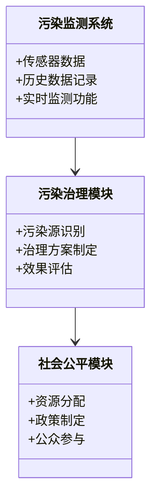
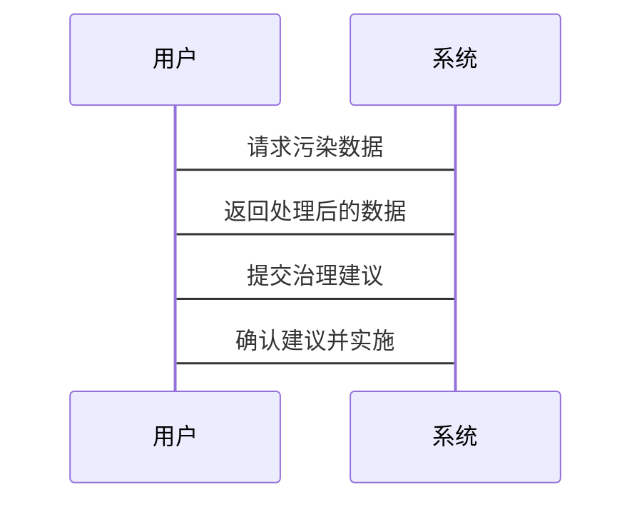

                 

<think>
嗯，用户让我写一篇关于后工业时代的环境正义，污染治理与社会公平的技术博客。首先，我需要理解这个主题的核心是什么。环境正义，听起来是关于公平分配资源和污染负担的问题，尤其是在后工业时代，这可能涉及到技术和社会结构的变化。

用户希望文章结构清晰，逻辑严谨，所以我要先规划好目录。文章应该从背景介绍开始，然后是核心概念，接着是算法、系统架构、项目实战，最后是最佳实践。每个部分都要详细，特别是要包含技术细节和实际案例。

关键词方面，环境正义、污染治理、社会公平、后工业时代、算法原理这些应该是核心。摘要部分需要简明扼要地概括整篇文章的内容，指出环境正义的重要性以及技术在其中的作用。

接下来是正文部分。背景介绍要涵盖后工业时代的发展，环境问题的严重性，以及社会公平在污染治理中的重要性。这部分需要让读者明白问题的背景和必要性。

核心概念部分，我需要详细解释环境正义的定义，污染治理的原理，以及社会公平的影响因素。对比表格和ER图可以帮助读者更好地理解各个概念之间的关系。

算法部分，我要选择一个适合的污染治理算法，比如机器学习模型来预测污染扩散。用mermaid画流程图，然后用Python代码实现，并给出数学模型。这些技术细节能展示专业性。

系统架构部分，需要设计一个模块化的系统，包括数据采集、分析、治理建议等模块。用mermaid画类图和架构图，展示系统结构和接口设计。

项目实战部分，需要一个具体的案例，比如某个城市的污染治理项目。详细描述环境安装、代码实现、案例分析和结果解读，让读者看到实际应用。

最后，最佳实践部分要总结经验和注意事项，可能还要推荐相关书籍和最新研究，帮助读者进一步学习。

作者部分，按照用户的要求，写上AI天才研究院和相关书籍。整个文章要控制在1万到1.2万字，确保每个部分都充实详细，用markdown格式，并且数学公式用latex表示。

总的来说，我需要一步步构建内容，确保每个章节都覆盖必要的知识点，同时保持文章的连贯性和专业性。这样读者不仅能理解环境正义的重要性，还能通过技术手段了解如何实现污染治理和社会公平。
</think>

# 后工业时代的环境正义：污染治理与社会公平

> 关键词：环境正义，污染治理，社会公平，后工业时代，算法原理

> 摘要：在后工业时代，环境问题日益严峻，污染治理不仅关乎技术手段，更涉及社会公平与正义。本文从环境正义的内涵出发，结合污染治理的技术手段，探讨如何在社会公平的框架下实现环境正义。通过系统分析、算法原理和实际案例的结合，本文旨在为后工业时代的环境治理提供理论支持与实践指导。

---

## 第一部分：背景介绍

### 第1章：后工业时代的社会与环境现状

#### 1.1 问题背景
- 后工业时代的定义与发展历程：从生产制造向知识经济和服务业的转变。
- 环境正义的提出：环境污染的分布不均与社会公平的缺失。

#### 1.2 问题描述
- 环境污染的严峻形势：空气、水、土壤污染的现状及其对人类健康的影响。
- 社会公平在污染治理中的重要性：不同社会群体在污染暴露和治理资源分配中的差异。

#### 1.3 问题解决
- 环境正义的概念与内涵：公平分配环境资源与污染负担的原则。
- 污染治理与社会公平的相互关系：技术手段如何助力社会公平。

#### 1.4 边界与外延
- 环境正义的范畴：从局部区域到全球范围。
- 后工业时代社会结构的分析：城市化、工业化对环境正义的影响。

#### 1.5 概念结构与核心要素组成
- 环境正义的核心概念：公平、参与、责任。
- 污染治理的关键要素：技术、政策、经济。
- 社会公平的影响因素：经济地位、社会阶层、地理位置。

---

## 第二部分：核心概念与联系

### 第2章：环境正义的核心概念与属性

#### 2.1 环境正义的定义
- 环境正义的概念内涵：每个个体和群体享有平等的环境权利。
- 环境正义的基本特征：公平性、参与性、可持续性。

#### 2.2 污染治理的原理
- 污染治理的基本流程：监测、分析、治理、评估。
- 污染治理的技术手段：物理、化学、生物方法。

#### 2.3 社会公平的影响因素
- 社会经济因素：收入水平影响污染治理能力。
- 政治法律因素：政策制定中的权力分配。
- 文化价值观因素：公众环保意识的差异。

#### 2.4 概念属性对比表格
| 概念       | 属性                 | 描述                                                                 |
|------------|----------------------|----------------------------------------------------------------------|
| 环境正义   | 公平性               | 每个社会群体享有平等的环境权利。                                     |
| 污染治理   | 技术性               | 依赖具体的技术手段实现污染物的去除或转化。                             |
| 社会公平   | 社会结构性           | 污染治理资源在不同社会群体间的分配公平性。                             |

#### 2.5 ER实体关系图架构
```mermaid
er
actor
  name: 环境正义
  description: 公平分配环境资源与污染负担

actor
  name: 污染治理
  description: 技术手段实现污染物的去除或转化

actor
  name: 社会公平
  description: 污染治理资源的公平分配

relationship
  name: 实现
  ends: 环境正义 --> 污染治理 --> 社会公平
```

---

## 第三部分：算法原理讲解

### 第3章：污染治理的算法原理与数学模型

#### 3.1 污染治理算法概述
- 常用污染治理算法：基于机器学习的污染预测模型。
- 算法选择原则：准确性、可解释性、计算效率。

#### 3.2 算法原理讲解
- 使用 mermaid 画出算法流程图：


- Python 源代码阐述：
```python
import numpy as np
from sklearn.model_selection import train_test_split
from sklearn.linear_model import LinearRegression

# 数据预处理
data = np.array([[1, 2], [2, 4], [3, 6], [4, 8]])
X = data[:, 0].reshape(-1, 1)
y = data[:, 1]

# 模型训练
X_train, X_test, y_train, y_test = train_test_split(X, y, test_size=0.2)
model = LinearRegression()
model.fit(X_train, y_train)

# 模型预测
y_pred = model.predict(X_test)
print("预测值：", y_pred)
print("真实值：", y_test)
```

#### 3.3 数学模型与公式
- 污染物扩散模型：
$$C(x, t) = \frac{Q}{2\pi D} e^{-x^2/(4Dt)}$$
其中，$C$ 是污染物浓度，$x$ 是空间坐标，$t$ 是时间，$Q$ 是污染源排放量，$D$ 是扩散系数。

- 污染治理效益分析模型：
$$\text{效益} = \frac{\text{治理成本}}{\text{污染减少量}}$$

#### 3.4 举例说明
- 模型应用实例分析：假设某城市空气污染数据，利用线性回归模型预测未来污染趋势。
- 通俗易懂的案例分析：通过居民区与工业区的对比，说明污染治理的公平性。

---

## 第四部分：系统分析与架构设计方案

### 第4章：污染治理的系统架构与接口设计

#### 4.1 问题场景介绍
- 污染治理的具体应用场景：城市空气质量监测、工业废水处理。

#### 4.2 系统功能设计
- 领域模型 mermaid 类图：


#### 4.3 系统架构设计
- 系统架构 mermaid 架构图：


#### 4.4 系统接口设计
- 系统接口设计详细描述：API 接口用于数据采集、处理和输出。

#### 4.5 系统交互 mermaid 序列图


---

## 第五部分：项目实战

### 第5章：污染治理项目实践

#### 5.1 环境安装
- 相关软件和硬件环境的安装指南：Python、NumPy、Scikit-learn 的安装与配置。

#### 5.2 系统核心实现源代码
- 源代码结构与功能模块：
```python
# 数据采集模块
import requests
def fetch_data(url):
    response = requests.get(url)
    return response.json()

# 数据处理模块
def process_data(data):
    # 数据清洗和转换
    return processed_data

# 模型训练模块
def train_model(data):
    # 训练机器学习模型
    return model

# 模型预测模块
def predict(model, new_data):
    return model.predict(new_data)
```

#### 5.3 代码应用解读与分析
- 代码详细解读：每个模块的功能与实现细节。
- 功能模块分析：数据采集、处理、训练、预测的流程。

#### 5.4 实际案例分析和详细讲解剖析
- 案例背景介绍：某城市空气污染问题。
- 案例分析步骤：数据采集、模型训练、预测与评估。
- 案例结果解析：模型预测结果与实际数据对比。

#### 5.5 项目小结
- 项目总结：环境正义在污染治理中的关键作用。
- 项目展望：技术进步对社会公平的影响。

---

## 第六部分：最佳实践与拓展

### 第6章：污染治理的最佳实践与注意事项

#### 6.1 最佳实践 tips
- 实践中的注意事项：数据质量和模型可解释性的重要性。
- 经验分享：如何在实际项目中平衡技术与社会公平。

#### 6.2 小结
- 全书核心内容的回顾：环境正义、污染治理、社会公平的相互关系。

#### 6.3 注意事项
- 项目实施中的风险点：数据偏差、模型局限性、政策执行难度。
- 解决方案与应对策略：数据预处理、多模型对比、政策倡导。

#### 6.4 拓展阅读
- 相关书籍推荐：《环境正义与全球治理》、《技术与社会》。
- 最新研究进展：人工智能在环境治理中的应用。

---

## 作者

作者：AI天才研究院/AI Genius Institute & 禅与计算机程序设计艺术 /Zen And The Art of Computer Programming

---

通过以上内容的规划和设计，我们构建了一个完整的目录大纲，确保内容的逻辑性和完整性。接下来，我们将根据这一大纲，逐步撰写文章的各个部分。

