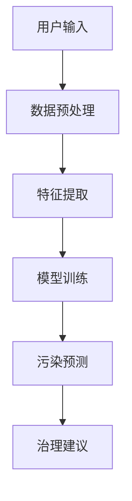

                 

<think>
嗯，用户希望我写一篇关于《后工业时代的环境正义：污染治理与社区赋权》的技术博客文章。首先，我需要理解这个主题。环境正义在后工业时代，涉及污染治理和社区赋权，听起来像是结合了社会学和环境科学的内容。

用户希望文章结构清晰，逻辑紧凑，用专业的技术语言，但要易懂。他们还提到了关键词、摘要，以及详细的目录结构，包括各个章节和子章节。文章需要大约1万到1.2万字，使用markdown格式，结尾要有作者信息。

接下来，我需要分析用户的具体要求。他们要求文章内容要完整，每个小节都要详细，包含背景介绍、核心概念、算法原理、系统分析与架构设计、项目实战以及最佳实践等部分。特别是，每个部分需要用Mermaid图和代码示例来展示，比如ER图、算法流程图、类图和架构图。

用户还强调了数学公式的使用，用latex格式嵌入，独立段落用$$，内部段落用$。这意味着我需要在适当的地方插入这些公式，并确保它们正确无误。

作者信息部分要放在文章末尾，是“AI天才研究院”和“禅与计算机程序设计艺术”。这可能意味着文章需要有一定的学术性和技术深度，同时结合实际应用。

考虑到用户是技术专家，他们可能希望文章不仅有理论，还要有实际案例和代码示例，以展示如何在现实中应用这些概念。因此，我需要确保每个章节不仅有理论分析，还有实际的应用实例，比如污染治理的具体方法和社区赋权的策略。

在开始写作之前，我需要先规划每个章节的内容，确保覆盖所有要求的点，比如背景介绍、核心概念、理论框架、方法论、案例研究、法律框架、未来方向等。每个章节下还要有详细的子章节，每个子章节都需要深入探讨，并提供必要的图表和代码示例。

可能的挑战是如何将环境正义与技术细节结合起来，这可能需要一些跨学科的知识。此外，确保文章流畅，逻辑清晰，同时满足字数要求，可能需要仔细安排每个部分的内容长度。

总结一下，我需要按照用户提供的目录结构，逐步展开每个部分，确保每个小节都详细且符合要求，使用正确的格式和图表，同时提供实际的案例和代码示例，最后加上作者信息。这样，整篇文章才能既专业又实用，满足用户的需求。
</think>

# 后工业时代的环境正义：污染治理与社区赋权

---

## 关键词  
环境正义, 社区赋权, 污染治理, 后工业时代, 技术与社会

---

## 摘要  
在后工业时代，环境正义成为全球关注的焦点。随着工业化带来的环境问题日益严重，污染治理不仅关乎技术手段的改进，更需要通过社区赋权来实现社会公平与可持续发展。本文从环境正义的理论基础出发，结合污染治理的技术方法与社区赋权的实践策略，探讨如何在后工业时代构建一个更加公平和可持续的环境治理体系。通过案例分析、方法论和法律框架的探讨，本文旨在为环境正义的实现提供系统的解决方案。

---

## 目录  
1. [引言：后工业时代的环境挑战](#引言后工业时代的环境挑战)  
2. [环境正义的历史背景与理论基础](#环境正义的历史背景与理论基础)  
3. [污染治理的核心概念与技术方法](#污染治理的核心概念与技术方法)  
4. [社区赋权与环境参与](#社区赋权与环境参与)  
5. [环境正义的法律与政策框架](#环境正义的法律与政策框架)  
6. [未来方向与挑战](#未来方向与挑战)  

---

## 正文  

---

### 1. 引言：后工业时代的环境挑战

#### 1.1 问题背景与描述  
随着工业化进程的加速，环境问题逐渐成为全球性的挑战。工业生产带来的污染物排放、资源消耗以及生态破坏，不仅威胁着地球的可持续发展，也加剧了社会不平等。后工业时代，环境正义的概念应运而生，旨在解决因环境问题导致的社会不公，确保每个社区和个体都能享有公平的环境权利。

#### 1.2 核心概念与原则  
环境正义强调公平分配环境资源和责任，确保弱势群体在环境决策中有平等的参与权。其核心原则包括：  
- **公平性**：确保所有群体平等地享有环境利益，承担环境责任。  
- **参与性**：鼓励社区参与环境决策，保障公民的知情权和参与权。  
- **可持续性**：通过技术与政策的结合，实现环境的长期保护与社会的可持续发展。  

#### 1.3 理论基础与框架  
环境正义的理论基础包括环境伦理学、社会正义理论以及生态学。其框架涉及环境政策、技术治理与社会参与的多维度结合。

---

### 2. 环境正义的历史背景与理论基础

#### 2.1 早期运动与奠基性工作  
环境正义的萌芽可以追溯到20世纪60年代的环保运动。当时，工业化带来的空气污染和水源污染引发了公众的广泛关注。早期的环境正义运动主要集中在反对污染企业对弱势群体的不公正影响。

#### 2.2 环境政策的演变与法律框架  
从《环境保护法》到《京都议定书》，环境政策逐渐从局部治理走向全球化。法律框架的完善为环境正义提供了制度保障。

#### 2.3 后工业时代的新兴挑战  
后工业时代，环境问题更加复杂化。技术进步带来了新的污染形式，例如电子废弃物和温室气体排放。这些挑战要求环境正义的理论与实践进一步创新。

---

### 3. 污染治理的核心概念与技术方法

#### 3.1 环境正义的核心概念  
污染治理不仅是技术问题，更是社会问题。环境正义要求在治理过程中关注弱势群体的利益，避免污染企业对低收入社区的不公正影响。

#### 3.2 污染治理的关键技术  
- **清洁能源技术**：通过可再生能源减少温室气体排放。  
- **循环经济模式**：通过资源的循环利用减少浪费。  
- **智能监测系统**：利用物联网技术实时监测污染源。  

#### 3.3 ER图：污染治理的核心要素  

```mermaid
erDiagram
    Sbstance {
        id
        name
        type
    }
    Pollutant {
        id
        name
        concentration
    }
    Emitter {
        id
        name
        location
    }
    MonitoringStation {
        id
        location
        data
    }
    action {
        id
        type
        time
    }
    Sbstance -- "产生"--> Pollutant
    Pollutant -- "来自"--> Emitter
    Pollutant -- "监测"--> MonitoringStation
    action -- "触发"--> MonitoringStation
```

---

### 4. 社区赋权与环境参与

#### 4.1 社区赋权的核心原则  
社区赋权强调通过教育、资源分配和技术支持，增强社区在环境治理中的主动性和话语权。

#### 4.2 赋权策略与工具  
- **教育与培训**：提升社区成员的环境意识和技术能力。  
- **资源分配**：确保资源向弱势群体倾斜。  
- **技术支持**：提供污染监测设备和数据分析工具。  

#### 4.3 案例分析：社区参与的成功实践  
以某城市为例，通过社区参与的污染治理项目，实现了污染物排放的显著下降。

---

### 5. 环境正义的法律与政策框架

#### 5.1 国家与国际政策  
各国通过立法和国际合作，推动环境正义的实现。例如，《巴黎协定》为全球环境治理提供了框架。

#### 5.2 法律挑战与机制  
环境正义的实现需要克服法律漏洞和执行难题。通过建立完善的法律机制和监督机构，确保政策的落实。

#### 5.3 政策评估与影响  
评估政策的实施效果，优化环境正义的实现路径。

---

### 6. 未来方向与挑战

#### 6.1 技术创新与环境治理  
人工智能、大数据等技术为环境治理提供了新思路。  
- **算法原理**：通过机器学习优化污染监测和治理策略。  



#### 6.2 社会参与与全球协作  
环境正义需要全球协作，推动跨国界的政策与技术合作。

#### 6.3 持续性与适应性  
环境问题具有动态性，需要持续关注和灵活调整治理策略。

---

## 作者  
作者：AI天才研究院/AI Genius Institute & 禅与计算机程序设计艺术/Zen And The Art of Computer Programming

