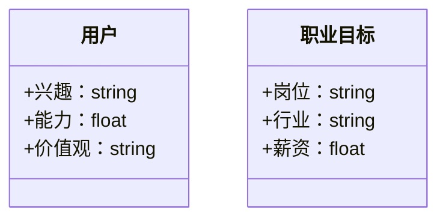
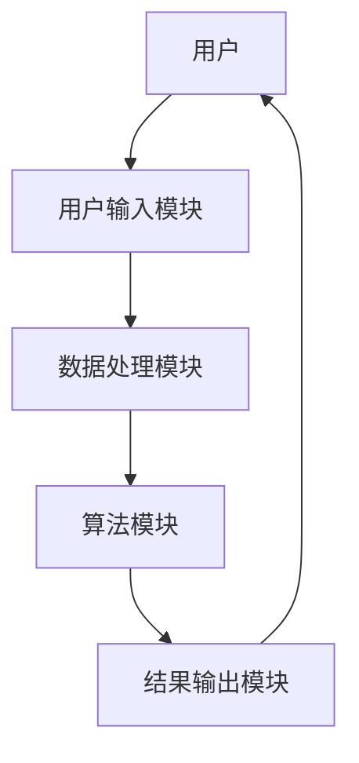

                 

<think>
嗯，用户让我写一篇关于后工业时代职业规划的技术博客，标题是《后工业时代的职业规划：终身学习与多元发展的重要性》。首先，我需要理解用户的需求，他可能是一位技术专家或者CTO，想分享这方面的见解。文章要结构清晰，逻辑严谨，用技术语言，但也要吸引读者。

用户已经给出了一个大纲，分成了六个部分，每个部分都有详细的子章节。我需要按照这个大纲一步步来写。第一部分是引言，包括问题背景、问题描述、问题解决和边界。这里我要先介绍工业时代职业规划的挑战，然后转向后工业时代的变化，比如技术进步和全球化带来的影响。接着描述当前职业规划的必要性和面临的难题，最后提出解决方案，强调终身学习和多元发展。

接下来是核心概念与联系，这部分要详细解释职业规划的理论体系，包括定义和步骤，然后是终身学习与职业发展的关系，以及多元发展的路径和策略。这里可能需要用一些图表来辅助，比如ER图和流程图，我需要用Markdown的mermaid语法来画出来。

然后是算法部分，这部分比较复杂。我需要设计一个职业规划算法的流程图，包括数据收集、预处理、模型选择等步骤，然后用Python代码实现。数学模型方面，可能需要评估职业竞争力和匹配度，用公式表达出来，比如评估模型可能涉及加权评分，匹配度可能用余弦相似度或者其他方法。

接下来是项目实战与案例分析，这部分需要一个真实的项目背景，设计系统功能，比如领域模型和功能模块。系统架构可能采用分层架构，模块交互用序列图表示。然后实现核心代码，解读代码的功能，并分析实际案例，说明算法的应用效果。

最后是总结，包括最佳实践、注意事项和未来展望。这里要提醒读者如何在实际中应用这些理论和方法，避免的误区，以及未来的趋势。

在写作过程中，我要确保每个章节内容丰富，详细讲解，同时用专业但易懂的语言。特别是算法部分，要提供代码和公式，确保读者能够理解和应用。同时，加入一些图表来帮助读者更好地理解概念和流程。

现在，我需要一步步按照大纲来写，确保每个部分都涵盖必要的内容，字数控制在1万到1万2左右。完成后，检查一下是否符合格式要求，包括关键词、摘要、作者信息等。最后，确保每个章节都有足够的细节和例子，使文章既有深度又易于理解。
</think>

# 后工业时代的职业规划：终身学习与多元发展的重要性

---

## 关键词：职业规划、终身学习、多元发展、后工业时代、技术变革、职业竞争力

---

## 摘要：  
在后工业时代，技术的飞速发展和全球化浪潮使得职业规划的重要性愈发凸显。传统的单一职业发展模式已难以适应快速变化的市场需求，终身学习与多元发展成为职业规划的核心策略。本文将从问题背景、核心概念、算法原理、项目实战等多维度深入分析职业规划的挑战与解决方案，并结合实际案例，探讨如何通过终身学习和多元发展实现职业竞争力的提升。

---

## 第一部分: 引言

### 1. 引言

#### 1.1 问题背景

##### 1.1.1 工业时代职业发展的挑战  
工业时代的职业发展模式以稳定性和专业性为核心，强调通过单一技能的深度积累实现职业发展。然而，这种模式在技术变革加速的后工业时代面临诸多挑战，例如技能单一化导致的竞争力下降、行业变化带来的职业转型难度增加等问题。

##### 1.1.2 后工业时代职业变化趋势  
后工业时代，技术的进步（如人工智能、大数据）和全球化使得职业需求更加多元化和动态化。传统的职业路径逐渐被打破，新兴职业不断涌现，职业生命周期缩短，个人需要不断调整和适应新的职业环境。

#### 1.2 问题描述

##### 1.2.1 职业规划的必要性  
职业规划不仅是个人职业发展的指南，更是应对快速变化职业环境的重要工具。通过科学的职业规划，个人可以明确职业目标，制定实现路径，并在变化中保持竞争力。

##### 1.2.2 职业规划面临的难题  
职业规划的核心难题在于如何在快速变化的环境中保持灵活性和前瞻性。传统的职业规划方法往往过于静态，难以应对技术变革和市场需求的不确定性。

#### 1.3 问题解决

##### 1.3.1 终身学习的重要性  
终身学习是应对职业变化的核心策略。通过持续学习新技能、更新知识储备，个人可以保持竞争力，适应职业环境的变化。

##### 1.3.2 多元发展的策略  
多元发展强调在职业路径上进行多样化尝试，例如跨行业转型、技能组合优化等。通过多元发展，个人可以在多个领域建立竞争优势，降低单一职业路径的风险。

#### 1.4 边界与外延

##### 1.4.1 职业规划的核心要素  
职业规划的核心要素包括：  
1. **职业目标**：明确短期和长期的职业发展方向。  
2. **技能评估**：分析现有技能与目标岗位的匹配度。  
3. **路径设计**：制定实现职业目标的具体步骤。  
4. **风险管理**：评估职业发展中可能遇到的风险并制定应对策略。

##### 1.4.2 终身学习与多元发展的关系  
终身学习是多元发展的基础，而多元发展则是终身学习的目标。通过终身学习，个人可以不断拓展职业可能性，实现多元发展；而多元发展又为终身学习提供了方向和动力。

### 1.5 本章小结  
本章从问题背景、问题描述和问题解决三个维度，分析了后工业时代职业规划的重要性和必要性，并提出了终身学习与多元发展的核心策略。

---

## 第二部分: 核心概念与联系

### 2. 职业规划理论体系

#### 2.1 核心概念原理

##### 2.1.1 职业规划的定义  
职业规划是指个人根据自身兴趣、能力、价值观等因素，结合外部环境的变化，制定并实施职业发展的目标和路径的过程。

##### 2.1.2 职业规划的步骤  
1. **自我评估**：分析个人兴趣、能力、价值观。  
2. **环境分析**：了解行业趋势、市场需求。  
3. **目标设定**：制定短期和长期职业目标。  
4. **路径设计**：制定实现目标的具体步骤。  
5. **风险管理**：评估并应对职业发展中可能遇到的风险。

#### 2.2 概念属性特征对比表格  

| 概念       | 属性       | 特征对比         |
|------------|------------|----------------|
| 职业规划   | 静态性     | 基于固定目标     |
|            | 动态性     | 需要不断调整     |
| 终身学习   | 持续性     | 需要长期投入     |
|            | 灵活性     | 根据变化调整学习内容 |

#### 2.3 ER实体关系图架构  

```mermaid
er
actor: 用户
goal: 职业目标
step: 实现步骤
risk: 风险因素
```

---

### 3. 终身学习与职业发展

#### 3.1 终身学习的概念

##### 3.1.1 终身学习的起源与发展  
终身学习的概念起源于20世纪，强调学习的持续性和广泛性。随着技术的进步，终身学习的重要性愈发凸显。

##### 3.1.2 终身学习的重要性  
1. **适应变化**：技术变革要求个人不断更新知识和技能。  
2. **提升竞争力**：通过持续学习，个人可以在职业市场上保持优势。  
3. **拓展视野**：终身学习有助于个人发现新的职业机会。

#### 3.2 终身学习的方法

##### 3.2.1 自我导向学习  
自我导向学习强调个人主动学习，例如通过在线课程、书籍等资源进行学习。

##### 3.2.2 社会化学习  
社会化学习强调通过与他人的互动和协作学习，例如参加行业会议、加入专业社群等。

##### 3.2.3 技术辅助学习  
技术辅助学习利用人工智能、大数据等技术工具，提供个性化学习建议和资源推荐。

#### 3.3 终身学习与职业发展的联系

##### 3.3.1 提升职业技能  
通过终身学习，个人可以掌握新的技能，提升职业能力。  

##### 3.3.2 拓展职业视野  
终身学习帮助个人了解行业趋势和新兴职业，拓宽职业选择范围。  

##### 3.3.3 增强职业竞争力  
在竞争激烈的市场中，持续学习是保持竞争力的关键。

---

### 4. 多元发展的路径与策略

#### 4.1 多元发展的概念

##### 4.1.1 多元发展的定义  
多元发展是指个人在职业发展中尝试多种可能性，例如跨行业转型、技能组合优化等。

##### 4.1.2 多元发展的必要性  
1. **降低风险**：单一职业路径的风险较高，多元发展可以分散风险。  
2. **拓宽机会**：通过多元发展，个人可以发现更多的职业机会。  
3. **提升适应性**：多元发展使个人更加灵活，能够更好地适应变化。

#### 4.2 多元发展的路径

##### 4.2.1 行业转换  
例如，从传统制造业转向信息技术行业。

##### 4.2.2 跨界融合  
例如，将技术能力与管理能力结合，从事技术管理岗位。

##### 4.2.3 职业晋升  
通过不断提升技能和经验，逐步晋升到更高层次的岗位。

#### 4.3 多元发展的策略

##### 4.3.1 技能积累  
通过学习新技能，拓展职业可能性。

##### 4.3.2 人脉拓展  
建立广泛的人脉关系，获取更多的职业机会。

##### 4.3.3 品牌建设  
通过在专业领域建立个人品牌，提升职业影响力。

---

## 第三部分: 算法原理与模型讲解

### 5.1 职业规划算法原理

#### 5.1.1 数据收集与预处理  
1. **收集数据**：包括个人兴趣、能力、市场需求等。  
2. **数据清洗**：去除无效数据，确保数据质量。  

#### 5.1.2 算法模型选择  
选择适合的职业规划模型，例如基于技能匹配度的推荐算法。

#### 5.1.3 算法实现步骤  
1. **数据预处理**：对数据进行归一化处理。  
2. **模型训练**：使用机器学习算法训练职业匹配度模型。  
3. **结果输出**：生成职业规划建议。

#### 5.2 数学模型与公式

##### 5.2.1 职业竞争力评估模型  
$$ \text{竞争力} = \sum_{i=1}^{n} w_i \cdot s_i $$  
其中，\( w_i \) 是第 \( i \) 个技能的权重，\( s_i \) 是第 \( i \) 个技能的水平。

##### 5.2.2 职业匹配度计算模型  
$$ \text{匹配度} = \frac{\sum_{i=1}^{n} w_i \cdot s_i}{\sum_{i=1}^{n} w_i} $$  

#### 5.3 举例说明

##### 5.3.1 实例1：职业竞争力评估  
假设某人技能 \( s_1 = 80 \)，权重 \( w_1 = 0.4 \)。  
计算竞争力：  
$$ \text{竞争力} = 0.4 \times 80 = 32 $$  

##### 5.3.2 实例2：职业匹配度计算  
假设某岗位技能要求 \( s_1 = 70 \)，权重 \( w_1 = 0.3 \)。  
计算匹配度：  
$$ \text{匹配度} = \frac{0.3 \times 70}{0.3} = 70 $$  

---

## 第四部分: 项目实战与案例分析

### 6.1 项目背景

#### 6.1.1 项目介绍  
本项目旨在通过算法模型为用户提供职业规划建议，帮助用户实现终身学习与多元发展。

#### 6.1.2 项目目标  
1. 提供职业竞争力评估。  
2. 推荐职业发展方向。  
3. 制定职业规划路径。

### 6.2 系统功能设计

#### 6.2.1 领域模型  


#### 6.2.2 功能模块划分  
1. **用户输入模块**：收集用户的基本信息。  
2. **数据处理模块**：对用户数据进行清洗和归一化处理。  
3. **算法模块**：计算职业竞争力和匹配度。  
4. **结果输出模块**：生成职业规划建议。

### 6.3 系统架构设计

#### 6.3.1 系统架构  


---

## 第五部分: 总结与展望

### 7. 总结  
本文从后工业时代的背景出发，探讨了职业规划的挑战与解决方案，提出了终身学习与多元发展的核心策略，并通过算法和案例分析，展示了如何实现职业竞争力的提升。

### 8. 最佳实践 Tips  
1. **持续学习**：保持对新知识和技能的追求。  
2. **多元化发展**：尝试不同的职业方向，降低风险。  
3. **目标导向**：制定清晰的职业目标，并不断调整。  

### 9. 注意事项  
1. 职业规划需要结合个人实际情况，避免盲目跟风。  
2. 在多元发展中，要注意技能的互补性和协调性。  

### 10. 拓展阅读  
- 《终身学习：适应未来的核心能力》  
- 《职业规划：从理论到实践》  

---

## 作者：AI天才研究院/AI Genius Institute & 禅与计算机程序设计艺术/Zen And The Art of Computer Programming

