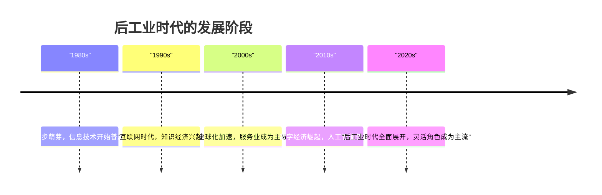
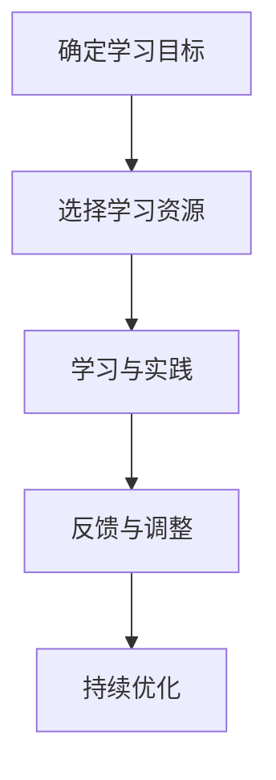

                 

<think>
嗯，用户希望我写一篇关于后工业时代职业认同转变的博客文章。首先，我需要理解用户的需求。他是一位技术专家，想以专业的技术语言写一篇结构清晰、有深度的文章。

我得先确定文章的结构，按照用户给的大纲来。标题已经定了，是《后工业时代的职业认同：从固定岗位到灵活角色的转变》。接下来是关键词和摘要，这部分要简洁明了，概括文章的核心内容。

然后是各章节的内容，每个章节都要详细展开。引言部分需要引入话题，说明文章的目的和重要性。后工业时代的背景介绍要涵盖发展历程、特点以及对职业的影响，这部分可能需要一些历史和经济的知识。

职业认同的概念和特点部分，要定义职业认同，分析其重要性和特点，比如专业性、社会认同等。这部分需要逻辑清晰，用例子来说明。

接下来是固定岗位到灵活角色的转变，分析两者的特点和转变的原因与挑战。这部分可能涉及企业结构的变化和个人适应的问题。

灵活角色的培养与适应需要具体策略，比如跨学科学习、持续更新知识，以及个人素质的要求。这部分可以引用一些成功案例来支持论点。

职业发展的新路径部分，可以探讨跨领域发展、创业和自由职业的可能性，以及职业身份的多元化。这部分需要分析新的就业模式和机会。

实战案例部分，选择几个典型的案例进行分析，总结经验和教训。最后的总结与展望，回顾全文，展望未来职业发展的趋势，并给出建议。

在写作过程中，我需要确保每个部分都包含背景介绍、核心概念、原理讲解和实战案例。特别是要使用技术术语，但保持语言简洁易懂。可能还需要加入一些数学公式或图表，但用户这次没有特别要求，所以先不考虑。

另外，用户强调文章要有深度，所以每个章节都要详细分析，避免泛泛而谈。最后，作者信息要放在末尾，符合格式要求。

总的来说，我需要一步步按照大纲填充内容，确保逻辑连贯，内容详实，满足用户的要求。
</think>

# 后工业时代的职业认同：从固定岗位到灵活角色的转变

## 关键词
后工业时代，职业认同，固定岗位，灵活角色，职业转型，职业发展

## 摘要
在后工业时代，职业认同正在经历一场深刻的变革。传统的固定岗位模式逐渐被灵活角色所取代，这不仅是技术进步和经济变革的结果，更是个体与组织适应新时代需求的必然选择。本文将从后工业时代背景出发，深入分析职业认同的概念、特点以及从固定岗位向灵活角色转变的动因、挑战与策略。通过具体案例的分析，探讨灵活角色的培养与适应、职业发展的新路径以及未来职业发展的趋势。

---

## 第1章 引言

### 1.1 引言
后工业时代，社会的生产方式、组织形式和价值观念正在发生深刻的变化。在这种背景下，职业认同的传统模式——固定岗位——逐渐暴露出其局限性。个体的职业发展不再局限于单一组织或岗位，而是向更灵活、多元的方向转变。这种转变不仅是技术进步和经济变革的结果，更是个体对自身价值实现的更高追求。本文将从后工业时代的职业认同入手，探讨从固定岗位到灵活角色的转变过程，并为读者提供实践指导。

---

## 第2章 后工业时代背景介绍

### 2.1 后工业时代的发展历程
后工业时代是指社会从传统的制造业经济向知识经济、服务经济和数字经济转型的阶段。这一阶段始于20世纪末，随着信息技术的快速发展，全球化和知识经济的兴起，社会的生产方式和组织形式发生了根本性的变化。

#### 图2-1 后工业时代的发展阶段

### 2.2 后工业时代的主要特点
后工业时代的主要特点包括：
1. **知识密集型**：知识和技能成为最重要的生产要素。
2. **服务主导**：服务业在经济中的比重显著增加。
3. **数字化转型**：信息技术和数字化工具成为生产和服务的核心。
4. **灵活性与不确定性**：个体和组织面临更多的不确定性和变化。

#### 图2-2 后工业时代的经济结构变化

### 2.3 后工业时代对职业的影响
后工业时代对职业的影响主要体现在以下几个方面：
1. **职业角色的变化**：传统固定岗位逐渐被灵活角色取代。
2. **职业安全感的挑战**：个体需要不断适应变化，保持竞争力。
3. **跨领域需求的增长**：职业发展需要跨领域知识和技能。

---

## 第3章 职业认同的概念和特点

### 3.1 职业认同的定义
职业认同是指个体对自己职业角色、职责和价值的内在认同和外在表现。它不仅包括对职业目标的追求，还包括对职业行为和态度的自我认知。

#### 表3-1 职业认同的构成要素
| 要素 | 描述 |
|------|------|
| 职业目标 | 个体在职业发展中追求的具体目标 |
| 职业行为 | 个体在职业活动中的具体行动和表现 |
| 职业态度 | 个体对职业工作的情感和价值判断 |

### 3.2 职业认同的重要性
职业认同对个人和组织都具有重要意义：
1. **对个人**：职业认同影响个体的职业满意度、工作表现和职业发展。
2. **对组织**：职业认同强的员工更容易与组织目标一致，提高组织效率和凝聚力。

### 3.3 职业认同的特点
职业认同具有以下特点：
1. **专业性**：职业认同与个体的专业知识和技能密切相关。
2. **社会认同**：职业认同受到社会文化、行业规范的影响。
3. **价值认同**：职业认同与个体的价值观和职业目标密切相关。

---

## 第4章 固定岗位到灵活角色的转变

### 4.1 固定岗位的定义与特点
固定岗位是指个体在特定组织中担任固定职责和任务的工作模式。其特点是：
1. **稳定性**：工作内容和职责相对固定，个体安全感较高。
2. **依赖性**：个体的职业发展依赖于特定组织的岗位需求。

#### 表4-1 固定岗位的优缺点
| 优点 | 缺点 |
|------|------|
| 稳定性高 | 创新性不足 |
| 职责明确 | 适应性差 |
| 依赖性低 | 职业发展空间有限 |

### 4.2 灵活角色的定义与特点
灵活角色是指个体在不同组织或项目中担任多种角色，以适应变化和需求的工作模式。其特点是：
1. **多样性**：个体可以根据需求调整角色和职责。
2. **适应性**：灵活角色能够快速适应变化和挑战。
3. **自主性**：个体在职业发展中具有较高的自主权。

#### 表4-2 灵活角色的优缺点
| 优点 | 缺点 |
|------|------|
| 多元性高 | 不安全感增加 |
| 适应性强 | 资源支持不足 |
| 自主性高 | 团队协作难度大 |

### 4.3 转变的动因与挑战

#### 4.3.1 转变的动因
1. **技术变革**：人工智能和自动化技术的应用，使得传统岗位逐渐消失。
2. **经济转型**：服务业和知识经济的兴起，需要更多灵活的角色。
3. **个体需求变化**：个体追求更灵活、多元的职业发展。

#### 4.3.2 挑战与应对
1. **个人技能挑战**：灵活角色需要多样化的技能，个体需要不断学习和更新。
2. **组织结构调整**：传统组织结构需要向更灵活的模式转型。

---

## 第5章 灵活角色的培养与适应

### 5.1 灵活角色的培养策略
1. **跨学科学习**：通过学习不同领域的知识，增强适应能力。
2. **持续更新知识**：保持对新技术和新趋势的敏感性。
3. **培养创新思维**：通过创新解决问题，适应变化。

#### 图5-1 灵活角色的培养流程

### 5.2 适应灵活角色的个人素质
1. **学习能力**：快速学习新知识和技能的能力。
2. **适应能力**：在变化环境中保持稳定的能力。
3. **沟通能力**：与不同角色和组织协作的能力。

### 5.3 职业教育的作用
1. **职业教育的现状**：传统职业教育模式难以适应灵活角色的需求。
2. **发展方向**：职业教育需要更加注重实践能力、跨领域知识和创新能力的培养。

---

## 第6章 职业发展的新路径

### 6.1 跨领域发展
1. **可能性**：个体可以在不同领域之间跨界发展，寻找新的职业机会。
2. **案例**：某技术专家从IT行业转向教育行业，担任技术培训师。

### 6.2 创业与自由职业
1. **创业**：个体可以利用自身技能和知识，创办企业或提供服务。
2. **自由职业**：通过灵活就业平台，承接短期项目或任务。

### 6.3 职业身份的多元化
1. **多元身份**：个体可以同时担任多个角色，如技术专家、创业者、教育者等。
2. **案例**：某程序员在开发项目的同时，兼任技术培训讲师。

---

## 第7章 实战案例与案例分析

### 7.1 案例选择与描述
1. **案例1**：某互联网公司员工从固定岗位转向灵活角色，成为自由职业者。
2. **案例2**：某技术专家通过跨界发展，成为行业知名的咨询顾问。

### 7.2 案例分析
1. **案例1分析**：自由职业的优势在于时间灵活、收入多样化，但需要较强的自我管理能力和市场敏感性。
2. **案例2分析**：跨界发展需要个体具备跨领域知识和经验，同时需要较强的人际交往能力和资源整合能力。

### 7.3 案例启示
1. **灵活角色的优势**：适应性强、职业发展空间广。
2. **挑战**：需要个体具备较高的自主性和适应能力。

---

## 第8章 总结与展望

### 8.1 总结
后工业时代，职业认同正在从固定岗位向灵活角色转变。这种转变不仅是技术进步和经济变革的结果，更是个体对职业发展新需求的响应。灵活角色的培养和适应需要个体具备跨领域知识、创新思维和较强的适应能力。

### 8.2 未来职业发展的趋势
1. **数字化与智能化**：人工智能和大数据将推动职业发展的新趋势。
2. **跨领域与多元化**：职业身份的多元化将成为主流。
3. **终身学习**：持续学习和更新知识将成为职业发展的关键。

### 8.3 对读者的建议
1. **拥抱变化**：积极适应后工业时代的职业变革。
2. **持续学习**：不断提升自身技能和知识。
3. **探索新路径**：尝试跨领域发展和灵活角色，寻找职业发展的新机会。

---

## 作者
作者：AI天才研究院/AI Genius Institute  
作者：禅与计算机程序设计艺术/Zen And The Art of Computer Programming

