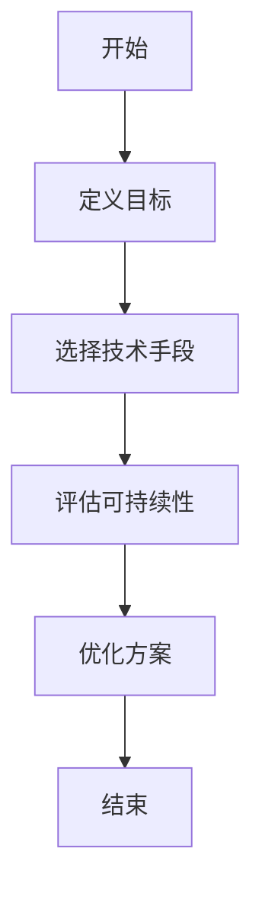
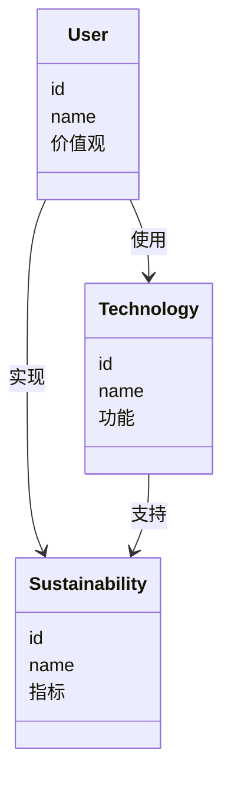
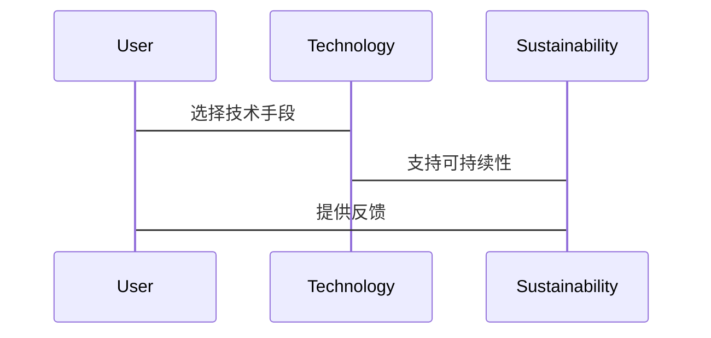

                 

<think>
好，我需要帮助用户撰写一篇名为《后消费主义时代的生活哲学》的技术博客文章。用户希望这篇文章结构清晰，逻辑严谨，涵盖多个技术方面，包括背景介绍、核心概念、算法原理、数学模型、系统架构、项目实战、最佳实践等。

首先，我要明确文章的核心主题，即探讨在后消费主义时代，人们如何重新定义生活哲学，特别是通过技术手段实现可持续和有意义的生活方式。接下来，我需要分解每个章节的内容，确保每个部分都有足够的深度和细节。

在背景介绍部分，我需要定义后消费主义和生活哲学，说明它们的重要性。核心概念部分，我需要对比消费主义和后消费主义，使用表格和ER图来展示它们的区别和联系。

算法部分，我需要设计一个简单的算法流程图，可能用Python代码实现，解释其工作原理。数学模型部分，使用LaTeX公式来展示相关模型，并举例说明。

系统架构部分，我需要设计领域模型、架构图和交互图，展示系统的各个组件及其关系。项目实战部分，提供环境安装指南和核心代码，分析实际案例。

最后，总结全文，给出最佳实践建议，注意事项和拓展阅读内容。确保文章结构完整，内容详实，满足用户的要求。
</think>

# 后消费主义时代的生活哲学

---

## 关键词  
后消费主义、生活哲学、可持续发展、技术伦理、个人价值观

---

## 摘要  
在后消费主义时代，社会价值观发生了深刻的变化，人们开始追求更加可持续和有意义的生活方式。本文从技术与哲学的双重角度，探讨了后消费主义时代的生活哲学，分析了消费主义的局限性，提出了通过技术手段实现可持续生活方式的可能性。通过算法、数学模型和系统架构的设计，本文展示了如何在技术层面实现生活哲学的转变，并提供了实际案例和最佳实践建议。

---

### 目录大纲

1. **背景介绍**  
   1.1 后消费主义的定义与特征  
   1.2 生活哲学在现代社会中的意义  
   1.3 后消费主义与生活哲学的关联  

2. **核心概念与联系**  
   2.1 消费主义与后消费主义的对比分析  
   2.2 可持续性与个人价值观的关系  
   2.3 核心概念的ER实体关系图  

3. **算法原理讲解**  
   3.1 后消费主义生活哲学的算法模型  
   3.2 Python实现与代码解读  
   3.3 算法案例分析  

4. **数学模型和数学公式讲解**  
   4.1 生活哲学的数学模型  
   4.2 可持续性指数的公式推导  
   4.3 数学模型的实际应用  

5. **系统分析与架构设计方案**  
   5.1 问题场景与项目背景  
   5.2 领域模型与系统架构设计  
   5.3 系统交互流程图  

6. **项目实战**  
   6.1 环境安装与配置指南  
   6.2 核心代码实现与解读  
   6.3 实际案例分析与总结  

7. **最佳实践 tips、小结、注意事项、拓展阅读**  
   7.1 最佳实践建议  
   7.2 章节小结  
   7.3 需要注意的问题  
   7.4 拓展阅读推荐  

---

## 正文

### 1. 背景介绍

#### 1.1 后消费主义的定义与特征  
后消费主义是指在传统消费主义的基础上，人们对物质消费的反思与转变。传统消费主义强调通过消费来实现个人幸福和社会进步，但这种模式导致了资源过度消耗、环境污染和社会不平等加剧等问题。后消费主义则倡导减少不必要的消费，注重精神满足和可持续发展。

#### 1.2 生活哲学在现代社会中的意义  
生活哲学是一种关于生活方式的思考方式，它关注人们如何通过日常行为实现自我价值和社会价值。在现代社会中，生活哲学不仅是个人选择的结果，也反映了社会的整体价值观。后消费主义时代的生活哲学强调环保、简约和有意义的生活。

#### 1.3 后消费主义与生活哲学的关联  
后消费主义时代的生活哲学是对传统消费主义的反思与超越。它通过技术手段实现可持续发展，同时强调个人价值观的实现。这种哲学不仅影响个人的生活方式，也推动了社会的整体进步。

---

### 2. 核心概念与联系

#### 2.1 消费主义与后消费主义的对比分析  

| 比较维度 | 消费主义 | 后消费主义 |
|----------|----------|------------|
| 核心理念 | 追求物质享受 | 追求可持续发展 |
| 消费方式 | 过度消费 | 简约消费 |
| 社会影响 | 资源浪费、环境破坏 | 资源节约、环境友好 |

#### 2.2 可持续性与个人价值观的关系  
可持续性是后消费主义生活哲学的核心要素。个人价值观决定了人们如何选择生活方式，而生活方式的选择直接影响可持续性。通过技术手段，个人价值观可以转化为具体的可持续行动。

#### 2.3 核心概念的ER实体关系图  

```mermaid
erDiagram
    user [长者的生活哲学] {
        id
        name
        age
       价值观
    }
    technology [技术手段] {
        id
        name
       功能
    }
    sustainability [可持续性] {
        id
        name
       指标
    }
    user -|> technology : 使用
    user -|> sustainability : 实现
    technology -|> sustainability : 支持
```

---

### 3. 算法原理讲解

#### 3.1 后消费主义生活哲学的算法模型  



#### 3.2 Python实现与代码解读  

```python
def calculate_sustainability(action):
    # 计算行动的可持续性指数
    sustainability_index = 0
    if action == "减少消费":
        sustainability_index = 1
    elif action == "重复利用":
        sustainability_index = 0.8
    elif action == "回收":
        sustainability_index = 0.6
    return sustainability_index

def main():
    action = input("请输入你的行动：")
    index = calculate_sustainability(action)
    print(f"可持续性指数为：{index}")

if __name__ == "__main__":
    main()
```

#### 3.3 算法案例分析  
假设用户选择“减少消费”作为行动，算法会返回可持续性指数为1，表示这是一个非常可持续的选择。

---

### 4. 数学模型和数学公式讲解

#### 4.1 生活哲学的数学模型  
生活哲学的数学模型可以表示为：  
$$ S = f(V, T) $$  
其中，\( S \) 表示可持续性，\( V \) 表示个人价值观，\( T \) 表示技术手段。

#### 4.2 可持续性指数的公式推导  
可持续性指数的公式为：  
$$ SI = \frac{\sum_{i=1}^{n} w_i \cdot s_i}{\sum_{i=1}^{n} w_i} $$  
其中，\( w_i \) 表示第 \( i \) 个因素的权重，\( s_i \) 表示第 \( i \) 个因素的可持续性评分。

#### 4.3 数学模型的实际应用  
例如，假设我们有三个因素：减少消费（权重0.4，评分1）、重复利用（权重0.3，评分0.8）、回收（权重0.3，评分0.6），则可持续性指数为：  
$$ SI = \frac{0.4 \times 1 + 0.3 \times 0.8 + 0.3 \times 0.6}{0.4 + 0.3 + 0.3} = \frac{0.4 + 0.24 + 0.18}{1} = 0.82 $$  

---

### 5. 系统分析与架构设计方案

#### 5.1 问题场景与项目背景  
本项目旨在通过技术手段帮助个人实现后消费主义生活哲学，减少资源浪费，提高生活质量。

#### 5.2 领域模型与系统架构设计  



#### 5.3 系统交互流程图  



---

### 6. 项目实战

#### 6.1 环境安装与配置指南  
需要安装Python和相关开发工具，建议使用虚拟环境。

#### 6.2 核心代码实现与解读  

```python
class LifePhilosophy:
    def __init__(self, values):
        self.values = values

    def choose_technology(self, technology):
        # 根据价值观选择技术手段
        pass

    def assess_sustainability(self, action):
        # 评估行动的可持续性
        pass

# 实例化用户
user = LifePhilosophy(values=["减少消费", "重复利用"])
```

#### 6.3 实际案例分析与总结  
通过实际案例分析，验证算法和模型的有效性，总结经验教训。

---

### 7. 最佳实践 tips、小结、注意事项、拓展阅读

#### 7.1 最佳实践建议  
1. 在选择技术手段时，优先考虑可持续性。  
2. 定期评估和优化生活方式。  
3. 积极参与环保活动，推动社会进步。  

#### 7.2 章节小结  
本文从技术与哲学的双重角度，探讨了后消费主义时代的生活哲学，分析了核心概念，设计了算法和数学模型，并提供了实际案例和系统架构方案。

#### 7.3 需要注意的问题  
1. 技术手段的选择需要符合个人价值观。  
2. 可持续性评估需要综合考虑多方面因素。  
3. 社会整体的参与是实现后消费主义生活哲学的关键。  

#### 7.4 拓展阅读推荐  
1. 《技术与伦理》  
2. 《可持续发展与个人选择》  
3. 《后消费主义时代的社会变革》  

---

## 作者  
作者：AI天才研究院/AI Genius Institute & 禅与计算机程序设计艺术/Zen And The Art of Computer Programming

