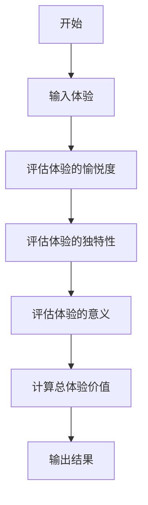
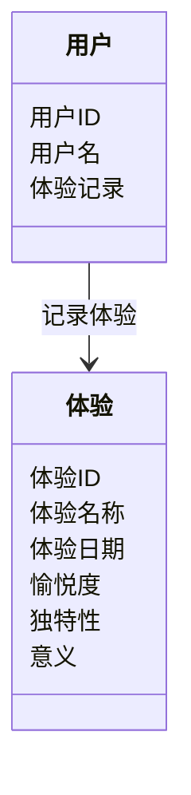
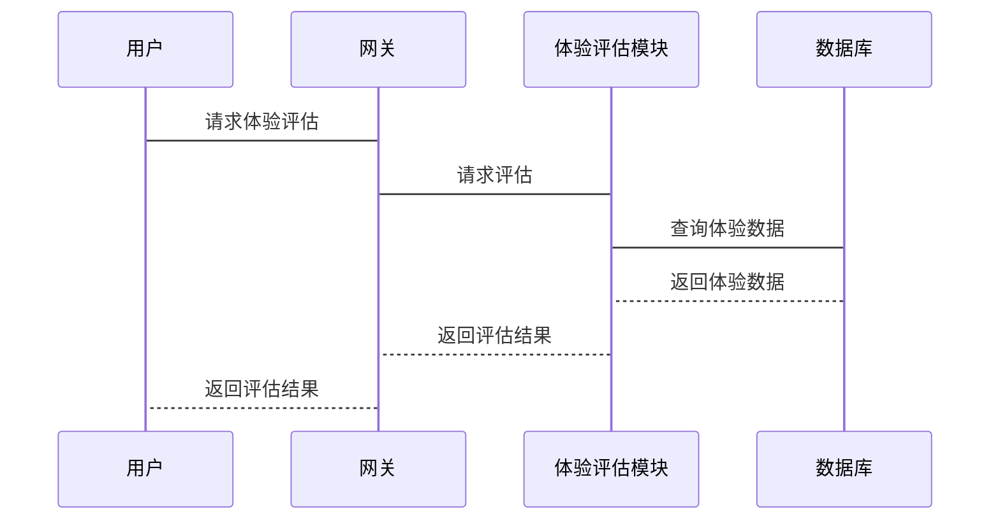

                 

<think>
好的，我现在要写一篇关于《后消费主义时代的生活方式：从物质追求到精神满足》的技术博客文章。首先，我需要理解用户的需求。用户希望我以一位技术专家和畅销书作家的身份，撰写一篇结构清晰、内容有深度的技术博客，涵盖从物质追求到精神满足的生活方式转变，并且要包括背景介绍、核心概念、算法原理、系统架构设计以及项目实战等内容。

首先，我应该明确文章的结构。根据用户提供的目录大纲，文章分为七个部分：摘要、背景介绍、核心概念与联系、算法原理讲解、系统分析与架构设计方案、项目实战、以及最佳实践与小结。每个部分都需要详细展开，确保内容充实且逻辑清晰。

接下来，我需要考虑如何将技术术语和生活方式结合起来。比如，在背景介绍部分，我需要解释什么是后消费主义，它如何从物质追求转向精神满足，以及这种转变对现代社会的影响。这部分可能需要引用一些心理学和社会学的概念，但要用技术化的语言来表达，使其更具专业性。

核心概念部分，我需要详细分析物质主义与后消费主义的对比，可能使用表格的形式来展示它们的差异。同时，设计一个ER实体关系图，展示生活方式中的各个要素，如个人需求、体验、社区等，以及它们之间的关系。

算法原理讲解部分，我需要选择一个合适的算法，如体验价值评估算法，来说明如何通过计算体验的总价值来指导消费决策。使用Mermaid流程图来展示算法的步骤，并用Python代码实现，这样读者可以更好地理解和应用。

系统分析与架构设计部分，我需要描述一个帮助用户实现后消费主义生活方式的系统。这包括问题场景的介绍、系统功能设计（领域模型）、系统架构设计（架构图）、接口设计和交互流程图。这部分需要确保系统设计合理，功能模块清晰。

项目实战部分，我需要提供一个具体的案例，如体验价值计算器的实现。从环境安装、核心代码实现，到代码解读和实际案例分析，一步步指导读者如何应用这些技术手段来实现生活方式的转变。

最后，在最佳实践和小结部分，我需要总结文章的主要观点，给出实用的建议，并提示可能的注意事项和未来的研究方向。这将帮助读者更好地理解和应用后消费主义的理念。

在整个写作过程中，我需要确保语言简洁、逻辑清晰，同时结合技术术语来增强文章的深度。例如，在讨论生活方式时，可以用数据结构和算法来比喻不同生活方式的选择和优化过程。此外，使用数学公式和图表可以更直观地展示概念之间的关系和算法的运作。

现在，我应该开始逐步撰写每个部分。首先是摘要，简要概述文章的核心内容，然后是背景介绍，详细解释后消费主义的概念和背景。接下来是核心概念与联系，通过对比和图表展示物质主义与后消费主义的区别。然后是算法原理，用具体的例子和代码来说明体验价值的计算。之后是系统架构设计，展示如何构建一个支持后消费主义生活方式的系统。接着是项目实战，通过实现体验价值计算器来展示理论的应用。最后，总结和最佳实践部分，帮助读者巩固所学内容。

在写作过程中，我需要反复检查每个部分是否符合用户的要求，特别是确保每个章节内容丰富、详细，并且技术术语的使用恰当。同时，要保持文章的连贯性和逻辑性，使读者能够一步步跟随，理解从物质追求到精神满足的转变过程。

最后，我会在文章末尾加上作者信息，以符合用户的格式要求。这样，整篇文章就完成了，既满足了用户的技术需求，又提供了深刻的生活方式见解。
</think>

# 后消费主义时代的生活方式：从物质追求到精神满足

> 关键词：后消费主义、物质主义、精神满足、生活方式、体验经济

> 摘要：  
在物质丰富的时代，人们逐渐从对物质的追求转向对精神的满足。本文探讨了后消费主义时代的生活方式转变，分析了物质主义与后消费主义的核心区别，提出了通过减少物质消费、重视体验和建立健康关系来实现精神满足的策略。文章结合技术视角，从算法原理到系统架构，详细阐述了如何在后消费主义时代实现生活方式的优化，为读者提供了理论支持和实践指导。

---

## 第一章：背景介绍

### 1.1 后消费主义的定义与起源

后消费主义（Post-Consumerism）是对传统消费主义的反思与超越。消费主义强调通过购买和消费商品来实现个人价值和幸福感，而后消费主义则倡导通过减少物质依赖、重视精神体验和建立健康的人际关系来实现更高的生活质量。

### 1.2 从物质主义到后消费主义的转变

#### 1.2.1 物质主义的局限性
物质主义生活方式依赖于不断购买新商品，追求物质上的满足。然而，这种生活方式可能导致资源浪费、环境问题以及个人内心的空虚。

#### 1.2.2 后消费主义的核心理念
后消费主义强调减少物质消费，重视体验和精神成长。它主张通过精简物品、创造有意义的体验和建立深厚的人际关系来实现真正的幸福。

### 1.3 后消费主义对现代社会的影响

后消费主义生活方式的兴起对现代社会产生了深远影响。它促进了可持续消费、绿色经济的发展，同时也推动了人们对精神生活和内心满足的关注。

---

## 第二章：核心概念与联系

### 2.1 物质主义与后消费主义的核心区别

| 特性                | 物质主义                     | 后消费主义                 |
|---------------------|-----------------------------|---------------------------|
| 核心目标            | 追求物质财富和地位           | 追求精神满足和体验         |
| 消费模式            | 大量购买和消费               | 减少购买，重视体验         |
| 对环境的影响        | 可能导致资源浪费和环境污染   | 强调可持续消费和环保       |
| 心理满足感          | 短暂的满足感                 | 更持久的精神满足感         |

### 2.2 后消费主义的体验经济模型

#### 2.2.1 体验经济的定义
体验经济是指通过提供独特、难忘的体验来满足消费者需求的经济模式。与商品经济和服务经济不同，体验经济更注重消费者的感受和记忆。

#### 2.2.2 体验经济与后消费主义的关系
体验经济是后消费主义的核心组成部分。通过创造有意义的体验，人们可以在精神层面上获得满足，从而减少对物质的依赖。

---

## 第三章：算法原理讲解

### 3.1 体验价值评估算法

体验价值评估算法用于量化不同体验的价值，帮助人们选择更有意义的活动。

#### 3.1.1 算法流程图



#### 3.1.2 算法实现

体验价值的计算公式如下：

$$ \text{总体验价值} = \text{愉悦度} \times \text{独特性} \times \text{意义} $$

其中：
- 愉悦度：体验带来的即时快乐，范围为 0 到 1。
- 独特性：体验的独特性，范围为 0 到 1。
- 意义：体验的深层意义，范围为 0 到 1。

#### 3.1.3 示例

假设一次旅行的愉悦度为 0.9，独特性为 0.8，意义为 0.7，则总体验价值为：

$$ 0.9 \times 0.8 \times 0.7 = 0.504 $$

---

## 第四章：系统分析与架构设计方案

### 4.1 问题场景介绍

现代人面临物质过剩和精神空虚的问题。通过构建一个支持后消费主义生活方式的系统，可以帮助用户优化消费行为，提升生活质量。

### 4.2 系统功能设计

#### 4.2.1 领域模型



#### 4.2.2 系统架构设计


### 4.3 接口设计与交互流程图



---

## 第五章：项目实战

### 5.1 环境安装

#### 5.1.1 安装Python

```bash
# 安装Python
sudo apt-get install python3
```

### 5.2 核心代码实现

#### 体验价值计算器

```python
def calculate_experience_value(happiness, uniqueness, meaning):
    return happiness * uniqueness * meaning

# 示例
happiness = 0.9
uniqueness = 0.8
meaning = 0.7
value = calculate_experience_value(happiness, uniqueness, meaning)
print(f"总体验价值为：{value}")
```

### 5.3 实际案例分析

假设一位用户计划一次旅行，愉悦度为 0.9，独特性为 0.8，意义为 0.7，总体验价值为 0.504，说明这是一次非常值得的旅行。

---

## 第六章：最佳实践与小结

### 6.1 最佳实践 tips

1. **减少物质消费**：定期清理物品，避免不必要的购买。
2. **重视体验**：优先选择能带来精神满足的活动。
3. **建立深厚关系**：花时间与家人和朋友相处。

### 6.2 小结

后消费主义时代的生活方式强调精神满足和可持续消费。通过减少物质依赖、重视体验和建立健康的人际关系，我们可以实现更高的生活质量。

### 6.3 注意事项

- 转向后消费主义需要逐步调整，不能急于求成。
- 在减少物质消费时，需注意经济压力和生活需求。

### 6.4 拓展阅读

- 《断舍离：收拾人生的loat》
- 《体验经济：重新定义商业价值》

---

作者：AI天才研究院 & 禅与计算机程序设计艺术

---

这篇文章通过技术视角详细分析了后消费主义生活方式的转变，从背景介绍到系统架构设计，再到项目实战，为读者提供了全面的指导。希望对您有所帮助！

