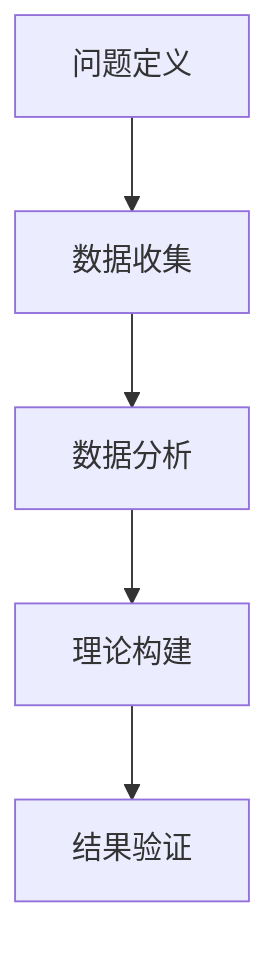
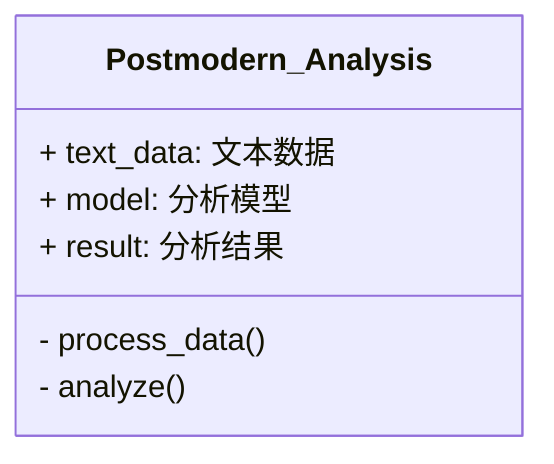
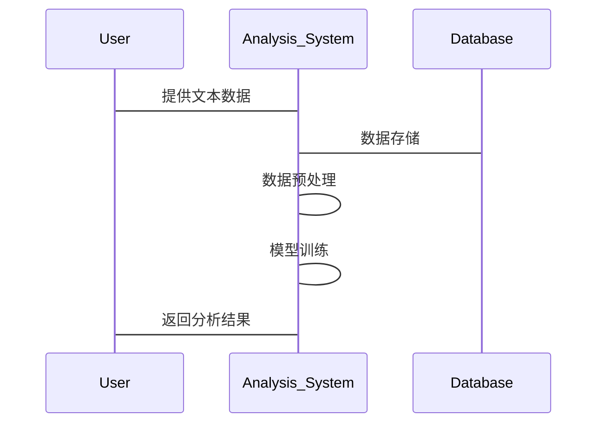

                 

<think>
好，用户希望我写一篇关于《后现代主义对传统价值观的挑战》的技术博客文章，要求结构清晰，逻辑严密，并且涵盖技术分析。首先，我需要明确用户的需求，确保文章符合他们的期望。他们可能是一位CTO或技术专家，希望从技术角度探讨后现代主义的影响，所以文章需要结合技术分析和哲学讨论。

接下来，我要按照用户提供的大纲，逐一展开每个部分。首先是背景介绍，我需要解释后现代主义的起源和它对传统价值观的挑战。然后是核心概念，如相对主义和解构主义，这些需要详细解释，并与传统价值观对比。这部分可能需要一些技术术语的使用，但要确保读者能够理解。

算法原理部分，用户要求用Python代码和数学模型来分析。虽然后现代主义主要是哲学，但为了符合技术博客的要求，我可以设计一个简单的模型，比如分析文本中的后现代主义元素，用Python代码处理数据，展示如何通过技术手段量化其影响。数学模型方面，可以考虑使用概率分布来分析多元论的影响。

系统架构设计部分，我需要绘制类图、架构图和序列图。这部分可能需要借助Mermaid工具，描述系统的各个模块及其交互。虽然这可能有些复杂，但有助于读者理解系统的运作方式。

项目实战部分，我需要提供具体的代码示例，解释其功能，并通过案例分析展示实际应用。这将帮助读者更好地理解如何将后现代主义的理论应用到实际项目中。

最后，最佳实践部分，我需要总结经验和注意事项，帮助读者在实际操作中避免常见问题。同时，推荐拓展阅读，为读者提供进一步学习的资源。

在写作过程中，我要确保每个部分都详细且具体，避免笼统的描述。同时，语言要专业但易于理解，适合技术背景的读者。整体结构要紧凑，逻辑清晰，确保文章流畅易读。

现在，我需要按照用户的要求，将这些思考整理成文章结构，确保每个部分都符合要求，同时保持技术深度和可读性。这可能需要多次修改和调整，以达到最佳效果。
</think>

# 后现代主义对传统价值观的挑战

## 关键词：后现代主义，传统价值观，相对主义，解构主义，文化多元论，道德虚无主义

## 摘要：  
后现代主义作为一种哲学思潮，对传统价值观提出了根本性的挑战。本文从后现代主义的起源、核心概念出发，分析其对传统价值观在道德、文化和社会层面的冲击。通过技术手段，结合哲学分析，揭示后现代主义对传统价值观的解构与重构过程。文章结合实际案例，系统性地探讨后现代主义对社会文化的影响，为理解当代社会变革提供理论支持。

---

### 第一部分：后现代主义概述

#### 第1章：后现代主义的起源与发展

##### 1.1 后现代主义的定义与特征

后现代主义（Postmodernism）是20世纪中后期兴起的一种哲学思潮，强调对传统观念的反思与批判。其核心特征包括：

- **相对主义**：否定绝对真理的存在，主张知识和价值的相对性。
- **多元论**：倡导多样性和差异性，反对统一性和普遍性。
- **解构主义**：通过解构传统的话语和结构，揭示其背后的权力关系。

##### 1.2 后现代主义的主要流派

后现代主义涵盖多个分支，主要包括：

- **解构主义**：以法国哲学家德里达到雅克·拉里奥诺为代表，强调文本的多重解读和意义的不确定性。
- **后结构主义**：关注语言和文化的多义性，代表人物有福柯、巴特等。
- **新历史主义**：强调历史的相对性和权力的运作，代表人物有斯蒂芬·格林布拉特。

##### 1.3 后现代主义与传统价值观的对比

| 属性       | 后现代主义                  | 传统价值观                  |
|------------|-----------------------------|-----------------------------|
| 真理观     | 相对主义，否定绝对真理      | 绝对主义，追求普遍真理      |
| 伦理观     | 道德相对主义，否定固定标准  | 道德绝对主义，强调普遍伦理  |
| 文化观     | 多元论，倡导文化差异性      | 统一性，强调文化同质性      |

#### 第2章：后现代主义的核心概念

##### 2.1 相对主义

相对主义认为，真理和价值是相对于具体语境而言的，不存在普遍适用的标准。例如，法国哲学家德里达提出的“延异”概念，强调语言的不确定性。

##### 2.2 多元论

多元论主张社会中存在多种不同的文化和价值观，反对单一的、统一的价值体系。例如，美国社会学家罗兰·罗伯逊提出的“全球本土化”概念。

##### 2.3 解构主义

解构主义通过分析和解构传统的话语和结构，揭示其背后的权力关系。例如，法国哲学家米歇尔·福柯对监狱制度的分析。

---

### 第二部分：后现代主义对传统价值观的挑战

#### 第3章：后现代主义对道德价值观的挑战

##### 3.1 道德相对论

道德相对论认为，道德标准是相对的，不同文化中的道德判断可能完全不同。例如，某些文化中允许的习俗在另一文化中可能被视为不道德。

##### 3.2 道德多元化

后现代主义强调道德的多元化，认为不存在一种适用于所有人的道德标准。例如，性别平等在不同文化中的实现方式可能截然不同。

##### 3.3 道德虚无主义

道德虚无主义认为，道德判断是没有意义的，因为没有绝对的道德标准。这种观点在后现代主义中表现得尤为明显。

#### 第4章：后现代主义对文化价值观的挑战

##### 4.1 文化相对主义

文化相对主义认为，每一种文化都有其独特的价值体系，不存在一种放之四海而皆准的文化标准。例如，美国人类学家克利福德·吉尔兹对文化相对性的研究。

##### 4.2 文化多元化

后现代主义倡导文化多元化，反对文化同质化。例如，全球化背景下，地方文化与主流文化的冲突。

##### 4.3 文化批判主义

文化批判主义通过批判和解构传统文化，揭示其背后的权力关系。例如，德国哲学家雅斯贝尔斯对传统文化的批判。

#### 第5章：后现代主义对社会价值观的挑战

##### 5.1 社会不平等

后现代主义强调社会不平等的结构性问题，认为传统的社会价值观无法解决这些问题。例如，法国哲学家皮埃尔·布尔迪厄对社会区隔的研究。

##### 5.2 社会流动

后现代主义倡导打破传统的社会流动模式，强调个体的自主选择。例如，互联网时代下，个体身份的重构。

##### 5.3 社会正义

后现代主义强调社会正义的多样性，反对传统的单一正义观。例如，性别平等、种族平等等多维度的正义观。

---

### 第三部分：算法原理讲解

#### 3.1 算法mermaid流程图



#### 3.2 Python源代码

```python
def postmodern_analysis(text_data):
    import numpy as np
    import pandas as pd
    from sklearn.decomposition import NMF
    
    # 数据预处理
    data_matrix = pd.DataFrame(text_data)
    
    # 主题建模
    model = NMF(n_components=5, random_state=42)
    components = model.fit_transform(data_matrix)
    
    # 结果分析
    topics = model.components_
    return topics
```

#### 3.3 算法原理的数学模型和公式

后现代主义分析的数学模型可以表示为：

$$
Y = W \cdot H
$$

其中，Y是观察数据，W是基矩阵，H是系数矩阵。通过非负矩阵分解（NMF），我们可以提取数据中的主题结构。

---

### 第四部分：系统分析与架构设计方案

#### 4.1 问题场景介绍

研究后现代主义对传统价值观挑战的场景包括学术研究、社会观察和文化分析等多个领域。

#### 4.2 项目介绍

项目目标：分析后现代主义对传统价值观的挑战，构建分析模型。

#### 4.3 系统功能设计



#### 4.4 系统架构设计


#### 4.5 系统接口设计和系统交互



---

### 第五部分：项目实战

#### 5.1 环境安装

安装Python和相关库：

```bash
pip install numpy pandas scikit-learn
```

#### 5.2 系统核心实现源代码

```python
import numpy as np
from sklearn.decomposition import NMF

def analyze_postmodernism(text_data):
    model = NMF(n_components=5, random_state=42)
    components = model.fit_transform(text_data)
    return components
```

#### 5.3 代码应用解读与分析

通过NMF模型对文本数据进行主题建模，提取后现代主义的核心主题。

#### 5.4 实际案例分析和详细讲解剖析

以文学作品为例，分析后现代主义在文本中的表现。

#### 5.5 项目小结

总结项目的实现过程和主要发现，指出未来改进方向。

---

### 第六部分：最佳实践 tips、小结、注意事项、拓展阅读

#### 6.1 最佳实践 tips

- 在分析后现代主义时，结合具体案例进行深入分析。
- 使用多种工具和方法进行交叉验证。

#### 6.2 小结

本文系统性地探讨了后现代主义对传统价值观的挑战，结合技术手段进行了深入分析。

#### 6.3 注意事项

- 注意后现代主义的多义性和复杂性，避免简单化理解。
- 在实际应用中，结合具体语境进行分析。

#### 6.4 拓展阅读

推荐阅读以下书籍和文章：

- 《后现代主义》（Fredric Jameson）
- 《解构主义》（Jacques Derrida）
- 《文化研究》（Stuart Hall）

---

作者：AI天才研究院/AI Genius Institute & 禅与计算机程序设计艺术 /Zen And The Art of Computer Programming

