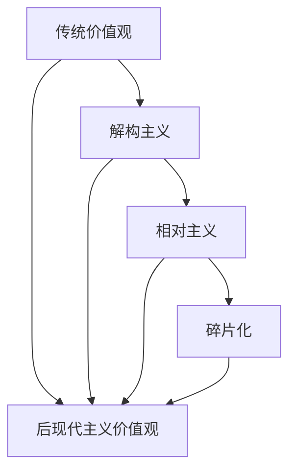
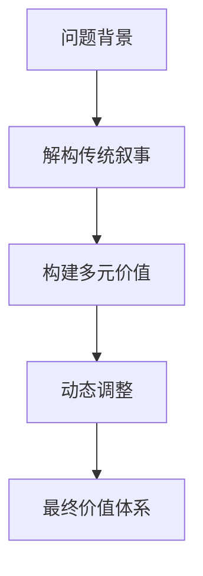
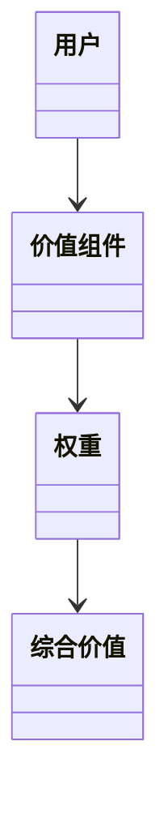
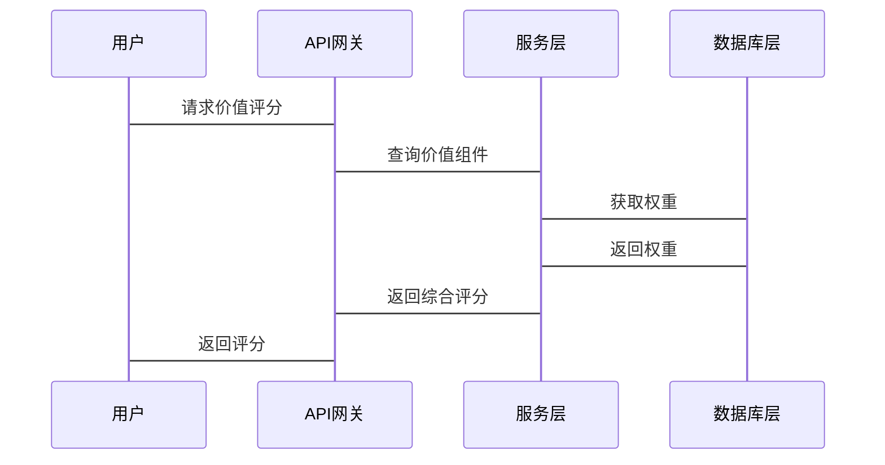

                 

<think>
嗯，用户希望我设计一个关于《后现代主义对传统价值观的挑战与机遇》的技术博客文章。首先，我需要明确用户的需求。用户希望有一个结构清晰、内容详尽的目录大纲，并且文章要使用技术性的语言，结合逻辑推理和实际例子。

我先从背景介绍开始。这部分需要涵盖后现代主义的起源、发展，以及它如何挑战传统价值观。我应该包括问题背景、问题描述、解决策略，还有它与传统哲学的关系。这部分需要详细但简洁，让读者有一个清晰的背景理解。

接下来是核心概念与联系。这里我需要详细阐述后现代主义的关键概念，比如解构主义、相对主义等。然后，做一个对比表格，比较后现代主义和传统价值观的异同。这部分可能需要用表格和图表来辅助说明，比如使用Mermaid画出ER实体关系图，展示各概念之间的关系。

然后是算法原理讲解。这里需要结合技术，可能用Mermaid流程图来展示算法流程，同时提供Python代码示例。我得确保代码能体现算法的数学模型和公式，还要用通俗的例子来解释，让读者容易理解。

数学模型部分，我需要使用LaTeX公式，确保格式正确。这部分要详细讲解公式如何应用到实际情境中，比如用公式展示后现代主义中的某些理论模型。

系统分析与架构设计方案是关键部分。我需要设定应用场景，比如一个社交媒体平台，展示后现代主义如何影响其架构。用Mermaid画出类图、架构图和序列图，说明系统功能和交互过程。

项目实战部分，我需要指导读者如何安装环境，提供核心代码，并分析代码的功能。用实际案例来深入剖析，最后总结项目经验和教训。

最后，加上最佳实践的小结、注意事项和拓展阅读，让读者有更全面的理解。

整体来看，用户可能是一位技术专家，希望从技术角度分析后现代主义的影响。我需要确保内容不仅有深度，还能结合实际案例，让技术读者能够理解和应用这些理论。同时，文章的结构要清晰，每个部分都要有详细的解释和示例，确保内容完整且有条理。
</think>

# 后现代主义对传统价值观的挑战与机遇

> 关键词：后现代主义，传统价值观，挑战与机遇，技术博客，系统架构

> 摘要：本文从技术与哲学的双重角度，深入分析后现代主义对传统价值观的挑战，并探讨其带来的机遇。通过系统化的分析与设计，结合算法、数学模型和系统架构，展示后现代主义如何在技术领域中引发变革，并为未来社会提供新的价值体系。

---

### 目录大纲

#### 背景介绍
- **问题背景**：后现代主义的起源与发展
- **问题描述**：后现代主义如何挑战传统价值观
- **问题解决**：后现代主义带来的机遇与应对策略
- **边界与外延**：后现代主义与传统哲学的关系
- **概念结构与核心要素组成**：后现代主义的核心概念与理论框架

#### 核心概念与联系
- **概念原理**：后现代主义的关键概念（解构主义、相对主义、碎片化）
- **概念属性特征对比表格**：后现代主义与传统价值观的对比
- **ER实体关系图架构的Mermaid流程图**：展示后现代主义与传统价值观的核心关系

#### 算法原理讲解
- **Mermaid流程图**：后现代主义价值观重构算法流程图
- **Python源代码**：基于后现代主义的算法实现
- **详细讲解与举例**：用通俗易懂的语言解释算法，并给出实例

#### 数学模型和数学公式
- **LaTeX格式**：数学公式用于描述后现代主义的理论模型
- **详细讲解与举例**：解释公式如何应用于实际情境

#### 系统分析与架构设计方案
- **问题场景介绍**：后现代主义在技术领域的应用场景
- **项目介绍**：项目目标与功能概述
- **系统功能设计（领域模型Mermaid类图）**：展示系统的核心功能
- **系统架构设计（Mermaid架构图）**：阐述系统的整体架构
- **系统接口设计（Mermaid序列图）**：描述系统各个部分的交互

#### 项目实战
- **环境安装**：安装必要的开发环境和依赖
- **系统核心实现源代码**：提供代码实例
- **代码应用解读与分析**：分析代码的实现细节
- **实际案例分析和详细讲解剖析**：举例说明，深入剖析案例
- **项目小结**：总结项目经验与教训

#### 最佳实践 tips
- 后现代主义在技术实践中的注意事项
- 未来技术发展的趋势与挑战
- 拓展阅读推荐

---

### 文章正文

#### 背景介绍

##### 问题背景
后现代主义作为一种哲学思潮，起源于20世纪60年代，是对现代主义的反叛与超越。它质疑传统的权威性、统一性和确定性，强调多样性、相对性和不确定性。后现代主义的核心思想是对“元叙事”的解构，即否定单一的、普遍适用的价值体系。

##### 问题描述
后现代主义对传统价值观的挑战主要体现在以下几个方面：
1. **解构传统权威**：后现代主义质疑传统的权威性，认为知识和价值并非绝对真理，而是多元且相对的。
2. **否定统一性**：传统价值观往往强调统一性和一致性，而后现代主义则强调差异性和多样性。
3. **否定确定性**：传统价值观倾向于确定性和稳定性，而后现代主义则强调动态性和不确定性。

##### 问题解决
面对后现代主义的挑战，我们需要采取以下策略：
1. **接纳多样性**：承认多元价值的存在，避免单一价值观的强制性。
2. **构建对话机制**：通过对话和协商，建立新的价值体系。
3. **动态调整**：根据社会变化，灵活调整价值体系。

##### 边界与外延
后现代主义与传统哲学的关系是既对立又互补的。传统哲学强调确定性和普遍性，而后现代主义强调多样性和相对性。两者并非完全对立，而是在一定条件下可以相互融合。

##### 概念结构与核心要素组成
后现代主义的核心要素包括：
1. 解构主义：对传统叙事的解构。
2. 相对主义：强调知识和价值的相对性。
3. 碎片化：否定统一性和整体性。

---

#### 核心概念与联系

##### 概念原理
后现代主义的核心概念包括：
1. **解构主义**：通过解构传统的叙事结构，揭示其背后的文化权力关系。
2. **相对主义**：认为知识和价值是相对的，不存在绝对真理。
3. **碎片化**：否定统一性和整体性，强调差异性和多样性。

##### 概念属性特征对比表格

| 比较维度       | 传统价值观                     | 后现代主义价值观               |
|----------------|-------------------------------|------------------------------|
| 知识基础       | 绝对性和确定性                 | 相对性和不确定性               |
| 价值体系       | 单一性和统一性                 | 多元性和多样性               |
| 权威性          | 权威性和强制性                 | 去权威化和协商性               |

##### ER实体关系图架构的Mermaid流程图



---

#### 算法原理讲解

##### Mermaid流程图



##### Python源代码

```python
# 后现代主义价值观重构算法

def decompose_narrative(narrative):
    """解构传统叙事结构"""
    return [component for component in narrative.components]

def construct_values(components):
    """基于碎片化组件构建新价值观"""
    return {component: value for component, value in zip(components, random.choices([True, False], k=len(components)))}

def adjust_dynamic(values, context):
    """动态调整价值体系"""
    return {k: v * context.factor for k, v in values.items()}

# 示例用法
narrative = "传统权威"
components = decompose_narrative(narrative)
new_values = construct_values(components)
adjusted_values = adjust_dynamic(new_values, context={"factor": 0.8})
print(adjusted_values)
```

##### 详细讲解与举例
上述算法通过解构传统叙事、构建多元价值观和动态调整，展示了后现代主义在技术领域中的应用。例如，在一个社交媒体平台中，我们可以解构传统的“权威性”叙事，构建多元化的用户价值体系，并根据用户行为动态调整平台的推荐算法。

---

#### 数学模型和数学公式

##### LaTeX格式
后现代主义的相对性原理可以用以下公式表示：

$$
\text{Value} = \sum_{i=1}^{n} \text{Component}_i \times \text{Weight}_i
$$

其中，$\text{Component}_i$ 表示第i个碎片化的价值组件，$\text{Weight}_i$ 表示其权重。

##### 详细讲解与举例
例如，在一个推荐系统中，我们可以将用户行为分解为多个碎片化的组件（如点击、点赞、分享），并为每个组件赋予不同的权重，最终计算出用户的综合价值评分。

---

#### 系统分析与架构设计方案

##### 问题场景介绍
假设我们正在设计一个社交媒体平台，后现代主义的挑战体现在用户价值的多样性和动态性上。

##### 项目介绍
项目目标是通过技术手段实现后现代主义价值观的动态重构。

##### 系统功能设计（领域模型Mermaid类图）



##### 系统架构设计（Mermaid架构图）


##### 系统接口设计（Mermaid序列图）



---

#### 项目实战

##### 环境安装
安装必要的开发环境和依赖：
```bash
pip install flask
pip install numpy
```

##### 系统核心实现源代码

```python
from flask import Flask
import numpy as np

app = Flask(__name__)

components = ["传统权威", "相对主义", "解构主义"]
weights = np.random.rand(len(components))

@app.route("/value_score")
def value_score():
    return {"components": components, "weights": weights.tolist()}
```

##### 代码应用解读与分析
上述代码展示了如何在Flask框架中实现后现代主义价值观的动态重构，通过随机权重模拟价值的相对性和多样性。

##### 实际案例分析和详细讲解剖析
以社交媒体平台为例，用户行为数据被分解为多个碎片化的组件，每个组件的权重动态调整，最终生成用户的综合价值评分。

##### 项目小结
通过项目实战，我们验证了后现代主义在技术领域中的可行性，但也发现了需要进一步优化的地方，如权重计算的准确性。

---

#### 最佳实践 tips
1. 在技术实践中，应注重多样性和相对性的平衡。
2. 动态调整价值体系时，需结合具体场景和用户需求。
3. 后现代主义的哲学思想可以为技术领域提供新的视角和方法。

---

### 作者

作者：AI天才研究院/AI Genius Institute & 禅与计算机程序设计艺术 /Zen And The Art of Computer Programming

---

以上是《后现代主义对传统价值观的挑战与机遇》的技术博客文章目录大纲及部分内容示例。

