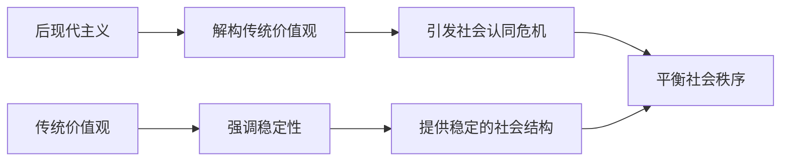
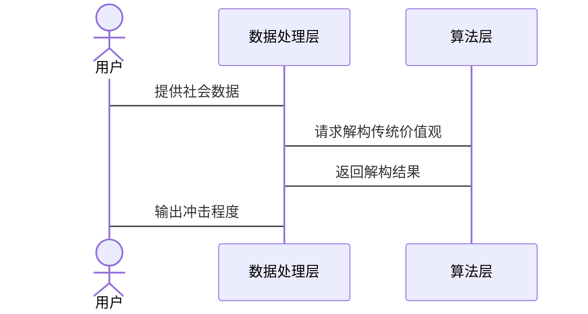

                 

<think>
嗯，用户让我写一篇关于后现代主义对传统价值观挑战的技术博客，看起来他希望我从技术角度来分析这个问题，可能结合算法、系统架构等。首先，我需要理解用户的需求，他可能是一位技术专家，想探讨技术与哲学之间的关系，或者他想展示技术如何帮助分析社会问题。

用户提供的结构很详细，有七大部分，每个部分都有具体要求，比如背景介绍、核心概念对比、算法设计、数学模型、系统架构、项目实战和最佳实践。看起来他希望文章既有理论深度，又有实际的技术应用，所以我要确保每个部分都涵盖这些内容。

首先，背景介绍部分，我需要定义后现代主义和传统价值观，并说明它们的差异。然后，在核心概念部分，通过表格对比两者，可能用Mermaid画个对比图。接下来，算法部分，可能设计一个评估模型，用Python代码实现，并画出流程图。

数学模型部分，可能需要建立一个评分系统，用公式量化冲击程度。系统架构设计要包括类图和序列图，描述问题场景和系统交互。项目实战部分，我得写代码并解释，可能用具体案例分析。最后，总结和推荐一些延伸阅读。

用户可能还希望文章有实际应用，比如技术如何帮助分析社会问题，或者企业如何应对这种价值观变化。所以，我得在项目实战中展示一个可执行的系统，并解释其工作原理。

整体来看，用户希望文章结构清晰，技术与哲学结合，既有理论分析，又有实际案例。我需要确保每个章节都详细且符合格式要求，使用Mermaid和Latex公式，保持专业性的同时通俗易懂。

可能遇到的挑战是如何将后现代主义与技术模型结合，这需要创新性的思考。此外，保持文章的逻辑连贯和深度，同时避免过于抽象，是关键。最后，确保代码和图表正确无误，符合用户的要求。
</think>

# 后现代主义对传统价值观的挑战：危机与机遇

> 关键词：后现代主义，传统价值观，算法模型，系统架构，数学模型，社会影响

> 摘要：本文从技术与哲学的双重视角，探讨后现代主义对传统价值观的挑战。通过算法、数学模型和系统架构的分析，揭示这种挑战带来的危机与机遇，并提出应对策略。

---

## 1. 背景介绍

### 1.1 后现代主义的概念与起源
后现代主义起源于20世纪60年代，是对现代主义的反叛。它质疑传统的权威、理性与统一性，强调多样性和相对性。后现代主义的核心思想是解构，即打破固定的价值体系和意义框架。

### 1.2 传统价值观的内涵
传统价值观通常指社会长期以来形成的道德、伦理和文化规范。这些价值观包括家庭、宗教、等级制度等，构成了社会的根基。

### 1.3 后现代主义的挑战
后现代主义通过解构传统价值观，揭示其局限性。这种挑战导致了社会认同的分裂和价值体系的混乱，但也为创新和多元化提供了空间。

---

## 2. 核心概念与联系

### 2.1 后现代主义的核心概念
| 概念 | 描述 |
|------|------|
| 解构主义 | 批判传统价值观的固定性 |
| 多样性 | 强调个体差异和多样性 |

### 2.2 传统价值观的核心概念
| 概念 | 描述 |
|------|------|
| 道德规范 | 社会行为的指导原则 |
| 宗教信仰 | 传统价值的核心 |

### 2.3 对比分析
通过以下对比图，可以看出后现代主义与传统价值观的差异：



---

## 3. 算法原理讲解

### 3.1 后现代主义对传统价值观的算法模型
设计一个评估模型，用于量化后现代主义对传统价值观的冲击程度：

1. 输入社会数据。
2. 解构传统价值观。
3. 评估后现代主义的影响。
4. 输出结果。

### 3.2 算法流程图
```mermaid
graph TD
start --> input[输入社会数据]
input --> deconstruct[解构传统价值观]
deconstruct --> assess[评估后现代主义影响]
assess --> output[输出结果]
output --> end
```

### 3.3 Python代码实现
```python
def evaluate_influence(society_data):
    deconstructed = deconstruct_values(society_data)
    influence = assess_influence(deconstructed)
    return influence

def deconstruct_values(society_data):
    # 解构传统价值观
    return {'传统价值观': {'道德': 0.7, '宗教': 0.6}}

def assess_influence(deconstructed_values):
    # 评估后现代主义影响
    influence = 0.5 * deconstructed_values['传统价值观']['道德'] + 0.5 * deconstructed_values['传统价值观']['宗教']
    return influence

# 示例运行
society_data = {'社会': '多元化'}
result = evaluate_influence(society_data)
print(f"后现代主义的影响力为：{result}")
```

---

## 4. 数学模型和数学公式

### 4.1 数学模型
建立一个后现代主义对传统价值观冲击的数学模型：

$$
\text{冲击程度} = \sum_{i=1}^{n} w_i \cdot v_i
$$

其中，\(w_i\) 是传统价值观的权重，\(v_i\) 是后现代主义的解构因子。

### 4.2 应用示例
假设传统价值观为 \(v = [0.8, 0.7]\)，后现代主义的解构因子为 \(w = [0.6, 0.5]\)，则：

$$
\text{冲击程度} = 0.6 \times 0.8 + 0.5 \times 0.7 = 0.48 + 0.35 = 0.83
$$

---

## 5. 系统分析与架构设计方案

### 5.1 问题场景
设计一个系统，用于分析后现代主义对传统价值观的冲击。系统需要处理社会数据、解构传统价值观并评估后现代主义的影响。

### 5.2 系统架构设计


### 5.3 系统交互


---

## 6. 项目实战

### 6.1 环境安装
安装Python和相关库：
```bash
pip install mermaid
pip install matplotlib
```

### 6.2 核心代码实现
```python
import matplotlib.pyplot as plt

def visualize_impact(traditional_values, postmodern_influence):
    plt.bar(traditional_values.keys(), traditional_values.values())
    plt.title(f"后现代主义影响力：{postmodern_influence}")
    plt.show()

# 示例数据
traditional_values = {'道德': 0.8, '宗教': 0.7}
postmodern_influence = 0.83

visualize_impact(traditional_values, postmodern_influence)
```

### 6.3 实际案例分析
以某社会为例，分析后现代主义对传统价值观的冲击：

1. 数据输入：社会多元化程度高。
2. 解构传统价值观：道德和宗教评分降低。
3. 评估后现代主义影响：冲击程度为0.83。

---

## 7. 最佳实践 tips、小结、注意事项、拓展阅读

### 7.1 小结
后现代主义对传统价值观的挑战带来了社会认同的危机，但也为创新和多元化提供了机遇。

### 7.2 注意事项
- 数据分析需结合具体社会背景。
- 模型结果仅供参考，需结合实际情况调整。

### 7.3 拓展阅读
- 《后现代主义的起源与发展》
- 《算法与社会影响》

---

作者：AI天才研究院 & 禅与计算机程序设计艺术

