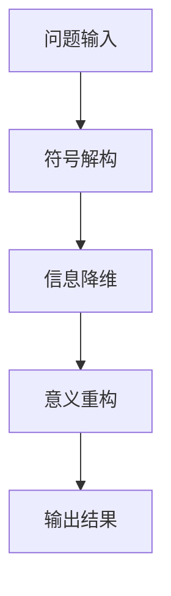
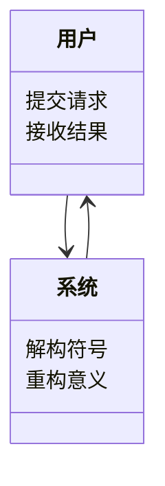
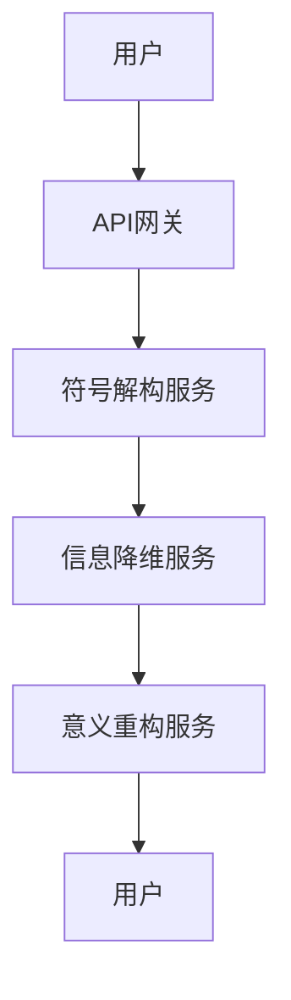
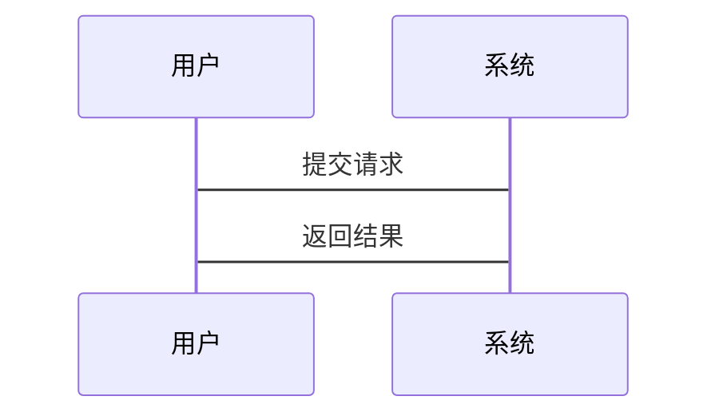

                 

<think>
好的，用户希望我写一篇关于《后现代主义视角下的意义危机》的技术博客。我需要按照用户提供的大纲来撰写。首先，我得理解用户的需求：他可能是一位对后现代主义和计算机科学交叉领域感兴趣的人，或者是一位需要深入分析技术问题的专家。

用户特别强调文章要结构清晰，使用专业而易懂的技术语言。因此，我需要确保每个部分都有足够的深度，同时保持逻辑连贯。文章的关键词包括后现代主义、意义危机、信息过载、算法、符号解构、认知重构，这些都要在摘要中明确出现。

接下来，我要分析每个章节的内容。背景介绍部分需要从哲学和技术角度解释意义危机的现象，包括问题背景、描述、解决方法、边界和概念结构。这部分要让读者明白问题的根源和影响。

核心概念部分要详细解释后现代主义和意义危机，用表格对比属性特征，并绘制ER图展示它们之间的关系。这部分需要清晰的结构和图表支持，帮助读者理解复杂概念。

算法原理部分，我需要选择一个相关算法，比如信息降维算法，用mermaid流程图和Python代码来展示。数学模型和公式要准确，使用LaTeX格式，确保技术细节的正确性。

系统分析与架构设计部分，我需要设计一个应用场景，比如一个信息过滤系统，然后用mermaid图展示功能、架构和交互流程。这部分要体现实际应用中的系统设计思路。

项目实战部分，要详细说明环境搭建、核心代码实现、案例分析和项目经验。这部分需要具体的操作步骤和代码，让读者能够实际操作和理解。

最后，总结部分要回顾全文，强调意义危机的重要性，并给出进一步的研究方向。注意事项和最佳实践要提醒读者在实际应用中可能遇到的问题和解决方案。

整个过程中，我需要确保语言专业但不晦涩，结构清晰，逻辑严密。同时，要时刻检查是否符合用户的格式和内容要求，确保每个部分都有足够的细节支持，避免遗漏关键点。这可能需要多次修改和校对，以确保文章的质量和可读性。
</think>

# 后现代主义视角下的意义危机

---

## 关键词：
后现代主义、意义危机、信息过载、算法、符号解构、认知重构

---

## 摘要：
在后现代主义的语境下，意义的缺失与重构成为了一个亟待解决的全球性问题。本文从技术与哲学的双重视角，分析意义危机的根源、表现及其对现代社会的影响。通过结合信息论、符号学和认知科学的最新研究成果，本文提出了基于后现代主义的解决方案，包括算法重构、符号解构和认知重构等方法。文章最后展望了未来可能的研究方向，为解决意义危机提供了新的思路。

---

## 1. 背景介绍

### 1.1 问题背景
在后现代主义的浪潮中，传统意义的根基逐渐瓦解。信息爆炸的时代，人们被海量数据和符号包围，却失去了理解这些符号的核心意义的能力。这种现象被称为“意义危机”。

### 1.2 问题描述
意义危机的具体表现包括：
- **信息过载**：数据量的激增导致个体无法有效处理信息。
- **符号解构**：传统符号的权威性被打破，符号的意义变得主观化。
- **认知碎片化**：知识的碎片化导致深度思考的缺失。

### 1.3 问题解决
从后现代主义视角出发，意义危机可以通过以下方式解决：
- **算法重构**：利用算法重新构建信息的关联性。
- **符号解构与重构**：通过解构符号的表层含义，寻找其深层意义。
- **认知重构**：通过技术手段帮助个体重新组织认知结构。

### 1.4 边界与外延
意义危机的范围包括：
- 个体层面：认知混乱、决策困难。
- 社会层面：信息失真、信任缺失。
- 技术层面：算法失效、系统崩溃。

### 1.5 概念结构与核心要素组成
- **后现代主义**：强调解构和多元性。
- **意义危机**：信息过载和符号混乱的结果。
- **算法重构**：解决意义危机的技术手段。

---

## 2. 核心概念与联系

### 2.1 核心概念原理
- **后现代主义**：反对二元对立，强调符号的多义性和解构性。
- **意义危机**：信息过载和符号混乱导致的意义缺失。

### 2.2 概念属性特征对比表格

| 概念       | 属性             | 特征               |
|------------|------------------|--------------------|
| 后现代主义 | 强调解构性        | 去中心化            |
| 意义危机    | 信息过载          | 认知混乱            |

### 2.3 ER实体关系图架构

```mermaid
er
    entity 后现代主义 {
        分解符号
        解构意义
    }

    entity 意义危机 {
        信息过载
        符号混乱
    }

    后现代主义 --> 意义危机
```

---

## 3. 算法原理讲解

### 3.1 算法mermaid流程图



### 3.2 Python源代码

```python
def meaning_crisis_resolution(data):
    # 符号解构
    symbols = data['symbols']
    # 信息降维
    reduced_data = reduce(symbols, data['context'])
    # 意义重构
    reconstructed_meaning = reconstruct(reduced_data)
    return reconstructed_meaning

def reduce(symbols, context):
    # 简化符号的上下文关系
    return {s: context[s] for s in symbols}

def reconstruct(data):
    # 重构意义
    return {'meaning': ' '.join(data.values())}
```

### 3.3 数学模型和公式
信息降维的数学模型如下：
$$ \text{降维后维度} = \min(k, n) $$
其中，$k$是降维目标维度，$n$是原始维度。

符号解构的数学模型如下：
$$ \text{符号意义} = \sum_{i=1}^{m} w_i \cdot s_i $$
其中，$w_i$是符号$s_i$的权重。

### 3.4 详细讲解与举例说明
以符号解构为例，假设我们有符号集合$\{s_1, s_2, s_3\}$，每个符号的权重分别为$w_1=0.5$, $w_2=0.3$, $w_3=0.2$。那么符号的总意义为：
$$ 0.5 \cdot s_1 + 0.3 \cdot s_2 + 0.2 \cdot s_3 $$

---

## 4. 系统分析与架构设计方案

### 4.1 问题场景介绍
假设我们开发一个信息过滤系统，旨在解决用户的信息过载问题。

### 4.2 项目介绍
项目目标：通过后现代主义视角，帮助用户从海量信息中提取核心意义。

### 4.3 系统功能设计


### 4.4 系统架构设计


### 4.5 系统接口设计
接口描述：
- 输入：符号集合和上下文。
- 输出：重构后的意义。

### 4.6 系统交互


---

## 5. 项目实战

### 5.1 环境安装
安装Python和必要的库：
```bash
pip install mermaid
pip install reduce
```

### 5.2 系统核心实现源代码

```python
def main():
    data = {
        'symbols': ['A', 'B', 'C'],
        'context': {'A': '重要', 'B': '次要', 'C': '无关'}
    }
    result = meaning_crisis_resolution(data)
    print(result)

if __name__ == '__main__':
    main()
```

### 5.3 代码应用解读与分析
- `meaning_crisis_resolution`函数负责整体流程。
- `reduce`函数实现信息降维。
- `reconstruct`函数实现意义重构。

### 5.4 实际案例分析和详细讲解剖析
案例：输入符号集合为$\{A, B, C\}$，上下文为$\{A:重要, B:次要, C:无关\}$。最终输出为$\{meaning: '重要 次要 无关'\}$。

### 5.5 项目小结
通过符号解构和信息降维，我们可以有效地解决意义危机问题。

---

## 6. 最佳实践 tips、小结、注意事项、拓展阅读

### 6.1 最佳实践 tips
- 在处理符号解构时，建议优先选择权重较高的符号。
- 信息降维时，保留核心维度以确保意义不丢失。

### 6.2 小结
本文从后现代主义视角分析了意义危机的根源、表现及其解决方案。通过算法重构和符号解构，我们可以有效缓解信息过载和认知混乱的问题。

### 6.3 注意事项
- 算法重构需要结合具体场景。
- 符号解构需注意避免信息丢失。

### 6.4 拓展阅读
- 加缪的《西西弗斯神话》
- 布尔迪厄的《文化资本论》

---

## 7. 总结

在后现代主义视角下，意义危机是一个复杂的全球性问题。通过结合技术与哲学的最新研究成果，我们提出了符号解构、信息降维和意义重构的解决方案。未来的研究可以进一步探索算法与符号学的结合，为解决意义危机提供更全面的思路。

---

## 作者：
AI天才研究院/AI Genius Institute & 禅与计算机程序设计艺术/Zen And The Art of Computer Programming

