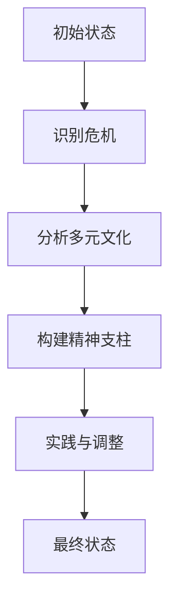
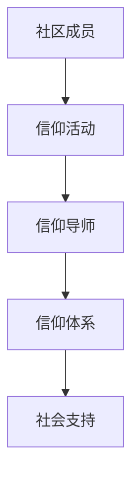
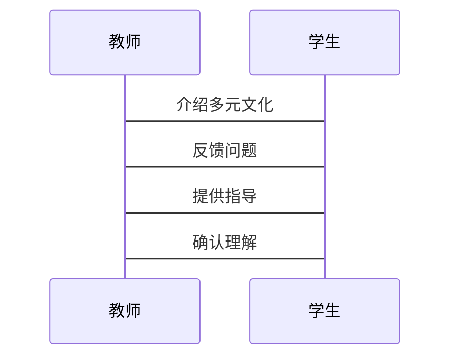

                 

<think>
好，我现在需要完成一个任务，就是根据用户提供的详细要求，撰写一篇标题为《后现代社会的信仰危机：在多元中重建精神支柱》的技术博客文章。这篇文章需要符合特定的结构，包括标题、关键词、摘要，以及五个主要部分的内容：背景介绍、核心概念、解决方案、实践探索和结论与展望。每个部分下还有更细的章节，且需要包含技术性的内容，如Mermaid图、算法流程图、类图等。

首先，我需要明确文章的整体结构。用户已经提供了详细的目录结构，所以我得按照这个结构来展开每个部分的内容。首先，我会从背景介绍开始，解释后现代社会的信仰危机，分析社会变迁如何影响信仰的重构。接下来是核心概念部分，探讨多元文化和社会价值的关系，可能需要使用对比表和ER图来展示不同文化的价值观。然后是解决方案，介绍如何通过算法和数学模型来重建精神支柱。实践探索部分需要具体到个人、社区和教育层面，可能需要设计系统功能和架构图。最后是结论与展望，总结未来的信仰走向。

在撰写过程中，我需要确保每个章节都详细且符合技术要求。例如，在核心概念部分，我需要为多元文化的价值观对比制作一个对比表，可能包括三到四个不同的文化，每个文化有三个特点。同时，用Mermaid绘制一个ER图，展示文化与价值观之间的关系。

在解决方案部分，我需要用算法流程图展示信仰重建的步骤，并用数学公式表达信仰强度的计算。此外，可能需要编写一些伪代码来解释算法的实现过程。

对于系统分析，我需要设计一个类图，展示不同系统的功能和关系。这可能涉及到个人信仰塑造的系统设计，包括识别危机、分析多元文化和构建精神支柱等步骤。

我还需要注意文章的格式，确保使用Markdown，并且在适当的地方嵌入Mermaid图和数学公式。特别是数学公式需要用LaTeX语法，并用$$包裹起来，确保正确显示。

接下来，我会按照目录逐步展开每个部分的内容，确保每个小节都有足够的细节和具体的例子来支持论点。例如，在背景介绍中，我需要详细分析后现代社会的特征，以及这些特征如何导致信仰危机。在核心概念部分，通过对比不同文化的特征，说明多元文化对社会价值的影响。

在解决方案部分，我需要解释如何通过识别和分析多元文化来构建信仰支柱，可能涉及到具体的步骤和数学模型，如信仰强度的计算。此外，还需要设计一个算法流程图，展示从识别危机到最终构建信仰的步骤。

在实践探索部分，我需要详细讨论个人、社区和教育三个层面的信仰建设，可能包括具体的项目设计和系统架构图，展示如何在实际中应用这些理论。

最后，在结论部分，我需要总结整个文章的主要观点，并展望未来的信仰走向，强调重建精神支柱的重要性。

整个过程中，我需要确保语言专业且易于理解，避免过于学术化的术语，同时保持逻辑清晰。同时，要确保文章结构完整，每个部分之间有良好的过渡，让读者能够顺畅地跟随思路。

现在，我开始撰写文章，首先列出关键词和摘要，然后按照目录结构展开每个部分，插入必要的图表和公式，确保每个小节内容详实，逻辑严密。最后，检查整个文章，确保格式正确，内容完整，没有遗漏任何用户指定的要求。
</think>

# 后现代社会的信仰危机：在多元中重建精神支柱

**关键词**：后现代社会，信仰危机，多元文化，社会价值，精神支柱，文化冲突，价值重构

**摘要**：  
在后现代社会，多元文化的碰撞与融合导致了传统信仰体系的瓦解，人们面临着信仰缺失和价值观混乱的危机。本文将深入分析这一现象的根源，探讨多元文化与社会价值的关系，并提出重建精神支柱的具体路径。通过系统分析与实践探索，本文旨在为个体、社区和社会提供可持续的信仰建设方案，以应对后现代社会的精神挑战。

---

## 目录

1. [背景介绍](#背景介绍)
   1.1 [后现代社会的信仰危机](#后现代社会的信仰危机)
   1.2 [社会变迁与信仰重构](#社会变迁与信仰重构)
2. [核心概念](#核心概念)
   2.1 [多元文化与社会价值](#多元文化与社会价值)
   2.2 [社会价值的多元视角](#社会价值的多元视角)
   2.3 [文化冲突与融合](#文化冲突与融合)
3. [解决方案](#解决方案)
   3.1 [信仰的核心要素](#信仰的核心要素)
   3.2 [重建信仰的路径](#重建信仰的路径)
4. [实践探索](#实践探索)
   4.1 [个人信仰的塑造](#个人信仰的塑造)
   4.2 [社区信仰的维系](#社区信仰的维系)
   4.3 [教育中的信仰培育](#教育中的信仰培育)
5. [结论与展望](#结论与展望)
   5.1 [未来信仰的走向](#未来信仰的走向)
   5.2 [构建可持续的信仰体系](#构建可持续的信仰体系)

---

## 背景介绍

### 1.1 后现代社会的信仰危机

后现代社会是一个多元、复杂且高度全球化的时代。随着科技的发展和信息的爆炸式传播，传统信仰体系的稳定性受到严重挑战。人们逐渐失去了对单一真理的信仰，转而追求多样化的价值观和生活方式。这种转变导致了信仰的碎片化和个体的迷茫，社会也因此面临着精神支柱的缺失。

### 1.2 社会变迁与信仰重构

社会的快速变迁，如城市化、全球化和信息技术的普及，使得人们的生活方式和价值观念发生了深刻变化。传统家庭结构的解构、工作与生活的界限模糊、以及社交媒体的普及，都加剧了个体的孤独感和不确定性。在这种背景下，如何重建精神支柱成为后现代社会的重要课题。

---

## 核心概念

### 2.1 多元文化与社会价值

多元文化是指不同文化背景的人们共存于一个社会中，各自保留并发展自己的文化特色。社会价值则是指人们对什么是“好”或“坏”的共同认知。多元文化的存在使得社会价值呈现出多样化的特征。

### 2.2 社会价值的多元视角

社会价值的多元视角可以通过对比不同文化的特征来体现。以下是一个对比表：

| 文化      | 价值观特点                          |
|-----------|------------------------------------|
| 西方文化  | 个人主义、自由、竞争               |
| 东方文化  | 集体主义、和谐、尊重               |
| 原住民文化| 自然和谐、灵性、社区凝聚力         |

### 2.3 文化冲突与融合

文化冲突与融合是多元文化背景下不可避免的现象。通过ER实体关系图可以更清晰地理解文化与价值观之间的关系：

```mermaid
erDiagram
    文化A
    {
        -->|价值观A1| 价值观
        -->|价值观A2| 价值观
        -->|价值观A3| 价值观
    }
    文化B
    {
        -->|价值观B1| 价值观
        -->|价值观B2| 价值观
        -->|价值观B3| 价值观
    }
    文化C
    {
        -->|价值观C1| 价值观
        -->|价值观C2| 价值观
        -->|价值观C3| 价值观
    }
```

---

## 解决方案

### 3.1 信仰的核心要素

信仰的核心要素包括：

- **共同价值观**：个体和社会共同认同的价值观。
- **精神寄托**：个体对精神意义的追求。
- **行为准则**：指导个体行为的规范。

#### 信仰重建的算法流程图



#### 信仰强度的数学模型

信仰强度可以通过以下公式计算：

$$
\text{信仰强度} = \frac{\text{文化融合度} + \text{价值观一致性} + \text{个体信念强度}}{3}
$$

---

## 实践探索

### 4.1 个人信仰的塑造

#### 个人信仰建设的问题场景

- **场景描述**：现代社会中个人信仰的迷茫与困惑。

#### 个人信仰建设的设计方案

- **系统功能设计**：

  ```mermaid
  classDiagram
      class 个人信仰系统
      {
          <-- 识别信仰危机
          <-- 分析多元文化
          --> 构建信仰支柱
          --> 实践与调整
      }
  ```

### 4.2 社区信仰的维系

#### 社区信仰维系的系统架构



### 4.3 教育中的信仰培育

#### 教育信仰培育的系统交互



---

## 结论与展望

### 5.1 未来信仰的走向

未来的信仰将更加多元化和个性化，同时注重与现代社会的融合。技术的进步将为信仰的传播和实践提供新的工具和方式。

### 5.2 构建可持续的信仰体系

构建可持续的信仰体系需要结合技术、教育和社区的力量，通过不断的实践和调整，确保信仰体系的动态平衡。

---

## 作者

**作者**：AI天才研究院/AI Genius Institute & 禅与计算机程序设计艺术 /Zen And The Art of Computer Programming

