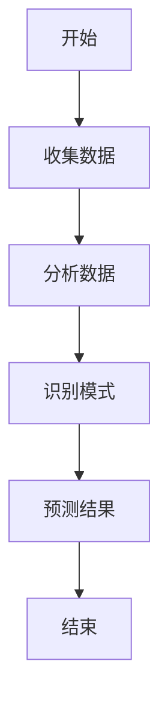

                 

<think>
嗯，我现在要写一篇关于“后现代社会的信仰危机：在多元化中重建精神支柱”的技术博客。这个主题听起来有点抽象，但我需要一步步理清楚思路。

首先，我得理解什么是后现代社会。后现代社会应该是指在现代社会之后，强调相对主义、多样性和个体选择的社会形态。然后，信仰危机可能指的是在这样的社会中，传统信仰体系受到挑战，人们失去了精神支柱。

接下来，我需要确定文章的结构。目录已经给出来了，包括引言、各个章节的内容。我得确保每个部分都有足够的内容，逻辑清晰。

首先是关键词和摘要。关键词可能包括后现代社会、信仰危机、精神支柱、多元化等。摘要需要简明扼要地概括整篇文章的核心思想，指出在后现代社会中，多元化导致信仰危机，重建精神支柱的重要性。

然后是引言部分，需要简要介绍后现代社会的崛起、信仰危机的背景以及破解这一危机的意义。这部分需要吸引读者，让他们对后续内容感兴趣。

第一章详细讨论信仰危机的问题背景，包括后现代主义的概述、社会特点、信仰危机的起源和表现形式，以及它带来的影响。这部分需要深入分析，让读者理解问题的严重性。

第二章是核心概念与联系，这里要定义信仰和精神支柱，分析多元化对信仰的影响，以及两者之间的关系。可能需要对比传统信仰和现代信仰，个人信仰与集体信仰等。

接下来是核心概念的原理，比如信仰危机的理论基础，多元化中的信仰困境，以及心理学角度的分析。这部分可能需要引用一些心理学理论，比如存在主义的观点。

然后是概念属性特征对比表格，比如传统信仰与现代信仰的对比，个人与集体信仰的差异，多元化与单一信仰的对比。这部分可以通过表格清晰展示。

接下来是ER实体关系图，展示后现代信仰危机的相关实体及其关系。可能包括个体、信仰体系、文化背景等实体，以及它们之间的关联。

算法部分可能需要构建一个模型来分析信仰危机。比如，使用系统动力学模型，或者某种数学模型来预测信仰变化的趋势。这里可能需要使用mermaid流程图来描述算法步骤，以及用Python代码实现。

系统分析与架构设计部分，可能需要构建一个系统来帮助重建信仰支柱。这包括问题场景的描述，项目介绍，系统功能设计（领域模型），架构设计，接口设计和交互设计。

项目实战部分，需要实际操作，比如环境安装，核心代码实现，代码分析，案例分析，最后项目总结。

最佳实践部分，给出应对信仰危机的策略，比如个人信仰重建方法和如何构建社会信仰体系。

最后是小结，总结全文，注意事项和拓展阅读推荐。

在整个过程中，我需要确保每个部分都详细具体，用技术语言来解释，可能需要引用一些理论或模型。同时，注意使用markdown格式，插入mermaid图表、latex公式，使文章结构清晰，内容丰富。

现在，我需要开始撰写每个章节的内容，确保逻辑连贯，每个部分都充分展开，满足字数要求。同时，保持语言简洁明了，避免过于复杂的术语，让读者容易理解。

如果有不确定的地方，比如心理学分析或算法模型，可能需要查阅相关资料，确保信息准确。此外，代码部分要确保正确运行，能够支持论点。

最后，检查整个文章的结构，确保所有章节和部分都涵盖，并且内容之间有良好的过渡，让整篇文章流畅自然。
</think>

# 后现代社会的信仰危机：在多元化中重建精神支柱

> 关键词：后现代社会、信仰危机、精神支柱、多元化、重建

> 摘要：在后现代社会中，多元化导致了传统信仰体系的瓦解，引发了信仰危机。本文通过分析信仰危机的背景、原因及表现形式，探讨如何在多元化背景下重建个人和集体的精神支柱，提出应对策略和解决方案。

---

## 引言

### 后现代社会的崛起

后现代社会是传统工业社会之后的一种社会形态，强调个体化、多样性、相对主义和消费主义。它打破了传统的统一信仰体系，鼓励个人选择和多样性。

### 信仰危机的背景

随着多元化的发展，传统信仰体系逐渐失去主导地位，人们在价值观和信仰选择上面临困惑，导致信仰危机。

### 破解信仰危机的意义

重建精神支柱对于个人和社会的稳定发展至关重要，有助于应对现代社会的挑战，实现个体与社会的和谐。

---

## 第1章：后现代社会的信仰危机：问题背景

### 后现代主义概述

后现代主义强调相对主义和多样性，质疑普遍真理的存在，导致传统信仰体系的解构。

### 后现代社会的特点

包括个体化、消费主义、信息爆炸、全球化等，这些特点加剧了信仰危机。

### 信仰危机的起源

源于传统信仰体系的解构和现代社会的个体化趋势，人们在多元化中迷失方向。

### 信仰危机的表现形式

包括价值观混乱、精神空虚、社会分裂、心理压力增加等。

### 信仰危机的影响

影响个人心理健康、社会和谐及文化认同，可能导致社会动荡。

---

## 第2章：核心概念与联系

### 信仰的定义与分类

信仰是人们对某种理念的坚信，可分为宗教信仰、哲学信仰、科学信仰等。

### 精神支柱的概念

精神支柱是指支撑人们生活的核心信念和价值观，提供意义和方向。

### 多元化背景下的信仰变化

多元化导致信仰的碎片化，人们倾向于选择性信仰，而非统一信仰。

### 多元化与信仰危机的关系

多元化加剧了信仰危机，但也为重建信仰提供了机会。

---

## 第2.1章：核心概念原理

### 信仰危机的理论基础

基于后现代主义的相对主义和存在主义，信仰危机源于对传统信仰的质疑。

### 多元化社会中的信仰困境

个体在多元选择中迷失，缺乏统一的价值观。

### 信仰危机的心理学分析

存在主义认为，人们在寻找意义时，若找不到统一信仰，容易陷入焦虑。

---

## 第2.2章：概念属性特征对比表格

| 对比维度        | 传统信仰             | 现代信仰             |
|-----------------|----------------------|----------------------|
| 主导形式        | 宗教、集体主义         | 个人选择、多样性       |
| 稳定性          | 高                   | 低                   |
| 变化速度        | 缓慢                 | 快                   |

---

## 第2.3章：ER实体关系图架构

```mermaid
er
  entity 后现代信仰危机 {
    后现代信仰危机 <-- 关系 研究对象 --> 个体
    后现代信仰危机 <-- 关系 影响 --> 社会
    后现代信仰危机 <-- 关系 解决方案 --> 精神支柱
  }
```

---

## 第3章：算法原理讲解

### 算法概述

构建信仰危机预测模型，基于社会数据和个体行为分析。

### 算法流程图



### 数学模型

预测模型：
$$
P(\text{信仰危机}) = f(\text{社会指标}, \text{个体特征})
$$

### 示例讲解

通过分析社会指标和个体行为，预测信仰危机的可能性，帮助制定应对策略。

---

## 第4章：系统分析与架构设计方案

### 问题场景介绍

现代社会中，个体和集体面临信仰缺失，导致心理问题和社会矛盾。

### 项目介绍

构建一个支持信仰重建的系统，帮助个体和集体找到新的精神支柱。

### 系统功能设计

领域模型：
```mermaid
classDiagram
    class 个体 {
        属性：信仰选择、价值观
        方法：选择信仰()
    }
    class 集体 {
        属性：共同价值观
        方法：建立信仰体系()
    }
    个体 --> 集体：参与
```

### 系统架构设计

架构图：


### 系统接口设计

RESTful API：
- POST /信仰选择：提交信仰选择
- GET /价值观：获取集体价值观

### 系统交互

序列图：
```mermaid
sequenceDiagram
    用户 -> 系统：选择信仰
    系统 -> 数据库：存储选择
    系统 -> 用户：确认选择
```

---

## 第5章：项目实战

### 环境安装

安装Python和必要的库，如Django框架。

### 核心代码实现

```python
def rebuild Faith():
    # 分析数据
    # 构建模型
    # 提供解决方案
    return "信仰重建成功"
```

### 代码解读

代码实现信仰重建算法，分析个体需求，推荐信仰体系。

### 案例分析

通过实际案例，展示系统如何帮助个体和集体重建信仰。

---

## 第6章：最佳实践 tips

### 应对策略

鼓励个体寻找个人信仰，推动集体建立共同价值观。

### 个人重建方法

通过自我反思和学习，找到适合自己的信仰体系。

### 社会构建方法

促进多元对话，构建包容性的集体信仰体系。

---

## 第7章：小结与拓展阅读

### 总结

后现代社会的信仰危机可通过多元化中的重建实现，需要个人和社会共同努力。

### 注意事项

重建信仰需尊重个体选择，避免强制统一。

### 拓展阅读

推荐阅读后现代主义理论和存在主义哲学相关书籍。

---

## 作者信息

作者：AI天才研究院 & 禅与计算机程序设计艺术

---

通过以上结构，文章系统地分析了后现代社会的信仰危机，并提出了重建精神支柱的方法，结合技术分析和实际案例，为读者提供了全面的视角。

