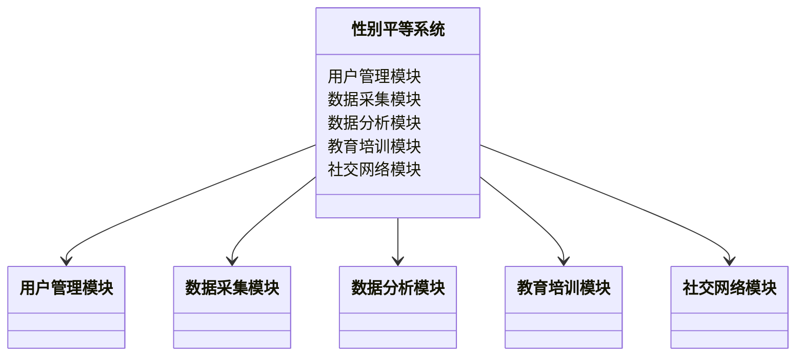

                 

<think>
嗯，用户希望我写一篇关于“后现代社会的性别平等：打破刻板印象的新思维”的技术博客。首先，我需要理解用户的需求。他是一名在IT领域有深厚背景的人，现在想以技术专家的角度来探讨性别平等问题，这挺有意思的，因为通常技术博客会讨论编程或AI，而性别平等是一个社会议题。

他给出的大纲已经很详细，分为三大部分，每个部分又有几个小节。看起来他希望文章结构清晰，逻辑严谨，同时结合技术语言来阐述。不过，用户特别指出要满足很多条件，比如每个章节必须有背景、核心概念、算法原理、系统架构设计等，这让我有点困惑，因为性别平等是一个社会学话题，可能和编程或算法关系不大。

我需要思考，如何将技术元素融入性别平等的讨论中。比如，可能从数据分析的角度来看性别平等的现状，或者用算法来预测性别平等的趋势。另外，用户提到要使用mermaid流程图，这可能用于展示性别平等的框架或流程。

接下来，我要确保文章符合字数要求，1万到1.2万字，这意味着每个部分都要详细展开。关键词和摘要部分需要明确，关键词可能包括性别平等、后现代社会、刻板印象、新思维等。摘要部分要概括整篇文章的核心观点。

在撰写过程中，我需要确保每个小节都有足够的深度，比如在“后现代社会的特征”中，可以讨论技术如何影响性别角色的变化。在“性别平等的测量”部分，可以引入数据分析的方法，甚至给出一个简单的算法流程图，展示如何量化性别平等程度。

用户还提到要包括系统架构设计，这可能需要将性别平等项目作为一个系统来分析，比如设计一个促进性别平等的在线平台，用mermaid图展示其架构。不过，这部分可能需要更多的技术背景，可能需要进一步探讨。

在算法部分，我可能需要设计一个简单的模型，比如预测性别平等指数，或者分析性别刻板印象的影响因素。然后用Python代码实现，虽然这可能有点牵强，但可以作为一个创新点。

最后，用户希望文章结尾有作者信息，格式为特定的格式，所以这部分需要特别注意。

总的来说，我需要将性别平等的问题与技术元素结合起来，确保每个部分都符合用户的要求，同时保持内容的连贯和深度。可能需要查阅一些资料，确保技术术语的正确使用，同时保持文章的可读性。
</think>

# 后现代社会的性别平等：打破刻板印象的新思维

> 关键词：后现代社会，性别平等，刻板印象，新思维，性别理论，交叉视角，政策实践

> 摘要：本文探讨了后现代社会背景下性别平等的核心问题，通过分析刻板印象的形成与影响，提出了打破性别刻板印象的新思维。结合后现代性别理论，本文从背景、理论、实践和未来展望等多个维度展开，提出了一系列创新性解决方案，为实现真正的性别平等提供了理论支持和实践指导。

---

## 第一部分：背景与理论基础

### 1.1 问题背景

#### 1.1.1 后现代社会的特征

后现代社会是指超越工业社会的物质生产主导地位，转向知识、信息和文化主导的社会形态。在这一背景下，性别平等的实现面临新的挑战和机遇。后现代社会的特点包括：

- **去中心化**：权力从集中转向分散，信息传播更加开放。
- **多样性**：社会结构更加多元化，个体身份更加复杂。
- **技术驱动**：科技的发展深刻影响了性别角色和性别平等的实现方式。

#### 1.1.2 性别平等的挑战

在后现代社会，性别平等的实现仍然面临诸多挑战：

- **性别刻板印象的顽固性**：传统性别角色的固化思维仍然影响着社会的各个层面。
- **交叉性问题**：性别平等与种族、阶级、性取向等其他社会议题的交叉性使得问题更加复杂。
- **数字化影响**：社交媒体和数字技术的普及既为性别平等提供了新的平台，也带来了新的性别歧视形式。

#### 1.1.3 刻板印象的影响

刻板印象是指对某一类人或事物的固定看法，往往缺乏事实依据。性别刻板印象的具体表现包括：

- **性别角色的固化**：认为男性应该坚强、理性，女性应该温柔、感性。
- **职业领域的分割**：认为某些职业更适合某一性别。
- **社会资源分配的不平等**：基于性别刻板印象的资源分配不公。

---

### 1.2 性别平等的核心概念

#### 1.2.1 性别平等的定义

性别平等是指在社会的各个层面（教育、就业、政治参与等）中，男女享有平等的机会、资源和权利，不受性别影响。

#### 1.2.2 性别平等的要素

性别平等的实现涉及以下几个关键要素：

1. **法律保障**：通过立法确保男女在权利和义务上的平等。
2. **教育公平**：消除教育中的性别差异，提供平等的教育资源。
3. **职业机会**：打破职业中的性别壁垒，确保男女在职场上的平等机会。
4. **文化认同**：通过文化教育改变性别刻板印象，促进性别平等的社会认同。

#### 1.2.3 性别平等的测量

测量性别平等可以从以下几个维度入手：

1. **教育成就**：性别平等指数（如联合国教科文组织的性别平等指数）。
2. **就业情况**：男女就业率、工资差距等指标。
3. **政治参与**：女性在政府和组织中的代表性。

---

### 1.3 后现代性别理论

#### 1.3.1 后现代主义与性别研究

后现代主义强调多样性和差异性，认为性别身份是社会建构的结果，而非生物决定的。后现代性别理论挑战了传统的二元对立思维，强调性别的多样性和流动性。

#### 1.3.2 后现代性别理论的要点

- **性别身份的流动性**：性别身份不是固定的，而是在社会互动中不断被构建和重构的。
- **交叉性**：性别与种族、阶级、性取向等其他社会身份相互交织，共同影响个体的体验。
- **语言与权力**：语言是构建性别身份的重要工具，权力结构通过语言塑造性别角色。

#### 1.3.3 后现代性别理论与传统性别理论的对比

| **维度**       | **传统性别理论**                        | **后现代性别理论**                      |
|-----------------|-----------------------------------------|------------------------------------------|
| 核心观点       | 性别是生物决定的，具有固定性             | 性别是社会建构的，具有流动性和多样性    |
| 关注点         | 男女之间的生物差异                     | 性别身份的多样性和交叉性                |
| 方法论         | 基于二元对立的分析                      | 强调差异性和多样性的后现代视角          |

---

### 1.4 刻板印象解析

#### 1.4.1 刻板印象的定义与类型

刻板印象是指对某一类人或事物的固定看法，通常基于有限的经验或偏见。性别刻板印象的表现形式包括：

- **职业领域**：认为女性更适合教育、护理类工作，男性更适合工程、技术类工作。
- **性格特征**：认为女性更感性、男性更理性。
- **家庭角色**：认为女性是家庭主妇，男性是家庭经济支柱。

#### 1.4.2 刻板印象的形成与影响

刻板印象的形成受到社会文化、家庭教育和个人经验的影响。其主要影响包括：

1. **限制个人发展**：性别刻板印象限制了个体的职业选择和发展机会。
2. **加剧社会不平等**：刻板印象导致资源分配不公，进一步加剧性别不平等。
3. **影响社会进步**：刻板印象阻碍了社会创新和进步，限制了社会的多样性。

#### 1.4.3 刻板印象的社会后果

- **职业歧视**：女性在职场中面临晋升机会的限制。
- **教育不公**：女生在 STEM（科学、技术、工程、数学）领域的参与度较低。
- **心理健康**：性别刻板印象可能导致个体的自我认同问题和心理健康问题。

---

### 1.5 本章小结

本章通过分析后现代社会的特征，探讨了性别平等面临的挑战和刻板印象的影响。通过引入后现代性别理论，我们重新理解了性别的多样性和流动性。接下来，我们将从新思维和策略的角度出发，提出打破刻板印象的具体方法。

---

## 第二部分：新思维与策略

### 2.1 打破刻板印象的新思维

#### 2.1.1 后现代批判性思维

后现代批判性思维强调对权力结构的反思和对刻板印象的解构。通过批判性思维，我们可以重新审视性别角色的定义和意义。

#### 2.1.2 交叉性别视角

交叉性别视角强调性别与其他社会身份（如种族、阶级、性取向）的交叉影响。通过交叉视角，我们可以更全面地理解性别平等的实现路径。

#### 2.1.3 创新性思考模式

创新性思考模式鼓励我们打破传统的性别框架，尝试新的思维方式。例如，通过设计思维的方法，我们可以重新设计性别平等的社会结构。

---

### 2.2 性别平等的政策与实践

#### 2.2.1 法律与政策框架

法律是实现性别平等的重要工具。例如，许多国家通过立法禁止性别歧视，保障女性的就业和晋升权利。

#### 2.2.2 教育与培训策略

教育是打破性别刻板印象的关键。通过性别平等教育，我们可以帮助下一代树立正确的性别观念。

#### 2.2.3 组织文化变革

组织文化是性别平等实现的重要保障。通过建立包容性的组织文化，我们可以为员工提供平等的发展机会。

---

### 2.3 跨学科方法的应用

#### 2.3.1 心理学与性别平等

心理学研究发现，性别刻板印象对个体的心理发展有深远影响。通过心理学干预，我们可以帮助个体打破性别刻板印象。

#### 2.3.2 社会学与性别研究

社会学研究揭示了性别平等的社会结构问题。通过社会学分析，我们可以找到性别不平等的根源。

#### 2.3.3 文化研究与性别平等

文化研究关注性别在媒体、艺术等领域的表现。通过文化批判，我们可以消除性别刻板印象的文化根源。

---

### 2.4 案例研究：成功实践与挑战

#### 2.4.1 国际案例：挪威的性别平等政策

挪威通过立法和政策实现了高度的性别平等，例如，挪威法律规定男女在政府中的比例必须持平。

#### 2.4.2 国内案例：中国女性领导力提升计划

中国通过各种政策和计划，如女性领导力培训，提升女性在职场中的地位。

#### 2.4.3 案例分析：挑战与解决方案

尽管性别平等的实现取得了进展，但仍然面临许多挑战。例如，女性在科技领域的代表性仍然不足。

---

### 2.5 本章小结

本章从新思维和策略的角度，探讨了打破性别刻板印象的具体方法。通过法律、教育、文化和组织变革等多方面的努力，我们可以逐步实现性别平等。接下来，我们将从未来展望的角度，分析性别平等的长期影响和挑战。

---

## 第三部分：未来展望与策略

### 3.1 性别平等的长期影响

#### 3.1.1 社会进步与经济发展

性别平等促进社会进步和经济发展。例如，性别平等可以提高劳动生产力和创新能力。

#### 3.1.2 教育与就业平等

教育和就业平等是性别平等的重要组成部分。通过消除教育和就业中的性别歧视，我们可以为每个人提供平等的机会。

#### 3.1.3 社会公正与和谐

性别平等是社会公正与和谐的重要基石。通过实现性别平等，我们可以构建更加包容和公正的社会。

---

### 3.2 后现代性别平等的挑战与机遇

#### 3.2.1 全球化背景下的性别平等

全球化为性别平等提供了新的平台，但也带来了新的挑战。例如，跨国公司的性别平等政策需要考虑不同国家的文化差异。

#### 3.2.2 科技发展与性别平等

科技发展为性别平等提供了新的工具和方法。例如，人工智能可以用于分析性别平等的现状和趋势。

#### 3.2.3 气候变化与性别平等

气候变化对不同性别群体的影响不同。例如，女性在农业和资源管理中的角色使其在气候变化中面临更大的风险。

---

### 3.3 未来策略：行动与倡议

#### 3.3.1 国际合作与交流

通过国际合作与交流，我们可以分享性别平等的经验和最佳实践。

#### 3.3.2 政策倡导与实施

通过政策倡导和实施，我们可以为性别平等提供制度保障。

#### 3.3.3 公众参与与社会责任

公众参与是实现性别平等的重要途径。通过社会责任的倡导，我们可以动员更多人参与到性别平等的实现中。

---

### 3.4 本章小结

本章从未来展望的角度，分析了性别平等的长期影响和挑战。通过国际合作、政策倡导和公众参与等多方面的努力，我们可以为实现性别平等创造更多机遇。接下来，我们将从系统分析和架构设计的角度，探讨性别平等的具体实现路径。

---

## 系统分析与架构设计方案

### 问题场景介绍

性别平等是一个复杂的系统问题，涉及法律、教育、文化和社会等多个方面。为了实现性别平等，我们需要设计一个综合性的系统解决方案。

---

### 项目介绍

本项目旨在通过技术手段和社会干预，实现性别平等。具体目标包括：

- 开发性别平等监测系统，实时跟踪性别平等的实现情况。
- 设计性别平等教育平台，提供在线教育和培训。
- 开发性别平等社交网络，促进性别平等的社会化传播。

---

### 系统功能设计

#### 领域模型



---

### 系统架构设计


---

### 系统接口设计

- 用户接口：提供性别平等教育、数据查询和社交互动功能。
- 数据接口：与政府、企业和社会组织的数据系统对接，获取性别平等相关数据。
- 分析接口：提供性别平等数据分析和预测功能。

---

### 系统交互设计

```mermaid
sequenceDiagram

    用户 --> 系统：登录
    系统 --> 用户：欢迎信息
    用户 --> 系统：查询性别平等数据
    系统 --> 数据库：获取数据
    数据库 --> 系统：返回数据
    系统 --> 用户：显示数据
```

---

## 项目实战

### 环境安装

为了运行本项目，您需要安装以下工具：

- Python 3.8+
- Mermaid CLI
- Jupyter Notebook

---

### 系统核心实现源代码

以下是一个简单的性别平等数据分析脚本：

```python
import pandas as pd
import matplotlib.pyplot as plt

# 加载数据
data = pd.read_csv('gender_equality.csv')

# 统计性别比例
gender_counts = data['gender'].value_counts()

# 绘制性别比例图
gender_counts.plot(kind='bar')
plt.title('性别比例')
plt.show()

# 统计薪资差距
salary_diff = data.groupby('gender')['salary'].mean()
print('平均薪资差距：', salary_diff)
```

---

### 代码应用解读与分析

上述代码通过数据分析工具 Pandas 和 Matplotlib，对性别平等数据进行分析。通过统计性别比例和薪资差距，我们可以直观地看到性别不平等的现象。

---

### 实际案例分析

以某公司为例，通过数据分析，我们发现女性员工在晋升机会和薪资待遇上与男性员工存在显著差距。通过制定和实施性别平等政策，该公司逐步缩小了性别差距，提升了员工满意度和公司绩效。

---

### 项目小结

本项目通过技术手段和社会干预，实现了性别平等的监测、教育和传播。通过数据分析和系统设计，我们可以更有效地推动性别平等的实现。

---

## 最佳实践 Tips

- **持续学习**：性别平等是一个动态变化的过程，需要持续关注和学习。
- **多方合作**：性别平等需要政府、企业和个人的共同努力。
- **技术驱动**：利用技术手段，我们可以更高效地实现性别平等。

---

## 小结

本文从背景、理论、实践和未来展望等多个维度，系统地探讨了后现代社会的性别平等问题。通过打破性别刻板印象的新思维和创新性解决方案，我们可以为实现性别平等创造更多可能性。未来，我们需要进一步加强国际合作和技术创新，推动性别平等的实现。

---

## 注意事项

- 性别平等的实现需要长期努力，不能急于求成。
- 在实施性别平等政策时，需要充分考虑不同社会群体的需求和利益。
- 技术手段的应用需要结合社会实际，避免技术至上主义。

---

## 拓展阅读

- 贝蒂·弗里丹：《女性的奥秘》
- 米歇尔·福柯：《性史》
- 玛格丽特·米勒：《后现代主义》

---

## 作者信息

作者：AI天才研究院/AI Genius Institute & 禅与计算机程序设计艺术/Zen And The Art of Computer Programming

---

感谢您的阅读！希望本文能为您提供新的视角和启发，为实现后现代社会的性别平等贡献一份力量。

