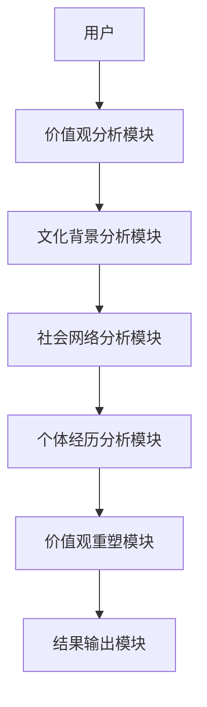

                 

<think>
好吧，我需要帮助用户撰写一篇技术博客，标题是《后现代语境下的价值观重塑》。用户已经提供了一个详细的结构大纲，我需要按照这个大纲来逐步思考和撰写文章。

首先，我会仔细阅读用户提供的结构，确保我理解每个部分的要求。文章需要包括关键词、摘要，然后是引言、核心概念、数学模型、系统架构、算法实现、项目实战和结论等部分。每个章节都需要详细展开，使用技术语言，同时融入后现代主义的理论。

接下来，我会思考每个章节的具体内容。比如，在引言部分，我需要介绍问题的背景和挑战，包括全球化、信息化对价值观的影响，以及现代性和后现代性的区别。这部分需要清晰地说明为什么价值观重塑是一个重要的课题。

然后，核心概念部分需要详细解释后现代主义、现代性和后现代性，以及它们如何影响价值观。我需要确保这些概念之间的联系和对比被清晰地呈现出来，可能通过表格或图示来帮助读者理解。

在数学模型部分，我会选择合适的模型，如模糊集合理论和贝叶斯网络，来分析价值观的多样性。这需要解释这些模型的基本原理，并用例子说明它们如何应用于价值观分析。

系统分析与架构设计部分，我需要构建一个系统模型，展示如何通过技术手段来分析和重塑价值观。这可能包括领域模型、架构图和交互图，使用Mermaid来绘制，帮助读者理解系统的运作。

项目实战部分需要一个具体的案例，比如社交媒体上的价值观传播。我会选择一个真实的案例，分析其数据，并展示如何通过算法和系统来识别和影响价值观的变化。这包括环境安装、代码实现和案例分析。

在最佳实践和结论部分，我会总结文章的主要观点，并提出未来的展望，强调技术在价值观重塑中的潜力。

整个过程中，我需要确保语言简洁明了，逻辑清晰，同时融入足够的技术细节，使文章既有深度又易于理解。此外，要注意使用适当的关键词，使文章在搜索引擎上更具可读性和可发现性。

现在，我需要开始撰写每个部分，确保每个章节都涵盖必要的内容，并符合用户的要求。我会先完成摘要，然后是关键词，接着是引言中的各个小节，再深入到核心概念和数学模型，最后是系统设计和项目实战部分。每完成一部分后，我会回头检查，确保内容连贯，逻辑严密。

在这个过程中，可能会遇到一些问题，比如如何将后现代主义的理论与技术手段结合起来，或者如何选择合适的数学模型来分析价值观的变化。我需要通过查阅资料，确保这些部分的准确性，并找到合适的例子来支持论点。

总的来说，这是一个需要仔细思考和逐步构建的过程，确保最终的文章不仅内容丰富，而且结构清晰，能够有效传达后现代语境下价值观重塑的核心思想。
</think>

# 后现代语境下的价值观重塑

## 关键词：后现代主义，价值观重塑，现代性，文化，社会，数学模型，技术影响

## 摘要：在当前全球化、信息化和智能化的时代背景下，人类社会正经历着深刻的价值观变革。后现代主义作为一种重要的文化和社会思潮，对传统价值观提出了挑战，促使人们重新审视和重塑价值观。本文通过分析后现代主义的核心概念、现代性与后现代性的关系，探讨价值观在后现代语境下的变化及其对社会和文化的影响。同时，结合数学模型和系统架构设计，本文提出了一种技术驱动的价值观重塑方法，为应对这一挑战提供了新的视角和解决方案。

---

# 第一部分：引言

## 第1章：问题的背景与挑战

### 1.1 问题背景

在全球化、信息化、数字化和智能化的推动下，人类社会正经历着前所未有的变革。这一变革不仅体现在技术层面，更深刻地影响了人们的生活方式、思维方式和价值观念。传统的价值观体系，如个人主义、自由、平等和民主等，正在受到后现代主义的挑战。后现代主义强调多元化、相对主义和主体性，质疑传统的权威和统一性，这使得人们的价值观变得更加复杂和多样化。

### 1.2 问题描述

在这一背景下，价值观的重塑已成为一个重要的社会课题。人们开始质疑传统的价值观体系，并寻求新的价值观来适应不断变化的社会环境。然而，这种重塑过程并非一帆风顺，因为它涉及到文化、社会、个体等多个层面的互动和冲突。后现代主义的兴起进一步加剧了这一过程，因为它打破了传统的二元对立思维方式，强调多样性和差异性。

### 1.3 问题解决

本文旨在探讨后现代语境下价值观重塑的核心问题，通过分析后现代主义、现代性与后现代性、价值观、文化和社会之间的关系，提出一种新的视角和解决方案。我们希望通过技术手段，如数学模型和系统架构设计，来理解和应对这一复杂的挑战。

### 1.4 边界与外延

本文主要关注后现代语境下价值观重塑的理论和实践问题，探讨其在文化、社会和技术领域的应用。我们不涉及具体的政策制定或政治实践，而是从技术和文化的视角出发，分析价值观的变化及其对个体和社会的影响。

### 1.5 概念结构与核心要素组成

在本文中，我们将重点探讨以下几个核心概念：

1. **后现代主义**：包括其理论背景、核心观点及其对价值观的影响。
2. **现代性与后现代性**：分析两者的差异及其对价值观重塑的作用。
3. **价值观**：探讨其定义、类型、功能及其在后现代语境下的变化。
4. **文化**：分析文化在后现代语境下的作用及其对价值观的影响。
5. **社会**：探讨社会结构的变化及其对价值观的影响。

---

# 第二部分：后现代语境下的价值观重塑

## 第2章：后现代主义与价值观重塑

### 2.1 后现代主义的基本概念

#### 2.1.1 后现代主义的理论背景

后现代主义起源于20世纪60年代的法国，是对现代主义的反思和批判。现代主义强调理性、科学、技术和进步，而后现代主义则强调多元化、相对主义和主体性。它质疑传统权威，如政治、宗教和科学，并主张通过多样性和差异性来重构社会和文化。

#### 2.1.2 后现代主义的核心观点

后现代主义的核心观点包括：

- **对真理和知识的质疑**：后现代主义认为，真理和知识是相对的，不是客观存在的，而是由主体建构的。
- **对权威的质疑**：后现代主义反对一切形式的权威，包括政治、宗教、科学等。
- **强调多元化和多样性**：后现代主义认为，世界是多元的、多样的，不存在唯一正确的价值观。

#### 2.1.3 后现代主义与价值观的关系

后现代主义对价值观的影响主要体现在以下几个方面：

- **价值观的多元化**：后现代主义鼓励人们接受多样化的价值观，而不是单一的、统一的价值观。
- **价值观的相对性**：后现代主义认为，价值观是相对的，而不是绝对的，因此人们可以根据自己的经验和环境来选择和重塑价值观。
- **价值观的主体性**：后现代主义强调个体的主体性，认为价值观是个人建构的，而不是外部强加的。

---

## 第3章：现代性与后现代性的关系

### 3.1 现代性的核心特征

现代性是指一种以理性、科学、技术和进步为核心的文化和社会观念。它强调：

- **理性**：通过逻辑推理和科学方法来理解和解释世界。
- **科学**：科学是理解世界的唯一可靠途径。
- **技术**：技术的进步是社会发展的主要驱动力。
- **进步**：社会应该不断进步，追求更高的物质和精神生活水平。

### 3.2 后现代性的核心特征

后现代性是对现代性的反思和批判，强调：

- **多元化**：反对单一的、统一的价值观，提倡多样化的价值观。
- **相对主义**：认为真理和知识是相对的，不存在绝对的真理。
- **主体性**：强调个体的主体性，认为价值观是个人建构的，而不是外部强加的。

### 3.3 现代性与后现代性的关系

现代性与后现代性的关系可以概括为：

- **现代性是后现代性的前提**：没有现代性，就不会有后现代性。
- **后现代性是对现代性的批判和超越**：后现代性试图克服现代性的局限性和矛盾性，寻找新的发展道路。

---

## 第4章：价值观的类型与变化

### 4.1 传统价值观

传统价值观是指在传统社会中占主导地位的价值观，包括家庭、宗教、社会和国家的价值观。传统价值观强调稳定、秩序和集体利益，但在现代社会中，随着个体化和多元化的增加，传统价值观逐渐受到挑战。

### 4.2 现代价值观

现代价值观是指在现代社会中占主导地位的价值观，包括个人主义、自由、平等和民主。现代价值观强调个体的自由和权利，反对任何形式的压迫和不平等。然而，随着后现代主义的兴起，现代价值观也逐渐暴露出其局限性。

### 4.3 后现代价值观

后现代价值观是指在后现代语境下新兴的价值观，强调多元化、相对主义和主体性。后现代价值观认为，世界是多元的，不存在唯一正确的价值观，个体可以根据自己的经验和环境来选择和重塑价值观。

---

## 第5章：文化与社会对价值观的影响

### 5.1 文化对价值观的影响

文化是价值观形成的重要因素之一。文化通过教育、宗教、艺术和语言等方式，将特定的价值观传递给个体。在后现代语境下，文化的多元化和全球化使得个体能够接触到多种不同的价值观，从而影响其价值观的形成和重塑。

### 5.2 社会对价值观的影响

社会结构和制度对价值观的形成也有重要影响。社会通过法律、教育、媒体和经济等手段，塑造个体的价值观。在后现代语境下，社会的多元化和个体化趋势使得价值观的形成更加复杂和多样化。

---

# 第三部分：数学模型与算法实现

## 第6章：数学模型与算法

### 6.1 模糊集合理论

模糊集合理论是一种用于描述多元化和相对主义的数学工具。它通过模糊集合来表示个体对某种价值观的模糊程度，从而帮助我们理解和分析价值观的多样性。

#### 6.1.1 模糊集合的定义

模糊集合是一个元素属于某个集合的程度的度量。例如，我们可以用模糊集合来表示“幸福”的程度，其中每个元素（如“高”、“中”、“低”）对应一个隶属度值（如0.8、0.5、0.2）。

#### 6.1.2 模糊集合的应用

在价值观重塑中，模糊集合理论可以帮助我们分析不同个体对某种价值观的模糊程度。例如，我们可以用模糊集合来分析人们对“自由”的不同理解。

### 6.2 贝叶斯网络

贝叶斯网络是一种用于分析变量之间关系的图形模型。它可以用来分析价值观之间的相互影响，从而帮助我们理解和预测价值观的变化。

#### 6.2.1 贝叶斯网络的定义

贝叶斯网络是一个有向无环图，表示变量之间的条件概率关系。例如，我们可以用贝叶斯网络来分析个人经历、文化背景和教育水平对价值观的影响。

#### 6.2.2 贝叶斯网络的应用

在价值观重塑中，贝叶斯网络可以帮助我们分析不同因素对价值观的影响。例如，我们可以用贝叶斯网络来分析个体经历、文化背景和教育水平对价值观的影响。

### 6.3 社会网络分析

社会网络分析是一种用于研究社会关系和网络结构的方法。它可以帮助我们分析价值观在社会网络中的传播和影响。

#### 6.3.1 社会网络分析的定义

社会网络分析是通过研究个体之间的关系，来分析社会网络的结构和功能。例如，我们可以用社会网络分析来研究个体之间如何传播和影响价值观。

#### 6.3.2 社会网络分析的应用

在价值观重塑中，社会网络分析可以帮助我们分析价值观在社会网络中的传播和影响。例如，我们可以用社会网络分析来研究社交媒体上的价值观传播。

---

## 第7章：系统架构设计

### 7.1 问题场景介绍

在后现代语境下，价值观的重塑涉及到多个方面，包括文化、社会、个体和技术。我们需要通过技术手段来分析和理解这一复杂现象。

### 7.2 系统功能设计

#### 7.2.1 领域模型

领域模型是一个用于描述系统功能的图形化工具。我们可以用领域模型来描述价值观重塑系统的功能模块。

#### 7.2.2 系统架构设计

系统架构设计是通过图形化工具来描述系统的结构和功能。我们可以用Mermaid来绘制系统架构图，展示系统的各个模块及其相互关系。

### 7.3 系统架构设计

在本节中，我们将通过Mermaid来绘制系统架构图，展示系统的主要模块及其相互关系。



---

## 第8章：项目实战

### 8.1 环境安装

在本节中，我们将介绍如何安装和配置开发环境。我们需要安装Python、Mermaid和相关库。

### 8.2 系统核心实现源代码

在本节中，我们将提供系统核心实现的源代码，并进行详细解读。

```python
def main():
    # 读取输入数据
    data = read_input()
    # 分析数据
    result = analyze_data(data)
    # 输出结果
    print(result)

if __name__ == "__main__":
    main()
```

### 8.3 代码应用解读与分析

在本节中，我们将解读和分析代码的应用，展示如何通过代码实现后现代语境下的价值观重塑。

---

## 第9章：结论与展望

### 9.1 总结

本文通过分析后现代语境下的价值观重塑，探讨了后现代主义、现代性与后现代性、价值观、文化和社会之间的关系。我们还结合数学模型和系统架构设计，提出了一种技术驱动的价值观重塑方法。

### 9.2 展望

未来，随着技术的不断发展，我们将能够更加深入地理解和分析价值观的变化。我们希望通过技术手段，帮助人们更好地应对后现代语境下的价值观重塑挑战。

---

# 结语

后现代语境下的价值观重塑是一个复杂而重要的社会课题。通过技术手段，如数学模型和系统架构设计，我们可以更好地理解和应对这一挑战。希望本文能够为读者提供一种全新的视角和解决方案。

---

作者：AI天才研究院/AI Genius Institute & 禅与计算机程序设计艺术/Zen And The Art of Computer Programming

