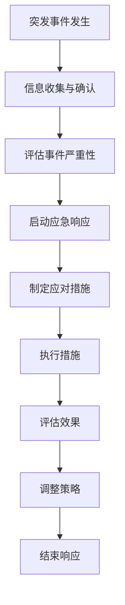
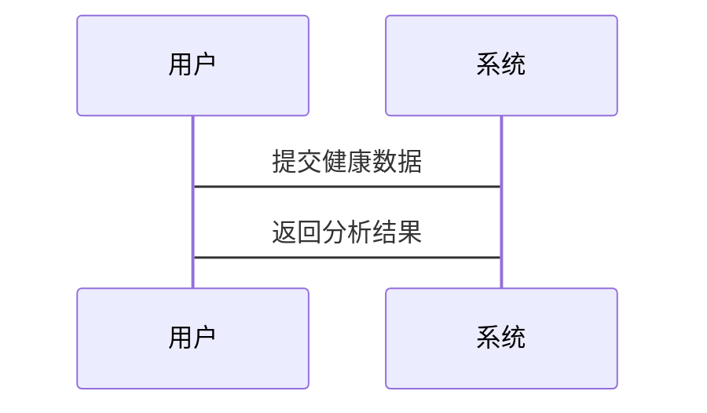

                 

<think>
嗯，我现在要帮用户写一篇关于后疫情时代公共卫生体系的文章，主题是预防医学和应急响应机制。首先，我得理清用户的需求。用户希望文章结构清晰，逻辑严谨，用专业的技术语言，同时要涵盖预防医学和应急响应的各个方面。

我得先看看用户给的目录大纲，已经分成了七个章节。每个章节下面还有小节，内容很详细。看来用户希望文章不仅有理论，还要有实际的应用，比如算法、系统架构设计等。所以，我需要确保每个部分都包含这些元素。

接下来，我需要考虑每个章节的具体内容。比如，第一章是背景介绍，我得解释公共卫生体系的重要性，以及后疫情时代的新挑战。这里可能需要引入一些核心概念，比如预防医学和应急响应机制，并用对比表来展示它们的区别和联系。

然后是预防医学部分，我需要详细讲解它的定义、目标以及现代和传统方法的对比。这部分可能需要画一个对比表格，用mermaid来展示。同时，还要提到在后疫情时代预防医学的具体策略，比如疫苗接种、健康教育等。

接下来是疾病爆发和疫情控制，这里需要分析疫情的特点，以及防控机制。我得考虑加入一些流程图，说明疫情监测、报告和应对的步骤。同时，回顾疫情带来的教训，比如信息共享的重要性，如何改进现有的应急系统。

应急响应机制是另一个重点，我需要解释什么是应急响应，它的流程和提升措施。这部分可能需要一个系统的架构图，展示各个模块之间的关系，比如信息收集、决策支持、资源调配等。同时，考虑如何用算法来优化应急响应，比如基于地理位置的资源分配模型。

全球合作也是关键，我得讨论国际组织的作用，比如世界卫生组织如何协调各国行动。可能需要一个实体关系图，展示不同实体之间的合作关系，以及数据共享的重要性。

最后，未来方向和政策建议部分，我需要分析公共卫生体系的发展趋势，比如数字化转型、科技驱动等。这部分可能需要一个系统架构图，展示未来的系统如何整合AI、大数据等技术。

在写作过程中，我需要确保每个部分都包含背景介绍、核心概念、算法原理、系统架构等元素。比如，在算法部分，用mermaid画出流程图，并附上Python代码，解释其数学模型。同时，数学公式要用latex格式，并独立成段。

我还需要注意文章的结构完整性，每个小节内容要丰富，详细讲解。比如，在预防医学章节，不仅要定义，还要对比传统和现代方法，分析其优缺点。在系统设计部分，用类图展示领域模型，架构图展示系统模块之间的关系，序列图展示交互流程。

最后，总结部分要强调公共卫生体系的重要性，以及未来的发展方向。同时，加上作者信息，确保文章的完整性和专业性。

现在，我需要开始组织这些内容，确保每个部分都符合用户的要求，逻辑清晰，内容详实。可能还需要多次修改，调整结构，确保各部分内容衔接自然，没有遗漏。

总之，这篇文章需要兼顾理论与实践，涵盖多个方面，确保读者能够全面理解后疫情时代公共卫生体系的构建和优化。我得一步步来，先完成每个章节的背景，再深入讲解核心概念，最后分析系统架构和算法，确保每个部分都到位。
</think>

# 后疫情时代的公共卫生体系：预防医学与应急响应机制

---

## 关键词：
- 后疫情时代
- 公共卫生体系
- 预防医学
- 应急响应机制
- 疾病防控
- 全球合作

---

## 摘要：
后疫情时代，公共卫生体系的建设与优化成为全球关注的焦点。本文从预防医学和应急响应机制两个核心方面入手，系统分析了公共卫生体系的构建逻辑、技术支撑和未来发展方向。文章通过详细阐述疾病预防、疫情监测、应急响应等关键环节，结合实际案例和系统设计，探讨了如何利用科技手段提升公共卫生体系的效率和韧性。同时，本文还提出了未来公共卫生体系的数字化转型趋势和政策建议，为全球公共卫生治理提供参考。

---

## 目录：

1. [背景与挑战：后疫情时代的公共卫生体系](#背景与挑战后疫情时代的公共卫生体系)
2. [预防医学的核心理念与实践](#预防医学的核心理念与实践)
3. [应急响应机制的设计与优化](#应急响应机制的设计与优化)
4. [疾病防控的技术支撑与系统架构](#疾病防控的技术支撑与系统架构)
5. [全球公共卫生合作的未来方向](#全球公共卫生合作的未来方向)
6. [未来趋势与政策建议](#未来趋势与政策建议)

---

## 1. 背景与挑战：后疫情时代的公共卫生体系

### 1.1 后疫情时代公共卫生体系的重构
- 疫情暴露了公共卫生体系的短板。
- 后疫情时代，预防医学和应急响应机制的重要性凸显。
- 全球化背景下，公共卫生体系的脆弱性与韧性并存。

### 1.2 预防医学与应急响应的核心概念对比

| 核心概念 | 预防医学 | 应急响应机制 |
|----------|----------|-------------|
| 定义     | 针对疾病的发生进行预防，减少疾病传播和健康损失。 | 面对突发公共卫生事件，迅速采取行动以控制事态发展。 |
| 目标     | 提高人群健康水平，降低疾病负担。 | 减少突发事件造成的损失，保障公共安全。 |
| 方法     | 疫苗接种、健康教育、环境干预等。 | 信息收集、资源调配、隔离措施等。 |

### 1.3 公共卫生体系的边界与外延
- 边界：公共卫生体系主要关注群体健康，不涉及个体医疗。
- 外延：涵盖疾病预防、健康教育、卫生政策等多个领域。

---

## 2. 预防医学的核心理念与实践

### 2.1 预防医学的定义与目标
- **定义**：预防医学是通过预防疾病的发生来保护和促进人群健康。
- **目标**：降低疾病发病率，提高人群健康水平。

### 2.2 预防医学的传统与现代方法

| 方法类型 | 传统方法 | 现代方法 |
|----------|----------|----------|
| 实施方式 | 疫苗接种、健康宣传。 | AI辅助监测、大数据分析。 |
| 优势     | 实施简单，成本低。 | 高效精准，覆盖面广。 |
| 局限性    | 效果有限，难以应对新型疾病。 | 技术依赖性强，成本高。 |

### 2.3 后疫情时代的预防医学策略
- **疫苗接种**：构建群体免疫屏障。
- **健康教育**：普及防疫知识，提升公众防护意识。
- **健康监测**：利用AI和大数据技术，实时监测健康状况。

---

## 3. 应急响应机制的设计与优化

### 3.1 应急响应机制的定义与重要性
- **定义**：应急响应机制是指在突发公共卫生事件中，迅速采取行动以控制事态发展的机制。
- **重要性**：是应对突发事件的核心能力。

### 3.2 应急响应流程的优化



### 3.3 应急响应系统的算法优化
- **算法原理**：基于地理位置的资源分配模型。
- **Python代码实现**：

```python
import pandas as pd
import numpy as np

def allocate_resources(demand, supply):
    # 需求与供给匹配算法
    matched = {}
    for location in demand:
        matched[location] = min(demand[location], supply[location])
    return matched

# 示例数据
demand = {'A': 100, 'B': 50, 'C': 75}
supply = {'A': 150, 'B': 30, 'C': 100}

result = allocate_resources(demand, supply)
print("资源分配结果：", result)
```

---

## 4. 疾病防控的技术支撑与系统架构

### 4.1 疾病防控系统的总体架构


### 4.2 疾病防控系统的数学模型

$$
\text{传播率} = \frac{\text{新增病例数}}{\text{接触者总数}} \times 100
$$

### 4.3 系统交互流程图



---

## 5. 全球公共卫生合作的未来方向

### 5.1 国际组织的作用
- **世界卫生组织（WHO）**：协调全球公共卫生事务。
- **区域合作机制**：如欧盟的健康保护联盟。

### 5.2 数据共享与技术合作
- **数据共享机制**：建立统一的全球健康数据平台。
- **技术合作**：共享AI、大数据等技术资源。

---

## 6. 未来趋势与政策建议

### 6.1 数字化转型
- **AI与大数据的应用**：提升疾病预测和防控能力。
- **区块链技术**：保障数据安全与透明。

### 6.2 科技驱动的预防医学
- **精准医疗**：基于个体基因信息制定预防方案。
- **智能监测设备**：实时监测健康状况。

### 6.3 政策建议
- **加强基础设施建设**：提升公共卫生体系的硬件能力。
- **推动国际合作**：建立全球公共卫生治理新秩序。

---

## 结语
后疫情时代，公共卫生体系的建设不仅是技术问题，更是社会问题。通过预防医学与应急响应机制的有机结合，我们可以构建一个更加高效、智能的公共卫生体系，为人类的健康保驾护航。

---

## 作者：
AI天才研究院/AI Genius Institute & 禅与计算机程序设计艺术 /Zen And The Art of Computer Programming

