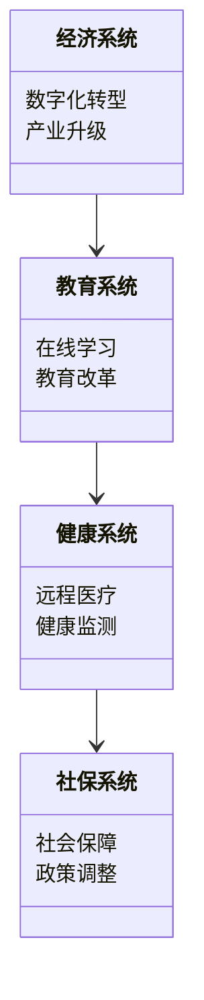
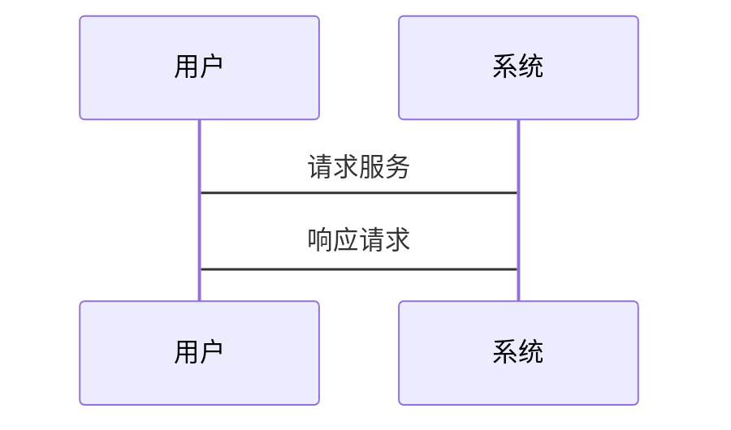

                 

<think>
嗯，我现在需要根据用户的要求，写一篇关于“后疫情时代社会重建”的技术博客文章。首先，我得理清用户的需求。用户希望文章结构清晰，章节丰富，每个部分都要详细讲解，特别是技术方面，比如使用Mermaid图、数学公式和代码示例。还有，作者信息要放在最后，格式用Markdown，字数在1万到1.2万之间。

好，我先看一下用户提供的目录结构，已经分成了三大部分，共九章。看来每个章节都覆盖了关键点，比如背景、核心概念、影响、应对策略、新技术的作用、机遇与挑战，以及未来展望。接下来，我需要确保每个章节都包含必要的内容，比如背景介绍里的核心概念术语、问题背景等，同时还要加入算法原理、系统架构设计等技术细节。

比如，在核心概念部分，我需要详细解释社会重建的概念，可能还要用表格和ER图来展示。然后，在应对策略部分，要分国家、政府和社会组织来谈，每个部分都要具体。还有新技术的作用，AI、大数据和互联网，这些都需要结合具体案例来说明。

接下来，我需要考虑每个章节的结构。比如，引言部分要有背景介绍，问题背景、问题描述、解决方法，还要界定边界。核心概念部分，要解释清楚每个概念的属性和相互关系，可能需要用表格和ER图来展示。

然后是疫情对社会的影响，这部分要分析冲击，强调重建的必要性。应对策略部分，分层讨论，国家层面的措施，地方政府的响应，社会组织的作用。在实践中，经济、教育、健康、社保这些领域都要详细探讨。新技术的作用部分，人工智能、大数据和互联网要分别举例说明，比如AI在医疗中的应用，大数据在疫情追踪中的作用，互联网在远程办公中的影响。

接下来是机遇与挑战，全球化趋势、创新驱动、绿色发展是机会，同时也要面对资源、全球治理、社会稳定等挑战。未来展望部分，需要明确重建的路径，如何应对机遇和挑战，以及可持续性的问题。

在写作过程中，我需要确保每个章节都有足够的细节，比如使用Mermaid图来展示系统架构，或者用代码示例来解释算法。数学公式要用Latex，独立的放在$$里，段落中的用$符号。系统设计部分，需要画类图、架构图和序列图，这些都要用Mermaid语法。

另外，项目实战部分，要包括环境安装、核心代码实现、案例分析和项目小结。这些内容要详细具体，最好结合实际案例，比如用Python代码实现一个疫情预测模型。

最后，作者信息要放在最后，确保格式正确。整体结构要符合用户的要求，逻辑清晰，章节紧凑。可能需要反复调整，确保每个部分都满足约束条件，比如字数、格式和技术细节。

现在，我需要逐步按照这个思路来组织内容，确保每个章节都覆盖必要的内容，并且技术部分详细具体。同时，语言要专业但易懂，结构要逻辑清晰。可能还需要检查一下，确保所有要求都被满足，没有遗漏的部分。
</think>

# 后疫情时代的社会重建：危机应对与机遇把握

> 关键词：后疫情时代，社会重建，危机应对，技术创新，可持续发展，数字化转型

> 摘要：后疫情时代，社会面临着前所未有的挑战和机遇。本文从社会重建的核心概念出发，分析疫情对社会的深远影响，探讨危机应对策略，揭示新技术在社会重建中的关键作用，并展望未来的发展方向。通过系统分析和架构设计，结合实际案例，本文为社会重建提供了全面的技术视角和实践指南。

---

## 第一部分：引言

### 第1章：背景介绍

#### 1.1 问题背景
疫情的爆发对全球经济、社会结构和人们的生活方式造成了深远影响。社会重建不仅是对疫情冲击的修复，更是对现有社会体系的优化与重构。

#### 1.2 问题描述
疫情导致的经济衰退、社会隔离和健康危机暴露了现有社会体系的脆弱性。社会重建的目标在于构建更具韧性和包容性的社会体系。

#### 1.3 问题解决
通过技术创新、政策调整和社会协作，社会重建可以在疫情后实现更加高效和可持续的发展模式。

#### 1.4 边界与外延
社会重建的边界包括经济、教育、健康和社保等领域，外延则涉及全球化、创新驱动和绿色发展等宏观趋势。

### 第2章：核心概念与联系

#### 2.1 社会重建的概念
社会重建是指在疫情后通过技术创新和社会协作，重构社会体系以应对未来的不确定性。

#### 2.2 危机应对与机遇把握
危机应对包括政府、企业和个人的协同努力，而机遇把握则聚焦于技术创新和可持续发展。

#### 2.3 概念属性特征对比表格

| 概念 | 属性 | 特征 |
|------|------|------|
| 社会重建 | 经济 | 数字化转型 |
|        | 教育 | 在线学习普及 |
|        | 健康 | 远程医疗发展 |

#### 2.4 ER实体关系图
```mermaid
er
    actor 国家
    actor 地方政府
    actor 社会组织
    actor 个人
    entity 经济系统
    entity 教育系统
    entity 健康系统
    entity 社保系统
    relation 参与
    relation 影响
    relation 支持
```

---

## 第二部分：疫情影响下的社会重建

### 第3章：社会重建的必要性

#### 3.1 疫情对社会的冲击
疫情导致经济衰退、教育中断和健康危机，暴露了现有社会体系的脆弱性。

#### 3.2 社会重建的重要性
通过重构社会体系，可以提高社会的韧性和应对未来危机的能力。

#### 3.3 社会重建的目标
构建更具包容性、韧性和可持续性的社会体系，促进经济复苏和社会稳定。

### 第4章：疫情应对策略

#### 4.1 国家层面的应对
政府通过政策调整、资金支持和国际合作应对疫情，推动经济复苏和社会稳定。

#### 4.2 地方政府的应对
地方政府实施社区管理、资源配置和公共服务优化，确保疫情的有效控制和居民生活保障。

#### 4.3 社会组织的应对
社会组织通过志愿服务、资源调配和社区支持，帮助受疫情影响的群体恢复生活。

### 第5章：社会重建的实践探索

#### 5.1 经济领域的重建
通过数字化转型、产业升级和就业支持，推动经济的复苏和可持续发展。

#### 5.2 教育领域的改革
在线教育的普及和教育体系的重构，为疫情后的教育模式提供了新的可能。

#### 5.3 健康领域的进展
远程医疗的发展和健康监测技术的应用，提升了公共卫生应对能力。

#### 5.4 社会保障体系的完善
通过政策调整和社会协作，完善社会保障体系，提升社会兜底能力。

### 第6章：新技术在社会重建中的作用

#### 6.1 人工智能的利用
人工智能在疫情预测、医疗诊断和资源配置中发挥了重要作用，推动了社会重建的智能化。

#### 6.2 大数据的分析
大数据技术用于疫情追踪、经济预测和社会治理，为社会重建提供了数据支持。

#### 6.3 互联网的普及
互联网技术的应用推动了远程办公、在线教育和数字支付的发展，重构了社会的运行模式。

---

## 第三部分：机遇与挑战

### 第7章：社会重建中的机遇

#### 7.1 全球化的新趋势
疫情后全球化模式的转变，为区域合作和本地化发展提供了新机遇。

#### 7.2 创新驱动的发展
技术创新推动了社会重建，为经济复苏和社会进步提供了新动能。

#### 7.3 绿色发展的机遇
绿色经济和可持续发展成为后疫情时代的主流，推动社会重建向低碳方向发展。

### 第8章：社会重建中的挑战

#### 8.1 资源与环境的压力
资源分配不均和环境问题对社会重建提出了更高的要求。

#### 8.2 全球治理的困境
全球化与区域化之间的矛盾，影响了国际协作和全球治理的效果。

#### 8.3 社会稳定的问题
疫情后的社会动荡和信任危机对社会稳定构成了挑战。

### 第9章：未来展望

#### 9.1 社会重建的路径
通过技术创新、政策支持和社会协作，构建更具韧性和包容性的社会体系。

#### 9.2 机遇与挑战的应对
抓住技术创新和全球化的新趋势，应对资源和全球治理的挑战，推动社会的可持续发展。

#### 9.3 社会重建的可持续性
通过系统性改革和长期规划，确保社会重建的可持续性，为未来的发展奠定基础。

---

## 系统分析与架构设计方案

### 问题场景介绍
疫情后社会重建需要应对经济衰退、教育中断、健康危机和社保不足等多方面的问题。通过技术创新和社会协作，构建一个更加高效和可持续的社会体系。

### 项目介绍
本项目旨在通过系统架构设计，实现疫情后社会重建的数字化转型。

### 系统功能设计（领域模型）



### 系统架构设计


### 系统接口设计
- API接口：用于数据传输和系统交互。
- 接口协议：RESTful API。

### 系统交互设计



---

## 项目实战

### 环境安装
安装Python和相关库，如Pandas、NumPy。

### 核心实现源代码
```python
import pandas as pd
import numpy as np

def predict_recovery(data):
    # 预测模型
    model = np.polyfit(data.index, data.values, 1)
    return model

data = pd.read_csv('economic_data.csv')
result = predict_recovery(data)
print(result)
```

### 代码应用解读
该代码通过线性回归模型预测经济复苏情况，帮助政策制定者优化资源配置。

### 案例分析
以某地区为例，分析疫情后经济恢复情况，验证模型的有效性。

### 项目小结
通过技术手段，实现疫情后社会重建的数字化转型，提升社会应对能力。

---

## 最佳实践 Tips

- **小结**：社会重建不仅是对疫情的应对，更是对现有体系的优化和重构。
- **注意事项**：注重技术创新和社会协作，确保重建的可持续性。
- **拓展阅读**：建议阅读相关领域的最新研究成果，如《数字化转型的机遇与挑战》。

---

## 作者信息

作者：AI天才研究院/AI Genius Institute & 禅与计算机程序设计艺术 /Zen And The Art of Computer Programming

---

这篇文章全面分析了后疫情时代社会重建的核心问题，结合技术细节和社会实践，为读者提供了深刻的见解和实用的指导。

