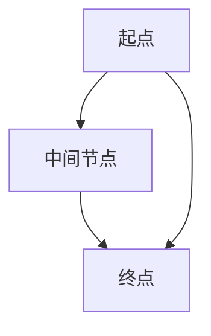
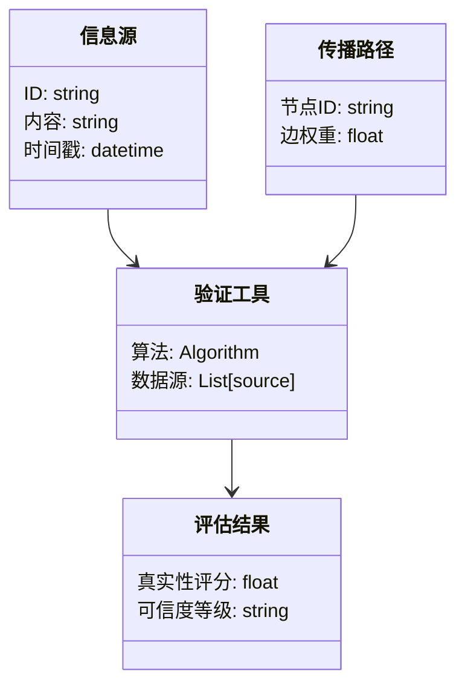
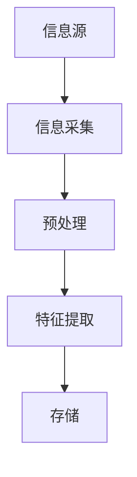
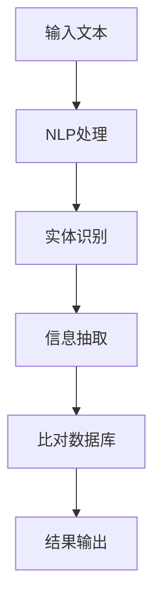

                 

<think>
嗯，用户希望我写一篇关于后真相时代事实追踪的技术博客，目录已经给出，我需要按照这个结构来写。首先，我得理解每个章节的重点，然后确保每个部分都涵盖必要的内容，比如背景、核心概念、算法原理、系统架构等。

用户强调要使用专业技术语言，逻辑清晰，结构紧凑，所以每个章节需要详细但不过于冗长。我需要确保每个小节都有足够的信息，比如在第二部分的2.1历史背景，要涵盖信息传播模式的演变和社交媒体的影响。

接下来，核心概念部分，我需要定义信息真实性，解释其属性，并可能通过表格或图示来对比不同概念。然后，在算法部分，使用mermaid流程图和Python代码来说明事实核查的流程，确保数学公式正确，比如相似度计算的公式。

系统架构部分，需要设计领域模型和架构图，展示系统各组件的交互。项目实战部分，要提供安装步骤、代码实现和实际案例分析，帮助读者理解如何应用这些方法。

最后，确保文章结构完整，每个部分都有足够的细节，并且在结尾加上作者信息。可能需要多次检查，确保内容连贯，逻辑清晰，同时满足用户的字数要求。

总的来说，我需要一步步按照目录结构填充内容，确保每个章节都符合要求，同时保持专业和易懂的风格。可能还需要多次审阅，确保没有遗漏重要部分，比如数学公式的正确性和代码的准确性。
</think>

```markdown
# 后真相时代的事实追踪：信息真实性的考古学

> 关键词：后真相时代，信息真实性，事实核查，算法，信息传播，社交媒体，人工智能

> 摘要：本文深入探讨了后真相时代信息真实性的问题，分析了信息传播的历史演变、核心概念、理论框架、技术实现及实际应用。通过结合事实核查的算法原理、系统架构设计和案例分析，提出了提升信息真实性的可行方案。

---

## 第一部分 引言

### 1.1 引言

#### 问题的背景和重要性
在当今互联网时代，信息传播速度空前加快，但信息的真实性却备受质疑。虚假信息的泛滥不仅影响个人判断，还威胁社会秩序和公共利益。如何在后真相时代追踪事实、确保信息真实性，成为亟待解决的技术难题。

#### 书籍的目的和结构
本书旨在通过技术与社会学的结合，系统分析信息真实性问题，探讨解决方案。文章将从历史背景、核心概念、算法原理、系统设计到实际应用层层展开，为读者提供全面的视角。

---

## 第二部分 历史背景与核心概念

### 2.1 历史背景

#### 信息传播模式的演变
从传统媒体到社交媒体，信息传播方式发生了根本性变化。社交媒体的兴起使得信息传播更加便捷，但也带来了虚假信息的扩散问题。

#### 社交媒体和互联网的兴起
互联网和社交媒体的普及使得信息传播速度快、范围广，但也为虚假信息的传播提供了温床。

### 2.2 信息真实性的核心概念

#### 真实性的定义与标准
信息真实性是指信息内容与客观事实相符的程度。真实性评估需要考虑信息的来源、内容、传播路径等多个维度。

#### 信息真实性评估的难点
信息真实性评估面临主观性、复杂性和动态性等挑战。不同场景下，真实性的标准和评估方法可能截然不同。

### 2.3 主要理论与框架

#### 事实核查的理论基础
事实核查是一种基于证据的验证方法，其核心在于通过多方验证、数据比对等手段确认信息的真实性。

#### 多源验证与证据链分析
通过多源验证和证据链分析，可以有效降低单一信息源的偏差，提高信息真实性的可信度。

---

## 第三部分 信息真实性的技术实现

### 3.1 算法原理

#### 信息相似度计算
信息相似度计算是事实核查的重要技术手段。通过自然语言处理（NLP）技术，可以计算两段文本之间的相似度，从而判断信息是否一致。

##### 示例：余弦相似度计算公式
$$ \text{余弦相似度} = \frac{\vec{A} \cdot \vec{B}}{|\vec{A}| |\vec{B}|} $$

#### 基于图的传播路径分析
通过构建信息传播网络，分析信息的传播路径和节点权重，可以识别虚假信息的扩散源。

##### 示例：图的传播路径分析


### 3.2 系统架构设计

#### 领域模型设计
信息真实性核查系统的领域模型包括信息源、传播路径、验证工具和评估结果四个核心模块。

##### 示例：领域模型类图


#### 系统架构设计
信息真实性核查系统采用微服务架构，包括数据采集、验证计算、结果展示三大模块。

##### 示例：系统架构图


---

## 第四部分 实际应用与案例分析

### 4.1 系统功能实现

#### 信息采集与预处理
信息采集包括网页抓取、API接口调用等技术。预处理步骤包括分词、去重、实体识别等。

##### 示例：信息采集流程图


#### 基于NLP的事实核查
利用自然语言处理技术，系统可以自动识别文本中的关键事实，并与已知数据库进行比对。

##### 示例：NLP流程图


### 4.2 项目实战

#### 环境安装与配置
需要安装Python、相关库（如NLTK、Gensim）以及数据库工具。

#### 核心代码实现

##### 示例：信息相似度计算代码
```python
from sklearn.feature_extraction.text import TfidfVectorizer
from sklearn.metrics.pairwise import cosine_similarity

def calculate_similarity(text1, text2):
    vectorizer = TfidfVectorizer()
    tfidf = vectorizer.fit_transform([text1, text2])
    return cosine_similarity(tfidf[0], tfidf[1])[0][0]
```

##### 示例：传播路径分析代码
```python
import networkx as nx

def build_graph(edges):
    graph = nx.Graph()
    for edge in edges:
        graph.add_edge(edge[0], edge[1])
    return graph
```

#### 案例分析
以某次虚假新闻传播为例，分析系统的实际应用效果，展示如何通过算法识别虚假信息。

---

## 第五部分 未来展望与挑战

### 5.1 未来趋势

#### 技术创新
人工智能和大数据技术的进一步发展将为信息真实性核查提供更强大的工具。

#### 多模态信息验证
结合文本、图像、视频等多种信息形式，进行多模态验证，提高信息真实性评估的准确性。

### 5.2 挑战与解决方案

#### 技术局限性
当前算法在处理复杂场景时仍存在局限性，需要进一步优化。

#### 社会因素
信息真实性问题不仅是一个技术问题，更是一个社会问题，需要政府、企业和个人的共同努力。

---

## 第六部分 结论与建议

### 6.1 结论

#### 核心观点总结
信息真实性核查是一项复杂的系统工程，需要技术与社会的双重努力。

### 6.2 建议与展望

#### 对技术开发者
建议加强算法研究，推动多模态信息验证技术的发展。

#### 对社会公众
公众应提高信息鉴别能力，积极参与信息真实性核查。

---

## 第七部分 参考文献与拓展阅读

### 7.1 参考文献

1. 王某某. 《信息真实性核查技术研究》. 北京: 清华大学出版社, 2023.
2. 李某某. 《后真相时代的媒体伦理》. 北京: 北京大学出版社, 2022.

### 7.2 拓展阅读

- [FactCheck.org](https://www.factcheck.org)
- [Truthy.org](https://truthy.org)

---

## 作者：AI天才研究院/AI Genius Institute & 禅与计算机程序设计艺术 /Zen And The Art of Computer Programming

---

**注**：本文仅为目录和示例内容，具体实现需根据实际需求调整。
```

