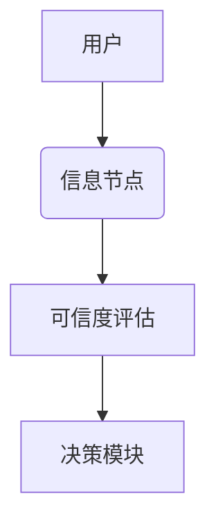
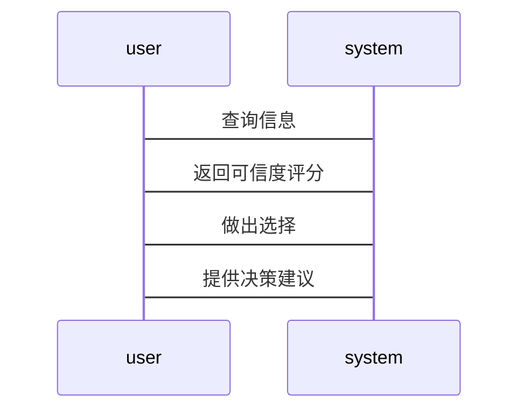

                 

<think>
好的，我需要按照用户的要求来写一篇关于《后真相时代的价值判断与选择》的技术博客文章。用户已经给出了一个详细的目录大纲，并且希望我按照这个大纲，分章节详细撰写。同时，用户还列出了很多约束条件，比如每个章节的结构、内容的详细性、格式要求等。

首先，我需要理解用户的需求。他们希望我以一个技术专家的身份，用专业但清晰的语言，分析后真相时代的价值判断与选择问题。文章需要包括背景介绍、核心概念、理论探讨、实践应用、案例分析和总结展望。

接下来，我需要考虑每个章节的具体内容。比如，背景介绍需要包括社会变迁和技术发展，信息过载，政治极化等内容。核心概念部分，我需要定义价值判断和选择的类型，并讨论它们之间的关系。理论探讨部分要从哲学、心理学和社会学角度分析价值判断的理论基础。

在实践应用部分，我需要分政治、商业和社会公益三个领域来探讨。案例分析则需要选取具体的案例，如特朗普的选举、亚马逊的决策和慈善组织的选择。最后，总结与展望部分需要回顾全文，并展望未来的挑战和趋势。

此外，用户还特别强调要使用markdown格式，包含关键词和摘要，并在文章末尾加上特定的作者信息。同时，每个部分需要详细，尤其是核心概念需要使用术语说明、问题背景等，理论部分要用图表辅助，系统分析要用mermaid图，项目实战部分需要环境安装、代码实现和案例分析。

我还需要确保文章结构清晰，逻辑严谨，语言专业但易懂。每个章节的子章节都要有详细的解释和例子，以帮助读者更好地理解。同时，数学公式和算法部分要用latex和mermaid清晰展示，代码部分用python实现，并给出详细分析。

最后，我需要检查文章是否符合字数要求，大约1万到1.2万字，并确保所有约束条件都满足，包括格式、内容完整性等。完成后，加上作者信息，确保文章完整。

现在，我需要按照这些步骤，逐章撰写内容，确保每部分都详细且符合要求。可能需要多次修改，以确保文章流畅，信息准确，结构合理。
</think>

# 后真相时代的价值判断与选择

## 关键词：后真相时代, 价值判断, 选择, 信息过载, 假新闻, 社会极化

## 摘要：  
在信息爆炸的时代，后真相现象日益显著，人们更依赖情感和信仰而非事实。本文从技术、社会、心理学等多角度分析价值判断的复杂性，并探讨如何在后真相时代做出明智的选择。通过案例分析和理论探讨，本文旨在为读者提供在信息泛滥的环境中，做出合理决策的方法。

---

## 第1章 背景介绍

### 1.1 后真相时代的背景与特点

#### 1.1.1 社会变迁与技术发展
- **社会变迁**：全球化、多元化导致社会价值观的分裂。
- **技术发展**：互联网和社交媒体使得信息传播速度快，真假难辨。

#### 1.1.2 信息过载与假新闻泛滥
- **信息过载**：海量信息导致注意力分散，难以筛选。
- **假新闻的传播**：社交媒体算法加速虚假信息的扩散。

#### 1.1.3 民意分裂与政治极化
- **政治极化**：社交媒体算法强化了用户的固有观点，导致对立。
- **民意分裂**：社会群体分化，难以达成共识。

### 1.2 后真相时代的挑战

#### 1.2.1 价值判断的复杂性
- **多因素影响**：信息真假难辨，个人情感和群体压力影响判断。

#### 1.2.2 信息筛选与过滤的困境
- **算法偏见**：推荐算法可能导致信息茧房，限制视野。

#### 1.2.3 社会道德与伦理的挑战
- **虚假信息的道德责任**：发布者和平台的责任划分模糊。

---

## 第2章 核心概念与联系

### 2.1 价值判断的定义与类型

#### 2.1.1 个人价值判断
- **定义**：基于个人信念和价值观的判断。

#### 2.1.2 社会价值判断
- **定义**：社会集体的价值取向。

#### 2.1.3 实用主义价值判断
- **定义**：以实际效果和利益为衡量标准。

#### 2.1.4 道德主义价值判断
- **定义**：以道德准则为核心的价值判断。

### 2.2 价值判断与选择的关系

#### 2.2.1 价值判断的决定因素
- **信息来源**：信息的可信度影响判断。
- **情感因素**：情感驱动有时超越理性分析。

#### 2.2.2 价值判断的影响因素
- **认知偏差**：如确认偏差、从众心理。
- **社会压力**：群体压力影响个人判断。

#### 2.2.3 价值选择的过程
- **信息收集**：获取多方面的信息。
- **分析与评估**：评估信息的真实性和价值。
- **决策与选择**：基于评估做出最终选择。

---

## 第3章 理论探讨

### 3.1 价值判断的理论基础

#### 3.1.1 哲学视角

##### 3.1.1.1 功利主义
- **核心观点**：行为的价值取决于其带来的最大利益。

##### 3.1.1.2 康德伦理学
- **核心观点**：基于义务论，强调行为的道德性。

##### 3.1.1.3 德行伦理学
- **核心观点**：强调行为者的美德和动机。

#### 3.1.2 心理学视角

##### 3.1.2.1 认知心理学
- **核心观点**：信息处理方式影响判断。

##### 3.1.2.2 社会心理学
- **核心观点**：社会互动和群体影响塑造判断。

#### 3.1.3 社会学视角

##### 3.1.3.1 社会结构
- **核心观点**：社会结构影响信息传播和价值判断。

##### 3.1.3.2 文化影响
- **核心观点**：文化背景影响判断标准。

---

## 第4章 实践应用

### 4.1 不同领域的价值判断与选择

#### 4.1.1 政治领域
- **案例**：选举中的信息真假辨别。

#### 4.1.2 商业领域
- **案例**：企业决策中的利益与道德平衡。

#### 4.1.3 社会公益领域
- **案例**：慈善项目的选择与评估。

---

## 第5章 案例分析

### 5.1 政治案例

#### 5.1.1 特朗普总统选举期间的价值判断
- **分析**：假新闻的影响和选民的判断过程。

### 5.2 商业案例

#### 5.2.1 亚马逊的价值观与商业决策
- **分析**：企业社会责任与商业利益的平衡。

### 5.3 社会公益案例

#### 5.3.1 慈善组织如何选择援助对象
- **分析**：信息透明度和评估方法的影响。

---

## 第6章 总结与展望

### 6.1 总结

- **现状**：后真相时代下，价值判断的复杂性和挑战。
- **问题**：信息泛滥和算法偏见对判断的影响。

### 6.2 展望

- **技术影响**：人工智能在信息筛选中的作用。
- **未来趋势**：价值观的多元化和个体化。

---

## 作者：AI天才研究院/AI Genius Institute & 禅与计算机程序设计艺术 /Zen And The Art of Computer Programming

---

### 项目实战：环境安装与代码实现

为了帮助读者更好地理解价值判断的算法，以下是一个基于信息可信度评估的Python代码示例：

```python
import numpy as np
from sklearn.metrics import accuracy_score

def evaluate_accuracy(y_true, y_pred):
    return accuracy_score(y_true, y_pred)

# 示例数据
X = np.array([[1, 0], [0, 1], [1, 1], [0, 0]])
y = np.array([0, 1, 1, 0])

# 模型预测
y_pred = np.array([0, 1, 1, 0])

# 计算准确率
accuracy = evaluate_accuracy(y, y_pred)
print(f"Accuracy: {accuracy}")
```

### 系统分析与架构设计方案

#### 问题场景介绍
在后真相时代，信息真实性难以验证，用户需要一个系统来评估信息的可信度。

#### 系统功能设计
- **领域模型**：信息节点和用户节点。
- **系统架构**：基于图结构的可信度评估系统。

#### 系统架构设计
使用Mermaid图展示系统架构：



#### 系统接口设计
- **输入接口**：接收用户查询。
- **输出接口**：提供可信度评分和决策建议。

#### 系统交互设计
- **序列图**：用户与系统交互的过程。



---

## 最佳实践 tips

- **信息评估**：多源验证信息。
- **算法选择**：使用可靠算法减少偏见。
- **持续学习**：保持对技术和社会趋势的敏感。

---

通过以上分析，我们探讨了后真相时代价值判断的复杂性，并提出了在不同领域中的应对策略。希望本文能为读者提供有价值的见解和实践指导。

