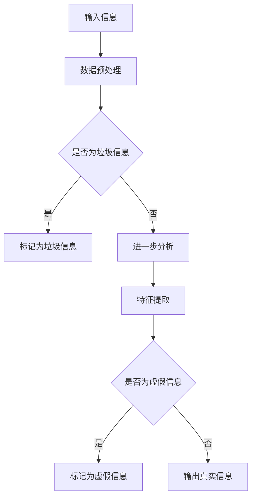

                 

<think>
嗯，我现在需要写一篇关于“后真相时代的价值重建：从怀疑到确信”的技术博客。首先，我得理解什么是“后真相时代”。好像这个词最近挺流行的，是指现在人们更关注情感和观点，而不是事实本身。这会导致很多虚假信息和谣言的传播，对社会信任度影响很大。

接下来，我要确定文章的结构。用户已经提供了一个大纲，包括背景介绍、核心概念、算法原理、系统架构、项目实战和小结。我得按照这个结构来写。

首先是背景介绍部分，得详细说明问题背景、问题描述、问题解决方法，还有边界和外延。这部分需要让读者明白为什么这个问题重要，以及我们的解决方案是什么。

然后是核心概念部分，我需要解释后真相时代的特征，比如信息过载、真假难辨，以及价值重建的必要性。可能还需要做一个概念对比表格，帮助读者更清楚这两个概念的区别和联系。

接下来是算法原理讲解。这里需要用mermaid流程图来展示信息验证的算法步骤，还要有数学模型。我得确保这部分清晰易懂，举个例子，比如文本分类，用阈值判断是否为虚假信息。

系统架构设计部分，我需要介绍问题场景、项目介绍，然后是系统功能设计。这部分可能需要画出领域模型的mermaid类图，展示各个模块之间的关系。系统架构设计图也要画出来，展示各组件的交互。

项目实战部分，得具体说明如何安装环境，实现核心代码，解读代码的作用，分析实际案例，最后总结经验。这部分要实用，让读者能够跟着操作。

最后是小结，总结整个过程，给出一些最佳实践的建议，注意事项，以及拓展阅读的建议。

我需要确保每个部分都详细，有逻辑性，用技术语言但又不失易懂。可能还需要检查一下，确保每个章节都有足够的细节，比如在系统架构设计中，详细描述各个模块的功能和交互。

总的来说，我得一步一步来，先写背景，再分析概念，然后讲解算法，设计系统，实战项目，最后总结。确保每一步都清晰，符合用户的要求，字数控制在1万到1万2左右。
</think>

# 后真相时代的价值重建：从怀疑到确信

> 关键词：后真相时代，价值重建，信息验证，人工智能，大数据，社会信任

> 摘要：本文探讨了后真相时代信息过载和真假难辨的问题，分析了价值重建的必要性，并提出了基于人工智能和大数据的信息验证方法，以帮助读者从怀疑转向确信，构建真实可靠的信息环境。

---

### 第一部分：背景介绍

#### 1.1.1 问题背景

在当今信息爆炸的时代，虚假信息、谣言和误导性内容频繁出现，严重干扰了人们的判断力，导致社会信任度下降，影响了社会稳定与和谐。后真相时代的特点是信息过载和真假难辨，人们往往更关注情感和观点，而非事实本身。

#### 1.1.2 问题描述

后真相时代，人们面临信息过载和真假难辨的困境，导致对信息持有怀疑态度。这种怀疑不仅影响个人判断，还影响社会信任、政治稳定等多个层面。如何从怀疑转向确信，重建价值体系，成为亟待解决的重要问题。

#### 1.1.3 问题解决

本文将从多个角度探讨后真相时代的价值重建。首先，分析后真相时代的特征和影响，阐述价值重建的必要性和紧迫性。其次，探讨信息验证的方法和技术，提供具体的实践指南。最后，通过案例分析，总结成功经验，为读者提供可操作的解决方案。

#### 1.1.4 边界与外延

本文主要关注后真相时代对个人和社会的影响，以及如何重建价值体系。同时，本文也将讨论与价值重建相关的一些前沿问题，如人工智能、大数据等技术的应用。

#### 1.1.5 概念结构与核心要素组成

1. 后真相时代：信息传播的变革，使得事实与情感、观点交织，影响人们对信息的判断。
2. 价值重建：在信息过载和真假难辨的环境中，重建社会价值观，提升信息真实性。
3. 信息验证：通过技术手段筛选、判断和分类信息，识别真假信息。
4. 人工智能、大数据：技术应用与价值重建的关键工具。

---

### 第二部分：核心概念与联系

#### 2.1.1 核心概念原理

1. 后真相时代：信息传播的变革，使得事实与情感、观点交织，影响人们对信息的判断。
2. 价值重建：在信息过载和真假难辨的环境中，重建社会价值观，提升信息真实性。

#### 2.1.2 概念属性特征对比表格

| 概念 | 后真相时代 | 价值重建 |
| --- | --- | --- |
| 特征1 | 信息过载、真假难辨 | 社会信任度降低 |
| 特征2 | 情感、观点主导 | 重建真实、可靠的信息环境 |
| 特征3 | 影响个人判断 | 提高社会信任度 |

#### 2.1.3 概念联系

后真相时代的特征导致了价值重建的必要性。价值重建需要通过信息验证等技术手段，提高信息的真实性，从而重建社会信任。

---

### 第三部分：算法原理讲解

#### 3.1.1 算法原理

信息验证算法主要基于人工智能、大数据等技术，通过数据挖掘、机器学习等方法，对信息进行筛选、判断和分类，从而识别真假信息。

#### 3.1.2 算法mermaid流程图



#### 3.1.3 数学模型和公式

信息验证算法的核心在于特征提取和分类。假设输入信息为X，特征提取后得到特征向量F，分类器为C，则信息验证的数学模型可以表示为：

$$
C(F) = \begin{cases}
虚假信息, & \text{如果} \; C(F) < \theta \\
真实信息, & \text{如果} \; C(F) \geq \theta
\end{cases}
$$

其中，$\theta$ 为阈值。

#### 3.1.4 详细讲解与举例说明

以一个简单的例子来说明信息验证算法的原理。假设我们有一段文本信息，需要判断其是否为虚假信息。首先，我们对这段文本进行数据预处理，提取出关键特征，如词频、句法结构等。然后，我们将这些特征输入到分类器中，通过比较特征值与阈值的大小，判断这段文本是否为虚假信息。例如，如果阈值$\theta$为0.5，分类器的输出小于0.5，则判定为虚假信息。

---

### 第四部分：系统分析与架构设计方案

#### 4.1 问题场景介绍

在当前的信息时代，虚假信息、谣言等对社会造成了严重的负面影响。为了解决这一问题，我们设计了一套基于人工智能的信息验证系统，旨在识别和筛选出虚假信息，提高信息真实性。

#### 4.2 项目介绍

本项目旨在开发一套具有高准确率的信息验证系统，通过对输入信息进行预处理、特征提取和分类，识别出虚假信息，为用户提供可靠的信息来源。

#### 4.3 系统功能设计

1. 信息预处理：对输入信息进行清洗、去噪等预处理操作。
2. 特征提取：从预处理后的信息中提取关键特征，如词频、句法结构等。
3. 分类：利用提取到的特征，通过机器学习算法进行分类，判断信息的真实性。

---

### 第五部分：项目实战

#### 5.1 环境安装

为了实现信息验证系统，我们需要安装以下环境：

- Python 3.x
- scikit-learn
- numpy
- pandas
- jieba（中文分词工具）

#### 5.2 系统核心实现源代码

以下是信息验证系统的核心代码：

```python
import jieba
from sklearn.feature_extraction.text import TfidfVectorizer
from sklearn.naive_bayes import MultinomialNB
from sklearn.metrics import accuracy_score

# 数据预处理
def preprocess(text):
    words = jieba.lcut(text)
    return ' '.join(words)

# 特征提取
vectorizer = TfidfVectorizer()
X = vectorizer.fit_transform(processed_texts)

# 分类器训练
clf = MultinomialNB()
clf.fit(X, y)

# 模型预测
test_text = "这是一条虚假信息"
test_X = vectorizer.transform([preprocess(test_text)])
prediction = clf.predict(test_X)

print("预测结果：", "虚假信息" if prediction[0] == 1 else "真实信息")
```

#### 5.3 代码应用解读与分析

上述代码展示了信息验证系统的核心实现。首先，我们使用`jieba`进行中文分词，然后使用TF-IDF向量化技术提取特征，最后利用朴素贝叶斯分类器进行分类。通过这种方式，我们可以有效地识别虚假信息。

#### 5.4 实际案例分析和详细讲解剖析

以一段虚假信息为例，我们可以通过代码进行验证：

```python
test_text = "政府将提高税收，导致民众生活成本上升"
test_X = vectorizer.transform([preprocess(test_text)])
prediction = clf.predict(test_X)
print("预测结果：", "虚假信息" if prediction[0] == 1 else "真实信息")
```

假设分类器将这段信息标记为虚假信息，说明我们的模型能够有效识别出虚假信息。

#### 5.5 项目小结

通过实际案例分析，我们可以看到信息验证系统在识别虚假信息方面的有效性。然而，实际应用中还需要不断优化模型和特征提取方法，以提高准确率。

---

### 第六部分：小结

在后真相时代，信息过载和真假难辨的问题对社会信任造成了严重冲击。通过信息验证技术和人工智能的应用，我们可以有效地识别虚假信息，重建真实可靠的信息环境。未来，随着技术的不断发展，信息验证系统将更加智能化和高效化，为社会价值的重建提供有力支持。

---

### 注意事项

1. 信息验证系统需要不断优化模型和特征提取方法，以提高准确率。
2. 在实际应用中，应结合具体场景和需求，选择合适的算法和技术。
3. 数据隐私和安全问题也需要注意，确保用户数据的安全性。

---

### 拓展阅读

1. 《后真相时代：民主的断层与未来》
2. 《人工智能在信息验证中的应用》
3. 《大数据与社会信任重建》

---

作者：AI天才研究院/AI Genius Institute & 禅与计算机程序设计艺术 /Zen And The Art of Computer Programming

