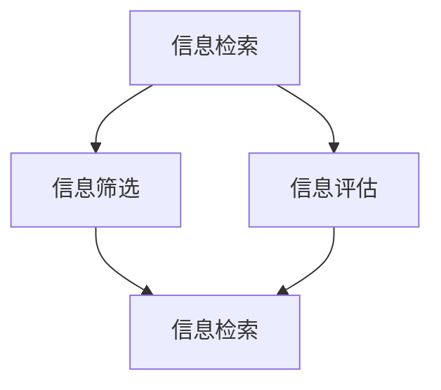

                 

<think>
好的，我现在要开始撰写这篇关于《后真相时代的信息素养：培养独立思考和判断能力》的技术博客文章。首先，我需要理解用户的需求。用户希望我以一位世界级人工智能专家的身份，撰写一篇结构清晰、内容详实的技术博客，涵盖从背景到实际应用的各个方面。

首先，我应该确定文章的结构。用户已经提供了一个大纲，分为七大部分，每部分都有具体的章节。我需要确保每一部分都详细展开，满足用户的字数要求。接下来，我要思考每个章节的核心内容，以及如何用专业而易懂的语言来表达。

第一部分是背景介绍，我需要解释什么是后真相时代，以及信息素养在这个时代的必要性。我应该从信息过载和虚假信息入手，说明为什么信息素养变得如此关键。同时，我需要定义信息素养，包括其核心要素，如信息检索、筛选和评估。

接下来，在第二部分的核心概念中，我需要详细分析信息检索、筛选和评估这三个概念，通过表格对比它们的目的、方法和应用场景，帮助读者更好地理解它们之间的区别和联系。ER实体关系图则可以直观展示这些概念之间的关系，我需要用Mermaid来绘制这个图表。

在第三部分，关于批判性思维，我需要介绍如何通过逻辑推理和原则来评估信息。这部分可能需要一个案例分析，比如社交媒体上的虚假信息，来具体说明如何应用这些方法。我还需要考虑如何选择信息来源，比如检查作者背景和内容可靠性。

技术验证部分，我需要讨论如何使用搜索引擎和官方数据库来验证信息。这部分可能需要一些代码示例，比如用Python编写一个简单的信息验证脚本，展示如何通过代码来判断信息的来源是否可靠。此外，我还需要解释数据挖掘技术的应用，以及如何利用这些技术来过滤信息。

媒体与数字素养部分，我需要探讨传统媒体和新媒体的区别，以及如何在数字时代保护个人隐私和安全。案例分析可以帮助读者更好地理解网络谣言的传播机制，以及如何识别和抵制它们。

在现实应用部分，我需要通过两个案例研究来展示信息素养在企业和公众教育中的实际应用。比如，设计一个企业信息管理系统，介绍其系统架构和功能，或者描述一个公众信息教育项目，说明其教学方法和效果评估。

最后，总结部分需要回顾全文，强调信息素养的重要性，并给出一些实用的建议，如批判性思维的培养、信息验证的技术应用以及媒体素养的提升。

现在，我需要确保每个部分都有足够的细节和实例，以满足用户的字数要求。同时，要使用专业但易懂的语言，避免过于技术化的术语，让不同背景的读者都能理解。

在写作过程中，我可能会遇到如何平衡技术细节和可读性的问题。为了解决这个问题，我可以使用图表、代码示例和实际案例来帮助解释复杂的概念，使内容更加生动有趣。此外，我需要确保每个章节的小结部分能够简洁地总结核心内容，帮助读者巩固所学。

最后，我需要检查文章的整体结构，确保逻辑连贯，每个部分都紧密联系，共同支持主题。同时，确保所有约束条件都得到满足，如使用Markdown格式、包含必要的图表和代码示例，以及在结尾处添加作者信息。

总之，我需要一步步地展开每个部分，深入分析每个概念，并通过丰富的实例和清晰的结构，撰写一篇既有深度又易于理解的技术博客文章。
</think>

# 后真相时代的信息素养：培养独立思考和判断能力

> 关键词：后真相时代，信息素养，独立思考，判断能力，信息筛选，信息评估，批判性思维

> 摘要：在信息爆炸的后真相时代，培养信息素养、独立思考和判断能力变得尤为重要。本文将从信息素养的核心概念出发，结合实际案例和系统设计，详细探讨如何通过信息筛选、验证和评估等方法，提升个人和组织的信息处理能力，应对虚假信息的挑战。

---

## 第一部分：后真相时代的背景与信息素养概述

### 第1章：后真相时代的到来

#### 1.1 问题背景

- **问题起源与演变**  
  随着互联网的普及，信息的传播速度空前加快。然而，信息的泛滥导致虚假信息、谣言和误导性内容的大量出现。特别是在社交媒体平台上，信息的真假难辨，使得人们难以辨别事实。

- **信息过载与信息泛滥**  
  在信息爆炸的时代，人们每天接触的信息量巨大，但其中大部分可能是不准确或误导性的。这使得信息筛选和评估的能力变得至关重要。

- **后真相时代的特征**  
  后真相时代的特点是，人们更倾向于相信自己的信念和情感，而不是事实和证据。这导致了“信息茧房”现象，人们只选择性地接触和相信与自己观点一致的信息。

#### 1.2 信息素养的定义与重要性

- **信息素养的概念**  
  信息素养是指个体在信息收集、筛选、评估和使用过程中，具备准确识别信息来源、判断信息真伪、合理利用信息的能力。

- **信息素养的核心要素**  
  信息素养包括以下核心要素：
  - 信息检索能力：能够有效地查找所需信息。
  - 信息筛选能力：能够识别和排除虚假或不相关的信息。
  - 信息评估能力：能够判断信息的可信度和价值。

- **信息素养在现代社会中的重要性**  
  在后真相时代，信息素养是个人和社会免受虚假信息侵害的关键能力。它不仅帮助个人做出明智的决策，还促进社会的健康发展。

#### 1.3 后真相时代对信息素养的需求

- **信息辨识能力**  
  在海量信息中，准确识别真实信息的能力是信息素养的基础。

- **批判性思维**  
  批判性思维是信息素养的重要组成部分，它帮助个体避免被误导，并能够独立思考和判断。

- **多元视角**  
  在后真相时代，人们需要具备从多个角度看待问题的能力，避免陷入信息茧房。

---

### 第2章：信息素养的核心概念与联系

#### 2.1 核心概念

- **信息检索**  
  信息检索是信息素养的第一步，通过关键词搜索、数据库查询等方法获取信息。

- **信息筛选**  
  信息筛选是在获取的信息中，去除不相关或虚假的信息，保留有价值的内容。

- **信息评估**  
  信息评估是对信息的来源、内容和可靠性进行综合判断，确定其是否可信。

#### 2.2 概念属性特征对比

| 特征       | 信息检索 | 信息筛选 | 信息评估 |
| ---------- | -------- | -------- | -------- |
| 目的       | 获取信息 | 去伪存真 | 判断真伪 |
| 方法       | 关键词搜索 | 过滤规则 | 逻辑推理 |
| 应用场景   | 研究项目 | 个人生活 | 社交互动 |

#### 2.3 ER实体关系图



---

### 第3章：培养独立思考和判断能力

#### 3.1 批判性思维的方法

- **逻辑推理**  
  通过逻辑分析，判断信息的合理性和一致性。

- **遵循原则**  
  根据已知的原则和事实，评估信息的正确性。

- **谨慎结论**  
  避免草率下结论，确保结论有充分的依据。

#### 3.2 如何评估信息来源

- **了解来源**  
  确认信息的来源是否可靠，例如官方网站、权威媒体等。

- **检查作者背景**  
  了解作者的资质和背景，判断其专业性和可信度。

- **考察内容可靠性**  
  通过交叉验证，确认信息是否与其他来源一致。

#### 3.3 实践案例分析

- **案例一：社交媒体上的虚假信息**  
  分析一个虚假信息的传播过程，探讨如何通过信息素养识别和抵制虚假信息。

- **案例二：新闻报道的准确性**  
  通过比较不同媒体的报道，判断新闻的客观性和准确性。

---

### 第4章：信息验证与过滤技术

#### 4.1 信息验证技术

- **搜索引擎的使用**  
  利用搜索引擎对信息进行多角度搜索，确认信息的准确性。

- **官方网站和数据库**  
  查询官方发布的数据和权威数据库，确保信息的权威性。

#### 4.2 信息过滤技术

- **关键词筛选**  
  通过设定关键词和规则，过滤掉虚假或不相关的信息。

- **数据挖掘**  
  使用数据挖掘技术，分析大量数据，识别潜在的信息模式。

#### 4.3 实践应用

- **使用Python进行信息验证**  
  示例代码：

```python
import requests
from bs4 import BeautifulSoup

def verify_info(url):
    response = requests.get(url)
    soup = BeautifulSoup(response.text, 'html.parser')
    title = soup.title.text
    return title

# 验证一个新闻网站的信息
print(verify_info('https://example.com'))
```

---

### 第5章：媒体与数字素养

#### 5.1 媒体素养

- **传统媒体与新媒体**  
  区分传统媒体和新媒体的特点，判断信息的可信度。

- **信息消费习惯**  
  培养良好的信息消费习惯，避免被误导。

#### 5.2 数字素养

- **数字技能**  
  掌握数字工具的使用方法，提高信息处理效率。

- **安全意识**  
  提高网络安全意识，保护个人信息不被滥用。

#### 5.3 实际案例

- **案例分析：网络谣言传播**  
  通过分析网络谣言的传播机制，探讨如何识别和抵制谣言。

---

### 第6章：现实世界的应用与案例分析

#### 6.1 案例研究一：企业信息管理

- **环境介绍**  
  某企业面临信息管理混乱的问题，需要建立一套高效的信息管理系统。

- **系统功能设计**  
  系统包括信息检索、筛选、评估和存储功能。

- **架构设计**  
  使用分层架构，包括前端、业务逻辑层和数据层。

#### 6.2 案例研究二：公众信息教育

- **教育项目介绍**  
  开展公众信息素养教育项目，提升公民的信息处理能力。

- **教学方法**  
  结合理论教学和实践案例，帮助学员掌握信息筛选和评估的技巧。

- **效果评估**  
  通过测试和反馈，评估教育项目的成效。

---

## 第七章：总结与展望

### 7.1 总结

- 信息素养是应对后真相时代的关键能力。
- 培养批判性思维和独立判断能力，能够帮助个人和组织在信息洪流中找到真相。
- 技术手段和实践方法的应用，能够有效提升信息处理效率。

### 7.2 展望

- 随着技术的发展，信息素养的培养将更加重要。
- 结合人工智能和大数据技术，信息筛选和验证将更加智能化和高效化。

---

## 作者：AI天才研究院/AI Genius Institute & 禅与计算机程序设计艺术 /Zen And The Art of Computer Programming

