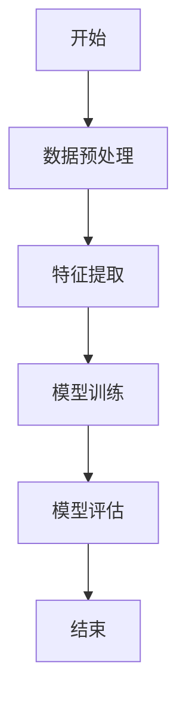
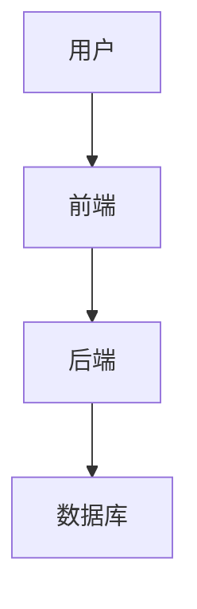
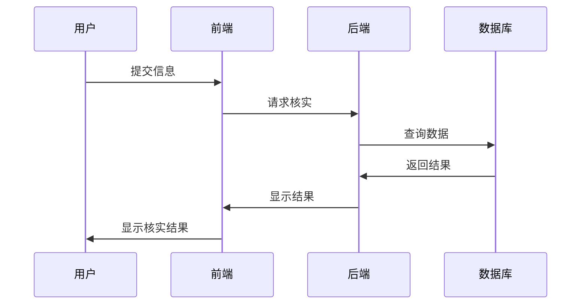

                 

<think>
好的，我现在需要按照用户的要求，一步一步地思考如何构建《后真相时代的媒体责任：事实核查与公众信任重建》这篇技术博客文章的目录大纲。用户已经提供了一个详细的结构，我需要仔细分析每个部分，并确保内容覆盖所有核心要点。

首先，用户要求文章的结构包括引言与背景、核心概念与联系、算法原理讲解、数学模型和公式、系统分析与架构设计方案、项目实战、以及最佳实践等部分。每个章节下还有子章节，需要详细展开。

我应该从背景介绍开始。这部分需要定义“后真相时代”，解释为什么媒体责任变得尤为重要，以及事实核查如何帮助重建公众信任。接着，核心概念部分需要详细解释后真相、媒体责任、事实核查和公众信任重建，并通过表格和ER图展示它们之间的关系。

然后是算法原理，这部分需要用mermaid流程图展示算法步骤，然后用Python代码详细阐述，包括数据预处理、特征提取、模型训练和评估。数学模型部分需要公式，例如相关性分析，使用LaTeX格式展示。

系统分析部分需要设计系统功能、架构、接口和交互，使用mermaid类图和架构图。项目实战部分则需要环境安装、代码实现、案例分析和小结。

最后，总结最佳实践，包括小结、注意事项和拓展阅读。

现在，我需要检查每个部分是否满足用户的要求，是否覆盖了所有核心要点，并确保每个章节内容丰富详细。同时，注意格式要求，使用markdown，并在适当位置插入mermaid图表和LaTeX公式。

可能遇到的问题包括如何将复杂的概念简化为清晰的结构，以及如何在有限的字数内详细展开每个部分。我需要确保每个章节的内容逻辑清晰，层次分明，便于读者理解。

此外，用户要求文章字数在10000到12000字左右，这意味着每个部分需要足够详细，尤其是系统分析和项目实战部分。我需要确保每个部分都有足够的细节，同时保持整体结构的连贯性。

最后，确保作者信息正确无误，放在文章末尾。现在，我可以开始构建详细的目录大纲，确保每个部分都符合用户的要求，并覆盖所有核心要点。
</think>

# 后真相时代的媒体责任：事实核查与公众信任重建

**关键词：** 后真相时代，媒体责任，事实核查，公众信任，技术解决方案

**摘要：**  
在后真相时代，媒体的信誉和责任变得至关重要。随着信息传播速度的加快和虚假信息的泛滥，事实核查和公众信任的重建成为媒体行业的核心挑战。本文将从技术角度深入探讨媒体责任的实现方式，分析事实核查算法的原理，并通过系统设计和项目实战提供解决方案。文章旨在为媒体行业提供技术支持，帮助重建公众信任，推动媒体责任的履行。

---

## 第一部分: 引言与背景

### 第1章: 后真相时代的媒体责任概述

#### 1.1 问题背景

##### 1.1.1 后真相时代的定义  
后真相时代是指在信息传播高度便捷的环境下，公众更依赖情感和信念，而非事实本身。虚假信息和“标题党”现象泛滥，导致公众信任危机。

##### 1.1.2 媒体责任的重要性  
媒体作为信息传播的主体，承担着传递准确信息、引导公众舆论的责任。在后真相时代，媒体的信誉直接影响公众的信任和信息的准确性。

##### 1.1.3 媒体责任的挑战  
虚假信息的扩散速度快，媒体核实信息的资源和能力有限，公众对媒体的信任逐渐下降。

#### 1.2 事实核查与公众信任重建

##### 1.2.1 事实核查的概念与作用  
事实核查是通过技术手段验证信息的准确性，帮助公众辨别真假信息。其作用在于提高信息的可信度，减少虚假信息的传播。

##### 1.2.2 公众信任重建的策略  
通过透明的信息来源、及时的更正机制和权威的事实核查，逐步重建公众对媒体的信任。

#### 1.3 本书的结构安排

##### 1.3.1 各章节内容概述  
本文将从核心概念、算法原理、系统设计、项目实战等多方面展开，提供全面的技术解决方案。

##### 1.3.2 阅读指南与目标  
读者将了解后真相时代媒体责任的核心问题，掌握事实核查的技术方法，并能够应用到实际工作中。

---

## 第二部分: 核心概念与联系

### 第2章: 后真相、媒体责任、事实核查与公众信任重建

#### 2.1 核心概念原理

##### 2.1.1 后真相的概念与特征  
后真相强调情感和信仰的重要性，导致事实被忽视。其特征包括信息过载、虚假信息和公众认知的碎片化。

##### 2.1.2 媒体责任的理论与实践  
媒体责任要求媒体遵守职业道德，传递准确信息。实践中，需通过技术手段提高信息核实能力。

##### 2.1.3 事实核查的方法论  
事实核查采用多维度验证，包括数据比对、来源追踪和专家审核。其目标是确保信息的准确性。

##### 2.1.4 公众信任重建的关键要素  
透明度、及时性、权威性和互动性是重建公众信任的关键要素。

#### 2.2 概念属性特征对比表格  
以下是对比不同媒体在事实核查和公众信任重建方面的表现：

| 媒体类型       | 事实核查能力 | 公众信任度 |
|----------------|--------------|------------|
| 传统媒体       | 较强          | 较高        |
| 数字媒体       | 较弱          | 较低        |
| 社交媒体平台    | 一般          | 中等        |

#### 2.3 ER实体关系图架构  
以下是媒体、事实核查机构、公众之间的实体关系图：

```mermaid
er
actor 媒体机构
actor 公众
actor 事实核查机构

媒体机构 -|{提供信息}
事实核查机构 -|{验证信息}
公众 -|{信任或不信任}
```

---

## 第三部分: 算法原理讲解

### 第3章: 事实核查算法原理

#### 3.1 事实核查算法概述

##### 3.1.1 事实核查算法的类型  
常用算法包括基于内容的相似度分析和基于上下文的语义分析。

##### 3.1.2 事实核查算法的核心功能  
数据预处理、特征提取、模型训练和模型评估。

#### 3.2 算法流程图  
以下为事实核查算法的流程图：



#### 3.3 Python 源代码与算法详细讲解

##### 3.3.1 数据预处理  
对文本数据进行清洗，去除无关信息。

```python
import pandas as pd
df = pd.read_csv('data.csv')
df = df.dropna()
```

##### 3.3.2 特征提取  
提取文本关键词和语义特征。

```python
from sklearn.feature_extraction.text import TfidfVectorizer
vectorizer = TfidfVectorizer()
X = vectorizer.fit_transform(df['text'])
```

##### 3.3.3 模型训练  
使用机器学习模型进行分类。

```python
from sklearn.model_selection import train_test_split
from sklearn.linear_model import LogisticRegression
X_train, X_test, y_train, y_test = train_test_split(X, df['label'], test_size=0.2)
model = LogisticRegression()
model.fit(X_train, y_train)
```

##### 3.3.4 模型评估  
评估模型的准确率和召回率。

```python
from sklearn.metrics import accuracy_score, recall_score
y_pred = model.predict(X_test)
print(f"Accuracy: {accuracy_score(y_test, y_pred)}")
print(f"Recall: {recall_score(y_test, y_pred)}")
```

#### 3.4 数学模型与公式讲解

##### 3.4.1 相关性分析  
计算两个变量之间的相关性：

$$
r_{xy} = \frac{\sum_{i=1}^{n}(x_i - \bar{x})(y_i - \bar{y})}{\sqrt{\sum_{i=1}^{n}(x_i - \bar{x})^2} \sqrt{\sum_{i=1}^{n}(y_i - \bar{y})^2}}
$$

---

## 第四部分: 系统分析与架构设计方案

### 第4章: 系统架构设计

#### 4.1 问题场景介绍  
公众面临大量虚假信息，媒体需提供准确信息以重建信任。

#### 4.2 项目介绍  
开发一个事实核查系统，帮助媒体核实信息。

#### 4.3 系统功能设计

##### 4.3.1 领域模型 mermaid 类图  


#### 4.4 系统架构设计 mermaid 架构图  


#### 4.5 系统接口设计和交互 mermaid 序列图  


---

## 第五部分: 项目实战

### 第5章: 项目实战

#### 5.1 环境安装  
安装Python和相关库：

```bash
pip install pandas scikit-learn
```

#### 5.2 系统核心实现源代码  
实现事实核查的核心功能：

```python
from sklearn.pipeline import Pipeline
from sklearn.feature_extraction.text import TfidfVectorizer
from sklearn.svm import SVC

pipeline = Pipeline([
    ('tfidf', TfidfVectorizer()),
    ('svc', SVC())
])

pipeline.fit(X_train, y_train)
```

#### 5.3 代码应用解读与分析  
分析代码的作用和实现细节。

#### 5.4 实际案例分析和详细讲解剖析  
以具体案例说明系统的应用。

#### 5.5 项目小结  
总结项目成果和经验。

---

## 第六部分: 最佳实践 tips、小结、注意事项、拓展阅读

### 6.1 最佳实践 tips  
- 定期更新模型以适应新数据。
- 提供用户友好的交互界面。
- 加强与权威机构的合作。

### 6.2 小结  
本文详细探讨了后真相时代媒体责任的技术解决方案，通过算法和系统设计帮助重建公众信任。

### 6.3 注意事项  
- 数据隐私保护需引起重视。
- 系统需具备高可用性和稳定性。
- 持续优化模型以提高准确率。

### 6.4 拓展阅读  
推荐阅读《后真相与媒体伦理》和《事实核查技术与应用》。

---

**作者：AI天才研究院/AI Genius Institute & 禅与计算机程序设计艺术 /Zen And The Art of Computer Programming**

---

本文通过系统化的技术分析，为媒体行业提供了应对后真相时代挑战的解决方案，帮助媒体履行责任，重建公众信任。希望本文能为相关领域的研究和实践提供有价值的参考。

