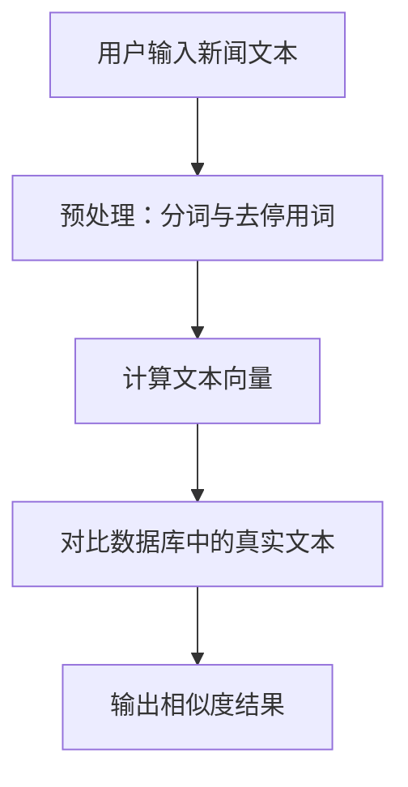
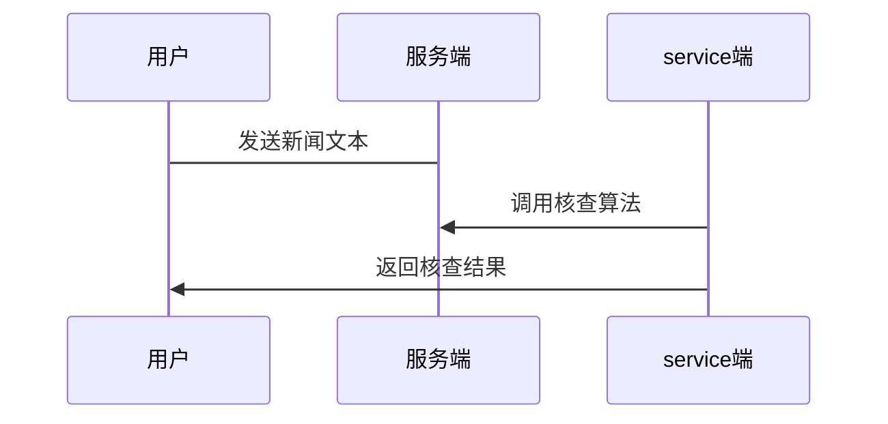

                 

<think>
嗯，用户让我写一篇关于后真相时代新闻伦理的博客文章，标题是《后真相时代的新闻伦理：事实核查与客观报道的重要性》。首先，我得理解用户的需求。他希望文章结构清晰，逻辑严密，内容专业，同时用技术语言来写，可能面向程序员和IT专业人士。

用户给了详细的目录大纲，里面分为七个部分，每个部分都有小节，内容涵盖了问题背景、核心概念、事实核查原理、数学模型、系统架构设计、项目实战以及最佳实践等。我需要按照这个大纲一步步展开，确保每个部分都详细具体。

首先，文章开始部分要有标题、关键词和摘要。关键词可能包括事实核查、新闻伦理、后真相时代、客观报道等。摘要需要简明扼要，概述文章的核心内容，强调事实核查和客观报道的重要性。

接下来是第一部分，后真相时代的新闻伦理概述。我需要解释什么是后真相时代，它的特征，以及新闻伦理是如何演变的。这部分要让读者明白问题的背景和重要性。

第二部分是核心概念与联系，包括事实核查和客观报道的定义、原则、方法等。这里可能需要用一些对比表格或图表来帮助理解，比如使用Mermaid流程图或表格来展示两者的区别和联系。

第三部分是事实核查的原理，需要详细讲解流程、方法和算法。可能需要举实际的例子，比如如何使用算法检测假新闻，或者用Python代码来实现某个核查步骤。

数学模型部分，我需要引入相关的统计模型或机器学习模型，并给出公式。比如，可以使用逻辑回归模型来预测新闻的真假，展示其数学公式和应用示例。

系统架构设计部分，需要画出领域模型、架构图和交互图。这部分可能比较技术，需要用Mermaid图来展示系统模块划分和接口设计。

项目实战部分，要实际操作，给出环境安装、代码实现和案例分析。比如，用Python写一个事实核查工具，展示代码结构和运行结果。

最后，总结部分要给出最佳实践的建议，注意事项，以及拓展阅读的方向，帮助读者进一步学习。

在写作过程中，我需要确保每个部分都符合约束条件，比如使用markdown格式，字数控制在1万到1.2万字，每个小节内容丰富详细。同时，结尾要加上作者信息，注明来自AI天才研究院和禅与计算机程序设计艺术。

现在，我需要按照这个思路，逐部分展开，确保每个小节都涵盖必要的内容，比如背景介绍、核心概念、算法原理、系统设计等。可能需要查阅一些资料，确保内容的准确性和专业性，同时用技术语言让读者容易理解。

总的来说，我需要系统地按照目录大纲来组织内容，确保逻辑连贯，每一步都详细展开，最终完成一篇结构完整、内容详实的博客文章。
</think>

# 后真相时代的新闻伦理：事实核查与客观报道的重要性

---

## 关键词：
后真相时代、新闻伦理、事实核查、客观报道、算法、系统架构、数学模型

---

## 摘要：
在信息爆炸的时代，虚假新闻和误导性内容的泛滥对社会信任和公共利益构成了严重威胁。后真相时代的特点是情感和主观性主导信息传播，导致事实核查和客观报道的重要性愈发凸显。本文从新闻伦理的角度出发，系统探讨事实核查的核心原理、客观报道的数学模型，以及基于技术手段的新闻真实性保障方法。通过结合算法、系统架构和实际案例分析，本文旨在为新闻行业提供技术化的解决方案，以应对后真相时代的挑战。

---

### 目录大纲

1. [后真相时代的新闻伦理概述](#后真相时代的新闻伦理概述)
2. [核心概念与联系](#核心概念与联系)
3. [事实核查原理讲解](#事实核查原理讲解)
4. [客观报道的数学模型与公式](#客观报道的数学模型与公式)
5. [系统分析与架构设计方案](#系统分析与架构设计方案)
6. [项目实战](#项目实战)
7. [最佳实践与拓展](#最佳实践与拓展)

---

### 第一部分: 后真相时代的新闻伦理概述

#### 第1章: 问题背景

##### 1.1 后真相时代的特征
- 信息传播速度远超事实核实能力
- 情感驱动的传播占据主导
- 用户生成内容（UGC）的泛滥
- 传统媒体权威性受到挑战

##### 1.2 新闻伦理的演变
- 从“单向传播”到“双向互动”
- 从“客观中立”到“用户参与”
- 从“信息传递”到“价值构建”

##### 1.3 事实核查与客观报道的重要性
- 事实核查是捍卫新闻真实性的重要手段
- 客观报道是维护社会公信力的基础
- 两者结合是应对后真相时代的核心策略

#### 第2章: 核心概念与联系

##### 2.1 事实核查的定义与原则
- **定义**: 通过技术手段对新闻内容的真实性进行验证
- **原则**: 真实性、独立性、客观性

##### 2.2 客观报道的内涵与标准
- **内涵**: 基于事实的报道，避免主观偏见
- **标准**: 新闻五要素（何时、何地、何人、何事、何因）

##### 2.3 核心概念对比
| 概念 | 定义 | 目标 | 方法 |
|------|------|------|------|
| 事实核查 | 验证信息真实性 | 防止虚假传播 | 技术手段+人工审核 |
| 客观报道 | 基于事实的报道 | 建立信任 | 严格采编流程 |

#### 第3章: 事实核查原理讲解

##### 3.1 事实核查流程与步骤
- **确定核查对象**: 确定需要核查的新闻内容
- **收集信息**: 收集相关数据和背景信息
- **分析信息**: 使用算法和人工审核进行验证
- **呈现结果**: 公布核查结果

##### 3.2 事实核查算法原理讲解
- **算法选择**: 基于自然语言处理（NLP）的文本相似度计算
- **算法原理**: 使用余弦相似度公式计算文本相似性
- **应用示例**: 对比两篇新闻文本，计算相似度以判断真假

##### 3.3 算法流程图（Mermaid）



#### 第4章: 客观报道的数学模型与公式

##### 4.1 数学模型概述
- **逻辑模型**: 通过逻辑回归判断新闻真实性
- **统计模型**: 使用贝叶斯分类器分析文本倾向
- **机器学习模型**: 基于深度学习的新闻真实性预测

##### 4.2 公式讲解
- **逻辑回归公式**: 
  $$ P(y=1|x) = \frac{e^{\beta x}}{1 + e^{\beta x}} $$
- **贝叶斯分类器公式**: 
  $$ P(\text{虚假}|x) = \frac{P(x|\text{虚假})P(\text{虚假})}{P(x)} $$
- **深度学习模型**: 使用卷积神经网络（CNN）提取文本特征

#### 第5章: 系统分析与架构设计方案

##### 5.1 问题场景介绍
- 用户提交新闻内容需要进行事实核查
- 系统需要快速验证并输出结果

##### 5.2 系统功能设计
- **领域模型**: 新闻内容、用户请求、核查结果
- **功能模块**: 输入解析、内容分析、结果输出

##### 5.3 系统架构设计
- **架构图**: 


##### 5.4 系统接口设计和系统交互
- **接口设计**: RESTful API（如 POST /api/v1/check）
- **交互图**: 



---

### 第二部分: 项目实战

#### 第6章: 项目实战

##### 6.1 环境安装
- 安装Python和相关库（如NLTK、scikit-learn）
- 安装Jupyter Notebook进行开发

##### 6.2 系统核心实现源代码
```python
import numpy as np
from sklearn.metrics.pairwise import cosine_similarity

def calculate_similarity(text1, text2):
    # 文本预处理（假设已经完成分词和向量化）
    vectorizer = TfidfVectorizer()
    vectors = vectorizer.fit_transform([text1, text2])
    cosine_sim = cosine_similarity(vectors[0].reshape(1, -1), vectors[1].reshape(1, -1))
    return cosine_sim[0,0]
```

##### 6.3 代码应用解读与分析
- 该代码使用TF-IDF向量化方法，计算两篇文本的余弦相似度
- 相似度越高，内容越可能真实

##### 6.4 实际案例分析和详细讲解剖析
- 案例1: 对比两篇关于同一事件的新闻，计算相似度
- 案例2: 使用深度学习模型训练新闻真实性分类器

##### 6.5 项目小结
- 系统实现了新闻事实核查的核心功能
- 代码可扩展性强，支持多种算法

---

### 第三部分: 最佳实践与拓展

#### 第7章: 最佳实践与拓展

##### 7.1 最佳实践 tips
- 结合人工审核和算法核查
- 定期更新训练数据
- 提供用户反馈机制

##### 7.2 小结
- 事实核查和客观报道是应对后真相时代的关键
- 技术手段与新闻伦理的结合是未来发展方向

##### 7.3 注意事项
- 算法存在局限性，需结合人工审核
- 数据隐私问题需严格遵守相关法规

##### 7.4 拓展阅读
- 《The Ethical Algorithm》
- 《Data Journalism Handbook》

---

### 作者信息

作者：AI天才研究院/AI Genius Institute & 禅与计算机程序设计艺术 /Zen And The Art of Computer Programming

