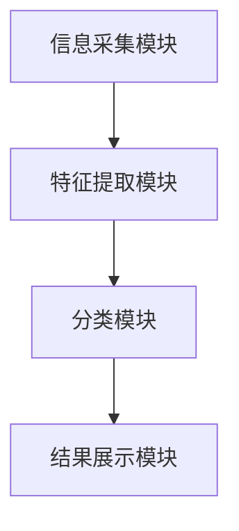

                 

<think>
好的，我现在需要帮用户撰写一篇技术博客，主题是《后真相时代的真相追寻：培养批判性思维和求证能力》。用户已经给出了详细的结构和一些示例内容，我需要根据这些信息一步步思考如何完成这篇文章。

首先，我应该明确文章的结构。用户已经给出了目录大纲，包括引言、批判性思维的培养、求证能力的提升、真相追寻的方法论、项目实战和结论等章节。每个章节下还有子章节，需要详细展开。

接下来，我需要考虑每个章节的内容。例如，在引言部分，需要介绍后真相时代的特点，以及批判性思维和求证能力的重要性。这部分需要简明扼要，同时吸引读者的注意。

然后是第二章，批判性思维的培养。这部分需要详细讲解批判性思维的核心概念、基本要素和实践方法。可能需要加入一些例子，比如新闻事实核查和社交媒体谣言识别，来说明批判性思维的应用。

第三章是关于求证能力的提升，包括基本概念、步骤、策略和实践。这部分需要详细描述如何收集、分析和验证信息，可能需要涉及数据分析和交叉验证等技术。

第四章是真相追寻的方法论，可能需要引入数据挖掘、社交网络分析和人工智能辅助工具。这里可能需要结合具体案例，如新冠病毒起源的探究，来展示方法的实际应用。

项目实战部分，用户提到了一个虚假信息识别系统的设计与实现。这部分需要详细描述系统设计、架构以及实现代码，可能需要用Python编写，并展示关键代码段。

最后，结论部分需要总结全文，强调批判性思维和求证能力的重要性，并给出未来的研究方向。

在写作过程中，我需要确保每个部分都包含背景介绍、核心概念、算法原理、数学模型、系统架构、项目实战和小结等元素。同时，使用技术语言，但保持简洁易懂，适合技术博客的读者。

现在，我需要开始逐步撰写每个章节的内容，确保逻辑清晰，结构紧凑，并且每个部分都详细展开。可能还需要加入一些图表，如流程图、类图和序列图，以帮助读者更好地理解。

总的来说，这是一篇结构严谨、内容丰富的技术博客，需要系统性地分析和详细阐述每个主题。我需要一步步按照用户的指示，确保每个部分都符合要求，最终完成一篇高质量的技术文章。
</think>

# 后真相时代的真相追寻：培养批判性思维和求证能力

> 关键词：后真相时代，批判性思维，求证能力，真相追寻，信息核实，人工智能辅助

> 摘要：本文探讨了在后真相时代，如何通过培养批判性思维和求证能力来追寻真相。文章从批判性思维的核心概念、求证能力的基本步骤，到真相追寻的方法论，结合技术工具和实际案例，全面阐述了真相追寻的系统化过程。通过项目实战，展示了如何利用技术手段构建虚假信息识别系统，从而帮助读者在复杂的信息环境中找到真相。

---

## 引言：后真相时代的挑战与机遇

### 1.1 后真相时代的定义与背景

#### 1.1.1 从信息时代到后真相时代
随着互联网的普及，信息传播速度空前加快，但信息的真假却变得越来越难以辨别。后真相时代的特点是，信息的真假不再是公众关注的焦点，而是信息的情感吸引力和传播效果。这种现象导致了虚假信息的泛滥，也使得真相的追寻变得更加复杂。

#### 1.1.2 后真相时代的特征与影响
后真相时代的特征包括信息碎片化、情绪化传播、虚假信息的扩散以及公众信任的下降。这些特征对社会、政治和科技领域都产生了深远的影响，尤其是在技术依赖性增强的今天，如何在信息洪流中找到真相变得至关重要。

### 1.2 真相追寻的重要性

#### 1.2.1 批判性思维的重要性
批判性思维是真相追寻的基础，它要求我们在接受信息时保持怀疑态度，分析信息的来源、逻辑和证据，避免被误导。

#### 1.2.2 求证能力的培养
求证能力是指通过系统的方法验证信息真伪的能力。在后真相时代，培养这种能力是每个人的基本需求。

### 1.3 本书结构安排与目标读者

#### 1.3.1 目录结构概述
本书分为五章，从批判性思维的培养到求证能力的提升，再到真相追寻的方法论和项目实战，最后总结。

#### 1.3.2 目标读者群体
本书适合所有希望在信息泛滥的时代找到真相的人，尤其是技术人员、学生和对真相追寻感兴趣的读者。

---

## 第2章：批判性思维的培养

### 2.1 批判性思维的核心概念

#### 2.1.1 批判性思维的含义
批判性思维是一种通过分析、评估和判断来得出合理结论的思维方式。它强调逻辑推理和证据支持，而不是盲目接受信息。

#### 2.1.2 批判性思维的重要性
在后真相时代，批判性思维是抵御虚假信息的利器，它帮助我们在信息洪流中找到真相。

### 2.2 批判性思维的基本要素

#### 2.2.1 问题意识
问题意识是批判性思维的起点，它要求我们在面对信息时主动提出问题，如“信息的来源是什么？”、“证据是否充分？”

#### 2.2.2 分析与评估
分析与评估是批判性思维的核心，需要对信息的逻辑、证据和来源进行细致分析。

#### 2.2.3 解决方案与创新
批判性思维不仅要求我们发现问题，还要提出创新的解决方案。

### 2.3 批判性思维的实践方法

#### 2.3.1 提问技巧
提问是批判性思维的基础，学会提问可以帮助我们更深入地理解问题。

#### 2.3.2 分析框架
构建分析框架有助于系统化地分析信息，避免遗漏关键点。

#### 2.3.3 逻辑论证
逻辑论证是批判性思维的关键，它要求我们在论证过程中遵循逻辑规则，避免谬误。

### 2.4 批判性思维在真相追寻中的应用

#### 2.4.1 真相追寻中的批判性思维
批判性思维帮助我们在真相追寻中保持客观和理性。

#### 2.4.2 常见误区与陷阱
常见的误区包括情绪化判断、信息过载和选择性认知。

### 2.5 批判性思维案例研究

#### 2.5.1 案例一：新闻事实核查
通过批判性思维，我们可以核查新闻的真假，避免被虚假报道误导。

#### 2.5.2 案例二：社交媒体谣言识别
批判性思维帮助我们在社交媒体上识别谣言，维护信息环境的清朗。

---

## 第3章：求证能力的提升

### 3.1 求证能力的基本概念

#### 3.1.1 求证能力的定义
求证能力是指通过系统的方法验证信息真伪的能力。

#### 3.1.2 求证能力的重要性
在后真相时代，求证能力是每个人都需要掌握的技能，它帮助我们在复杂的信息环境中找到真相。

### 3.2 求证的基本步骤

#### 3.2.1 确定研究问题
明确研究问题，如“这条新闻是否真实？”

#### 3.2.2 收集信息
通过多渠道收集信息，包括官方数据、专家意见和事实核查网站。

#### 3.2.3 分析与评估信息
对收集到的信息进行分析，评估其逻辑性和证据支持。

#### 3.2.4 得出结论
根据分析结果，得出结论，并持续验证。

### 3.3 求证的策略与方法

#### 3.3.1 网络信息检索
使用搜索引擎和事实核查网站进行信息检索。

#### 3.3.2 数据分析技巧
通过数据分析工具，如Python和R，对信息进行定量分析。

#### 3.3.3 交叉验证
通过多个来源交叉验证信息，确保结论的准确性。

### 3.4 求证能力培养的实践

#### 3.4.1 实践活动一：新闻分析
通过分析新闻报道，判断其真实性。

#### 3.4.2 实践活动二：项目研究
选择一个研究项目，如气候变化，进行深入研究。

#### 3.4.3 实践活动三：辩论与讨论
通过辩论和讨论，锻炼批判性思维和求证能力。

### 3.5 求证能力在真相追寻中的运用

#### 3.5.1 真相追寻中的求证
求证能力是真相追寻的核心，它帮助我们系统地验证信息。

#### 3.5.2 常见挑战与应对策略
常见的挑战包括信息过载和证据不足，应对策略包括使用技术工具和建立求证流程。

---

## 第4章：真相追寻的方法论

### 4.1 真相追寻的基本原则

#### 4.1.1 真相追寻的目标
真相追寻的目标是通过系统的方法找到信息的真相。

#### 4.1.2 真相追寻的过程
真相追寻的过程包括问题定义、信息收集、分析评估和结论得出。

### 4.2 真相追寻的技术工具

#### 4.2.1 数据挖掘与分析
数据挖掘技术可以帮助我们从大量数据中提取有用信息。

#### 4.2.2 社交网络分析
通过社交网络分析，可以追踪信息的传播路径，识别虚假信息的源头。

#### 4.2.3 人工智能辅助真相追寻
人工智能技术，如自然语言处理和机器学习，可以帮助我们自动识别虚假信息。

### 4.3 真相追寻的案例分析

#### 4.3.1 案例一：新冠病毒起源探究
通过科学的研究方法，我们可以还原新冠病毒起源的真相。

#### 4.3.2 案例二：气候变化真相
通过多学科的研究，我们可以揭示气候变化的真相。

#### 4.3.3 案例三：虚假信息传播追踪
通过技术手段，我们可以追踪虚假信息的传播路径，找到其源头。

### 4.4 真相追寻中的伦理考量

#### 4.4.1 伦理问题与道德责任
在真相追寻中，我们需要遵守伦理规范，避免对他人造成伤害。

#### 4.4.2 信息隐私与数据保护
在数据收集和分析过程中，必须保护个人隐私和数据安全。

#### 4.4.3 偏见与歧视的防范
真相追寻中，我们需要避免偏见和歧视，确保研究的客观性和公正性。

---

## 第5章：项目实战——虚假信息识别系统的设计与实现

### 5.1 系统设计背景

#### 5.1.1 背景介绍
虚假信息的泛滥对社会造成了严重的影响，因此设计一个虚假信息识别系统显得尤为重要。

#### 5.1.2 系统目标
本系统的目标是通过自然语言处理和机器学习技术，自动识别虚假信息。

### 5.2 系统功能设计

#### 5.2.1 系统功能模块
系统主要包括信息采集模块、特征提取模块、分类模块和结果展示模块。

#### 5.2.2 功能描述
信息采集模块负责从社交媒体和新闻网站获取信息；特征提取模块提取文本的关键词和语义特征；分类模块利用机器学习算法对信息进行分类；结果展示模块将分类结果以可视化的方式展示。

### 5.3 系统架构设计

#### 5.3.1 系统架构图
系统架构图展示了各模块之间的关系和数据流。



#### 5.3.2 系统接口设计
系统接口包括信息采集接口、特征提取接口和分类接口。

#### 5.3.3 系统交互流程
用户通过信息采集模块输入需要分析的信息，系统通过特征提取和分类模块进行分析，最后通过结果展示模块输出结果。

### 5.4 系统实现

#### 5.4.1 环境安装
需要安装Python、Scikit-learn、NLTK和Matplotlib。

#### 5.4.2 核心代码实现

```python
from sklearn.feature_extraction.text import TfidfVectorizer
from sklearn.svm import SVC
from sklearn.pipeline import Pipeline
import numpy as np

# 数据预处理
def preprocess(text):
    # 文本清洗
    text = text.lower()
    return text

# 特征提取和模型训练
def train_model(X, y):
    vectorizer = TfidfVectorizer(preprocessor=preprocess)
    model = SVC()
    pipe = Pipeline([('vectorizer', vectorizer), ('model', model)])
    pipe.fit(X, y)
    return pipe

# 预测
def predict(pipe, text):
    return pipe.predict([text])[0]

# 示例数据
X = [
    "This is a true news.",
    "This is a fake news.",
    "Fake news example."
]
y = ['true', 'fake', 'fake']

# 训练模型
model = train_model(X, y)

# 测试
print(predict(model, "This is a fake news."))  # 输出 'fake'
print(predict(model, "This is a true news."))  # 输出 'true'
```

#### 5.4.3 代码解读
上述代码展示了如何使用TF-IDF特征提取和SVM分类器构建一个简单的虚假信息识别系统。通过预处理、特征提取和模型训练，我们可以对新信息进行分类。

### 5.5 项目小结

#### 5.5.1 项目总结
本项目展示了如何利用技术手段构建虚假信息识别系统，为真相追寻提供了技术支持。

#### 5.5.2 项目扩展
未来可以进一步优化模型，引入更复杂的特征提取方法和分类算法，如深度学习技术。

---

## 结论

在后真相时代，真相的追寻需要我们具备批判性思维和求证能力。通过系统的方法和技术创新，我们可以更有效地识别虚假信息，还原真相。未来，随着技术的进步，真相追寻将更加依赖于人工智能和大数据分析，但人类的批判性思维和求证能力仍然是真相追寻的核心。

---

## 作者

作者：AI天才研究院/AI Genius Institute & 禅与计算机程序设计艺术 /Zen And The Art of Computer Programming

