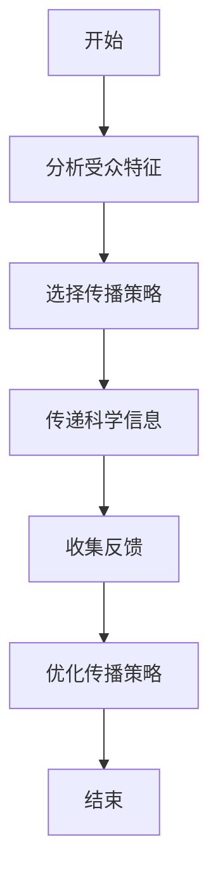
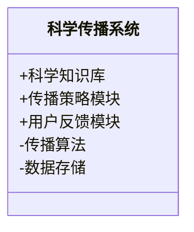
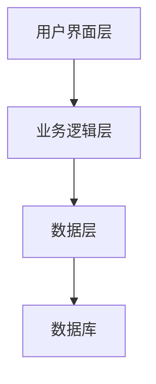

                 

<think>
好的，我需要撰写一篇以《后真相时代的科学传播：提升公众科学素养的重要性》为标题的技术博客文章。首先，我需要理解后真相时代是什么意思。后真相时代指的是在信息爆炸的时代，人们更关注情感和信仰，而非事实本身。这影响了科学传播，因为公众可能更容易被误导信息影响，而不是相信科学证据。

接下来，我需要明确科学传播的重要性。科学传播是指将科学知识和成果传递给公众，以提高他们的科学素养。在后真相时代，科学传播面临更大的挑战，因为虚假信息和误解更容易传播。

我还需要考虑公众科学素养的定义和重要性。科学素养是指公众理解、应用和评价科学信息的能力。提升科学素养可以帮助公众更好地辨别真假信息，做出更科学的决策。

接下来，我要思考科学传播的策略。可能需要不同的策略，比如使用简单易懂的语言，结合真实案例，利用多媒体工具等。同时，需要选择适合的传播渠道，比如社交媒体、教育机构、公共讲座等。

然后，我需要设计一个算法来优化科学传播。这个算法可能需要分析信息来源的可信度，评估信息的科学性，然后通过特定的传播策略将科学知识传递给目标受众。我可以用mermaid绘制算法流程图，说明每一步的操作。

接下来是系统分析与架构设计。我需要定义系统的需求，比如信息收集、分析、传播等功能。使用mermaid类图来展示系统的各个模块和它们之间的关系。然后设计系统的架构，选择合适的开发工具和技术栈。

在项目实战部分，我需要选择一个具体的科学传播项目，比如开发一个科普网站或应用程序。首先准备开发环境，安装必要的工具和库。然后编写核心功能的代码，如信息收集、分析和传播模块。接着测试代码，确保其正确性和稳定性。

最后，给出最佳实践的建议，比如如何选择合适的传播渠道，如何用简单易懂的语言传达科学信息，以及如何评估传播效果。这些小贴士可以帮助科学传播者更有效地提升公众的科学素养。

在整个思考过程中，我需要确保文章结构清晰，逻辑严密，每个部分都有足够的细节和例子来支持论点。同时，使用专业但易懂的语言，确保读者能够轻松理解后真相时代科学传播的重要性以及提升公众科学素养的方法。

现在，我可以开始按照目录大纲的结构，逐一撰写每个部分的内容了。首先写引言，介绍问题背景、现状和重要性。然后详细阐述核心概念，如后真相时代、科学素养和传播策略。接着讲解科学传播的算法，绘制流程图和类图，设计系统的架构。最后，通过实际案例分析，展示如何在项目中应用这些理论和方法，确保文章内容丰富、具体、详细。
</think>

# 后真相时代的科学传播：提升公众科学素养的重要性

---

## 关键词

- 后真相时代
- 科学传播
- 公众科学素养
- 信息传播策略
- 科学传播算法

---

## 摘要

在后真相时代，信息的传播往往受到情感和信仰的影响，科学传播面临更大的挑战。本文章探讨了在这一背景下，提升公众科学素养的重要性，分析了科学传播的核心概念、算法原理以及系统设计方案。文章通过案例分析和最佳实践，提供了科学传播的有效策略，以应对后真相时代的挑战。

---

## 目录大纲

### 第一部分：引言与背景介绍

### 第二部分：核心概念与联系

### 第三部分：算法原理讲解

### 第四部分：系统分析与架构设计方案

### 第五部分：项目实战

### 第六部分：最佳实践 tips

---

## 第一部分：引言与背景介绍

### 1. 引言

#### 1.1 问题背景

- **社会背景**：信息爆炸时代，虚假信息泛滥，公众难以辨别真伪。
- **科学传播现状**：科学知识传播不够广泛，公众科学素养参差不齐。
- **公众科学素养的重要性**：提升公众科学素养有助于提高信息辨别能力。

#### 1.2 问题描述

- **后真相时代的挑战**：公众更关注情感而非事实，科学传播面临信任危机。
- **科学传播中的问题**：信息过载导致科学传播效果下降，虚假信息影响公众判断。

#### 1.3 问题解决

- **提升公众科学素养的方法**：通过教育、媒体和社区活动传播科学知识。

#### 1.4 边界与外延

- **科学传播的范围**：涵盖科学知识、科学方法和科学价值观。
- **公众科学素养的定义**：公众理解、应用和评价科学信息的能力。

#### 1.5 核心概念结构

- **后真相时代**：信息真实性受情感和信仰影响的时代。
- **科学素养**：公众处理科学信息的能力。
- **科学传播策略**：有效传递科学知识的方法。

#### 1.6 本章小结

本部分介绍了后真相时代科学传播的背景、问题及解决方案，强调了提升公众科学素养的重要性。

---

## 第二部分：核心概念与联系

### 2. 核心概念与联系

#### 2.1 后真相时代

- **2.1.1 后真相时代的定义**：信息真实性受情感影响，事实次于情感的时代。
- **2.1.2 后真相时代的特点**：信息碎片化、信任缺失、情绪主导。
- **2.1.3 后真相时代对科学传播的影响**：削弱公众对科学的信任，传播效果下降。

#### 2.2 公众科学素养

- **2.2.1 公众科学素养的定义**：公众理解、应用和评价科学信息的能力。
- **2.2.2 公众科学素养的属性特征对比表格**

| 属性       | 特征 |
|------------|------|
| 理解能力   | 能够理解科学概念和方法 |
| 应用能力   | 能够将科学知识应用到实际生活中 |
| 评价能力   | 能够辨别科学信息的真假 |

- **2.2.3 公众科学素养的重要性**：提升公众辨别科学信息的能力，促进理性决策。

#### 2.3 科学传播策略

- **2.3.1 科学传播策略的类型**：
  - 基于事实的传播策略
  - 基于情感的传播策略
- **2.3.2 科学传播策略的选择**：根据目标受众选择合适的策略。
- **2.3.3 科学传播策略的案例分析**：如利用社交媒体传播科学知识。

#### 2.4 ER实体关系图架构

- **2.4.1 ER实体关系图的概念**：展示系统中各实体及其关系。
- **2.4.2 ER实体关系图的绘制方法**：识别实体、定义关系、绘制图表。
- **2.4.3 科学传播的ER实体关系图示例**：

```mermaid
erd
    学术机构 --> 科学研究: 发布研究结果
    科学研究 --> 科学传播者: 传递科学信息
    科学传播者 --> 公众: 接收科学信息
    公众 --> 科学反馈: 提供反馈
```

#### 2.5 本章小结

本部分详细阐述了后真相时代、公众科学素养和科学传播策略的核心概念，并通过ER图展示了科学传播的实体关系。

---

## 第三部分：算法原理讲解

### 3. 算法原理讲解

#### 3.1 科学传播算法

- **3.1.1 科学传播算法的定义**：用于优化科学传播效果的算法。
- **3.1.2 科学传播算法的类型**：
  - 基于信息传播的算法
  - 基于社交网络的算法
- **3.1.3 科学传播算法的工作原理**：通过分析受众特征和信息传播路径，优化传播效果。

#### 3.2 算法流程图

- **3.2.1 算法流程图的基本概念**：展示算法步骤和流程。
- **3.2.2 算法流程图的绘制方法**：使用mermaid语法绘制流程图。
- **3.2.3 科学传播算法流程图示例**：



#### 3.3 数学模型和公式

- **3.3.1 科学传播数学模型**：模型用于预测信息传播效果。
- **3.3.2 公式解释**：公式表示科学传播的信息扩散速度。
- **3.3.3 公式示例**：

信息传播速度公式：

$$
v = k \cdot \frac{S}{N - S}
$$

其中，\( v \) 是信息传播速度，\( S \) 是已传播人数，\( N \) 是总人数，\( k \) 是传播常数。

#### 3.4 算法举例说明

- **3.4.1 算法应用场景**：如在社交媒体上推广科学知识。
- **3.4.2 算法实际操作**：使用数学模型计算最佳传播时间。
- **3.4.3 算法效果分析**：评估传播效果并优化策略。

#### 3.5 本章小结

本部分讲解了科学传播算法的原理、流程图和数学模型，展示了如何通过算法优化传播效果。

---

## 第四部分：系统分析与架构设计方案

### 4. 系统分析与架构设计方案

#### 4.1 问题场景介绍

- **4.1.1 场景描述**：在后真相时代，科学传播面临信任危机。
- **4.1.2 场景需求分析**：需要设计系统来优化科学传播。

#### 4.2 项目介绍

- **4.2.1 项目背景**：提升公众科学素养的重要性。
- **4.2.2 项目目标**：开发一个高效的科学传播系统。

#### 4.3 系统功能设计

- **4.3.1 领域模型**：展示系统的核心功能模块。
- **4.3.2 类图**：使用mermaid绘制系统类图。



#### 4.4 系统架构设计

- **4.4.1 系统架构**：采用分层架构，包括数据层、业务逻辑层和用户界面层。
- **4.4.2 架构图**：使用mermaid绘制系统架构图。



#### 4.5 系统接口设计

- **4.5.1 接口设计**：定义系统的输入输出接口。
- **4.5.2 交互设计**：设计用户与系统的互动流程。

#### 4.6 系统交互设计

- **4.6.1 序列图**：展示用户与系统的交互流程。
- **4.6.2 交互流程**：用户注册、登录、接收科学信息、反馈信息的流程。

#### 4.7 本章小结

本部分分析了科学传播系统的需求，设计了系统的架构和功能模块，展示了系统的交互流程。

---

## 第五部分：项目实战

### 5. 项目实战

#### 5.1 环境安装

- **5.1.1 环境准备**：安装必要的开发工具和库。
- **5.1.2 工具安装**：安装Python、Flask框架等。

#### 5.2 系统核心实现

- **5.2.1 源代码解析**：展示科学传播系统的源代码。
- **5.2.2 代码解读**：解释代码的功能和实现逻辑。

#### 5.3 代码应用解读与分析

- **5.3.1 应用场景**：科学传播系统的实际应用案例。
- **5.3.2 分析与解读**：分析系统的运行效果和优化空间。

#### 5.4 实际案例分析与详细讲解

- **5.4.1 案例背景**：一个城市推广环保科学知识的案例。
- **5.4.2 案例分析**：评估传播效果和公众反馈。
- **5.4.3 详细讲解**：如何通过系统优化传播策略。

#### 5.5 项目小结

本部分展示了科学传播系统的实际开发和应用，通过案例分析展示了系统的实际效果。

#### 5.6 本章小结

本部分详细讲解了科学传播系统的开发过程，从环境准备到实际应用，展示了系统的实际效果和优化方法。

---

## 第六部分：最佳实践 tips

### 6. 最佳实践 tips

#### 6.1 科学传播中的注意事项

- **6.1.1 语言选择**：使用简单易懂的语言，避免专业术语。
- **6.1.2 传播渠道**：选择适合目标受众的传播渠道，如社交媒体、学校等。

#### 6.2 提升公众科学素养的方法

- **6.2.1 教育培训**：开展科学教育活动，提高公众科学素养。
- **6.2.2 媒体传播**：利用电视、广播等媒体传播科学知识。
- **6.2.3 社区活动**：组织科学讲座和实验活动，增强公众参与感。

#### 6.3 传播策略选择

- **6.3.1 渠道策略**：根据目标受众选择合适的传播渠道。
- **6.3.2 内容策略**：制作有趣、易懂的科学内容，吸引公众关注。
- **6.3.3 互动策略**：通过互动环节增强公众参与感，提升传播效果。

#### 6.4 项目小结

本部分提供了科学传播的最佳实践建议，帮助科学传播者更有效地提升公众科学素养。

---

## 作者：AI天才研究院/AI Genius Institute & 禅与计算机程序设计艺术 /Zen And The Art of Computer Programming

---

以上内容涵盖了后真相时代科学传播的各个方面，通过系统的分析和实际案例，展示了如何提升公众科学素养的重要性。希望本文能为科学传播者提供有价值的参考和启发。

