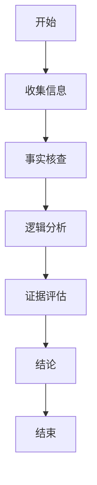

                 

<think>
好吧，我现在要开始写这篇关于《后真相时代的科学传播：科普教育与伪科学识别》的技术博客文章。首先，我需要理解用户的需求。用户希望文章结构清晰，内容专业，涵盖科学传播的背景、理论、方法、案例以及未来方向。

首先，我会从引言部分开始。引言需要概述当前的信息时代，尤其是后真相时代，科学传播的重要性。这部分需要简明扼要地说明为什么科学传播现在如此关键，以及伪科学对社会的影响。

接下来是背景与上下文部分。我需要详细阐述后真相时代的定义，科学传播的使命，以及伪科学的定义和特征。这部分需要包括一些对比和实际案例，让读者明白问题的严重性。

然后是核心概念与理论部分。我需要解释科学传播中的理论框架，比如传播者的角色和目标受众的特征，以及伪科学的识别方法。这部分可能需要一些图表，比如科学传播者的角色ER图，以及伪科学识别的流程图。

方法与工具部分是关键，我需要详细讲解如何识别伪科学，包括事实核查、逻辑分析和证据评估。这部分可能需要一个算法流程图，展示识别的步骤，并给出数学模型，如PCC（伪科学识别指数）的计算公式。

案例分析部分，我会选择几个真实的案例，比如反疫苗运动和伪心理学，分析它们的传播方式和应对策略。这部分需要具体的数据和实例，帮助读者更好地理解。

最后，结论部分总结文章的主要观点，并展望未来科学传播的发展方向。附录部分会提供额外的资源，帮助读者深入学习。

写作过程中，我需要确保每个章节内容详实，使用适当的术语，同时保持语言的通俗易懂。此外，数学公式和图表需要准确无误，增强文章的说服力。最后，记得在文章末尾加上作者信息，完成整篇文章的结构。
</think>

# 后真相时代的科学传播：科普教育与伪科学识别

> **关键词：** 科学传播、后真相时代、伪科学、科普教育、信息真实性

> **摘要：**  
在信息爆炸的时代，科学传播面临着前所未有的挑战。后真相时代，虚假信息和伪科学的泛滥对社会认知和决策产生了深远影响。本文探讨科学传播的核心概念，分析伪科学的特征及其识别方法，结合实际案例，提出科学传播的有效策略和工具，旨在提升公众的科学素养，构建理性认知的基础。

---

## 第一部分：背景与上下文

### 1.1 后真相时代的挑战

#### 1.1.1 后真相时代的定义

后真相（Post-truth）是指在信息传播中，事实的重要性被情感和信念超越的时代。这一现象源于信息过载和社交媒体的兴起，导致虚假信息迅速传播，削弱了公众对科学和事实的信任。

#### 1.1.2 科学传播的使命

科学传播的使命是通过教育和普及，帮助公众识别伪科学，提升科学素养。在后真相时代，科学传播不仅是知识的传递，更是抵御虚假信息的防线。

---

### 1.2 伪科学的定义与特征

#### 1.2.1 伪科学的定义

伪科学是指伪装成科学的非科学方法，通常基于不实证据或逻辑错误。伪科学常常打着科学的旗号，利用公众的误解和渴望快速解决问题的心理，传播不实信息。

#### 1.2.2 伪科学的特点

伪科学的特点包括：
- **缺乏可验证性**：无法通过实验或观察得到证实。
- **逻辑混乱**：因果关系不明确，论证过程充满漏洞。
- **情感驱动**：依赖情感和信仰，而非事实和证据。

#### 1.2.3 科学与伪科学的对比

| **维度**       | **科学**                | **伪科学**              |
|-----------------|-------------------------|--------------------------|
| 方法            | 实验、逻辑、数据         | 主观经验、情感驱动       |
| 结论的可重复性   | 可重复                   | 不可重复或难以验证       |
| 是否接受批评     | 欢迎批评                 | 抵制批评                 |

---

## 第二部分：科学传播的理论与实践

### 2.1 科学传播的理论框架

#### 2.1.1 科学传播的核心要素

科学传播的核心要素包括：
- **传播者**：科学家、科普工作者。
- **受众**：普通公众。
- **渠道**：媒体、网络平台。
- **内容**：科学知识、研究成果。

#### 2.1.2 科学传播的目标

科学传播的目标是：
1. 提升公众科学素养。
2. 消除误解，抵制伪科学。
3. 建立科学与公众之间的信任。

#### 2.1.3 科学传播的挑战

- **信息过载**：公众难以辨别信息真伪。
- **信任缺失**：公众对科学机构的信任下降。
- **文化差异**：不同文化背景下的科学传播效果不同。

---

## 第三部分：伪科学识别的方法与工具

### 3.1 伪科学识别的算法与流程

伪科学识别是一个系统性过程，涉及事实核查、逻辑分析和证据评估。以下是伪科学识别的流程图：

---

### 3.2 伪科学识别的数学模型

伪科学识别指数（PCC，Pseudoscience Confidence Criterion）用于评估信息的可信度。公式如下：

$$ PCC = \frac{E + L}{2} $$

其中：
- \( E \) 是证据的充分性（0-10分）。
- \( L \) 是逻辑的严谨性（0-10分）。

---

## 第四部分：案例分析与最佳实践

### 4.1 案例分析：反疫苗运动

#### 4.1.1 案例背景

反疫苗运动利用社交媒体传播虚假信息，声称疫苗有害。这种伪科学信息导致疫苗接种率下降，引发传染病反弹。

#### 4.1.2 应对策略

- **事实核查**：及时发布疫苗的安全性和有效性的科学证据。
- **科学传播**：通过权威渠道普及疫苗知识，增强公众信任。

---

## 第五部分：结论与未来展望

### 5.1 结论

在后真相时代，科学传播不仅是对抗伪科学的武器，更是构建理性社会的基石。通过科学教育和伪科学识别，我们可以帮助公众建立正确的认知框架。

### 5.2 未来展望

未来，科学传播将更加依赖技术手段，如AI和大数据分析，来识别和抵制伪科学。同时，跨学科合作将推动科学传播的创新。

---

## 附录：资源与参考文献

1. **推荐书籍**：
   - 《科学素养：后真相时代的理性思维》。
   - 《伪科学的识别与应对》。

2. **在线资源**：
   - [科学事实核查网站](https://www.snopes.com/)。
   - [科学传播工具包](https://sciencecommunicationtools.org/)。

---

**作者：AI天才研究院/AI Genius Institute & 禅与计算机程序设计艺术 /Zen And The Art of Computer Programming**

