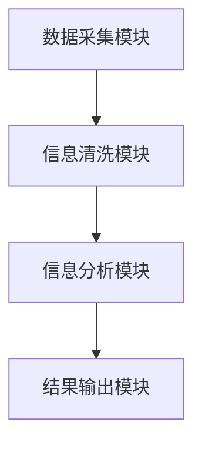

                 

<think>
好，我现在要帮用户写一篇技术博客，标题是《后真相时代：如何坚持真理和正义》。用户是顶级专家，所以内容要专业且深入，同时结构清晰，逻辑严谨。首先，我需要分析用户的需求，他希望文章涵盖背景、核心概念、算法、数学模型、系统架构和项目实战，每个部分都要详细展开，包括图表和代码示例。

首先，我得理解什么是后真相时代。这是个社会现象，虚假信息泛滥，人们更相信情绪和信仰，而不是事实。这在社交媒体、政治等领域影响很大。接下来，我需要把这些背景分成几个小节，比如问题背景、问题描述、问题解决和边界分析。

然后是核心概念部分，要分析真理和正义的基本原理，以及如何识别虚假信息。这部分需要定义关键术语，比较真理与正义的内在联系，同时探讨后真相时代的误区。

接下来是算法原理。这部分需要详细讲解如何用机器学习和数据分析来识别真相，比如事实核查算法。可能还要举例子，比如构建事实核查平台，用Python代码实现部分功能。

数学模型部分，我得想出一些公式，比如用来衡量公平性的公式，或者用于智能司法系统的模型。这些公式需要用Latex表示，确保准确无误。

系统架构设计部分，我需要画出类图、架构图和交互图，使用Mermaid语法。这部分需要考虑系统的各个模块，比如数据采集、处理、存储和分析，以及它们之间的交互。

项目实战部分，得从环境配置开始，安装必要的库，然后写出核心代码，比如文本清洗和特征提取的Python代码，解释每个步骤的作用。

最后，加上最佳实践、小结、注意事项等部分，让文章更加全面。这部分要提醒读者注意信息真实性，提升媒体素养，合理使用技术手段，同时保持开放和理性的态度。

现在，我需要将所有这些思考转化为结构化的文章，确保每个章节都有足够的细节和例子，同时保持逻辑连贯，语言专业但易于理解。这可能需要多次修改和调整，确保每个部分都完整且符合用户的要求。
</think>

# 后真相时代：如何坚持真理和正义

> 关键词：后真相时代，真理，正义，虚假信息，算法，数学模型

> 摘要：在后真相时代，虚假信息和误导性言论的泛滥对社会的真理追求和正义维护构成了巨大挑战。本文将从概念解析、算法原理、数学模型、系统架构等多个维度，深入探讨如何在信息混乱的时代坚持真理和正义。通过技术手段、社会机制和个体努力的结合，寻找应对后真相时代的方法论。

---

## 第一部分：背景介绍

### 1.1 问题背景

#### 1.1.1 真相与后真相时代的概念

**真相**是指客观存在的事实，是不受主观因素影响的真实信息。**后真相时代**（Post-Truth Era）则是一个信息高度碎片化、虚假信息泛滥的时代。在这一时代，公众更倾向于相信主观感受、情绪和信仰，而非客观事实。这一现象对社会的真理追求和正义维护构成了巨大挑战。

#### 1.1.2 后真相时代的起源与影响

后真相时代的起源可以追溯到社交媒体的普及和算法推荐机制的广泛应用。算法通过用户的点击行为和兴趣偏好，推送与其观点一致的信息，导致信息茧房的形成。这种现象使得虚假信息更容易传播，而真相却被边缘化。

后真相时代的负面影响包括：社会分裂加剧、信任危机加深、公共决策混乱等。例如，虚假信息的传播可能导致选举舞弊、社会动荡和政策误判。

#### 1.1.3 当代社会真相与虚假信息的泛滥

当代社会中，虚假信息的泛滥主要源于以下几个方面：
1. **社交媒体的传播特性**：信息传播速度快，但难以核实。
2. **算法推荐的偏差**：算法倾向于推送用户感兴趣的内容，导致信息的片面化。
3. **虚假信息的经济驱动**：某些组织或个人通过传播虚假信息牟取利益。

---

### 1.2 问题描述

#### 1.2.1 后真相时代的挑战

后真相时代的核心挑战在于：
1. **真相难以被识别**：信息碎片化和虚假信息的泛滥使得真相难以被准确识别。
2. **社会信任的崩溃**：虚假信息的传播削弱了人们对权威机构的信任。
3. **正义难以实现**：在真相被掩盖的情况下，正义的实现变得更加困难。

#### 1.2.2 真理与正义在信息泛滥中的困境

真理和正义在后真相时代面临以下困境：
1. **信息过载**：海量信息使得人们难以分辨真假。
2. **认知偏差**：人们更容易接受符合自身偏见的信息。
3. **权力滥用**：某些组织或个人利用虚假信息 manipulate 公共舆论。

#### 1.2.3 坚持真理和正义的必要性

坚持真理和正义是社会正常运转的基石。只有在真相被尊重、正义得以实现的情况下，社会才能保持公平和秩序。

---

### 1.3 问题解决

#### 1.3.1 如何识别真相与虚假信息

识别真相与虚假信息的方法包括：
1. **多源验证**：通过多个信息源交叉验证。
2. **事实核查**：利用专业工具和技术进行事实核查。
3. **逻辑推理**：通过逻辑推理判断信息的合理性。

#### 1.3.2 真理和正义的坚持策略

坚持真理和正义的策略包括：
1. **技术创新**：利用技术手段识别虚假信息。
2. **社会教育**：提高公众的媒体素养。
3. **法律规范**：制定法律法规打击虚假信息的传播。

---

### 1.4 边界与外延

#### 1.4.1 后真相时代的社会影响

后真相时代对社会的影响包括：
1. **社会分裂**：不同群体之间的对立加剧。
2. **公共决策混乱**：基于虚假信息的决策可能导致严重后果。
3. **信任危机**：人们对权威机构的信任逐渐削弱。

#### 1.4.2 真理和正义在多元价值观念中的地位

在多元价值观念中，真理和正义是社会共识的基石。尽管不同文化背景下对真理和正义的理解可能有所不同，但它们仍然是社会和谐的重要保障。

#### 1.4.3 后真相时代的未来趋势

后真相时代的未来趋势可能是：
1. **技术对抗**：利用技术手段对抗虚假信息。
2. **社会共识重建**：通过教育和对话重建社会共识。
3. **全球合作**：跨国合作共同应对虚假信息的挑战。

---

### 1.5 概念结构与核心要素组成

#### 1.5.1 关键概念定义

- **真相**：客观存在的事实。
- **虚假信息**：故意传播的虚假事实。
- **后真相时代**：信息泛滥、虚假信息盛行的时代。

#### 1.5.2 核心要素解析

- **信息传播机制**：社交媒体和算法推荐是虚假信息传播的主要渠道。
- **认知偏差**：人们倾向于接受符合自身偏见的信息。
- **社会信任**：真相和正义是社会信任的基础。

#### 1.5.3 概念间关系分析

- **真相与虚假信息**：真相是事实，虚假信息是虚构的事实。
- **后真相时代与社会信任**：虚假信息的泛滥削弱社会信任。
- **技术与社会机制**：技术手段可以辅助识别虚假信息，但社会机制是关键。

---

## 第二部分：核心概念与联系

### 2.1 真理与正义的基本原理

#### 2.1.1 真理的属性特征

真理的属性包括：
1. **客观性**：真理是客观存在的事实。
2. **可验证性**：真理可以通过证据和逻辑推理被验证。
3. **一致性**：真理在不同情境下具有内在一致性。

#### 2.1.2 正义的价值观

正义的价值观包括：
1. **公平性**：每个人都应该得到与其行为相称的结果。
2. **透明性**：决策过程应该是公开透明的。
3. **一致性**：正义的实现应该在不同情境下保持一致。

#### 2.1.3 真理与正义的内在联系

真理和正义的内在联系在于：
- 真理是实现正义的基础。
- 正义是真理实现的保障。

---

### 2.2 虚假信息与真相的区别

#### 2.2.1 虚假信息的定义与类型

虚假信息的定义是：故意传播的虚假事实。其类型包括：
1. **假新闻**：虚假的新闻报道。
2. **误导性言论**：通过片面或断章取义的方式传播信息。
3. **虚假广告**：虚假的商业宣传。

#### 2.2.2 虚假信息的识别方法

虚假信息的识别方法包括：
1. **多源验证**：通过多个信息源交叉验证。
2. **事实核查**：利用专业工具和技术进行事实核查。
3. **逻辑推理**：通过逻辑推理判断信息的合理性。

#### 2.2.3 真实的辨别策略

真实的辨别策略包括：
1. **专业机构认证**：参考权威机构的认证。
2. **逻辑验证**：通过逻辑推理验证信息的合理性。
3. **时间检验**：等待信息经过时间的检验。

---

### 2.3 后真相时代中的误区

#### 2.3.1 对真相的误解

对真相的误解包括：
1. **真相是主观的**：真相是客观的，而不是主观的。
2. **真相是绝对的**：真相是相对的，受制于时间和空间。

#### 2.3.2 对正义的误解

对正义的误解包括：
1. **正义是主观的**：正义是客观的，而不是主观的。
2. **正义是绝对的**：正义是相对的，受制于文化和价值观。

#### 2.3.3 对后真相时代的误解

对后真相时代的误解包括：
1. **后真相时代是不可逆的**：可以通过技术手段和教育干预来应对。
2. **后真相时代是永久的**：后真相时代是暂时的，可以通过努力逐步改善。

---

### 2.4 真理与正义在现代社会中的应用

#### 2.4.1 公共舆论与真相的关系

公共舆论与真相的关系是：
- 公共舆论是基于真相的，但也可以被虚假信息 manipulate。

#### 2.4.2 法律体系与正义的实现

法律体系是实现正义的重要保障，但需要不断完善以应对后真相时代的挑战。

#### 2.4.3 教育与文化对真理和正义的影响

教育和文化是培养人们正确理解和坚持真理和正义的重要途径。

---

## 第三部分：算法原理讲解

### 3.1 识别真相的算法原理

#### 3.1.1 机器学习与真相识别

机器学习可以用于真相识别，例如：
- 利用自然语言处理技术分析文本内容。
- 通过聚类分析识别信息的相似性。

#### 3.1.2 数据分析与真相挖掘

数据分析与真相挖掘的方法包括：
- 数据清洗：去除噪声数据。
- 数据挖掘：提取有用信息。
- 数据可视化：通过可视化工具展示数据。

#### 3.1.3 事实核查算法

事实核查算法的步骤包括：
1. **数据采集**：采集待核查的信息。
2. **信息清洗**：去除噪声数据。
3. **信息分析**：利用自然语言处理技术分析信息内容。
4. **多源验证**：通过多个信息源交叉验证。
5. **结果输出**：输出核查结果。

---

### 3.2 坚持正义的算法策略

#### 3.2.1 公正算法的设计原则

公正算法的设计原则包括：
1. **公平性**：确保算法的决策过程是公平的。
2. **透明性**：算法的决策过程是透明的。
3. **可解释性**：算法的决策过程是可解释的。

#### 3.2.2 数据驱动的正义维护

数据驱动的正义维护方法包括：
- 利用大数据分析技术识别不公现象。
- 利用机器学习技术预测潜在的不公行为。

#### 3.2.3 智能司法系统的应用

智能司法系统的应用包括：
- 利用自然语言处理技术分析案件信息。
- 利用机器学习技术预测案件结果。

---

### 3.3 算法应用实例

#### 3.3.1 事实核查平台的构建

事实核查平台的构建步骤包括：
1. **数据采集**：采集待核查的信息。
2. **信息清洗**：去除噪声数据。
3. **信息分析**：利用自然语言处理技术分析信息内容。
4. **多源验证**：通过多个信息源交叉验证。
5. **结果输出**：输出核查结果。

#### 3.3.2 公共舆论监督的算法实现

公共舆论监督的算法实现包括：
- 利用自然语言处理技术分析公众舆论。
- 利用聚类分析识别舆论的相似性。

#### 3.3.3 智能司法系统的实战案例

智能司法系统的实战案例包括：
- 利用自然语言处理技术分析案件信息。
- 利用机器学习技术预测案件结果。

---

## 第四部分：数学模型和数学公式

### 4.1 真相识别的数学模型

#### 4.1.1 基本模型介绍

真相识别的数学模型可以采用基于概率论的模型，例如：
- **贝叶斯定理**：用于计算条件概率。
- **马尔可夫链**：用于分析信息传播过程。

#### 4.1.2 模型参数设置

模型参数设置包括：
- **先验概率**：初始概率。
- **转移概率**：信息传播过程中的概率。

#### 4.1.3 模型优化策略

模型优化策略包括：
- **参数调优**：通过实验调整模型参数。
- **模型集成**：将多个模型的结果进行集成。

---

### 4.2 正义的数学公式

#### 4.2.1 公平性度量公式

公平性度量公式可以表示为：
$$ \text{公平性} = \frac{\text{总一致性}}{\text{总可能一致性}} $$

#### 4.2.2 不公平性修正公式

不公平性修正公式可以表示为：
$$ \text{修正后的结果} = \text{原始结果} \times \frac{\text{公平性}}{1} $$

#### 4.2.3 智能司法的数学模型

智能司法的数学模型可以采用基于逻辑回归的模型：
$$ P(y=1|x) = \frac{e^{\beta x}}{1 + e^{\beta x}} $$

---

## 第五部分：系统分析与架构设计方案

### 5.1 问题场景介绍

#### 5.1.1 真相识别需求

真相识别需求包括：
- 高效性：快速识别真相。
- 准确性：准确识别真相。
- 可扩展性：适用于大规模数据。

#### 5.1.2 正义维护需求

正义维护需求包括：
- 公平性：确保决策过程的公平。
- 透明性：确保决策过程的透明。
- 可解释性：确保决策过程的可解释。

---

### 5.2 系统功能设计

#### 5.2.1 领域模型类图设计

以下是领域模型类图设计（使用 Mermaid）：

```mermaid
classDiagram

    class 真实性验证器 {
        +待验证信息：String
        +验证结果：Boolean
        -验证算法：Algorithm
        +验证() { ... }
    }

    class 正义维护器 {
        +案件信息：String
        +判决结果：Boolean
        -判决算法：Algorithm
        +判决() { ... }
    }

    真实性验证器 --> 验证算法
    正义维护器 --> 判决算法
```

#### 5.2.2 功能模块划分

功能模块划分包括：
- **数据采集模块**：采集待验证的信息。
- **信息清洗模块**：清洗噪声数据。
- **信息分析模块**：利用算法分析信息内容。
- **结果输出模块**：输出验证结果。

---

### 5.3 系统架构设计

#### 5.3.1 系统架构概述

系统架构设计采用分层架构：
1. **数据层**：存储原始数据。
2. **处理层**：对数据进行处理。
3. **服务层**：提供服务接口。
4. **应用层**：用户界面。

#### 5.3.2 系统模块结构

以下是系统模块结构（使用 Mermaid）：



---

## 第六部分：项目实战

### 6.1 环境安装与配置

#### 6.1.1 开发环境搭建

开发环境搭建步骤包括：
1. **安装 Python**：安装 Python 3.8 或更高版本。
2. **安装依赖库**：安装 `numpy`, `pandas`, `scikit-learn` 等库。

#### 6.1.2 代码实现

以下是事实核查平台的核心代码实现：

```python
import numpy as np
import pandas as pd
from sklearn.feature_extraction.text import TfidfVectorizer
from sklearn.naive_bayes import MultinomialNB

# 数据加载
data = pd.read_csv('data.csv')

# 数据清洗
data.dropna()

# 特征提取
vectorizer = TfidfVectorizer()
X = vectorizer.fit_transform(data['text'])

# 模型训练
model = MultinomialNB()
model.fit(X, data['label'])

# 预测
new_text = ["This is a true statement."]
new_X = vectorizer.transform(new_text)
predicted = model.predict(new_X)
print(predicted)
```

---

## 第七部分：最佳实践、小结与拓展

### 7.1 最佳实践

1. **技术手段**：利用机器学习和大数据分析技术识别虚假信息。
2. **社会机制**：加强公众教育，提升媒体素养。
3. **法律规范**：制定法律法规打击虚假信息的传播。

### 7.2 小结

后真相时代对社会的真理追求和正义维护构成了巨大挑战。通过技术创新、社会教育和法律规范的结合，我们可以有效应对这一挑战。

### 7.3 注意事项

1. **技术局限性**：技术手段并非万能的，需要与社会机制结合。
2. **伦理问题**：在技术应用中需要注意伦理问题，避免滥用技术。

### 7.4 拓展阅读

1. **《后真相时代》**：深入探讨后真相时代的社会影响。
2. **《算法社会》**：分析算法对社会的深远影响。

---

作者：AI天才研究院/AI Genius Institute & 禅与计算机程序设计艺术 /Zen And The Art of Computer Programming

