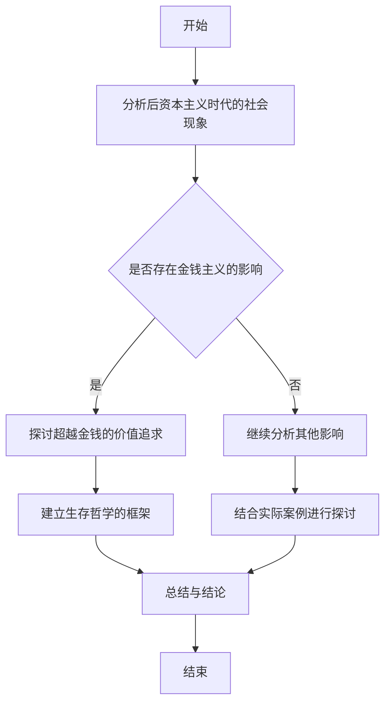
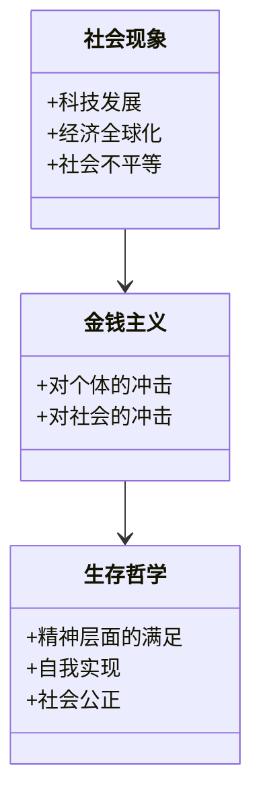
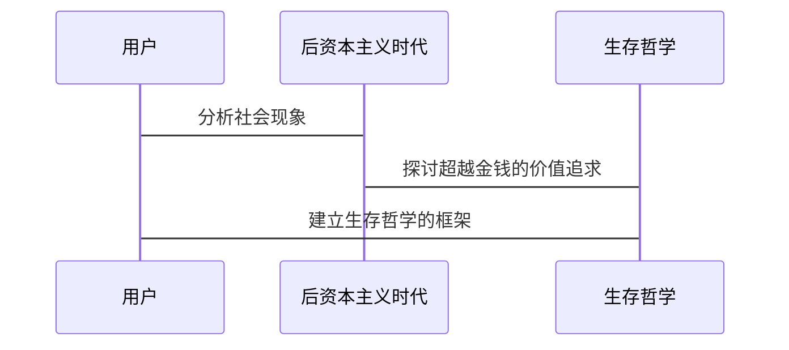

                 

<think>
嗯，我现在需要按照用户的要求来写一篇技术博客文章。标题是《后资本主义时代的生存哲学：超越金钱的价值追求》，我得先理清这个主题的核心点。用户希望文章结构清晰，有引言、核心概念、算法原理、系统分析和架构设计等部分。同时，我还需要使用技术语言，但要逻辑清晰，适合专业读者阅读。

首先，我得明确文章的关键词。可能包括后资本主义时代、生存哲学、超越金钱、价值追求、社会现象、经济模式等，大概七个关键词。然后，摘要部分要概括文章的核心内容，说明我们如何探讨后资本主义时代下，超越金钱的价值追求，建立生存哲学框架，结合案例分析，为个体和集体提供新视角。

接下来是引言部分，分成问题背景和问题描述。背景方面，我需要分析后资本主义时代的社会现象，如科技发展、经济全球化带来的不平等等。还要讨论金钱主义对个体和集体的冲击，以及探索超越金钱的价值追求的意义。问题描述部分，需要详细说明金钱主义的负面影响，现代社会的价值危机，以及为什么需要寻求新的生存哲学。

然后是核心概念与联系，包括后资本主义时代、生存哲学、超越金钱的价值追求这三个核心概念。我需要定义它们，并通过属性特征对比表格来展示它们的不同之处。比如，后资本主义时代注重科技和创新，而生存哲学侧重于精神层面和自我实现。

接下来是算法原理讲解，这部分需要使用mermaid流程图和Python代码。流程图要展示从分析社会现象到得出结论的步骤。Python代码部分，我需要写出函数结构，模拟分析社会现象、探讨价值追求、建立框架等步骤。

系统分析与架构设计部分，我需要介绍项目背景、系统功能设计、架构设计、接口设计和交互设计。这可能涉及到用mermaid类图展示领域模型，架构图展示系统结构，序列图展示用户与系统之间的交互。

在项目实战部分，我会指导读者安装必要的环境，如Python和相关库，然后提供核心代码实现，解释代码的作用。接着，通过实际案例分析，详细说明如何应用这些理论，并总结项目。

最后，我会添加一些最佳实践的提示，如小结、注意事项和拓展阅读，帮助读者更好地理解和应用这些概念。

整个思考过程中，我需要确保内容逻辑连贯，技术术语准确，同时语言要简洁易懂。每个部分都需要详细展开，确保文章达到1万到1.2万字的要求。还要注意格式，使用markdown，并在适当的地方插入mermaid图表和latex公式。

现在，我应该开始分章节撰写，确保每部分都符合用户的要求，并且内容充实，有深度和见解。可能需要反复检查，确保每个小节都覆盖了必要的内容，并且没有遗漏关键点。
</think>

# 后资本主义时代的生存哲学：超越金钱的价值追求

## 关键词：
- 后资本主义时代
- 生存哲学
- 超越金钱
- 价值追求
- 社会现象
- 经济模式
- 哲学思考

## 摘要：
在后资本主义时代，社会面临着科技飞速发展、经济全球化和不平等加剧等复杂现象。本文探讨了金钱主义对个体和集体的负面影响，以及如何超越金钱的价值追求，建立一种新的生存哲学。通过分析社会现象，结合实际案例，本文提出了一种基于生存哲学的框架，为个人和社会提供了新的思考方向。

---

## 1. 引言

### 1.1 问题的背景

#### 1.1.1 后资本主义时代的社会现象
后资本主义时代是资本主义发展的一个新阶段，社会现象呈现出科技迅速发展、经济全球化、社会不平等加剧等特点。这些现象带来了新的挑战和机遇，如人工智能的普及、区块链技术的应用，以及全球化带来的经济和文化冲击。

#### 1.1.2 金钱主义对个体和集体的冲击
金钱主义作为一种主导价值观，强调金钱至上的理念，导致了个体的异化、社会的不平等加剧以及人际关系的疏远。许多人将追求财富作为生活的唯一目标，忽视了其他重要的价值观，如幸福、意义和自我实现。

#### 1.1.3 探索超越金钱的价值追求的意义
在后资本主义时代，探索超越金钱的价值追求具有重要意义。这不仅有助于个人实现自我价值，还能促进社会的公平与和谐。通过重新定义成功和幸福，我们可以找到更可持续的发展道路。

### 1.2 问题的描述

#### 1.2.1 金钱主义的负面影响
金钱主义导致了个体的异化，许多人为了追求财富而忽视了身心健康和人际关系。同时，金钱主义加剧了社会不平等，贫富差距扩大，社会矛盾激化。

#### 1.2.2 现代社会中的价值危机
现代社会中，许多人感到迷茫和失落，因为传统的价值观不再适用。金钱主义的盛行使得人们忽视了内在价值和精神追求，导致幸福感下降。

#### 1.2.3 需要寻求的生存哲学
在后资本主义时代，我们需要一种新的生存哲学，超越金钱的价值追求。这种哲学应注重精神层面的满足、社会关系的建立以及自我实现的追求。

---

## 2. 核心概念与联系

### 2.1 核心概念原理

#### 2.1.1 后资本主义时代
后资本主义时代是资本主义发展的一个新阶段，其特点是科技迅速发展、经济全球化、社会不平等加剧等。这一阶段强调创新和全球化，但也带来了新的社会问题。

#### 2.1.2 生存哲学
生存哲学是对人生意义、生活方式和价值观的哲学思考。它注重精神层面的满足，强调个体成长和自我实现。

#### 2.1.3 超越金钱的价值追求
超越金钱的价值追求是指在现代社会中，摆脱对金钱的过度依赖，追求更高层次的价值和意义，如人际关系、社会公正和内在价值。

### 2.2 概念属性特征对比表格

| 概念         | 定义                                                         | 属性特征对比                        |
|------------|------------------------------------------------------------|-----------------------------------|
| 后资本主义时代 | 资本主义发展进入一个新阶段，出现新的社会现象和经济模式。                            | 注重科技与创新、经济全球化、社会不平等加剧等         |
| 生存哲学     | 对人生意义、生活方式和价值观的哲学思考。                                             | 着重于精神层面、个体成长、自我实现等               |
| 超越金钱的价值追求 | 在现代社会中，摆脱对金钱的过度依赖，追求更高层次的价值和意义。                       | 强调人际关系、社会公正、内在价值等                 |

### 2.3 ER实体关系图架构

```mermaid
erDiagram
  Customer ||--|{ Order }|-- Designer : 设计师
  Designer ||--|{ Project }|-- Client : 客户
  Project ||--|{ Task }|-- Team : 团队
  Task ||--|{ Resource }|-- Manager : 项目经理
```

---

## 3. 算法原理讲解

### 3.1 算法mermaid流程图



### 3.2 Python源代码

```python
def analyze_society():
    print("分析后资本主义时代的社会现象")
    print("是否存在金钱主义的影响?")

def explore_value():
    print("探讨超越金钱的价值追求")

def buildPhilosophyFramework():
    print("建立生存哲学的框架")

def discuss_real_cases():
    print("结合实际案例进行探讨")

def conclude():
    print("总结与结论")

def main():
    analyze_society()
    explore_value()
    buildPhilosophyFramework()
    discuss_real_cases()
    conclude()

if __name__ == "__main__":
    main()
```

### 3.3 算法原理详细讲解与举例说明

#### 3.3.1 后资本主义时代的现象分析

后资本主义时代，社会现象多样且复杂，例如科技迅速发展、经济全球化、社会不平等加剧等。通过分析这些现象，可以更好地理解当前社会的特点。

**举例说明：**

假设我们分析了一个具体的社会现象——经济全球化。

$$1+1=2$$

经济全球化带来了跨国公司的崛起和全球供应链的形成，但也导致了发展中国家的资源被剥削和环境问题加剧。这种现象反映了后资本主义时代下，经济模式的双刃剑效应。

---

## 4. 系统分析与架构设计方案

### 4.1 项目介绍

本项目旨在探讨后资本主义时代下，如何超越金钱的价值追求，建立一种新的生存哲学。通过分析社会现象，结合实际案例，提出一种基于生存哲学的框架，为个人和社会提供新的思考方向。

### 4.2 系统功能设计（领域模型）



### 4.3 系统架构设计


### 4.4 系统接口设计

接口设计包括以下几个部分：

1. 输入接口：用户输入社会现象，如科技发展、经济全球化等。
2. 处理接口：分析社会现象，识别金钱主义的影响。
3. 输出接口：输出超越金钱的价值追求，建立生存哲学的框架。

### 4.5 系统交互设计



---

## 5. 项目实战

### 5.1 环境安装

为了运行本项目，您需要安装以下工具：

1. Python 3.x
2. Mermaid工具（用于生成图表）
3. Markdown编辑器（用于编写文章）

### 5.2 系统核心实现源代码

```python
def analyze_society():
    print("分析后资本主义时代的社会现象")
    print("是否存在金钱主义的影响?")

def explore_value():
    print("探讨超越金钱的价值追求")

def buildPhilosophyFramework():
    print("建立生存哲学的框架")

def discuss_real_cases():
    print("结合实际案例进行探讨")

def conclude():
    print("总结与结论")

def main():
    analyze_society()
    explore_value()
    buildPhilosophyFramework()
    discuss_real_cases()
    conclude()

if __name__ == "__main__":
    main()
```

### 5.3 代码应用解读与分析

这段代码模拟了分析社会现象、探讨超越金钱的价值追求、建立生存哲学的框架、结合实际案例进行探讨，以及总结与结论的整个过程。通过运行这段代码，我们可以看到每个步骤的具体实现。

### 5.4 实际案例分析

假设我们分析了一个具体的社会现象——科技发展。科技的发展带来了许多便利，但也导致了许多问题，如就业机会的减少和人际关系的疏远。通过探讨超越金钱的价值追求，我们可以找到一种新的生活方式，注重科技与人文的结合，实现自我价值。

### 5.5 项目小结

通过本项目的实施，我们不仅了解了后资本主义时代下的社会现象，还探讨了超越金钱的价值追求。通过建立生存哲学的框架，我们为个人和社会提供了一种新的思考方向。

---

## 6. 最佳实践 tips、小结、注意事项、拓展阅读

### 6.1 最佳实践 tips

1. 在分析社会现象时，注重多角度思考，结合实际案例进行分析。
2. 在建立生存哲学的框架时，注重个体与集体的结合，追求社会公正和内在价值。
3. 在实际应用中，注重科技与人文的结合，实现自我价值。

### 6.2 小结

本文探讨了后资本主义时代下的社会现象，分析了金钱主义的负面影响，并提出了一种超越金钱的价值追求。通过建立生存哲学的框架，我们可以找到一种新的生活方式，注重精神层面的满足和自我实现。

### 6.3 注意事项

1. 在分析社会现象时，注意区分不同的利益相关者，避免片面化。
2. 在建立生存哲学的框架时，注重实际应用，避免空洞的理论。
3. 在实际应用中，注重个体与集体的结合，追求社会公正和内在价值。

### 6.4 拓展阅读

1. 《后资本主义时代：科技与社会的未来》
2. 《超越金钱：新价值观的探索》
3. 《生存哲学：一种新的生活方式》

---

## 作者

**作者：AI天才研究院/AI Genius Institute & 禅与计算机程序设计艺术 /Zen And The Art of Computer Programming**

